> [!NOTE]
> 책 내용 + 기타 레퍼런스를 보완한 요약본입니다.

# Chapter 3] 컨테이너 런타임

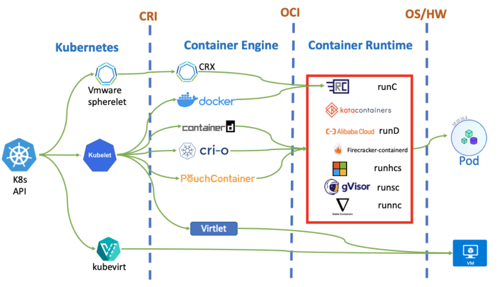

## 개요

컨테이너 기술인 Docker가 나온 이후 애플리케이션의 배포는 컨테이너를 기반으로 하는 큰 변화를 가져오게 되었지만, 포맷과 런타임에 대한 특정한 규격이 없어 혼란을 빚고 있었다. (Docker는 API, CLI, 네트워크, 스토리지 등 많은 기능이 하나의 패키지에 담긴 거대한 Monolithic Engine을 분해하는 작업을 진행하고 있었고, CoreOS는 Docker와는 다른 규격의 또 다른 표준화를 추진하고자 하고 있던 상황이었다.) 따라서 수많은 벤더들이 애플리케이션 이식성 관점에서 컨테이너 포맷과 런타임에 대한 개방형 업계 표준을 만들기 위해 OCI를 구성하게 된다.

## OCI (Open Container Initiative)

컨테이너 및 런타임에 대한 개방형 표준을 설계하는 커뮤니티 프로젝트로, 컨테이너 ecosystem에서 컨테이너 기술 간의 상호 운용성을 보장하여 다양한 플랫폼과 컨테이너 런타임에서 컨테이너화된 애플리케이션을 보다 더 쉽게 만들고 실행할 수 있도록 지원하는 것을 목표로 한다.

> 표준화, 상호운용성, 생태계 이점

다음과 같이 OCI 표준 컨테이너가 만족해야 하는 5가지 Principles가 있다.

|Principle|Description|
|---|---|
|Standard Operations|- 표준 컨테이너 도구들을 이용해서 컨테이너의 생성, 시작, 정지가 가능해야 함|
||- 표준 파일 시스템 도구를 통해서 컨테이너의 스냅샷과 복사가 가능해야 함|
||- 표준 네트워크 도구들을 통해서 컨테이너의 업로드와 다운로드가 가능해야 함|
|Content-agnostic|표준 컨테이너는 컨테이너가 담고 있는 애플리케이션의 종류에 상관없이 표준 동작들이 동일하게 동작해야 함|
|Infrastructure-agnostic|표준 컨테이너는 OCI 지원 인프라라면 종류에 상관없이 컨테이너 실행이 가능해야 함|
|Designed for Automation|표준 컨테이너는 컨테이너 내용과 인프라 종류에 상관없이 동일한 표준 동작을 지원하기 때문에 자동화가 용이함|
|Industry-grade Delivery|표준 컨테이너는 기업 규모에 상관없이 산업 수준의 배포가 가능해야 함|

아래와 같은 주요한 표준 명세가 있다.

- [OCI Runtime Specification](https://github.com/opencontainers/runtime-spec)
    - 컨테이너가 실행될 떄의 동작과 관련한 표준 정의
        - 컨테이너 생성/실행/종료 방식 등을 정의
        - 예) 컨테이너 파일 시스템, 프로세스 모델, 리소스 제한 등
    - 구현체
        - 저수준 컨테이너 런타임 runc
        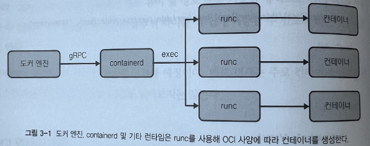
- [OCI Image Specification](https://github.com/opencontainers/image-spec)
    - 컨테이너 이미지 구조와 관련된 표준 정의
    - 이 명세에 따라 컨테이너 이미지는 여러 레이어로 구성되며 각 레이어는 파일 시스템 변경사항을 포함
    - 이미지의 메타데이터와 구성 정보 포함
    - 구현체
        - [kaniko](https://github.com/GoogleContainerTools/kaniko)
        - [jib](https://github.com/GoogleContainerTools/jib)
        - [buildpacks](https://buildpacks.io)
- [OCI Distribution Specifiction](https://github.com/opencontainers/distribution-spec)
    - 컨테이너 이미지를 저장하고 전송하는 방식을 표준화
    - 이미지 레지스트리와의 상호 작용, 이미지의 버전 관리, 서명 및 보안 기능과 같은 배포와 관련된 프로세스 포함
    - 이 명세를 따르면 컨테이너 이미지를 다양한 환경에서 일관되게 배포 가능

## CRI (Container Runtime Interface)

쿠버네티스 v1.5부터 도입. gRPC 및 Protobuf를 사용해 구현. 인터페이스는 RuntimeService 및 ImageService 두 가지 서비스를 정의한다. Kubelet은 두 서비스를 활용해 컨테이너 런타임과 상호작용한다.

- [RuntimeService](https://github.com/kubernetes/cri-api/blob/5eda686b5b1446f079d074e83f7cf57963fcdb01/pkg/apis/runtime/v1/api.proto#L34-L143)
    - Pod 생성, 컨테이너 시작 및 중지, 파드 삭제 등을 포함해 모든 Pod 관련 작업 담당
- [ImageService](https://github.com/kubernetes/cri-api/blob/5eda686b5b1446f079d074e83f7cf57963fcdb01/pkg/apis/runtime/v1/api.proto#L146-L161)
    - Node에서 Container 이미지 나열, 가져오기 및 제거를 포함해 컨테이너 이미지 작업과 관련

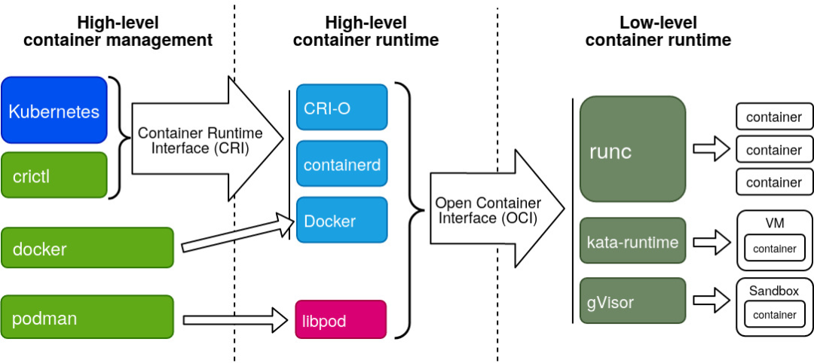

> 초기 쿠버네티스에서는 Docker를 컨테이너 런타임으로 사용하기 위해 [`dockershim`](https://github.com/kubernetes/kubernetes/tree/release-1.23/pkg/kubelet/dockershim)과 같은 도구를 [`kubelet`](https://github.com/kubernetes/kubernetes/tree/master/pkg/kubelet) 소스 코드 내부에 하드코딩으로 통합하여 구현되었는데 Docker Engine의 인터페이스 변경에 맞게 계속해서 수정하여 사용해 왔다.
> 이렇게 통합된 프로세스는 kubelet에 대한 깊은 이해를 필요로 했고 쿠버네티스 커뮤니티에 상당한 유지보수 오버헤드를 발생시켰으며, 쿠버네티스는 계속해서 다양한 컨테이너 런타임마다 kubelet을 수정해 kubelet과 통합하기에는 무리가 있었기에 쿠버네티스에서는 kubelet 수정없이 여러 컨테이너 런타임을 지원하기 위해 kubelet과 컨테이너 런타임간의 통신을 위한 주요 gRPC 프로토콜을 정의한다. 이것이 CRI이다. 

쿠버네티스와 컨테이너 런타임 사이의 추상화 레이어로, kubelet이 다양한 컨테이너 런타임과 호환될 수 있도록 하는 플러그인 인터페이스 정의이다.

### Pod 시작

- kubelet과 컨테이너 런타임 간의 상호작용으로 Pod 시작
    
    ```bash
    /usr/bin/kubelet
      --container-runtime=remote
      --container-runtime-endpoint=/run/containerd/containerd.sock
    ```
    
- PodSandBox 생성 (격리된 환경, Pod 내 컨테이너가 공유할 Linux 네트워크의 namespace 설정 위함)
    - RuntimeService#RunPodSandbox
    - 호출 후 kubelet은 파드 이름, 고유 식별자, 쿠버네티스 네임스페이스, DNS 구성 등을 포함해 메타데이터와 구성을 containerd로 전달.
    - 생성된 후 Pod의 Sandbox ID 응답.
- 컨테이너 이미지의 노드 내 존재 여부 확인
    - ImageService#ImageStatus
        - 없으면 null이 반환되며 kubelet이 Image Pull 진행
- Image Pull
    - ImageService#PullImage
        - 필요한 경우 Image Pull
        - SHA256 digest로 응답
- Sandbox에 컨테이너 생성
    - RuntimeService#CreateContainer
    - kubelet은 샌드박스 ID와 컨테이너 구성을 컨테이너 런타임에 제공
        - 컨테이너 구성에는 컨테이너 이미지 다이제스트, 명령 및 인수, 환경 변수, 볼륨 마운트 등을 포함해 예상할 수 있는 모든 정보가 포함
    - 생성 프로세스 중에 컨테이너 런타임은 컨테이너 ID를 생성한 다음 다시 kubelet으로 전달한다.
        - 컨테이너 ID는 컨테이너 상태 아래에 있는 파드의 상태 필드에 표시되는 ID
    
    ```yaml
    containerStatuses:
    	- containerID: containerd://0018556b01e1662c5e7e2dcddb2bb09dedff6cf6933...
    		image: docker.io/library/nginx:latest
    ```
    
- 컨테이너 시작
    - RuntimeService#StartContainer
    - RuntimeService#StartContainer 메서드를 호출할 때 컨테이너 런타임에서 받은 컨테이너 ID를 사용

```
Kubelet                  KubeletGenericRuntimeManager       RemoteRuntime
   +                              +                               +
   |                              |                               |
   +---------SyncPod------------->+                               |
   |                              |                               |
   |                              +---- Create PodSandbox ------->+
   |                              +<------------------------------+
   |                              |                               |
   |                              XXXXXXXXXXXX                    |
   |                              |          X                    |
   |                              |    NetworkPlugin.             |
   |                              |       SetupPod                |
   |                              |          X                    |
   |                              XXXXXXXXXXXX                    |
   |                              |                               |
   |                              +<------------------------------+
   |                              +----    Pull image1   -------->+
   |                              +<------------------------------+
   |                              +---- Create container1 ------->+
   |                              +<------------------------------+
   |                              +---- Start container1 -------->+
   |                              +<------------------------------+
   |                              |                               |
   |                              +<------------------------------+
   |                              +----    Pull image2   -------->+
   |                              +<------------------------------+
   |                              +---- Create container2 ------->+
   |                              +<------------------------------+
   |                              +---- Start container2 -------->+
   |                              +<------------------------------+
   |                              |                               |
   | <-------Success--------------+                               |
   |                              |                               |
   +                              +                               +
```

### 컨테이너 런타임 구분

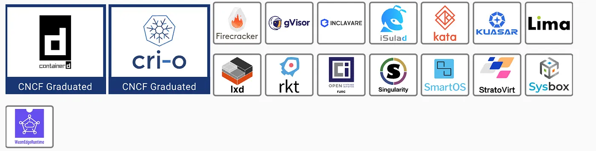

> 컨테이너 엔진과 컨테이너 런타임 간의 인터페이스 사양은 OCI를 준수한다.
> 고수준 컨테이너 관리 시스템 (UI 레이어로 쿠버네티스와 같은 플랫폼을 의미함)와 컨테이너 엔진 간의 인터페이스 사양은 CRI를 준수한다.

#### 개요

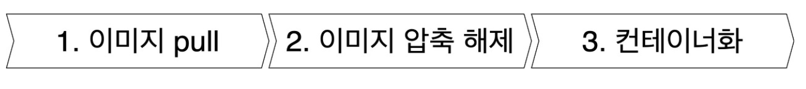

위 이미지는 이미지가 컨테이너로 실행되는 과정인데, Docker는 이러한 단계 중 3번만을 표준화하였고, 이로 인해 런타임은 고수준 컨테이너 런타임과 OCI 표준화된 저수준 컨테이너 런타임으로 나뉘게 된다.

#### 저수준 컨테이너 런타임

Linux 커널 요소인 `namespace` (파일 시스템 혹은 네트워킹과 같은 시스템 리소스 가상화를 통한 컨테이너 환경 격리) 와 `cgroups` (CPU / 메모리 등의 리소스 제한) 를 사용해 **컨테이너를 생성하고 실행하는 역할을 수행**한다.

- 종류
    - [runc](https://github.com/opencontainers/runc) (OCI 표준)

#### 고수준 컨테이너 런타임 (or Container Engine)

컨테이너 상태 및 리소스 공급. 이미지 관리, 네트워크 액세스, 컨테이너 상태, 저수준 런타임 호출을 포함해 컨테이너 및 기타 기능을 실행한다. 다시 말해 **컨테이너를 실행하고 컨테이너 생명주기를 관리하는데 필요한 리소스를 준비하는 역할을 수행한다.**

- 종류
    - Docker, rkt, pouch
    - containerd, cri-o (OCI 표준)

### 컨테이너 런타임

#### Docker

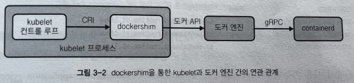

Docker Engine은 CRI를 구현하지 않기 때문에 이를 컨테이너 런타임으로 지원하기 위해 kubernetes는 kubelet에 컴포넌트 dockershim을 내장한다. 이는 CRI로 도커와 통신하도록 Facade 역할을 수행한다.

내부적으로는 containerd를 활용하기 때문에 결과적으로 kubelet에서 들어오는 API 호출이 최종적으로 containerd에 연달아 전달된다. 따라서 생성된 컨테이너는 Docker Daemon이 아닌 containerd 아래에 있게 된다.

Docker 에 Pod 개념이 없지만 dockershim에서 쿠버네티스 네임스페이스와 Pod명, Pod ID를 컨테이너 이름으로 인코딩한다.

```bash
docker ps --format='{{.ID}}\t{{.Names}}' | grep nginx_default
3c8c01f47424	k8s_nginx_nginx_default_6470b3d3-87a3-499c-8562-d59ba27bced5_3
c34ad8d80c4d	k8s_POD_nginx_default_6470b3d3-87a3-499c-8562-d59ba27bced5_3
```

이미지 빌드 등 Kubernetes 환경에서 사용되지 않는 불필요한 확장 세트가 포함되어 있으므로 권장되지 않는다.

#### cri-o

Kubernetes용으로 특별히 설계된 컨테이너 런타임이다. CRI 구현이므로 Docker / containerd와 달리 Kubernetes 외부에서 사용되지는 않는다.

containerd와 유사하게 Unix Socket으로 CRI를 노출한다. `/var/run/crio/crio.sock` 파일에 있는 Socket을 사용해 kubelet이 cri-o와 상호작용한다.

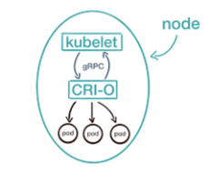

컨테이너가 생성되면 conmon (Container Monitor) 프로세스가 생성된다. 컨테이너 프로세스의 부모로써, 컨테이너에 연결 방법을 노출하고, 컨테이너의 stdout, stderr 스트림을 로그 파일에 저장하며 컨테이너 종료 처리와 같은 여러 문제를 처리한다.

쿠버네티스 저수준 컴포넌트로 설계되어 CLI가 제공되지 않아 `crictl` 을 사용하면 된다.

<aside>
💡 crictl 유틸리티는 쿠버네티스 커뮤니티에서 개발한 커맨드라인 툴로 CRI로 컨테이너 런타임과 상호작용하기 위한 CLI 클라이언트다. 도커가 CRI를 구현하지 않더라도 dockershim Unix Socket과 함께 crictl을 사용할 수 있다.

</aside>

#### [Kata Container](https://katacontainers.io/)

OpenStack의 프로젝트로 일반적인 컨테이너 도구와 다르게 컨테이너 대신 경량 VM을 사용해 워크로드를 실행하는 오픈소스 런타임이다. VM 기반의 런타임인 Intel ClearContainers, Hyper.sh의 RunV를 merge한 후속작으로 나온 프로젝트. VM을 사용하므로 리눅스 컨테이너보다 더 강력한 격리 환경을 보장한다. 워크로드가 Linux 커널을 공유하지 못하도록 하는 보안 요구사항 혹은 cgroup 격리로 충족할 수 없는 리소스 보장 요구사항이 있는 경우 적합하다. (특히 Untrusted Code 실행하는 Multi-Tenant 클러스터에 주로 사용한다.)

Kubernetes와 함께 사용하기 위해서는 kubelet과 kata 런타임 사이에 pluggable한 Container Runtime이 필요하다. (Kata가 CRI를 구현하지 않음) 따라서 Kata는 기존 컨테이너 런타임 (containerd 등) 을 사용해 쿠버네티스와의 상호작용을 처리하며 v2 containerd shim API를 구현한다.

동일한 Node에서 Linux 컨테이너 Pod와 VM Pod를 실행할 수 있는데 이는 K8s RuntimeClass를 정의하여 달성 가능하다.

```yaml
apiVersion: node.k8s.io/v1beta1
kind: RuntimeClass
metadata:
    name: kata-containers
handler: kata
```

Hypervisor로는 QEMU / NEMU / AWS Firecracker 를 사용할 수 있다.

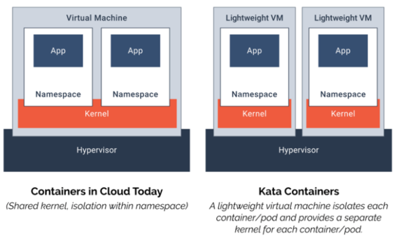

#### [Virtual Kubelet](https://virtual-kubelet.io/)

kubelet을 가장(masquerade)하는 구현체이다. 일반적인 kubelet과는 다르게 Node가 아닌 Cloud Serverless API와 같이 다른 곳에서 컨테이너를 스케줄링하는 차이점을 가진다.

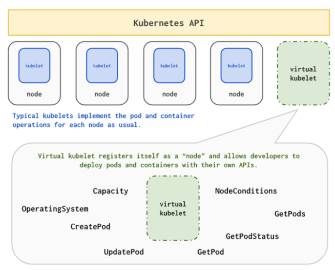

---

## Kubernetes는 왜 Docker 지원을 중단하였는가?

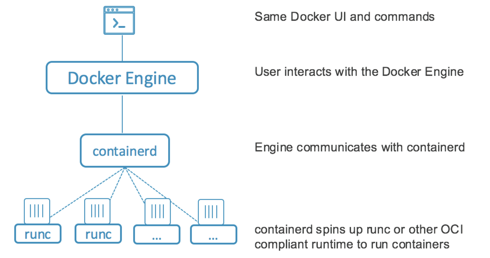

Docker Engine은 containerd (High-level), runc (Low-level) 로 나누어 컨테이너를 관리한다.

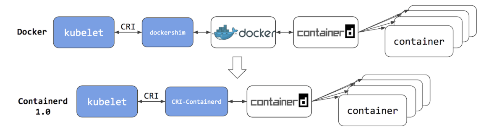

초기 Docker Engine은 사용자 편의성을 위해 Docker Engine 패키지에 컨테이너 관리 도구들을 담았는데, 이후 컨테이너 오케스트레이션 도구인 Kubernetes가 컨테이너 관리 도구로 Docker를 채택해 호환성을 제공했다.

Docker 자체가 CRI 사양 수립 전에 개발되었기 때문에, Kubernetes는 Adapter 컴포넌트인 `dockershim` 을 만들었고 이는 kubelet이 Docker가 CRI 호환 런타임인 것과 같이 Docker와의 Interaction을 지원했다. 하지만 Docker의 버전 업데이트가 계속되면서 점차 Kubernetes와의 의존성 이슈가 발생하기 시작했다.

containerd와 같이 CRI를 준수하는 컨테이너 런타임으로 대체하여 Kubernetes에서는 컨테이너를 동작시킬 수 있었고, 점차 Docker를 지속적으로 지원하는 것이 비효율적이고 불필요하다고 판단한 Kubernetes는 v1.24 부터 Docker 지원을 중단하였다.

> **Docker는 CRI는 준수하지 않으나, OCI는 준수하고 있기 때문에 Docker로 빌드한 이미지들도 OCI 표준을 따르는 다른 컨테이너 런타임을 통해 그대로 사용 가능하다.*
