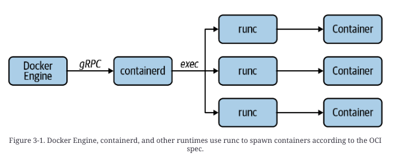
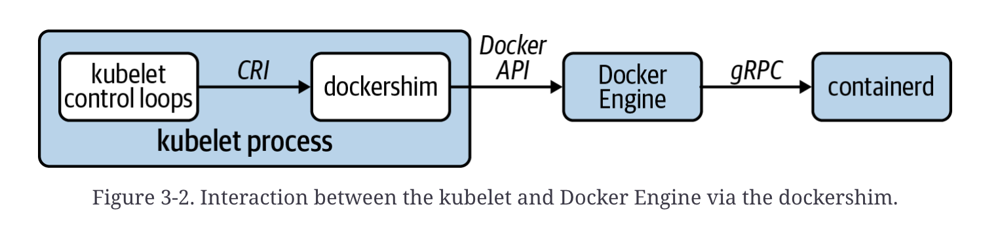
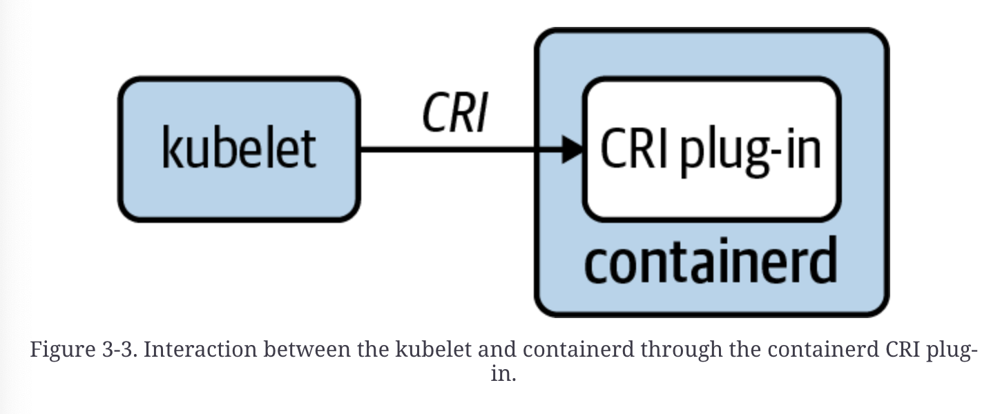
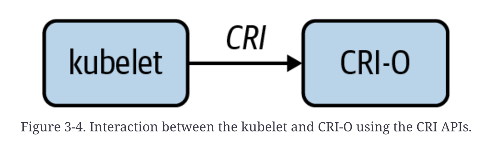
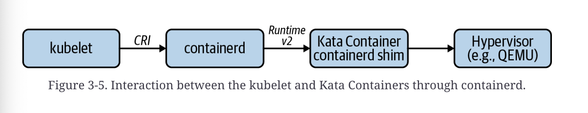
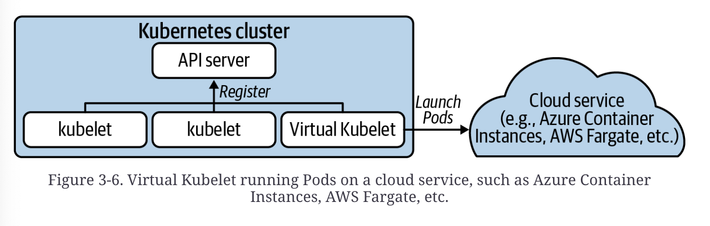

# 3장 Container runtime

### Definitions

**Kubernetes**: Container ochestrator

**Container runtime**: cluster node에서 container를 생성하고 관리하는 software


### Container의 출현

#### Container 구현에 필요한 기본 요소

**cgroups** (Control groups)

- process가 사용할 수 있는 resource(CPU, memory, etc.)의 양을 제한

**namespace**

- process가 접근할 수 있는 resource(volume mount, process, network interface) 제어


#### Container가 떠오른 배경

- application의 복잡성 증가
- 여러 언어로 작성된 여러 서비스로 구성할 필요성
- software가 business 차별화 요소가 됨 (빠르고 안정적인 배포로 제품의 경쟁력이 높아짐)
- public cloud가 새로운 hosting 환경으로 등장함 (모든 환경에서 똑같이 동작해야 하는 필요성이 높아짐)


#### Container가 software 개발 생명 주기를 개선한 점들

- container와 container 이미지로 application 환경을 code로 관리할 수 있고 application 종속성으로 인한 문제로 공수를 낭비하지 않아도 됨
- 재현 가능한 환경을 제공함으로써 test가 더 편리해짐
- 운영 환경에 더 쉽게 배포할 수 있게 됨


### OCI (Open Container Initiative)

> Container 명세의 각 단체 간 협업을 위해 2015년에 설립된 open source project

**OCI runtime spec.** / **OCI image spec.** / **OCI distribution spec.** 

배포 명세는 container image registry와 관련이 있어서 자세히 알아보지 않음


### OCI runtime spec.

- container를 instantiate하고 실행하는 방법을 결정한다.
- container 구성의 schema를 설명한다.
  - schema: container의 root file system, 실행할 명령, 환경 변수, 사용자 및 그룹, 리소스 제한 등
- container runtime이 지원해야 하는 작업을 결정한다.
  - 생성, 시작, 종료, 상제 및 상태 등
- container의 생명 주기와 진행 방식을 구분한다.
  - **creating**: container 생성 중
  - **created**: 생성 완료
  - **running**: container process가 시작돼 실행 중
  - **stopped**: container process가 완료됨



#### runc

https://github.com/opencontainers/runc

OCI runtime spec. 을 구현하는 저수준 container runtime.

docker, containerd, CRI-O 같은 고수준 container runtime에서 runc를 사용해서 OCI 사양에 따라 컨테이너를 생성한다.

따라서 OCI runtime spec을 준수하면서, 다른 상위 수준 기능들(image 가져오기, networking 구성, storage 처리 등)에 집중 할 수 있다.


### OCI image spec.

- image manifest, image index(optional), a set of filesystem layers and a configuration
  - **image manifest**
    - config
    - layers
    - annotations
  - **image index** (optional): a higher-level manifest which points to specific [image manifests](https://github.com/opencontainers/image-spec/blob/main/manifest.md), ideal for one or more platforms
  - **[configuration](https://github.com/opencontainers/image-spec/blob/main/config.md)**: 각 OCI image manifest에서 참조함
- container image layer를 생성하고 관리하는 방법을 설명한다.
  - layer들의 다양한 미디어 타입을 정의한다.(tar, tar+gzip, tar+zstd 등)
  - SHA 256 digest를 이용해서 특정 레이어를 참조한다.
  - manifest에 기록된 대로 각 layer를 적용하면 최종 container image filesystem이 된다.


## CRI (Container Runtime Interface)

> CRI 전에는 새로운 container runtime을 추가하려면 쿠버네티스 코드 기반에 대한 자세한 지식이 필요했으나,
>
> CRI로 인해 단순히 인터페이스만 준수하면 쿠버네티스와의 호환성을 보장할 수 있다.

- kubelet 구현의 복잡성을 줄이고, 확장성과 테스트 가능성을 높였다.
- grpc로 구현되어 있고, **RuntimeService**(pod 생성/삭제, container 시작/중지 등), **ImageService**(container image 목록 조회/가져오기/제거 등) 두가지 서비스를 정의한다. kubelet은 이 2개의 서비스를 활용해 container runtime과 상호작용한다.


### Pod 시작

> K8S v1.28.3 & containerd v1.7.8 

kubelet과 container runtime의 상호작용으로 pod을 실행시킨다.

[API proto 참고](https://github.com/kubernetes/cri-api/blob/master/pkg/apis/runtime/v1/api.proto)

1. **pod가 node에 scheduling됨**
2. **containerd CRI plug-in이 Unix socket을 듣는 gRPC server를 시작한다.**
   - socket은 `/run/containerd/containerd.sock` 에 위치하고, kubelet이 이 socket을 통해 containerd와 상호작용한다. 
     (`--container-runtime`, `--container-runtime-endpoint` command line flag 사용)
3. **kubelet ==(`RuntimeService.RunPodSandBox`)==> container runtime**
   - container들이 공유할 Linux network namespace가 필요하기 때문에 sandbox가 반드시 우선적으로 필요하다.
   - [RunPodSandboxRequest](https://github.com/kubernetes/cri-api/blob/master/pkg/apis/runtime/v1/api.proto#L468C9-L468C29) : pod name, unique ID, k8s namespace, DNS config, etc.
   - [RunPodSandboxResponse](https://github.com/kubernetes/cri-api/blob/master/pkg/apis/runtime/v1/api.proto#L479C9-L479C30) : pod_sandbox_id
     - pod_sandbox_id: sandbox에 container들을 생성할 때 사용
4. **kubelet ==(`ImageService.ImageStastus`)==> container runtime**
   - image가 없을 경우
     1. kubelet ==(`ImageService.PullImage`)==> container runtime
        - Response: image SHA256 digest(container 생성 시 사용)
5. **kubelet ==(`RuntimeService.CreateContainer`)==> container runtime**
   - Request: sandbox ID, container config
   - Response: container ID
6. **kublet ==(`RuntimeService.StartContainer`)==> container runtime**
   - Request: container ID


CRI는 이외 `Exec`, `ExecSync` `Attach` `PortForward` 등의 method들도 정의한다.


## Choosing a Runtime

container runtime을 고르는데 고려해야 할 점들

1. 어떤 container runtime을 경험해봤는가?
   - 대부분의 조직이 docker를 경험해봤으나, K8S에 필요없는 확장기능들로 인해 추천하지 않는다.
2. availability of support
   - Tanzu Kubernetes Grid, OpenShift와 같은 K8S 배포들은 특정 container runtime이 포함되어 있다
3. linux container에서 제공하는 것보다 강력한 isolation 보장이 필요한가?
   - VM-level isolation이 필요한 경우 Kata containers 같은 runtime을 채택할 수 있다.


### Docker

> K8S에서는 dockershim 이라는 CRI shim을 통해 docker engine을 container runtime으로 지원한다.
>
> K8S 1.24 이후 dockershim 제거로 인해 채택 불가

**dockershim**

- 정의: CRI service들(RuntimeService, ImageService, etc.)을 구현한 grpc server
- docker engine은 CRI를 구현하지 않았기 때문에 필요하다.
- kubelet process에 위치함



- 위 그림에서 결국 containerd가 container를 실행하게 되는 것을 알 수 있다.

- inspecting containers

  - **docker cli** : docker에서는 pod 관련 개념이 존재하지 않아서 dockershim에서 encode해준다.

    `K8S_{container_name}_{pod_name}_{kube_namespace}_{pod_id}`
  
    ```shell
    $ docker ps --format='{{.ID}}\t{{.Names}}' | grep nginx_default
    3c8c01f47424	k8s_nginx_nginx_default_6470b3d3-87a3-499c-8562-d59ba27bced5_3
    c34ad8d80c4d	k8s_POD_nginx_default_6470b3d3-87a3-499c-8562-d59ba27bced5_3
    ```

    k8s_POD_... :infrastructure(pause) container이다(pod의 container network 구성).

  - **ctr** (containerd cli) : `moby`라는 containerd namespace에 위치함
  
  - **crictl**: K8S community에 의해 개발됨. docker에서 CRI를 구현하지 않았지만, dockershim socket으로 사용 가능하다.
  
    ```shell
    $ crictl --runtime-endpoint unix:///var/run/dockershim.sock ps --name nginx
    CONTAINER ID   IMAGE                CREATED        STATE    NAME   POD ID
    07ba23a409f31  nginx@sha256:b0a...  3 seconds ago  Running  nginx  ea179944...
    ```
  


### containerd

> K8S 에서 가장 보편적인 container runtime
>
> Cluster API-based node image에서 기본 container runtime이며 managed K8S들에서 제공함(AKS, EKS, GKE..)

**containerd CRI plug-in**

- containerd CRI 구현체이며 containerd runtime에 포함되어 있다.
- gRPC API를 `/run/containerd/containerd.sock` 의 unix socket으로 노출시킨다.



- inspecting containers
  - **ctr**: containerd namespaec `k8s.io`에 위치함
  - **crictl**: `--runtime-endpoint unix:///run/containerd/containerd.sock`


### CRI-O

> K8S에 특화되어 디자인된 container runtime이다.
>
> K8S 밖에서 사용할 수 없다.
>
> RedHat OpenShift에서 주로 사용한다.

- kubelet과 직접적으로 상호작용한다. (`/var/run/crio/crio.sock`)



- container 생성 시 `conmon` (container monitor) process를 생성한다.

  **conmon**

  - container attach를 위한 노출
  - container의 STDOUT, STDERR stream을 logfile에 저장하기
  - handling container termination

- K8S의 low-level component로 설계되었기 때문에 별도의 cli를 제공하지 않는다.

  - **crictl** 사용 


### Kata Containers

- workload 실행을 위해 container들 대신 경량 VM을 사용하는 것이 특징이다.

  - linux container보다 강력한 isolation 보장을 제공한다. 

  - Kata container 선택 이유

    - Linux kernel 공유를 하면 안되는 보안 요구사항이 존재할 경우 
    - cgroup isolation으로 달성할 수 없는  자원 보장 요구사항이 존재할 경우

    따라서 untrusted code를 실행하는 multitenant K8S cluster들에 주로 사용한다.

- Baidu Cloud, Huawei Cloud에서 사용한다.

- CRI 구현체가 없기 때문에 별도 container runtime을 사용한다.

  

- linux container pods와 VM-based pods를 같은 node에서 실행할 수 있다.

  - **Runtime Class**

    여러 container runtime을 설정할 수 있도록 해준다.

    ```yaml
    apiVersion: node.k8s.io/v1beta1
    kind: RuntimeClass
    metadata:
        name: kata-containers
    handler: kata
    ```

- workloads 실행을 위한 hypervisor들을 지원한다.

  - QEMU
  - NEMU (지금은 [cloud hypervisor](https://github.com/cloud-hypervisor/cloud-hypervisor))
  - AWS firecracker


### Virtual Kubelet

> kubelet 처럼 동작하며, pluggable API를 제공한다.

- Virtual kubelet 자체는 container runtime이 아니고, 다양한 runtime들을 접목하는 것이 목표다.

- 확장성 있는 구조를 갖춰, serverless frameworks, edge frameworks 등의 app들을 실행할 수 있다.

  


