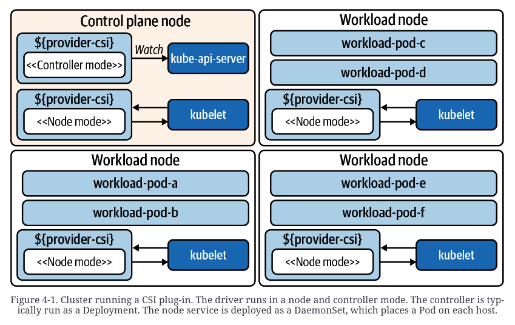

# Chapter 4. Container Storage

> stateful service들에 대한 요구가 보편화됐다.
>
> 복잡한 stateful workload들(databases & message queues)을 위해서 storage capabilities 제공이 필요해졌다.
>
> app crashing, 다른 host에 workload가 rescheduling 되는 상황에 필요한 resilience & availability를 제공할 수 있어야 한다.


## Storage Considerations

잠재적인 storage 요구사항에 대한 고려가 우선적으로 필요하다.

### Access Modes

- app에 제공되는 3가지 access mode

  - *ReadWriteOnce (RWO)*  - **일반적으로 사용됨**
    - 하나의 pod이 읽고 쓸 수 있음
  - *ReadOnlyMany (ROX)* 
    - 여러 pod들이 읽을 수 있음
  - *ReadWriteMany (RWX)*
    - 여러 pod들이 읽고 쓸 수 있음

- Amazon EBS, Azure Disk Storage를 사용하면 하나의 node에만 disk가 붙을 수 있기 때문에 **RWO**로 제한된다.

  이게 제한적이라 생각 될 수 있지만 배타적이고 높은 performance 를 제공하기 때문에 대부분 cloud native app들에 적합하다.

- **RWX**는 legacy app.들에서 요구되는 경우가 있다.

  - data sharing이 필요할 경우 file에 대한 공유 접근보다, API를 사용하는 것이 낫다.
  - message queue나 database 사용 같은 우아한 해결책도 존재한다.

  따라서 RWX를 사용해야될 특별한 이유가 없다면 쓰지 않는 것이 좋을 것이고, 써야 하는 상황이라면, Amazon EFS(Elasic File System), Azure File Share 를 사용해볼 수 있다.


### Volume Expansion

application 구동 중 volume을 계속 채워나가다 보니, volume expansion이 필요한 순간이 온다.

K8S에서는

1. Orchestrator에서 storage 추가 요청 (PersistentVolumeClaim)
2. Storage provider에 의해 volume size 확장
3. 커진 volume을 사용하기 위해 filesystem 확장


### Volume Provisioning

1. **Dynamic provisioning**
   - driver가 도는 중에 storage provider와 통신하여 workload request를 처리할 수 있다.
2. **Static provisioning**
   - 사용할 volume들이 이미 K8S node들에 생성되어 있다고 가정한다.

- 가능하다면 dynamic provisioning이 선호된다.
- K8S와 호환되는 storage system을 사용중이냐에 따라 선택될 수 있다.


### Backup and Recovery

> Backup은 자동화된 resotre가 요구사항으로 존재할 경우 storage에서 가장 복잡한 aspect가 될 수 있다.

**고려사항들**

- storage backup strategy들과 availability 보장에 대한 균형을 조정한다.
  - storage 이중화 보장이 되어 있다면, hardware loss가 발생하더라도 치명적이지 않을 수 있다.
- 각 application 마다 다른 backup 방식이 요구될 수도 있다.

- platform service로 restore 기능을 제공하는 것은 좋을 수 있으나, 앱에 특정적인 복잡성이 존재할 경우 복구 과정이 까다로울 수 있다

**[Project Velero](https://velero.io/)**

- 소개: K8S state와 application state의 유명한 backup solution
- K8S object backup
- volume snapshot scheduling
- backup and store hooks
  - backup 전에 traffic 중단이나 flush가 필요할 경우 hook을 이용해 가능하도록 한다.


### Block Devices and File and Object Storage

**File storage**

- Application들에서 주로 사용
- filesystem을 상위에 둔 block device

**Block device**

- app들에서 직접적으로 block device와 상호작용
- Filesystem들은 data 쓰기 작업에서 overhead가 발생하나, 이것을 고려하는 경우는 극히 드물다
- 특정 storage system들이 지원 가능

**Object storage**

- 식별자 부여, metadata 작성, 저장을 통해 비정형화된 data를 저장할 수 있게 해준다.
- cloud-provider object store(ex. AWS S3)는 app들과 가장 많이 상호작용한다.
- interface 표준화가 잘 되어 있지 않음
- app들과 투명하게 상호작용할 수 있는 platform service들이 통합된 것


### Ephemeral Data

- 각 container의 filesystem에 ephemeral stoage를 사용해서 쓴다.
- emptyDir volume type은 재시작시 탄력적인 저장소를 제공할 수 있고, data를 pod 내 container간 공유할 수 있도록 해준다.
- ephemaral data가 커질 경우 node에 수용가능한 선을 넘을 수 있다. 따라서 각 pod에서 사용하는 양을 제한해야 한다.


### Storage provider 고르기

**Ceph**, **Google Persistent Disk**, **Amazon EBS**


## Kubernetes Storage Primitives

**PersistentVolumes**, **PersistentVolumeClaims**, **StorageClasses**


### Persistent Volumes and Claims

> using the [PersistentVolume](https://oreil.ly/7_OAz) and [PersistentVolumeClaim](https://oreil.ly/PKtAr) APIs

**Example**

1. node가 30Gi의 storage를 갖고 있다.
2. 이 storage를 `/mnt/fast-disk/pod-0`에 provisioning 했다.

이 volume을 표현할 때 **PersistentVolume**에 대한 yaml은 아래와 같다.

```yaml
apiVersion: v1
kind: PersistentVolume
metadata:
  name: pv0
spec:
  capacity:
    storage: 30Gi # 가능한 양, claim을 bind할 수 있는지 결정할 때 사용되는 값
  volumeMode: Filesystem # Filesystem || Block
  accessModes:
  - ReadWriteOnce # ReadWriteOnce || ReadMany || ReadWriteMany
  storageClassName: local-storage # storage class와 연동할 때 사용, 
  local:
    path: /mnt/fast-disk/pod-0
  nodeAffinity: # node 지정 
    required:
      nodeSelectorTerms:
      - matchExpressions:
        - key: kubernetes.io/hostname
          operator: In
          values:
          - test-w
```

3.  **PersistentVolumeClaim**으로 한 겹 더 추상화를 제공한다. claim 내용에 따라 적절한 volume을 bind해준다.

   주로 앱개발 팀에서 정의하고, 그들의 app. pod에서 참조한다. 

```yaml
apiVersion: v1
kind: PersistentVolumeClaim
metadata:
  name: pvc0
spec:
  # volume의 storageClassName, accessMode를 확인한다.
  storageClassName: local-storage 
  accessModes:
    - ReadWriteOnce
  resources:
    requests:
      storage: 30Gi # 30Gi 이상의 volume을 bind한다.
---
apiVersion: v1
kind: Pod
metadata:
  name: task-pv-pod
spec:
  volumes:
    - name: fast-disk
      persistentVolumeClaim:
        claimName: pvc0 # 이 pod이 claim을 사용하도록 정의한다.
  containers:
    - name: ml-processer
      image: ml-processer-image
      volumeMounts:
        - mountPath: "/var/lib/db"
          name: fast-disk
```

- PersistentVolume의 `nodeAffinity`에 따라서 pod 또한 자동으로 해당 host에 scheduling된다. 따라서 추가적인 node affinity 설정은 필요없다.
- 위의 예시는 **static provisioning**에 해당하고, 이는 적절한 자동화를 통해 host의 fast disk를 pod에 노출시키는 방법이 될 수 있다.
  -  [Local Persistence Volume Static Provisioner](https://oreil.ly/YiQ0G) 를 이용해 할당된 storage들을 감지해서 PV로 노출시킬 수 있다. PVC 제거에 따라 data를 삭제하는 것과 같은 lifecycle management 기능도 제공한다.

> `hostPath`의 직접적인 사용은 보안 문제(다른 pod들에 대한 영향)가 있어서 주의해야 한다.


### Storage classes

> 많은 환경에서 node가 미리 disk와 volume을 갖추고 있기 어렵다. 따라서 dynamic provisioning이 필요하다. 

- claim에 따라서 volume이 생성되어야 한다.
- 따라서 개발자들에게 사용 가능한 storage class들을 만들어둘 수 있다.
- 아래는 이를 위한 [StorageClass](https://oreil.ly/MoG_T) API 예시이다. (AWS EBS 사용)

```yaml
apiVersion: storage.k8s.io/v1
kind: StorageClass
metadata:
  name: ebs-standard # PVC에서 참조하는 이름
  annotations:
    # 이 storage class를 claim에서 사용하는 기본 class로 지정(storageClassName 미작성시 해당 class 사용)
    storageclass.kubernetes.io/is-default-class: true  
provisioner: kubernetes.io/aws-ebs # claim에 따라 volume 생성시 사용할 provisioner 지정
parameters: # provider에 필요한 설정들
  type: io2
  iopsPerGB: "17"
  fsType: ext4
```


- 다양한 provider의 다양한 storage class를 사용할 수 있지만, 해당 요청 권한을 통제하는 기능이 없다. 따라서 admission controller(8장에서 배울 예정)를 확인하는 방법으로 구현하게 된다.

- 다양한 provider를 지원하기 위해 core k8s project에 provider들의 logic이 구현되어 있어야 했고, k8s control plane components에 포함되어야 했다.

  **단점들**

  - provider에 필요한 모든 변경이 k8s release에도 포함되어야 함
  - k8s 배포에 필요없는 코드들도 포함되어버림

  따라서 FlexVolume driver라는 외부 구현 스팩이 있었지만, 이것 또한 maintanance로 들어가고, CSI가 나오게 된다.


## The Container Storage Interface (CSI)

> block과 file storage를 workload들에 제공한다.

- CSI 구현체 = storage provider들과 상호작용하는 driver
- CSI 구현은 controller plug-in / node plug-in을 같은 binary에 bundling하고, 환경 변수 설정(`X_CSI_MODE`)를 통해 둘 중 하나를 활성화한다.
- controller service는 storage provider의 volume의 생성/삭제를 관리한다.
  - 추가적으로 volume snapshot, volume 확장 등의 기능도 있다.
- node service는 해당 node 내 pod들이 사용할 volume들을 준비하는 역할을 한다.
  - volume mount set up
  - node 내 volume 정보 reporting
- controller/node service 둘다 plug-in 정보, health check, 기능 reporting이 가능하다.



### CSI Controller

- Persistent storage system의 volume들을 관리하는 API를 제공한다.

- control plane은 직접적으로 CSI driver와 상호작용하지 않고, k8s event들에 반응해서 CSI instruction들로 번역한다. ( ex. PersistentVolumeClaim 생성 event => CreateVolumeRequest)

- UNIX socket을 통해 CSI Controller service가 노출되기 때문에, 다양한 외부 controller들은 sidecar로 배포된다. 

  AWS ebs의 CSI Controller

  

  - external-provisioner
    - PVC 생성시 volume을 생성하도록 요청, 생성되면 PV object를 생성한다.
  - external-attacher
    - VolumeAttachment object를 관측, CSI driver에 volume attach / detach 요청한다.
  - external-resizer
    - PVC storage-size 변화를 감지, CSI driver에 확장 요청한다.
  - external-snapshotter
    - VolumeSnapshotContent object가 생성되면, CSI driver에 snapshot 요청을 보낸다.
  - liveness-probe (optional?)
    - health check


### CSI Node

- mounting attached volumes
- establishing filesystem
- volume mounting to pods
- 위 작업 요청들은 kubelet을 통해 처리된다.
- CSI Node Pod에는 아래 sidecar들이 주로 존재한다.
  - node-driver-registerar : kubelet이 CSI driver를 인식할 수 있도록 요청을 보냄
  - liveness-probe: health check


## Implementing Storage as a Service

지금까지의 개념들로 Storage as a service를 구현해본다.

**목적**

- 선언적인 방법으로 storage를 요청한다.
- admin의 preprovision, volume attachment 없이 동적으로 하고 싶다.
- workload의 on demand 방식으로 제공한다.

> 구체적인 구현 예시를 위해 [AWS EBS](https://docs.aws.amazon.com/AWSEC2/latest/UserGuide/AmazonEBS.html)를 사용한다.


### Installation

1. provider access 설정 3가지 방법

   1. k8s node의 instance profile 수정
      - credential에 대한 신경을 쓰지 않아도 되지만, AWS API에 대한 전체 권한을 갖게 된다.
   2. 특정 workload들에 대한 IAM permission을 부여하는 identity service (ex. [kiam](https://github.com/uswitch/kiam))
      - 가장 보안성 좋은 방법
   3. CSI driver에 마운트할 secret 생성

2. cluster에 CSI driver component 배포

   1. controller 설치 (여러개일 경우 leader-election 진행)

   2. node plug-in 설치 (DaemonSet)

   3. 각 kubelet에 node 등록
   4. 각 kubelet이 CSINode object 생성, report

**CSINode example**

```yaml
apiVersion: storage.k8s.io/v1
kind: CSINode
metadata:
  name: ip-10-0-0-205.us-west-2.compute.internal
spec:
  drivers:
    - allocatable:
        count: 25 # 해당 node의 최대 volume 수
      name: ebs.csi.aws.com
      nodeID: i-0284ac0df4da1d584
      topologyKeys:
        # CreateVolumeRequest 시 넘겨줘서 어디에 volume이 생성됐는지 driver가 알 수 있게 해줌
        # pod와 Volume이 동일한 AZ에 있어야 함
        - topology.ebs.csi.aws.com/zone
```

**CSIDriver object**

```yaml
apiVersion: storage.k8s.io/v1
kind: CSIDriver
metadata:
  name: aws-ebs-csi-driver # storage class에 binding되는 이름
  labels:
    app.kubernetes.io/name: aws-ebs-csi-driver
spec:
  attachRequired: true # volume mount 전에 attach operation 여부
  podInfoOnMount: false # mount 시점에서 pod metadata가 필요한지 여부
  volumeLifecycleModes:
  - Persistent # PV provisioning 시 default model 지정 (Persistent or Ephemaral)
```


**bootstrapping process**


### Exposing Storage Options

> storage option들을 제공하기 위해 **StorageClass**들을 생성해야 한다.

- 두 종류의 storage가 존재한다고 가정한다.

  

  - 느리고 값싼 disk (ex. HDD)

    ```yaml
    kind: StorageClass
    apiVersion: storage.k8s.io/v1
    metadata:
      name: default-block # PVC에서 참조
      annotations:
        # PVC에서 StorageClass 지정을 하지 않으면 default-block을 사용한다.
        storageclass.kubernetes.io/is-default-class: "true" 
    provisioner: ebs.csi.aws.com # CSI driver 지정
    allowVolumeExpansion: true # PVC 요청에 따른 volume size 조정 여부
    # Immediate || WaitForFirstConsumer
    volumeBindingMode: WaitForFirstConsumer # Pod에서 PVC를 사용하기 전까지 provision하지 않는 옵션: scheduled pod AZ에 맞게 volume을 생성할 수 있고, 미사용인 PVC로 인한 volume이 생성되는 것을 방지한다.
    parameters:
      type: st1 # claim을 위해 driver에게 요구되는 storage type
    ```

    

  - 빠르고 비싼 disk (ex. SSD), IOPS customizing이 가능

    ```yaml
    kind: StorageClass
    apiVersion: storage.k8s.io/v1
    metadata:
      name: performance-block
    provisioner: ebs.csi.aws.com
    parameters:
      type: io1
      iopsPerGB: "20"
    ```

    


### Consuming Storage

위 예시의 storage class들을 그대로 예시로 사용한다.

여기서 2개의 PVC를 생성한다.

```yaml
apiVersion: v1
kind: PersistentVolumeClaim
metadata:
  name: pvc0 # 별도 storage class 지정이 없었으므로 storageclass.kubernetes.io/is-default-class가 true인 'default-block'을 사용한다.
spec:
  resources:
    requests:
      storage: 11Gi
---
apiVersion: v1
kind: PersistentVolumeClaim
metadata:
  name: pvc1
spec:
  resources:
    requests:
      storage: 14Gi
  storageClassName: performance-block
```

- perforemance-block은 volumeBindingMode가 Immediate였기 때문에, volume이 생성된 것을 확인할 수 있다.
- default-block은 pending 상태로 해당 PVC를 사용할 Pod이 schedule되는 것을 기다린다.


이제 각각 pv0, pv1을 사용하는 2개의 Pod이 생성되는 시나리오를 생각해보자.

- pv0의 경우 Pending상태에서 벗어나 volume이 AWS에 생성된다.
- 이후 filesystem establishing하며 container에 storage가 mount된다.


> CSI와의 storage interaction을 보려면 events를 확인하면 좋다.


### Resizing

대부분의 CSI 구현체에서 `external-resizer` controller 를 사용하여 PVC object들의 변경사항을 감지한다.

`aws-ebs-csi-driver`의 경우 AWS EBS API를 사용해 확장 기능을 수행한다.

- 확장한다고 해서 바로 container가 그 공간을 사용할 수 있지는 않다.
  - filesystem은 여전히 기존 저장공간을 사용하기 때문이다.
  - node plugin에서 filesytem을 확장시켜주는 것을 기다려야 한다. (pod 제거 없이 가능)


> k8s는 PVC downsizing을 지원하지 않는다. CSI-driver가 workaround를 제공하지 않으면 volume 재생성 없이는 downsize가 불가능하니 미리 고려가 필요하다.


### SnapShots

- controller들이 두개의 다른 CRD (CustomResourceDefinition)를 나눠서 담당한다.

- VolumeSnapshot

  - volume의 lifecycle 담당

  storage class와 유사하게 Snapshot class를 통해 제공된다.

  **VolumeSnapshotClass**

  ```yaml
  apiVersion: snapshot.storage.k8s.io/v1beta1
  kind: VolumeSnapshotClass
  metadata:
    name: default-snapshots
  driver: ebs.csi.aws.com
  deletionPolicy: Delete # VolumeSnapshot이 삭제될 경우 VolumeContentSnapshot도 같이 삭제되어야 하는지 여부
  ```

  **VolumeSnapshot**

  ```yaml
  apiVersion: snapshot.storage.k8s.io/v1beta1
  kind: VolumeSnapshot
  metadata:
    name: snap1
  spec:
    volumeSnapshotClassName: default-snapshots # class 지정
    source:
      persistentVolumeClaimName: pvc0 # target PVC 지정
  ```

  

-  VolumeContentSnapshot

  - `external-snapshotter` controller(일반적으로 sidecar)에서 관리한다.


