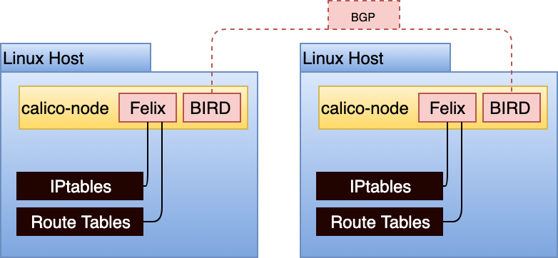

> [!NOTE]
> 책 내용 + 기타 레퍼런스를 보완한 요약본입니다.

# Chapter 5] 파드 네트워크

## Backgrounds

- Underlay Network
    - 실제 장비를 이용한 물리적 인프라(네트워크 장비, 보안 장비, 서비스 제공 서버)를 의미
    
- Overlay Network
    - 물리적 인프라를 기반으로 네트워크 가상화 기술을 사용해 End-to-End 통신을 수행하는 기술을 정의
    

> Reference : https://www.baeldung.com/cs/underlay-overlay-network

|항목|Underlay|Overlay|
|---|---|---|
|데이터 전송|물리 네트워크 장비의 링크를 통해 전송|가상화된 터널을 통한 데이터 전송|
|패킷 캡슐화 / 오버헤드|L2 / L3 레벨에서의 캡슐화|신규 헤더가 추가되어 원본 헤더의 캡슐화, 헤더 추가에 따른 오버헤드 발생|
|패킷 제어|Hardware 지향|Software 지향|
|배포 시간|많은 시간 소요|가상 링크 구성으로 빠르고 안정성 있게 구성 가능|
|ECMP (Equal-Cost MultiPath)|가능하지만 복잡한 설정과 어려운 관리|가상 네트워크로 쉽게 구성 가능|
|확장성|나쁨, 네트워크 구축 이후 신규 장비 추가의 어려움|쉬움, VXLAN과 같은 기술 사용으로 쉽게 확장 가능|
|프로토콜|Ethernet, VLAN, Routing Protocol (OSPF, BGP)|VXLAN, NVGRE, SST, GRE, NVO3, EVPN|
|Multi-Tenant 관리|NAT or VRF 기반의 독립적 구성 필요. 이러한 구성이 확장을 힘들게 함|Multi-Tenant IP 헤더를 새로운 헤더로 캡슐화시켜 쉽게 관리 가능|

- SDN (Software Defined Network)

    

    - 소프트웨어로 네트워크 리소스를 가상화, 추상화하는 네트워크 인프라 접근 방식
    - 소프트웨어 애플리케이션 및 API를 사용해 네트워크를 프로그래밍하고, 중앙에서 전체 네트워크를 제어하고 관리하는 것
    - Control Plane(컴퓨팅 서버)과 Data Plane(네트워크 장비 - 데이터 전송 기능)으로 분리한다.
    - [비용 절감] 제어부가 여러 네트워크 장비를 제어하므로 관리가 최소화되고 운영에 들어가는 비용을 줄일 수 있음
    - [확장성 및 유연성] 하드웨어를 소프트웨어로 전환하여 더 이상 물리적 리소스 한계에 구애받지 않아도 됨, 필요한 시기에 필요한 만큼 네트워크 리소스를 확장/축소할 수 있다.

- Routing Protocol

    

    - Static Routing과 Dynamic Routing
        - Static Routing은 관리자에 의해 Routing Table이 유지 관리되는 기법으로, Routing Table 교환이 불필요하므로 네트워크 대역폭이 Save된다. 그리고 외부에 자신의 경로를 알리지 않으므로 보안에도 강하다. 다만 경로에 문제가 생기면 대처가 어렵다.
        - Dynamic Routing은 Routing Protocol에 의해 동적으로 Routing Table이 유지 관리되는 기법이다. Router가 판단해 가장 효율적인 방법으로 패킷을 전송시킨다.
    
    - IGP(Interior Gateway Protocol) / EGP(Exterior Gateway Protocol)
        - Dynamic Routing을 IGP / EGP로 구분하며, Autonomous System (동일한 Routing 정책을 적용해 하나의 관리자에 운영되는 독립적 네트워크) 내부에서 Routing 정보가 교환되는지 혹은 Autonomous System 간 Routing 정보가 교환되는지에 의해 구분된다.

        - BGP (Border Gateway Protocol)
            - EGP에 속하는 Routing Protocol
            - Distance Vector 방식을 사용해 대용량의 Routing 정보를 공유한다.

        - OSPF (Open Shortest Path First)
            - IGP에 속하는 Routing Protocol
            - 최저 Time Cost를 최적 Routing 경로로 결정한다.
            - 대표적인 Link State Protocol로 Shortest Path Algorithm을 사용해 Routing Table을 생성한다.

## Summary

쿠버네티스 클러스터 내 다양한 노드 간의 통신 관리에는 Overlay Networking이 적용된다. 클러스터 내 컨테이너 간 통신 및 컨테이너와 클러스터의 다른 구성 요소 간의 네트워크 설정 관리를 CNI라는 표준 인터페이스로 정의하여 이를 구현한 CNI Plugin을 사용할 수 있다.

### 네트워크 고려사항

- IPAM (IP Address Management)
    - 주소 할당 및 해제
        - 신규 장치가 추가되면 자동으로 IP 주소를 할당하고, 해당 장치가 더 이상 필요하지 않으면 주소를 해제
    - 주소 예약 및 Pool 관리
        - 특정 장치 혹은 서비스를 위해 일부 IP 주소를 예약하거나, Pool로부터 사용 가능한 주소를 동적으로 할당하는 등 IP 주소의 효율적 관리
    - 주소 충돌 방지
        - 중복된 IP 주소 할당을 방지하고 이를 예방하기 위한 기능 제공
    - 서브넷 방지
        - 서브넷을 만들고 관리하여 네트워크를 효율적으로 조직하고 세분화
    - 트래픽 모니터링
        - IP 주소 사용량 및 트래픽 흐름을 모니터링하여 네트워크 성능 최적화
    - 보안 및 감사
        - IP 주소에 대한 액세스 제어 및 변경 이력을 기록하여 보안 강화, 감사 및 감시 지원
    
    쿠버네티스 환경에서는 IPAM이 CNI 플러그인을 기반으로 구현됨. 클러스터 생성 시 Pod 네트워크의 CIDR를 지정할 수 있음.
    ```shell
    $ kubeadm init --pod-network-cidr 10.30.0.0/16
    ```

    ```yaml
    apiVersion: v1
    kind: Node
    metadata:
        labels:
            kubernetes.io/arch: amd64
            kubernetes.io/hostname: test
            kubernetes.io/os: linux
            manager: kubeadm
        name: master-0
    spec:
        podCIDR: 10.30.0.0/24
        podCIDRs:
            - 10.30.0.0/24
    ```

    > CNI 플러그인에 따라 IPAM에서 값이 사용되는지 여부가 달라짐 (Calico는 이 설정을 감지하고 준수하는 반면 Cilium은 독립적 IP Pool을 관리하거나, 할당을 준수하는 옵션 제공)

- Routing Protocol
    - 쿠버네티스 환경에서 워크로드 간 라우팅 방법이 복잡하므로 동적 라우팅을 통해서 구성되어야 하며 CNI 플러그인은 라우팅 프로토콜을 통해 워크로드 간 네트워킹을 지원한다.

- Encapsulation / Tunneling
    - 쿠버네티스에서의 네트워크 터널링(네트워크에서 또 다른 네트워크로 패킷 이동)은 Pod의 네트워크 정보를 Node에서 캡슐화하여 목적지 Node로 전달하는 것이다.
    - 터널링 프로토콜로 VXLAN, Geneve, GRE 등이 있다.
        - 가장 일반적으로는 VXLAN이 사용된다.

    - 쿠버네티스에서의 네트워킹은 Overlay 통신으로, 아래와 같은 단점을 고려해야 한다.
        - 트래픽 이해 및 문제 해결의 어려움
        - 캡슐화 적용 및 해제에 드는 처리 비용
        - 패킷 크기 증가
    
- Workloads Routability
    - Pod 간에는 직접 통신이 가능하지만, 외부 클라이언트는 Pod IP에 직접 연결할 수 없으므로 이를 추상화하는 Service Discovery 혹은 Load Balancing 메커니즘에 의존해야 한다.
        - 전용 노드 하위 집합의 호스트 네트워크에 Ingress Controller를 노출하여 패킷이 Ingress Controller Proxy로 들어가게 한다.

- IPv4 / IPv6
    v1.16부터 dualstack으로 IPv6를 지원한다. (클러스터에서 dualstack을 통해 IPv4 / IPv6 주소 공간 구성이 가능하다.)

    ```yaml
    apiVersion: v1
    kind: Node
    metadata:
        labels:
            kubernetes.io/arch: amd64
            kubernetes.io/hostname: test
            kubernetes.io/os: linux
            manager: kubeadm
        name: master-0
    spec:
        podCIDR: 10.30.0.0/24
        podCIDRs:
            - 10.30.0.0/24
            - 2002:1:1::/96
    ```

    > v1.16에서 beta Feature 이나 v1.21부터 Dualstack이 default로 enabled 된다.

- Encrypted Workload Traffic
    Pod 간 기본 트래픽은 암호화되지 않으므로 유선으로 전송된 패킷은 Sniffing 가능하다. 네트워크 플러그인으로 유선을 통한 트래픽 암호화를 할 수 있다.

    - Antrea : GRE(Generic Routing Encapsulation) Tunnel을 사용할 때 IPsec을 사용한 암호화를 지원한다.
    - Calico : Wireguard 설치를 활용해 트래픽 암호화를 지원한다.

    > mTLS (Mutual TLS)를 사용하여 양쪽 엔티티간 상호 인증 및 암호화 또한 가능하며 Istio와 같은 Service Mesh를 사용하는 경우 Envoy Sidecar에서 이를 처리한다.

- `NetworkPolicy`
    - Ingress / Egress Traffic에 대해 허용 혹은 거부하는 정책을 설정할 수 있는 Object.
    - CNI Provider에 따라 이 오브젝트가 적용되지 않을 수 있음. 예) Flannel
    - namespace 단위 자원이다.
    - 여러 개가 존재하면 중복 적용된다.
    - Whitelist 형식이다.
    - 제한사항 - 아직 완벽하지 않고 제약이 많다. 실제로 이를 모든 CNI Provider가 100% 준수하지 않는다.
        - TLS 관련 기능이 없다.
        - 노드 단위 설정이 안된다.
        - 한번에 여러 포트 설정이 안된다.
        - Auditing 미지원

    > AWS VPC CNI의 경우 23년도에 NetworkPolicy를 지원하는 것으로 발표함 (v1.25 이상의 클러스터에서)
    > https://aws.amazon.com/ko/blogs/containers/amazon-vpc-cni-now-supports-kubernetes-network-policies/

    ```yaml
    apiVersion: networking.k8s.io/v1
    kind: NetworkPolicy
    metadata:
        name: team-netpol
        namespace: org-1
    spec:
        podSelector: {}
        policyTypes:
        - Ingress
        - Egress
        ingress:
        - from:
          - ipBlock:
            cidr: 10.40.0.0/24
          ports:
          - protocol: TCP
            port: 80
        egress:
        - to:
          ports:
          - protocol: UDP
            port: 53
        - to:
          - namespaceSelector:
            matchLabels:
                name: org-2
        - podSelector:
            matchLabels:
              app: team-b
          ports:
          - protocol: TCP
            port: 80
    ```

    일반적으로 아래와 같은 요구사항이 발생할 때 NetworkPolicy가 사용되는 것으로 보여진다.
    - 복잡한 상태평가
    - DNS 레코드 기반 IP 확인
    - L7 규칙 (호스트, 경로 등)
    - 클러스터 차원의 정책으로 모든 네임스페이스에서 글로벌 규칙을 복제할 필요 없이 글로벌 규칙을 적용할 수 있다.

#### 요약

- Pod CIDR은 클러스터당 얼마나 커야 하는가?
- Underlay Network가 이후 생성될 Pod 네트워크에 어떤 네트워크 제약을 가하는가?
- 쿠버네티스 관리 서비스나 벤더 제품을 사용할 때 지원되는 Network 플러그인은 무엇인가?
- BGP와 같은 Routing 프로토콜이 인프라에서 지원되는가?
- 캡슐화되지 않은 패킷이 네트워크로 라우팅될 수 있는가?
- 터널 프로토콜을 사용하는 것이 바람직하거나 필요한가?
- 라우팅 가능한 Pod를 지원해야 하는가?
- 워크로드에 IPv6 실행이 요구사항인가?
- NetworkPolicy 또는 방화벽 규칙을 어느 수준에서 시행할 것으로 예상하는가?
- Pod 네트워크에서 유선 트래픽을 암호화해야 하는가?

## [CNI (Container Network Interface)](https://github.com/containernetworking/cni)

워크로드에 대한 네트워크 리소스를 요청할 수 있는 방법의 표준을 정의한다.
Spec에서는 다음 주요 내용을 정의한다.

- ADD
    - 네트워크에 컨테이너를 추가하고 연결된 인터페이스, IP 등으로 응답한다.
- DELETE
    - 네트워크에서 컨테이너를 제거하고 연결된 모든 리소스를 해제한다.
- CHECK
    - 컨테이너의 네트워크가 올바르게 설정됐는지 확인하고, 문제가 있을 때는 에러로 응답한다.
- VERSION
    - 플러그인에서 지원하는 CNI 버전을 반환한다.

호스트에 설치된 바이너리로 구현된다. `kubelet`이 호스트에서 예상하는 구성을 기반으로 적절한 CNI 바이너리와 통신한다.

```json
{
    // CNI Spec Version
    "cniVersion": "0.4.0",
    // CNI 드라이버
    "name": "dbnet",
    "type": "bridge",
    "bridge": "cni0",
    "args": {
        "labels": {
            "appVersion": "1.0"
        }
    },
    // 사용할 IPAM 드라이버, CNI 플러그인이 IPAM을 처리하지 않을 때 지정
    "ipam": {
        "type": "host-local",
        "subnet": "10.1.0.0/16",
        "gateway": "10.1.0.1"
    }
}
```

### 설치

Pod 네트워크에 포함되는 모든 노드에 대해 네트워킹이 처리되어야 하므로 CNI 드라이버는 DaemonSet 형태로 설치된다.

### 플러그인

- [Calico](https://docs.tigera.io/calico/latest/about/)
    
    - Node 간 워크로드 경로 전파, 큰 규모의 데이터센터 패브릭과의 통합을 위해 BGP 사용
    - 각 Node에 존재하는 `calico-node` 에이전트는 각 Host에 존재하는 커널 라우팅 테이블에 경로 정보를 반영하는 Felix와 BGP Peering을 지원하는 Bird Daemon으로 구성
    - 자체 CRD인 `IPPool`로 유연한 IPAM 제공
        - 노드별 블록 크기 설정
        - IPPool이 적용되는 노드 지정
        - 노드가 아닌 네임스페이스에 IPPool 할당
        - 라우팅 동작 구성
        ```yaml
        apiVersion: projectcalico.org/v3
        kind: IPPool
        metadata:
            name: default-ipv4-ippool
        spec:
            cidr: 10.30.0.0/16
            blockSize: 29
            ipipMode: Always
            natOutgoing: true
        ```
    - 클러스터 내부 패킷 라우팅 방법
        - Native : 패킷 캡슐화 하지 않음
        - IP-in-IP : 간단한 캡슐화, IP 패킷이 다른 패킷의 페이로드에 배치
        - VXLAN : 고급 캡슐화, 전체 L2 프레임이 UDP 패킷에 캡슐화되며 가상 L2 Overlay를 설정함
    - Calico는 K8s `NetworkPolicy` API를 완벽히 구현
        - `NetworkPolicy`
        - `GlobalNetworkPolicy`
        - K8s `NetworkPolicy`에서 보다 좋은 규칙과 표현식 제공, 정책 순서 지정 및 애플리케이션 레이어 정책 지원

- [Cilium](https://cilium.io/)
    
    

    - eBPF 사용 (userspace에서 패킷을 처리하는 대신 kernel space를 떠나지 않고 처리할 수 있음)
        - `iptables`를 처리하지 않는 대신 eBPF가 이벤트를 Hooking하여 변경
    - IPAM은 Cloud Provider에 위임하거나 자체 관리 모델을 따름
        - 일반적으로는 각 노드에 Pod CIDR을 할당
        ```yaml
        apiVersion: cilium.io/v2
        kind: CiliumNode
        metadata:
            name: node-a
        spec:
            addresses:
            - ip: 192.168.122.126
              type: InternalIP
            - ip: 10.0.0.245
              type: CiliumInternalIP
            health:
              ipv4: 10.0.0.78
            ipam:
              podCIDRs:
              - 10.0.0.0/24 
        ```
    - 캡슐화된 기본 라우팅 모드 제공
    - 터널링 프로토콜 VXLAN / Geneve 사용 지원
    - K8s `NetworkPolicy` API 적용
        - `CiliumNetworkPolicy`
        - `CiliumClusterwideNetworkPolicy`
    - 각 노드에 배포된 `cilium-agent`가 `kube-proxy`를 대체 가능함
        - 적용할 경우 eBPF Map에서 서비스에 대한 경로를 O(1)만큼 빠르게 해결

- [AWS VPC CNI](https://github.com/aws/amazon-vpc-cni-k8s)

    

    - 노드 네트워크와 독립적으로 파드 네트워크를 실행하는 대신 파드를 동일한 네트워크에 완전히 통합
        - Node와 Pod의 IP 대역이 동일
        - 즉 Overlay가 아닌 직접 통신 방식이다.
    - Node에서 Network namespace는 Root / Per-Pod namespace로 나누어진다.

        - Node의 EC2 Instance Type에 따라 가질 수 있는 ENI 수가 달라진다.
    - Node에 배포되는 Pod가 늘어나면 그 수에 맞게 ENI가 생성된다.
        - 예외적으로 `aws-node`와 `kube-proxy` Pod만 Root namespace의 IP와 동일한 IP를 사용한다.

    > 다음 문서들에 설명이 잘 되어 있다.
    > - https://dobby-isfree.tistory.com/201
    > - https://kim-dragon.tistory.com/46

- [Multus](https://github.com/k8snetworkplumbingwg/multus-cni)
    
    

    - Pod가 둘 이상의 네트워크에 연결하는 경우 사용
    - NFV (Network Function Virtualizations)

- [Antrea](https://antrea.io/docs)

    

    - Data Plane이 Open vSwitch 방식으로 구현
    - 흐름 데이터 체크 및 고성능 라우팅 제공

- [Weave](https://www.weave.works/oss/net)
    - 트래픽 라우팅을 위한 많은 메커니즘을 제공하는 Overlay 네트워크 제공

- [Flannel](https://github.com/coreos/flannel)
    - L3 네트워크
    - VXLAN
