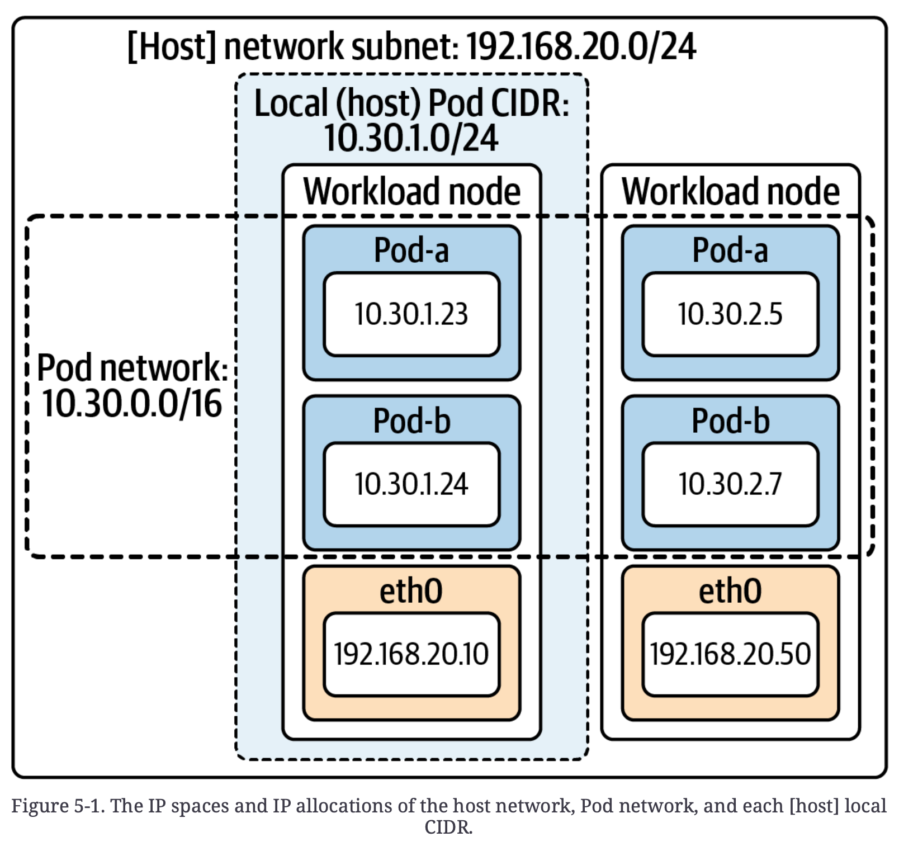
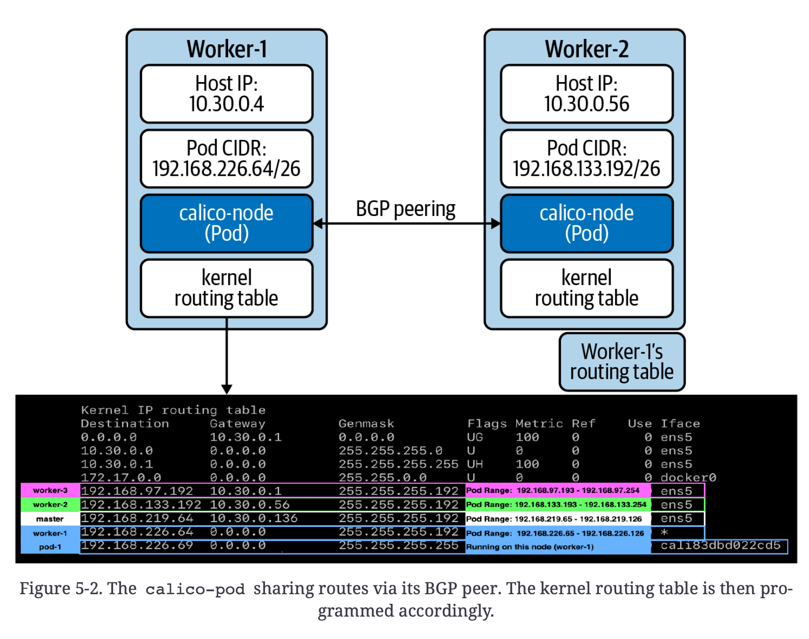
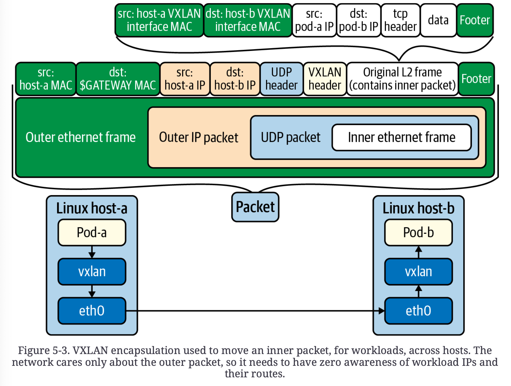
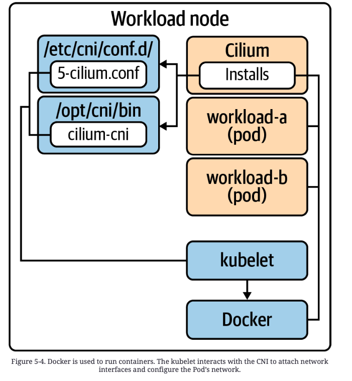
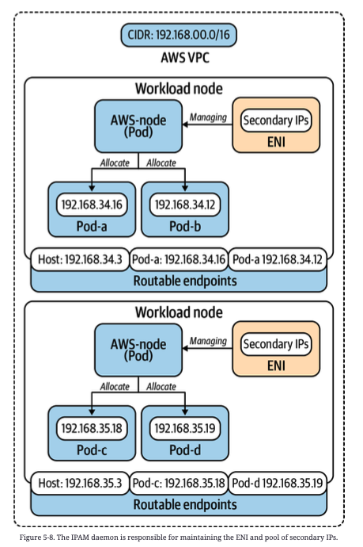

# Chapter 5. Pod Networking

> host to hsot communication에 대한 개선에 대한 고민
>
> 1. uniquely addressing hosts
> 2. network packet routing
> 3. propagation of known routes

**SDN** (Software-defined networks)은 이런 고민들을 유동적인 환경속에서 해결하기 위해 빠르게 성장했다.


해당 장에서는 networking solution, app. platform 설정에 대한 올바른 결정들을 할 수 있도록

1. 주요 networking 개념들을 이해한다.
2. CNI (Container Networking Interface)를 이해하고, 이를 통해 network 요구사항에 부합하는 network 구현체를 선택할 수 있도록 한다.
3. **Calico**나 **Cilium**과 같은 plug-in들을 비교해본다.


## Networking Considerations

### IP Address Management

- 각 pod은 cluster internal IP 또는 externally routable IP를 갖는다. 따라서,
  - 고유 IP를 갖기 때문에 port collision을 걱정하지 않아도 된다.
- pod은 restart, reschedule이 빈번하게 발생한다. 따라서, 
  - IP allocation이 빠르게 이뤄져야 한다.
  - cluster IP pool에 대한 관리가 효율적이어야 한다.

이러한 관리를 **IPAM** (IP Address Management)라고 한다.

>  [!warning]
>
> 특정 IP를 특정 workload에 고정시킬 수 있으나, 필요한 경우가 아니면 권장되지 않는다.
>
> 이에 대한 해결책으로 **service discovery**나 **DNS mechanism**들이 제시되고, 이는 6장에서 다룰 예정이다.

- IPAM은 **CNI plug-in** 선택에 기반으로 구현된다.

  - cluster 생성 시 pod network의 **CIDR** (Classless Inter-Domain Routing)을 지정할 수 있다.
    - K8S bootstrap에서 설정 가능 (ex. `kubeadm init --pod-networ-cidr 10.30.0.0/16`)
    - 위 명령어를 통해 kube-controller-manager의 `--cluster-cidr` flag 설정을 하게됨
  - 이후 K8S가 해당 cluster-cidr chunk를 모든 node들에 할당한다. (mask size는 기본값으로 `/24`)
    - `--node-cidr-mask-size-ipv4` or `--node-cidr-mask-size-ipv6` 설정으로 변경 가능

  ```yaml
  apiVersion: v1
  kind: Node
  metadata:
  	labels:
  		kubernetes.io/arch: amd64
  		kubernetes.io/hostname: test
  		kubernetes.io/os: linux
  		manager: kubeadm
  	name: master-0
  spec:
  	podCIDR: 10.30.0.0/24 # 이전 스펙 호환성을 위해서 존재
  	podCIDRs: # IPv6 & IPv4 dual stack support
  	- 10.30.0.0/24 # 10.30.0.0 - 10.30.0.255 Pod에 사용가능한 IP 254개
  ```

- 이러한 값들이 IPAM에서 사용되는지는 CNI plug-in에 따라 다르다.

  - **Calico**: 해당 설정들을 감지하고 따른다.
  - **Cilium**: K8S와 별개로 IP pool을 관리하거나 K8S 할당을 따를지에 대한 선택권을 제공한다.

- CNI 구현체에서 CIDR 설정이 cluter host/node network와 겹치지 않아야 한다.

  - 하지만 Pod network가 internal이라는 가정하에서 cluster 외부 network space와 겹쳐도 된다.



### Routing Protocols

> dynamic routing을 가능하게 한다.
>
> network에서 workload IP들이 어떻게 route 되는지 모르기 때문에, encapsulation을 활용하지 않을 때, route들을 이해하는 것이 중요하다.

**BGP** (Border Gateway Protocol)

- workload route 분산을 위한 가장 흔한 protocol
- **Calico**, **Kube-Router**와 같은 프로젝트에 사용된다.
- internal router들을 external router들과 peering하는 기능도 있어서, external network에서 pod IP로 route할 수 있게 해준다.
- **Calico**와 같은 구현체에서 BGP daemon이 Calico pod의 일부로 실행되고 있다. (모든 node에 pod이 존재함)
  - workload를 향한 route를 알게 되어, calico pod에서 kernel routing table에 각 (잠재적) workload 로 가는 route를 포함시킨다.



- 대부분 환경들에서 workload IP에 대한 기본 routing이 불가능하고, BGP와 같은 routing protocol은 기존 network와 통합될 수 없다. (Cloud provider network 상에서 그렇다.)

  - AWS로 예를 들면 2가지 이유로 실패하게 된다.

    1. **Source/Destination check가 켜져있다.**

       host로 향한 packet이 target host의 destination을 host가 갖고 있는지를 확인하고, 아니라면 packet을 drop한다.

    2. **packet이 subnet들을 지나가야 한다.**

       packet이 subnet을 나가야 하는 경우, destination IP는 AWS router에 의해 도출된다. 만약 Pod id가 존재한다면, route가 불가능하게 된다.


### Encapsulation and Tunneling

> tunneling은 기본 network가 모르도록 하고 Pod network를 실행할 수 있도록 해준다.
>
> 이를 encapsulation으로 해낸다.

- 이름에서 알 수 있듯이 packet을 한번 더 감싼다.

  1. 내부 packet의 src IP, dst IP는 workload IP를 참조한다.

     외부 packet의 src IP, dst IP는 host/node IP를 참조한다.

  2. packet이 node를 떠나게 되면 일반적인 packet과 같이 기본 network에게 보인다.

- tunneling protocol은 **VXLAN**, **Geneve**, **GRE** 등 다양하다. 이중 **VXLAN**이 가장 흔히 쓰인다.

  - **VXLAN**
    1. VXLAN은 UDP packet에 Ethernet frame을 통째로 집어넣는다.
    2. 이를 통해 완전히 가상화된 layer-2 network(overlay network)를 제공한다.
    3. underlay network는 overlay의 일들에 대해 관여하지 않는다.

  

**위 방식의 3가지 단점**

1. Traffic이 이해하거나 오류 분석하기 어려워진다. 

   packet이 nesting되어 있어서 networ issue 분석이 복잡해진다.

2. de/encapsulation의 overhead

   host 출입시 필요한 과정

3. packet이 더 커진다.

   따라서 MTU (Maximum Transmission Unit) 조정이 필요할 수 있음


### Workload Routability

> 대부분 cluster에서 pod network는 cluster 내부적으로 동작한다.
> 따라서 내부 pod끼리는 직접적으로 통신이 가능하지만 외부 클라이언트에서는 Pod id에 직접적으로 도달할 수 없다.
>
> Pod ip는 일시적이기 때문에 pod ip에 직접적으로 통신하는 것은 좋지 않다.
>
> 대신에 service discovery나 load balancing에 의존하는 것이 선호된다.


**pod에 직접적으로 route할 수 없을 때 외부 traffic을 pod ip로 보내려면**

1. node들 subset의 host network의 Ingress controller를 노출시킨다.

2. packet이 ingress controller proxy로 들어오면 pod ip로 직접 route해준다.

   ingress controller proxy는 Pod network에 속하기 때문에 가능

몇몇 cloud provider들은  위 기능이 자동화된 (외부) load balancer 통합도 포함시킨다. 


**pod이 더 큰 network에 routable 가능하게 만들기**

두가지 방법

1. 기본 network와 통합시켜주는 networking plug-in 사용하기
   - ex) AWS VPC CNI는 여러 보조 IP를 각 node에 부여하고 이를 Pod들에 할당한다.
   - 이런 방식의 단점은 subnet, VPC의 ip를 소모하게 된다는 것이다.
2. BGP와 같은 routing protocol을 사용해서 pod들에 route 전파
   - BGP를 사용하는  일부 plug-in들은 전체 IP space를 노출시키는 대신 pod 일부만 노출시키는 기능도 제공한다.


> [!warning]
>
> Pod network를 외부에 노출시키는 것은 정말 필요한 것이 아니라면 피해야한다.
>
> 다른 문제 해결방법보다 간단해보일 수 있으나, IP space를 소모하는 비용이 크고, IPAM과 route propagation config를 더욱 복잡하게 만들 수 있다.


### IPv4 and IPv6

> 압도적인 수의 cluster가 IPv4를 사용한다.
>
> 하지만 통신사와 같이 수 많은 workload에게 주소를 부여해야 되는 요구사항이 있을 경우 IPv6가 필요할 수 있다.

- K8S는 v1.16부터 dual-stack 으로 IPv6를 지원한다. (v1.23부터 stable)
  - 따라서 feature-gate 필요 없다
- **dual-stack**: IPv4 & IPv6 주소 둘 다 할당 가능
  - kube-apiserver, kube-controller-manager, kube-proxy 모두에 추가적인 설정이 필요하다.
  - IPv6를 지원하는 **Calico**, **Cilium**과 같은 CNI plug-in을 사용해야 한다.

example

```yaml
spec:
	podCIDR: 10.30.0.0/24
	podCIDRs:
	- 10.30.0.0/24
	- 2002:1:1::/96
```


### Encrypted Workload Traffic

기본적으로 Pod to Pod traffic은 별도 암호화가 없을 경우 평문으로 통신하게 된다.

그래서 Antrea(IPsec), Calico(WireGuard) 등 network plug-in을 통해 암호화를 할 수 있다.

반드시 필요한지는 trade-off를 보고 고민해봐야 한다. 


### Network policy

> pod network가 연결됐다면 network policy를 고민해야 한다.

- firewall rules, security groups와 유사하게 ingress / egress traffic을 제한한다.
- K8S는 NetworkPolicy API를 core networking API들 중 하나로 제공해준다.
- policy를 구현하는 것은 CNI provider의 역할인데, 대부분의 CNI 구현체들은 NetworkPolicy의 일부를 지원해준다.


- firewall-style rule들이 관리될 수 있는 다른 layer를 추가한다.
  - 많은 network들이 Pod-based workload communication에 대한 규칙들을 설정할만한 정밀함이 부족하다
    - 분산형 firewall, security group mechanism을 이용해 subnet이나 host level의 rule들을 지원하는데, 대신 Pod network에 대한 가시성이 없기 때문
- 다른 object들과 같이 선언적이고, 다른 firewall management solution들에 비해 관리가 쉽다.
- 따라서 기존 host to host firewall solution과 함께 NetworkPolicy로 intra-workload policy를 관리하면 된다.


- Namespace-scoped
- NetworkPolicy가 존재하지 않을 경우 모든 통신이 허용이나, 존재할 경우 명시된 정책을 제외하고 모두 차단한다.

```yaml
apiVersion: networking.k8s.io/v1
kind: NetworkPolicy
metadata:
	name: team-netpol
	namespace: org-1
spec:
	podSelector: {} # 해당 namespace의 모든 pod을 지정한다. 필요하면 label 지정
	policyTypes:
  - Ingress
  - Egress
  ingress:
  - from:
  	- ipBlock:
      cidr: 10.40.0.0/24
    ports:
    - protocol: TCP
  		port: 80
  egress:
  - to: # 
  	ports:
    - protocol: UDP
    	port: 53
  - to:
  	- namespaceSelector:
      	matchLabels:
      		name: org-2
    - podSelector:6
      	matchLabels:
      		app: team-b
    ports:
    - protocol: TCP
      port: 80
```


**NetworkPolicy**의 use cases

- 복잡한 조건 계산
- DNS record 기반 IP 확인
- L7 rules (host, path, etc.)
- cluster-wide policy로 global rule 적용


## The Container Networking Interface (CNI)

**CNI spec.**

- **ADD:** network에 container 추가하고 관련 interface, IP 반환
- **DELETE:** network에서 container 제거하고 관련 resource 해제
- **CHECK:** container network set up 확인 후 오류가 있으면 오류 반환
- **VERSION:** plug-in이 지원하는 CNI version 반환


### CNI 설치




### AWS VPC CNI

- Node network에서 개별적으로 Pod network를 실행하는 것이 아니라, 동일한 network에 pod들을 통합한다.
  - 따라서 route distributing이나 tunneling protocol에 대한 고민이 필요없어진다.
- Pod IP는 EC2 host와 같은 방법으로 network의 구성이 된다.
  - 따라서 subnet 내 다른 host들과 동일한 route table의 영향을 받는다. (VPC networking)
- IPAM을 위해 K8S node에 보조 ENI (Elastic Network Interface)를 붙여서, 보조 IP pool을 관리하게된다.
  - node에서 사용 가능한 IP 갯수는 EC2 instance 크기에 따라 달라진다.
- 이전에 알아봤듯이 이런 방식은 VPC의 IP space를 소모하고, 독립적인 Pod network에 비해 IPAM system이 더욱 복잡해진다.
- 대신 새로운 network가 적용되지 않았기 때문에 traffic routing과 troubleshooting이 간단해졌다.




