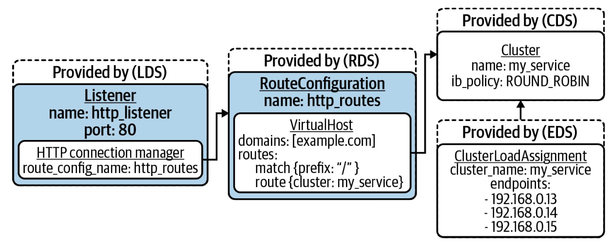

## 서비스 메시 (Service Mesh)?

Mesh ?

  

이름 그대로의 역할
- 네트워크 전체에서 흩뿌려져 내부 동작을 손쉽게 제어
- 서비스 라우팅, 로드밸런싱, 텔레메트리에 대한 아이디어를 재구성

 

Kubernetes 이전?
- 관련된 기능을 특정 언어의 라이브러리로 제공했음 (물론 지금도 사용하는 곳도 많음)
- 무엇이 있었나?
	- Scala - finagle
	- Java - Netflix OSS (hystrix, ribbon), Spring cloud
- 만약 다른 언어에서 사용하고 싶다면?
	- 사용할 수 없다. 해당 언어에서만 사용이 가능함.
	- 해당 언어 애플리케이션에서 사용할 땐 의존성이 생기는 문제
		- 단순히 import dependency가 아닌 애플리케이션 비즈니스 코드 내부로 깊게 침투해져 있는 경우가 많았다.
- 만약 이걸 때내려고 하면?
	- 아주 큰 고통... 어떻게 때야하지...?

 

서비스 메시는 이러한 문제를 해결할 수 있음
- 언어별 라이브러리가 아닌 보통 외부 프록시를 통한 제어
	- 라우팅, 로드 밸런싱, 텔레메트리 등 기능이 프록시에 내장되어 있음.
- 애플리케이션 코드에서는 외부 상황을 몰라도 됨. 즉, 비즈니스 코드에서 이러한 외부 환경에 대한 의존성이 없어짐.
	- 무언가 네트워크 동작을 바꿔야 해? 코드 변경 없이 외부 프록시 설정(서비스 메시 설정)만 바꿔도 되는 것.

 

## 서비스 메시의 3가지 기둥
1. **라우팅 및 안정성**
	- Traffic shifting, mirroring, retry, circuit breaker 등 고급 트래픽 라우팅 기능을 사용할 수 있음. 이로써 안전한 통신이 가능하도록 지원.
2. **보안**
	- ID, 인증서 관리, 상호 TLS (mTLS/mutual TLS Authentication) 지원
	- 서비스 간 안전한 통신을 지원함.
3. **관찰 가능성 (Observability)**
	- 서비스 메시 내 발생하는 모든 상호작용 트래픽/메트릭/트레이스를 자동으로 수집.

 

## 도입해야 해?
기능만 들으면 무조건 도입해야 할 것처럼 느껴짐
- "아니 고급 라우팅 기능 !? 도입해야하는 것 아니야?"
- 옳지 않은 생각이다!

 

진짜 말그대로 "고급"적인 기능이다.
- 네트워크 전체 상황을 계산하고 이를 처리하기 위해 여러 추가적인 워크로드가 필요하며, 전체적인 서버 아키텍처 자체가 엄청 복잡해진다. 
	- 추상적인 그림으로 프로덕션 클러스터를 운영하기엔 너무 리스크가 크다.
	- 추가적인 워크로드들 때문에 생기는 여러 문제(리소스, 네트워크)도 덤으로 따라온다.
- 그러므로 기본적인 네트워크 기능만 사용하는데는 서비스 메시가 필요하지 않다. 특히 소규모 프로젝트인 경우, 더 적합하지 않다.
- 예를 들어, 서비스 메시를 도입해놓고 Ingress만 사용하는 사례가 있다.
	- mTLS, advanced routing, Tracing 등 기능을 사용하지도 않으면서, 더 나아가 알지도 못하면서 서비스 메시를 도입하는건 불필요한 행동이다.

 

도입하더라도 일단 최소한 실행가능한 최소 형태부터 시작하는 것이 좋다.
- 서비스 메시가 없는 형태(Ingress controller만 있는 상태 등)에서 서비스가 제대로 제공되는 구조는 만들어놓고 서비스 메시 도입을 고려하자.
- 도입하고서도 하나하나 작은 기능부터 도입하는 것이 안전하다. 이슈 추적도 어렵고, 내부 기능 파악하기도 좋다.

 

## 서비스 메시 인터페이스 (SMI: Service Mesh Interface)

서비스 메시의 구현체들은 여럿있다.
- 많이 사용하는 Istio부터 linkerd, cilium 등...

 

Kubernetes에서 여러 인터페이스(CRI, CSI, CNI 등)를 지원하듯, 이러한 서비스 메시 구현체들에게 적용되는 인터페이스를 만들고자 하는 액션이 있었다.
- Kubernetes 산하 프로젝트의 일부는 아니고 외부 프로젝트 일환으로 보인다. CNCF 프로젝트에도 등록되어있다.

 

하지만 더 이상 지원되지 않는다.
- https://www.cncf.io/blog/2023/10/03/cncf-archives-the-service-mesh-interface-smi-project/
- 앞서 1편에서 이야기했던 k8s Gateway API와 비슷한 Goal이였고, 결국 k8s Gateway API를 통합하는 방향으로 결정되어 SMI는 아카이빙 처리되었다 (~~즉, 깊게 볼 필요 없다~~).

 

## 데이터 플레인 프록시
뒤에서 이야기나오겠지만, 서비스 메시에서 직접적으로 데이터가 이동, 네트워크 통신하는데는 프록시가 이용된다.
- 즉, 서비스 메시의 데이터 플레인은 프록시의 모음이라고 봐도 무방할 것 같다.

 

이러한 데이터 플레인 프록시 역할을 하는 소프트웨어들도 많지만, 가장 대표적인건 [Lyft](https://www.lyft.com/)에서 개발해 오픈소스가 된 [Envoy](https://www.envoyproxy.io/)이다.
- Ingress Controller(Contour), API Gateway (Ambassador, Gloo), Service Mesh (Istio, OSM) 같이 다양한 구현체들에서 폭 넓게 이용된다.

 

왜 Envoy를 이렇게 많이 사용하는 것일까?
- 여러 이유가 있지만, 큰 특징으로 gRPC/REST API를 이용해 동적 구성할 수 있다는 점이다.
- Envoy 이전의 프록시들은 쿠버네티스 같은 동적인 환경을 위해 설계되지 않았다. 보통 정적 구성파일을 사용했고, 구성 변경이 생기면 재시작이 필요했다.
- Envoy는 이러한 문제를 [xDS(Discovery Service) API](https://www.envoyproxy.io/docs/envoy/latest/api-docs/xds_protocol)를 통해 동적구성을 지원함으로써 해결했다. [Hot restart 기능](https://www.envoyproxy.io/docs/envoy/latest/intro/arch_overview/operations/hot_restart)을 지원해 활성된 Connection을 끊지 않고도 설정 초기화 등이 가능하다.

 

xDS 기능에 대해 더 자세히 알아보면 4가지로 크게 나뉜다.
- LDS (Listener Discovery Service)
- RDS (Route Discovery Service)
- CDS (Cluster Discovery Service)
- EDS (Endpoint Discover Service)

  

- Envoy는 시작 시 configuration server에 gRPC로 연결해 구성 변경사항을 subscribe 한다. 변경사항이 생기면 Envoy로 streaming되어 이에 대해 반응하게 된다.

  

- 요청이 들어오면 LDS, RDS, CDS, EDS가 필터 체인 형태로 동작하며 도착지로 프록시 하게 된다.

 

## 쿠버네티스의 서비스 메시 (Istio)
앞서 데이터 플레인/프록시를 이야기했으니, 컨트롤 플레인에 대해 이야기해보자.

SDN(Software Defined Network) 구성에서는 데이터 플레인과 컨트롤 플레인이 나뉘어 이야기하는데, 직접적으로 데이터를 어디로 보낼지 계산하고 route를 구성하는 건 컨트롤 플레인인다. (데이터 플레인을 구성하는 역할이라고 볼 수 있다)

 

서비스 메시에서 제일 많이 활용되는 구현체는 [Istio](https://istio.io/)이다.

  

- istio에선 envoy를 이용해 데이터 플레인을 구성하고, 이를 위한 컨트롤 플레인으로 [istiod](https://istio.io/latest/docs/ops/deployment/architecture/#istiod) component를 구성한다.
	- Pilot: Envoy configuration server. xDS API를 구현하고, Envoy proxy로 구성을 Streaming.
	- Citadel: Mesh 내부의 인증서 관리 담당. Service ID, mTLS 설정하는데 사용되는 인증서 발급
	- Galley: Istio configuration을 확인, istiod 구성요소 구성 변환.

 

Istio의 간단한 동작 구성을 보면, 다음과 같다.
- Istio에는 Envoy sidecar를 주입하는 admission webhook이 포함되어있다. 이를 통해 istio에 영향 받는 모든 파드에는 모든 수신/발신 연결을 처리하는 Envoy sidecar가 존재하게 된다. (수동으로 추가할 필요가 없다!)
- 단순히 Envoy sidecar를 추가한다고 프록시 역할을 하는게 아니다. 네트워크 트래픽을 가로채기 위한 설정들을 해주어야 하는데, initContainer(초기화 컨테이너)를 통해 이를 지원한다. Envoy로 라우팅하는 iptables 규칙을 설정해 지원하는 것을 볼 수 있다.

 

  

initContainer의 예시 구성을 보자.
- 1번의 경우, 모든 outbound 트래픽을 envoy로 전송할 수 있도록 설정하고 있다.
- 2번의 경우, 모든 inbound 트래픽을 envoy로 전송할 수 있도록 설정하고 있다.

 

앞서말한 mTLS도 살펴보자.
- 이 또한 서비스 애플리케이션/컨테이너 이미지에서 따로 수동으로 설정할 필요가 없다.
- istio에서 mTLS 설정을 하게 되면, Envoy 단에서 mTLS를 활성화 시켜 프록시 간 암호화된 통신을 지원하게 된다. 
- 즉, 워크로드(서비스 애플리케이션)에서 envoy로 암호화되지 않은 트래픽을 보내게 되면, envoy는 이를 암호화하고 수신측 envoy로 전송하게 되고 상대측 envoy는 이를 decrypt 해서 해당 워크로드에 전송하게 되는 것이다 (컨테이너 내).

 

[Virtual Service](https://istio.io/latest/docs/reference/config/networking/virtual-service/), [Destination Rule](https://istio.io/latest/docs/reference/config/networking/destination-rule/)을 통해 Traffic splitting/shifting,  fault injection, circuit breaker, mirroring 등을 지원한다.
- Virtual Service는 서비스 생성 및 서비스 라우팅 규칙을 설정함.
- Destination Rule는 서비스에 사용할 수 있는 실제 백엔드가 나열됨.

 

모든 네트워크 트래픽을 Istio(더 자세히말하면 envoy)를 거쳐가기 때문에 트래픽을 관찰하기 아주 쉽다/간단하다.

  

- 더구나 다양한 모니터링 시스템에서 사용할 수 있도록 위 사진처럼 Prometheus 형식으로 노출된다.

 

## 데이터 플레인 아키텍처
sidecar proxy를 이용하는 데이터 플레인 아키텍처를 이야기했지만, 노드 레벨의 proxy를 이용하는 방법도 있다.

 

### sidecar proxy

앞서 이야기했던 방식으로 Pod 단에 Sidecar proxy container를 띄워 이용하는 방식이다.
- sidecar 패턴을 잘모르는 사람을 헷갈릴 수 있는데, 별개의 파드를 두는 것이 아니다. 위 그림에서 처럼 하나의 파드 내에 별개의 container를 두는 방식이다.

많은, 많이 사용되는 Service mesh가 이러한 방식을 이용하고 있다 (ex. istio, linkerd v2 등).

 

### node proxy
Pod마다 sidecar proxy container가 추가되는 방식이 아닌 node 당 단일 proxy pod가 추가되는 형식.

Consul connect, Maesh, Linkerd(v1)에서 이러한 방식을 이용했다.

 

추세는 Sidecar proxy가 더 우세한 것 같다.
Node proxy에서 모든 파드마다 추가적인 container가 필요없다는 점은 큰 장점일 수 있으나, 모든 Service에서 공유되며 네트워크 병목현상이 일어날 수 있으며, SPoF 문제가 발생할 수 있다 (이는 너무 큰 문제다).

 

### sidecarless/eBPF

추가로 아직 실험적인 부분이지만, 최근엔 sidecar 없이 네트워크 홉을 제거한 방식인 eBPF 방식이 등장하고 있다. 대표적으로 Cilium Service mesh가 있다.

 

Node proxy처럼 Sidecar가 없는 것은 동일하다. 하지만 위 두 방식 Sidecar proxy/Node proxy는 어찌됬든 통신간에 무조건 Proxy를 타야하는 [network hop](https://www.wikiwand.com/ko/%ED%99%89_(%EB%84%A4%ED%8A%B8%EC%9B%8C%ED%81%AC))이 생긴다.
L7 layer일 것이므로 아마 L1에서 L7까지 왔다 갔다해야하는 hop이 생겨버린다. 이는 큰 트래픽 상황이 아니라면 문제가 아니겠지만, 초마다 수 많은 서비스 간 서로 소통하며 상호작용하는 MSA에서는 문제가 될 수 있다.

 

이러한 문제를 막기 위해 cilium service mesh에선 eBPF를 이용하여 network hop을 최소화하는 방식을 선택했다.

  

 

아직은 실험적인 기능으로 많이 활용되고 있지는 않은 것 같다. 즉, 노하우가 많이 쌓여있지는 않은 것 같아 production 도입하기엔 좀 어려울 수 있다.
하지만 노하우가 많이 쌓이고 관련 자료가 많아지면, sidecar proxy 형태의 문제점들을 해결할 수 있을 것 같아 관심이 두고 보면 좋을 것 같다.

 

## 그럼, 어떻게 서비스 메시를 도입해야하는가?

서비스 메시 구현체를 검색해보면 참 많다.

  

 

이러한 서비스 메시 중 어떠한 메시를 어떻게 도입해야할까? 어떤 서비스 메시를 선택해야할까?
- 여러 고려사항을 생각해보자. 
- ~~선택에 대해서는 사실 안전하게 많은 노하우가 쌓인 큰 녀석들을 사용하게 될 가능성이 높겠지만...~~

 

### 3가지 기둥 중 우선순위 지정

앞서 서비스 메시의 3가지 기둥(라우팅 및 안정성, 보안, 관찰 가능성)에 대해 이야기했다.

이 3가지 기둥을 한 번에 적용/활용하고 싶은 건 어떻게 보면 욕심일 수 있다. 서비스 중인 클러스터에 많은 문제를 일으킬 수 있고, 문제에 대해 트러블 슈팅도 쉽지 않기 때문이다.

 

고로, 기둥 중 우선순위를 설정해 천천히 확인하며 도입해보는 것을 추천한다. 
네트워크 트래픽에 대한 관찰가능성 도입이 제일 중요하다고 생각하면, 이러한 기능을 지원하는 서비스 메시 중 하나를 선택해 도입해보는 것이다. 관찰가능성 기능을 중점으로 활성화시키고, 제대로 동작하는지/서비스 운영에 이슈는 없는지/리소스 상 변화가 부정적인지는 않은지 등을 살펴보고 다음 기둥을 도입해보는 것이다.

 

### 기존 클러스터 배포/업그레이드
서비스 메시는 전반적인 네트워크 크게 영향을 줄 수 있는 녀석이다.
잘못된 CR 배포로 어떤 서비스의 접근 자체를 막아버리거나 틀어버리거나 할 수 있기 때문이다.

 

그러므로 기존 운영중인 클러스터에 배포한다는 건 기존 운영중인 서비스에 영향이 갈수도 있다는 것이다. 고로 매우 조심스럽게 접근해야 한다. 
개발 환경에서 충분한 테스트를 진행하고 도입해야만 한다. 더 나아가 모든 서비스에 대해 서비스 메시를 활성화시키는 것이 아닌 활성화/비활성화 할 수 있는(옵트인/아웃 할 수 있는) 옵션들을 제공해 선택적으로 활성화 시킬 수 있도록 지원해야 한다.
- 예를 들어, 특정 어노테이션을 추가한 경우만 서비스 메시가 활성화된다거나 하는 등 말이다.

 

클러스터/서비스 메시 버전 업그레이드 또한 생각할 거리가 많다.
클러스터 버전 업그레이드에도 서비스 메시에 이상이 없을지? 서비스 메시 버전 업그레이드에도 클러스터에서 제대로 동작할지? 많은 고민을 해봐야한다.
꼭 버전 호환성을 살펴보아야 하며, Canary 업데이트 등을 이용해 발생할 문제에 대해 대비해야 한다.

 

### 리소스 오버헤드
앞서 이야기했듯 많은 서비스 메시 구현체에서 채택하고 있는 Sidecar proxy 방식은 리소스 오버헤드를 일으킨다.
서비스 메시가 적용된 모든 파드에 대해 Proxy container가 추가되기에 모든 파드에 추가적인 리소스가 들어가게 된다.

 

이러한 문제는 sidecar proxy를 이용하는 서비스 메시의 고질병? 같은 건데, istio도 이러한 문제를 인식하고 있다.
그래서 istio 같은 경우 버전업 때마다 관련된 성능 테스트를 진행하고 이를 공유하고 있다. 자세한 내용은 [istio Performance and Scalability 문서](https://istio.io/latest/docs/ops/deployment/performance-and-scalability/)를 참고하면 좋다.

 

근데 sidecar proxy 체제에선 어쩔 수 없는 문제 같기도 하다. 무조건 proxy container가 생기는 구조인데 어떻게 리소스/네트워크 트래픽 영향도를 0으로 만들 수 있겠는가?

이러한 구조를 원천적으로 해결하고 싶다면 앞서 이야기한 eBPF 구조를 가져가는 등 다른 구현체를 살펴보는 것이 좋을 것 같다.
