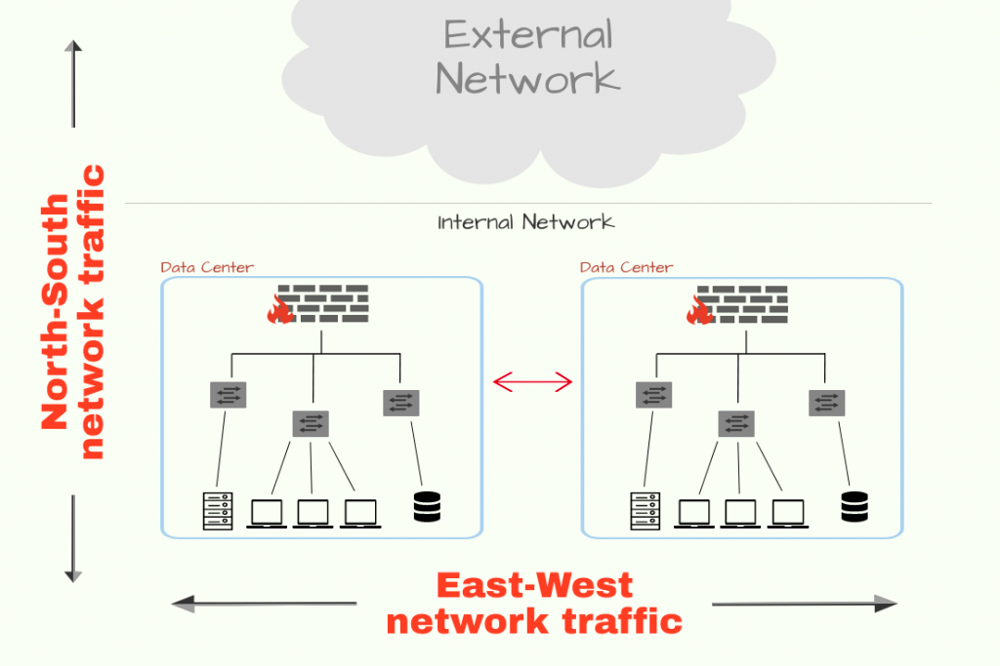
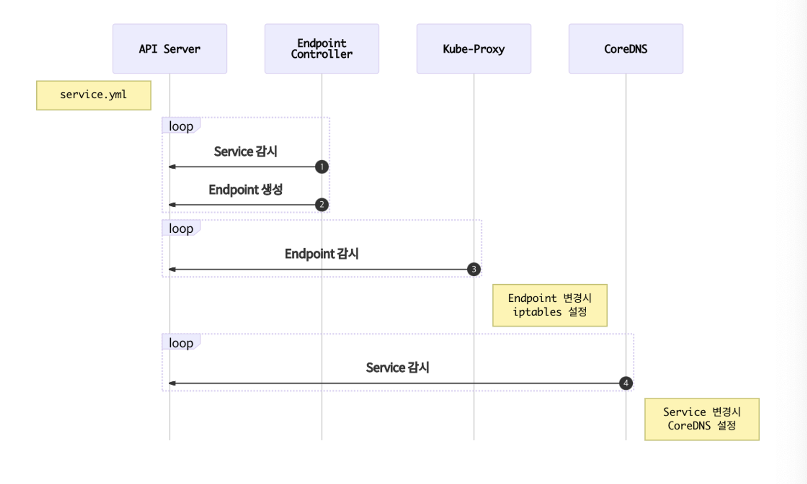
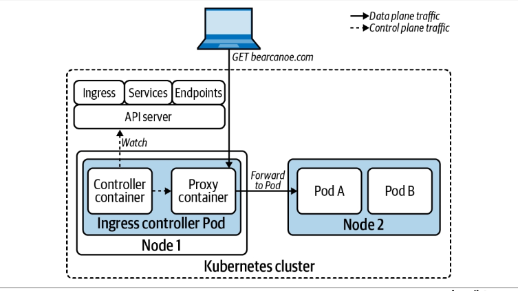
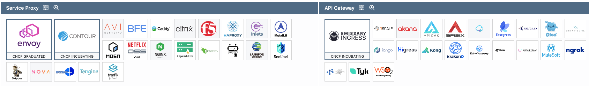
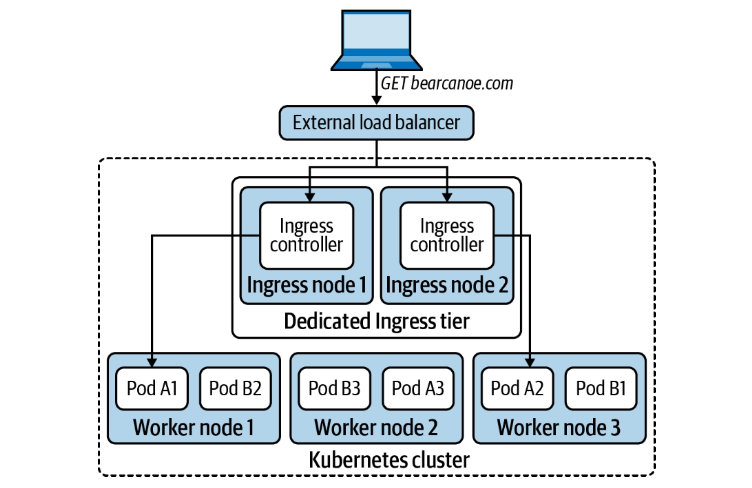
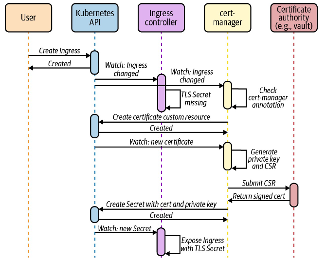
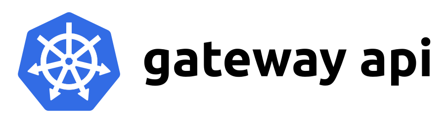
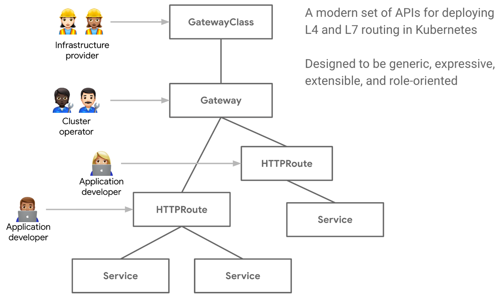

# 6장 (1) - 서비스/인그레스

## 개요

  

**서비스 (East-West)**
- 파드 집합을 단일 유닛 또는 네트워크 서비스로 취급
- 로드밸런싱/라우팅. 서비스 검색 매커니즘. 레이어 3/4 매커니즘

**인그레스 (North-South)**
- 클러스터에서 실행되는 워크로드에 대한 진입점
- 세분화 된 트래픽 라우팅. 레이어7 로드밸런싱.

**서비스 메시**
- 더 진보된 라우팅, 보안, Observability 제공
- East-West, North-South 지원
- 애플리케이션 소스코드 변경없이 Proxy/Sidecar를 이용한 통신


<br/>

## Kubernetes Service

여러 파드에서 걸쳐 트래픽을 로드밸런싱 하는 쿠버네티스의 핵심 API
- L3/L4 Layer load balancing -> TCP/IP, Port/IP
- 워크로드/파드는 대체 가능한 특성이기에 IP 대신 서비스를 이용하는 것이 바람직

<br/>

지원되는 서비스 타입
- ClusterIP: Cluster VIP
- NodePort: Port of cluster node IP
- Loadbalancer: Cloud loadbalancer (Out-of-tree cloud provider pod)
  - 내부적으론 NodePort 서비스를 Extenal loadbalancer와 자동연결
- ExternalName: 외부 주소를 cluster FQDN으로 접근이 가능
- Headless Service: Pod FQDN 노출. 특정 Pod 연결


<br/>

## Endpoint

  

서비스는 바로 파드에 대한 정보를 가지고 있는 것이 아님.
- 엔드포인트 리소스가 파드 IP를 갖고 이를 로드밸런싱
- 서비스를 생성할 때 자동으로 엔드포인트 리소스를 생성 (자세히 말하면 엔드포인트 컨트롤러가 생성)
- 파드의 준비상태를 검사(using [probe](https://kubernetes.io/docs/tasks/configure-pod-container/configure-liveness-readiness-startup-probes/#define-readiness-probes))하고, 준비되었다면 파드 IP를 가져와 엔드포인트 리소스를 업데이트

<br/>

### 엔드포인트 슬라이스

엔드포인트 리소스는 클러스터가 커져감에 따라 비효율적임 ([문서](https://kubernetes.io/ko/docs/concepts/services-networking/endpoint-slices/#motivation))
- 대규모 클러스터의 경우, 많은 노드가 있음. 노드가 많을수록 엔드포인트가 변경될 때, 더 많은 업데이트를 전송해야 함.
- 대규모 클러스터의 경우, 파드가 많음. 파드 수가 증가함에 따라 엔드포인트 리소스 업데이트 빈도도 증가.
- 엔드포인트 리소스 크기는 서비스에 속한 파드의 수가 증가함에 따라 증가. 엔드포인트 오브젝트가 클수록 더 많은 네트워크 및 스토리지 리소스가 필요.

<br/>

예를 들면, 엔드포인트가 10,000개인 서비스에서 변경이 일어나면, 이 엔드포인트 업데이트를 위해 10,000개가 포함된 엔드포인트 리소스를 모든 노드에 전달해야 함.
- 이러한 전달이 파드의 변경사항에 따라 계속 반복될 것.

<br/>

이러한 문제를 해결하기 위해 엔드포인트를 분할해놓은 엔드포인트 슬라이스 `EndpointSlice`가 kubernetes 1.16부터 등장 (1.19부턴 default active)
- 최대 엔드포인트 수를 100개로 제한하고, 그 이상인 경우 추가적인 `EndpointSlice`를 생성.
- 변경이 일어난 경우, 변경이 포함된 `EndpointSlice`만 전파.
- kube-controller-manager `--max-endpoints-per-slice`옵션을 통해 최대 1,000개로 설정이 가능


<br/>

### kube-proxy

Service 구현을 위한 kubernetes component
- 모든 cluster node에서 실행되는 agent
- 서비스 및 엔드포인트 API server를 감시하고, 이에 따라 패킷을 처리하도록 리눅스 네트워크 작업 스택(ex. iptables)를 업데이트하는 역할

3가지 모드를 지원

<br/>

####  [1] userspace 모드

초기 `kube-proxy` 의 구현에서는 userspace(사용자 공간)에서 동작하는 Proxy 였다.
- 리눅스 프로세스에는 kernelspace, userspace가 존재한다. 여기서의 userspace를 의미한다.

실제 요청이 들어오면 서비스 IP로 향하는 연결을 `kube-proxy` 가 가로챘다. 연결을 가로채기 위해서 `kube-proxy` 는 iptables rule을 설정해 특정 서비스 IP 요청을 `kube-proxy` 로 오도록 설정했다.
- `kube-proxy` 는 이 요청을 서비스와 연결된 Pod로 전송했다.


결국, Service에 대한 모든 요청이 `kube-proxy` 를 거쳐야만 알맞은 Pod로 전달됬다.
- 하지만 node마다 daemonset으로 구성된 `kube-proxy` 가 모든 요청을 감당하기엔 적절하지 않았고, 성능적인 이슈도 있다.
- 그래서 이 방법은 이제 거의 사용하지 않는다고 보면 된다.


<br/>

#### [2] iptables 모드

현재는 iptables 규칙만 사용해 Proxy를 거치지 않고 패킷을 무작위로 서비스에 연결된 Pod로 전달한다. iptables은 kernelspace에서 동작한다. 
- `kube-proxy` 가 서비스, 엔드포인트의 변경을 감지하고, 이에 맞게 iptables 설정을 진행한다.
- 서비스 IP, 포트로 향하는 트래픽을 **iptables에 정의된 DNAT(목적지 주소 변환)에 의해 Pod로 전달된다.**
- 즉, `kube-proxy` 는 proxy 역할이 아닌 iptables 설정을 진행하게 된다.

**userspace에서 동작하지 않는다는 것이 성능에 크게 영향을 주기 때문에 userspace 모드보다 성능이 우수하다.**

iptables 모드에선 서비스에 연결된 Pod를 선택할 때, 랜덤으로 선택한다.

<br/>

그럼 iptables 모드에서 `kube-proxy`는 서비스 및 엔드포인트 생성 유무를 어떻게 알 수 있을까?

- 관리자가 쿠버네티스 API로 서비스로 정의하면 API Server에서 서비스와 엔드포인트를 생성하기 시작한다.
- `kube-proxy` 는 서비스와 엔드포인트가 변경되는 것을 계속 감시, 감지(`watch`)하고 있다. 변경이 감지되면 iptables에 서비스 IP, 포트를 연결해 줄 Pod의 IP, 포트로 변경해주게 된다.
- 서비스, 엔드포인트가 제거될 때도 `kube-proxy` 는 이를 감지해 iptables 설정을 하게 된다.

<br/>

정말 대규모의 서비스 일 때, 성능상 이슈가 있을 수 있음.
- iptable은 매칭에 있어 O(n) 시간복잡성을 가짐
- 업데이트도 대규모로 영향을 미침. 완료되는데 몇 분씩 걸릴 수 있으며, 오래된 엔드포인트로 트래픽이 전송될 위험이 있음.
- 소규모에서는 사실 큰 문제가 아님. 정말로 수 만개의 서비스인 경우에 이 문제를 해결하기 위해 IPVS를 고려해볼 수 있음.

<br/>


### [3] IPVS 모드 (IP Virtual Service)

kernelspace에서 제공되는 L4 LB (Load Blancer)
- `kubernetes v1.11` 에서 등장하였다.
- iptables은 패킷 필터링, 조작을 통한 유연성으로 방화벽을 구현하기 위해 설계되었다면,
- IPVS는 다양한 로드밸런싱 기능을 제공하기 위해 설계된 커널 기능이다.

Ipvs는 Hash table을 이용해 규칙을 저정한다.  [즉, 수 천개 이상의 서비스가 있는 대규모 클러스터에서는 iptables 모드보다 ipvs 모드의 성능이 더 우수하다.](https://kubernetes.io/docs/concepts/services-networking/service/#ipvs)

ipvs는 기존에 제공되는 Load balancing 알고리즘보다 더 다양한 알고리즘을 제공하고 있다.
- least connection, shortest expected delay, ...

`kube-proxy` 는 iptables 모드와 유사하게 API server를 감시하며 서비스, 엔드포인트 변경을 감지한다. 변경이 일어나면, iptables 뿐만 아니라 ipset, IPVS를 업데이트한다.


<br/>

#### `kube-proxy` 대체

eBPF 등장 이전까지만 해도 `kube-proxy`는 대체 불가능한 필수적인 요소였음.
- `eBPF`가 등장하면서 Cilium, Calico 같은 CNI Plugin이 kube-proxy 책임을 흡수하고 대체할 수 있게 되었음.
- iptables, IPVS를 이용하는 대신 Pod networking data plane으로 바로 프로그래밍 함. eBPF를 이용하여 엔드포인트 조회에 Hash Table을 이용하기에 성능 및 확장성이 향상되었음.
- 성능적으로 보면 무조건 써야하는 것 아닌가 싶지만, 아직 지원이 초기 단계. 프로덕션에서 쓰기엔 무섭다. 조금 더 지켜보면 좋을 것 같음.

<br/>

### 서비스 조정

파드가 삭제되면 아래의 두 작업이 병렬로 동작한다.
- [1] kubelet은 파드 종료 시퀀스를 시작함. Pod에 `SIGTERM` 신호를 보내고 종료될 때까지 기다림. grace shutdown 기간까지 기다렸는데 종료가 안되면 `SIGKILL`을 전송해 강제로 종료.
- [2] Endpoint controller는 파드 삭제 Watch event를 수신하고, 이에 따라 Endpoint resource에서 Pod IP 제거를 트리거 함. Endpoint resource가 업데이트되면, kube-proxy는 iptable/IPVS에서 IP 주소를 제거.

이상적으로는 파드가 종료되기 전에 Endpoint controller, kube-proxy가 업데이트를 완료하는 것이 좋다 (2 -> 1번 순서). 하지만 병렬로 동작하기에 순서가 보장되지는 않는다.

즉, Endpoint 목록에서 Pod IP가 제거되기 전에 Pod가 종료 될 가능성이 있다. 이런 경우, 더 이상 실행되지 않는 Pod로 라우팅되기 때문에 요청이 실패한다.


<br/>

이러한 문제는 어떻게 해결할 수 있을까?
- Signal handler, `Sleep preStop` hook를 이용하자.
- [문서 1 - 파드 라이브사이클](https://kubernetes.io/docs/concepts/workloads/pods/pod-lifecycle/#pod-termination), [문서 2 - 컨테이너 라이프 사이클 훅](https://kubernetes.io/docs/concepts/containers/container-lifecycle-hooks/#container-hooks)


### Service Discovery & DNS

Kubernetes에서는 서비스 리소스를 기반으로 서비스 검색(Service Discovery) 매커니즘을 제공
- Eureka, Consul과 같은 녀석들이 추가로 필요 없다.

<br/>

[CoreDNS](https://coredns.io/)
- Kubernetes는 내부에서 실행되는 Pod에 DNS를 통한 서비스 검색을 제공
- 이 때 사용되는 DNS 서버는 일반적으로 CoreDNS를 사용.

<br/>

Service를 만들면 coreDNS는 `<Service Name>.<Namespace name>.svc.cluster.local` 형식의 DNS 레코드를 생성
- Pod가 생성되면 이러한 DNS 기반 Service discovery를 하기 위해, Pod의 DNS resolver로 coreDNS를 구성함. 
- kubelet은 coreDNS를 nameserver로 지정하는 `/etc/resolv.conf`를 작성하고, 컨테이너 내 삽입함.
- 이를 통해 Pod는 이름으로 서비스를 연결하려 할 때마다 DNS 쿼리를 CoreDNS로 전송함

```
$ cat /etc/resolv.conf
nameserver 10.96.0.10
search default.svc.cluster.local svc.cluster.local cluster.local
options ndots:5
```

- 같은 이름의 네임스페이스인 경우, `<서비스 이름>`만으로 접근이 가능하며, 다른 이름의 네임스페이스라면, `<서비스 이름>.<네임스페이스 이름>`으로 접근이 가능함.


<br/>

CoreDNS 튜닝: `ndots`
- https://mrkaran.dev/posts/ndots-kubernetes/
- https://jonnung.dev/kubernetes/2020/05/11/kubernetes-dns-about-coredns/
- https://nyyang.tistory.com/161


<br/>


## Ingress 인그레스

인그레스
- 서비스를 클러스터 외부의 클라이언트에 노출하기 위한 접근 방식
- Kubernetes에서는 기본적으로 API만 제공할 뿐, 구현체는 제공하지 않음
- 이를 구현하고 활용할 줄 아는 Controller(외부 구현체)가 필요하며, 현재 상황에 맞게 다양한 구현체 중 적절한 것을 골라 사용해야 함.

### 왜 인그레스를 사용하는가?

인그레스를 처음 접하면 한 가지 궁금점이 든다.
"왜 서비스를 외부에 노출하면 안되는가?"

이 질문엔 2가지 이유로 대답할 수 있다.

1. 비용
    - 서비스를 다 외부 노출한다고 해보자. 클라우드 벤더의 LoadBalancer를 통해 지원을 해야할 것이다.
    - 각 LoadBalancer 마다 비용을 발생하며, 총 비용이 서비스 개수에 비례해 증가할 수 있다.
2. 제한된 라우팅 기능
    - 서비스는 L3/L4 라우팅만 제공한다.
    - 고로 L7 등 더 방대한 라우팅 규칙 지원을 위해서는 다른 것이 필요하다.

<br/>

이러한 문제를 해결하고 있는 것이 인그레스이다.
- L3/L4 뿐 아니라 L7에서도 로드밸런싱, 라우팅 기능을 제공한다.
- 애플리케이션 레이어이므로 방대한 고급 라우팅 (헤더 기반 등)을 지원한다.
- 이를 통해 단일 엔트리 포인트로 라우팅하고, 트래픽 다중화 해제의 역할을 담당할 수 있다.

<br/>

### 더 다양한 인그레스

다양한 프로토콜, 다양한 라우팅 규칙을 제공하기 위해 인그레스 컨트롤러/구현체 별 CRD를 가지고 지원할 수 있다.
- 어노테이션 기반 지원은 Kubernetes API Server애서 잘못된 구성을 알아차리기 어렵기에 CRD로 많이 제공한다고 함.
- 이를 이용한 고급 라우팅 지원은 좋은데, 문제는 인그레스 컨트롤러를 변경하게 될 때 이를 다 옮겨야 한다는 문제가 있다는 것.
- 이런 점들을 고려하며 고급 라우팅 구현체들을 이용하는 것이 좋다.

<br/>

### 인그레스 컨트롤러와 작동 방식

  

앞서 이야기했듯 Kubernetes는 API를 제공할 뿐, 구현체는 따로 필요하다. 이를 인그레스 컨트롤러라고 한다.
- 인그레스 컨트롤러는 보통 2가지 기능을 나뉘어 구성된다.
  - 컨트롤러 컨테이너
    - 컨트롤 플레인 역할. 인그레스 API에 구성된 내용에 따라 Path를 결정한다.
    - API Server Watch하고 변화에 맞게 데이터 플레인이 선언된 원하는 형태로 작동하도록 구성.
  - 프록시 컨테이너
    - 데이터 플레인 역할. 직접적으로 정해진 구성으로 요청을 전달/Proxy 한다.
    - 직접적인 라우팅, 로드밸런싱 역할을 진행.
- 인그레스 컨트롤러에서 라우팅/Proxy는 직접 파드로 한다.
  - 서비스를 통해 우회해 전달되면 네트워크 홉이 추가되기에 오버헤드가 생길 수 있다.
  - 그래서 보통 인그레스 구현체들은 엔드포인트 리소스로 부터 가져온 Pod ip로 요청을 로드밸런싱 한다.

<br/>

### 어떤 인그레스 컨트롤러를 사용해야하는가?

앞서 이야기했지만, 현재 자신의 클러스터 상황에 맞는 인그레스 컨트롤러를 이용하면 된다.
- 인그레스 컨트롤러도 정말 다양한데, 각기 자신만의 특징들이 존재하므로 그것을 보고 이용하면 된다.
- 책에 의하면 기본적으로 NGINX Ingress controller가 가장 유명하다고 한다. (진짜 그래?)

기본적으로 아래 사항은 고려해 선택해보는 것이 좋다.
- HTTPS endpoint를 노출하는지? 클라이언트와 TLS Handshake를 직접 처리해야하는지? Edge에서 TLS를 종료해도 괜찮은지?
- 애플리케이션이 어떠한 SSL encryption를 사용하는지? 세션 선호도 및 고정 세션이 필요한지?
- HTTP header 기반, cookie 기반, method 기반 라우팅과 같은 고급 라우팅 기능이 필요한지?
- 라운드 로빈, 최소 가중 요청 등 다양한 로드밸런싱 알고리즘이 필요한지?
- CORS 지원이 필요한지?
- TCP/UDP 엔드포인트 노출이 필요한 애플리케이션이 있는지?
- 들어오는 트래픽 속도를 제한하는 기능이 필요한지?

<br/>

[공식문서](https://kubernetes.io/docs/concepts/services-networking/ingress-controllers/#additional-controllers)에 보면 인그레스 컨트롤러가 정말 다양한 것을 볼 수 있다.

CNCF 프로젝트는 살펴보면 다음과 같다.
  

<br/>

도입 후에 최악의 상황 또한 대비해야 한다.
- 인그레스는 외부와 연결되는 몇 개 안되는 연결점일 수 있다. 이 부분에 문제/장애가 생기면, 전체적으로 많은 악영향을 끼칠 수 있다.
- 인그레스 컨트롤러에 문제가 생겼을 때 어떻게 해결할 것인지? 필요한 지원을 받을 수 있는지도 확인하는 것이 좋다.

<br/>

### 인그레스 전용 노드

  

바로 앞에서 이야기했지만, 인그레스/인그레스 컨트롤러는 매우 중요하다.

그렇기에 다른 서비스 애플리케이션 파드와 격리해 인그레스로만 이루어진 노드를 구성하는 전략인 '인그레스 전용 노드'가 있다.

이렇게 구성함으로써 타 파드들이 점유율을 먹지 않도록 함으로써 인그레스 컨트롤러들은 성능, 규정준수, 외부로드 밸런서 관리에 이점을 가질 수 있게 된다.

구성하는 법은 다양하겠지만, 간단하게는 노드에 레이블을 지정한 뒤, 테인트를 이용하여 데몬 셋으로 배포하는 방법이 있다.

물론 무조건 옳지는 않다. 이런 경우에 인그레스 노드가 다운되는 경우 큰 문제가 발생할 수 있다. 해결을 위한 백업/복구 플랜이 필요하다.


<br/>

### TLS 지원

인그레스 TLS 지원을 위해 cert-manager를 사용할 수 있음.
- cert-manager는 Ingress API와 통합해 인증서를 자동으로 발급할 수 있다.
- 정확한 과정은 아래의 과정 참고.
  - 인그레스 생성에 따라 자동으로 cert-manager에서 annotation을 보고 CSR을 만들어 cert/private key를 주입해준다.
  - 이를 통해 Ingress는 TLS Secret를 지원하게 된다.

  


<br/>

### Kubernetes Gateway API

  

최근엔 ingress의 여러 제한점으로 인해 Kubernetes Gateway API가 나왔으며, 여러 구현체에서 지원하기 시작했다.
- https://gateway-api.sigs.k8s.io/

2023.10.31에 1.0.0 버전이 GA 되었다.
- https://kubernetes.io/blog/2023/10/31/gateway-api-ga/

<br/>

[잘 정리된 글](https://www.anyflow.net/sw-engineer/kubernetes-gateway-api-1)이 있어 인용해왔다.

> ingress와 API Gateway 모두는 Network 관점에서 보면 L7 Load balancer에 해당하지만, API Gateway는  ingress와는 달리 L7 protocol(e.g. HTTP)에 특화된 다양한 작업을 수행 가능하다. 한마디로 말해, k8s Gateway API란 ingress + API Gateway인 셈이다.

> 주목할 점으로 resource 별 담당자의 역할 분배를 고려했음이 보인다. ingress와는 달리 k8s Gateway API는 단일 runtime에 대해(API Gateway - ingress) Gateway와 HTTPRoute 라는 두 개의 resource로 나누어, Cluster와 application level 담당자를 분리 가능하도록 함과 동시에 application level 내에서도 각기 담당하는 resource를 분리 가능하도록 한다.

  


각 담당별 리소스들이 존재하며, 지원되는 기능들이 다르다.

- `GatewayClass` : 인프라 제공자가 정의하는 클러스터 범위의 resource로서 생성 가능한 gateway를 정의한다. ingress의 networking.IngressClass 에 해당한다.
- `Gateway` : GatewayClass 에 의해 Gateway를 provisioning한다.
- `HTTPRoute` : HTTP request를 서비스로 routing을 위한 규칙이다. GatewayClass, Gateway 까지는 gateway의 설치에 해당한다면, HTTPRoute 는 gateway가 갖는 다양한 기능을 적용하는 부분이다.

```yaml

apiVersion: gateway.networking.k8s.io/v1beta1
kind: GatewayClass
metadata:
  name: istio-gateway # Gateway resource에서 사용할 이름
spec:
  controllerName: "istio.io/gateway-controller" # istio의 gateway class를 추가

---

apiVersion: gateway.networking.k8s.io/v1beta1
kind: Gateway
metadata:
  name: mygateway # HTTPRoute resource에서 사용할 이름
  namespace: mysystem
spec:
  gatewayClassName: istio-gateway # GatewayClass resource의 name 참조
  listeners:
  - name: http-a # 80 port의 HTTP로 a.example.com의 host traffic을 수신
    hostname: "a.example.com"
    port: 80
    protocol: HTTP
  - name: https-b # 443 port의 HTTPS로 b.example.com의 host traffic을 수신
    hostname: "b.example.com"
    port: 443
    protocol: HTTPS
    tls: # mygateway-credential secret에 저장된 certificate 적용
      mode: Terminate
      certificateRefs:
      - name: mygateway-credential

---

apiVersion: gateway.networking.k8s.io/v1beta1
kind: HTTPRoute
metadata:
  name: httpbin
spec:
  parentRefs:
  - name: mygateway # Gateway resource의 name 참조
    namespace: mysystem
  hostnames: 
	- "a.example.com" # rule 적용 대상 incoming host
  rules:
  - matches:
    - path: # /status path를 prefix로 하는 traffic에 대해 적용
        type: PathPrefix
        value: /status 
    - path: # /delay path를 prefix로 하는 traffic에 대해 적용
        type: PathPrefix
        value: /delay
    backendRefs: # httpbin service의 8000 port로 traffic을 routing
    - name: httpbin
      port: 8000

```


모호한 중복 역할
EKS?
- Service: Cloud vendor Loadbalancer => NLB
- Ingress: Ingress controller => ALB
- Kubernetes API Gateway: 