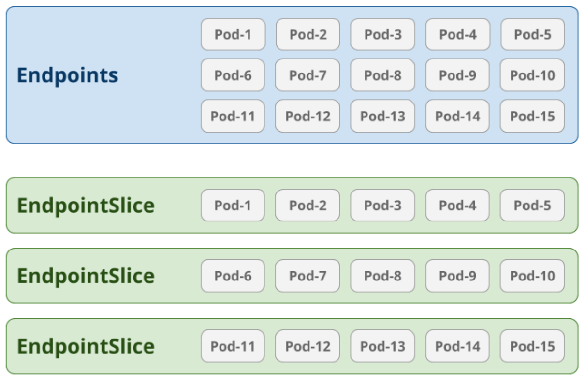

> [!NOTE]
> 책 내용 + 기타 레퍼런스를 보완한 요약본입니다.

# Chapter 6] 서비스 라우팅


## Backgrounds


### North-South Traffic

데이터센터와 클라이언트, 네트워크 상 데이터센터 외부와 통신되는 트래픽, 즉 내부 트래픽을 제외한 나머지 트래픽

### East-West Traffic

데이터센터 내부에서 발생되는 트래픽으로 서버 간 트래픽

---

## Kubernetes Networking Components

### Ingress (L7)


- 클러스터에서 `North-South` Traffic을 처리한다.
- 주로 HTTP(S) 서비스와 같이 클러스터에서 실행되는 워크로드에 대한 진입점 역할을 한다.
  - 일반적으로 클러스터 외부에서 쿠버네티스 내부의 워크로드로 액세스가 안되나 Ingress를 통해 쿠버네티스에서 실행 중인 서비스를 클러스터 외부의 클라이언트에 노출 가능하다.
- L7 로드밸런싱 기능이 제공된다.
    - 트래픽 로드밸런싱은 클러스터에 설치된 Ingress Controller가 처리한다. e.g. HAProxy / NGINX

> #### Service Mesh
>
> 고급 라우팅, 보안 및 관찰 기능은 별도의 서비스 라우팅 레이어인 Service Mesh를 사용해 처리 가능하다.
> East-West Traffic과 관련 있으나 일부 구현은 North-South Traffic 처리도 지원한다.
> Service Mesh 내 각 서비스는 별도의 Proxy가 서로 통신하는 방식으로 처리된다. 애플리케이션 소스 코드 변경 없이 워크로드를 향상시킨다.

Service는 Ingress와 비교하여 아래와 같은 한계점이 존재한다.
- 제한된 라우팅
  - 수신 요청의 목적지 IP 및 포트에 따라 트래픽을 라우팅하는데, 이러한 서비스는 작고 비교적 단순한 애플리케이션에 유용하지만 보다 실질적 마이크로서비스 기반 애플리케이션에서는 빠르게 분리되기 때문에 더 스마트한 라우팅 기능과 기타 고급 기능이 필요하다.
- 비용
  - 클라우드 환경에서 실행 중일 때 클러스터 각 LoadBalancer 서비스는 AWS ELB와 같은 외부 로드밸런서를 생성하는데, 플랫폼의 각 서비스를 별도의 LB로 실행하면 비용 이슈가 발생한다.

Ingress는 서비스와 다르게 여러 로드밸런서 또는 엔트리포인트를 가질 필요가 없는 장점이 있다. 호스트 헤더 기반으로 HTTP 요청을 라우팅하는 기능과 같이 Ingress에서 사용할 수 있는 고급 라우팅 기능 덕에 모든 서비스 트래픽을 단일 엔트리포인트로 라우팅하고 Ingress Controller가 트래픽 역다중화를 처리하도록 할 수 있다. 이를 통해 플랫폼으로 트래픽을 가져오는 비용을 크게 줄일 수 있다.

#### Ingress Controller 구성

Ingress Controller는 컨트롤 플레인과 데이터 플레인으로 구분된다.

컨트롤 플레인은 Kubernetes API에 연결하고 Ingress, Service, Endpoint와 같은 다양한 리소스를 감시한다. 리소스가 변경될 때마다 컨트롤러가 알림 수신하고 Kubernetes API에 선언된 원하는 상태에 따라 작동하도록 데이터 플레인을 구성한다.

데이터 플레인은 네트워크 트래픽 라우팅과 로드밸런싱을 처리한다. 일반적인 프록시로 구현된다.


Ingress API는 서비스 추상화를 기반으로 하기 때문에 컨트롤러는 트래픽을 전달하거나 Pod로 직접 보낼 수 있다. 일반적으로는 후자 방식을 사용한다. Ingress 리소스에서 참조하는 서비스가 존재하는지 확인하는 것 외에 Service 리소스를 사용하지 않는다. Pod로 트래픽을 직접 라우팅하면 Service 레이어를 우회하므로 지연 시간이 줄어들고 다양한 로드밸런싱 전략이 추가된다.

#### Ingress 트래픽 패턴

##### HTTP 프록시


```yaml
apiVersion: networking.k8s.io/v1
kind: Ingress
metadata:
  name: app1
spec:
  rules:
  - host: app1.example.com
    http:
      paths:
      - path: /
        backend:
          serviceName: app1
          servicePort: 80
```

##### TLS 적용 HTTP 프록시

이 경우 트래픽이 Ingress Controller에서 TLS Termination된 후 암호화되지 않은 HTTP 트래픽이 Pod로 전달된다.


```yaml
apiVersion: networking.k8s.io/v1
kind: Ingress
metadata:
  name: app1
spec:
  tls:
  - hosts:
    - app1.example.com
    secretName: app1-tls-cert
  rules:
  - host: app1.example.com
    http:
      paths:
      - path: /
        backend:
          serviceName: app1
          servicePort: 443
```

경우에 따라 클라이언트 Pod에 암호화된 트래픽을 전달해야 할 수 있는데 Ingress Controller에서 새롭게 TLS Handshake를 수행하여 연결을 설정하는 방법이 있다. 다만 TLS 연결 재설정이 적절하지 않는 경우 TLS Termination 없이 TLS Passthrough 하는 방법도 있다.


##### L3/L4 Proxy

일부 Ingress Controller는 L3/L4 트래픽을 Proxy할 수도 있다. (HTTP를 사용하지 않는 애플리케이션 노출에 이를 활용할 수 있다.)

#### Ingress Controller 선택

알려진 Ingress Controller로 NGINX, Contour, Traefik 등이 있다. 아래와 같은 다양한 조건을 고려하여 Ingress Controller를 선택할 수 있을 것이다.

- 애플리케이션이 HTTPS 엔드포인트를 노출하는가? 클라이언트와의 TLS Handshake를 직접 처리해야 하는가 아니면 Edge에서 TLS Termination해도 되는가?
- 애플리케이션은 어떤 SSL 암호를 사용하는가?
- 애플리케이션에 Session Affinity 또는 Sticky Session이 필요한가?
- 애플리케이션에 HTTP Header 기반 라우팅, 쿠키 기반 라우팅, HTTP 메서드 기반 라우팅 등과 같은 고급 요청 라우팅 기능이 필요한가?
- 애플리케이션에 Round Robin, 가중 최소 요청 또는 랜덤과 같은 다양한 로드밸런싱 알고리즘 요구사항이 있는가?
- 애플리케이션에 CORS에 대한 지원이 필요한가?
- 애플리케이션이 인증 문제를 외부 시스템으로 Offload하는가? 일부 Ingress Controller는 애플리케이션 전반에 거쳐 공통 인증 메커니즘을 제공하려고 활용할 수 있는 인증 기능을 제공하는가?
- TCP / UDP 엔드포인트를 노출해야 하는 애플리케이션이 있는가?
- 애플리케이션에 수신 트래픽의 속도를 제한하는 기능이 필요한가?

#### 배포 고려사항

- 전용 Ingress Node
  - 리소스 격리
  - 규정 준수
  - Bare-metal / On-Premise 환경에서의 구축 용이성
- 호스트 네트워크 바인딩
  - K8s Service Fabric을 우회하고 Ingress Controller에 직접 도달 (`.spec.dnsPolicy: ClusterFirstWithHostNet`) - 성능 향상
- Ingress Controller 및 외부 트래픽 정책
- Ingress Controller 분산
  - 고가용성 위한 Pod AntiAffinity 규칙을 사용한 Ingress Controller의 분산

#### DNS 및 Ingress 역할

- Wildcard DNS Record
- Kubernetes 및 DNS 통합
 
커뮤니티에서 제공하는 external-dns 를 사용하면 Ingress가 생성될 때 설정된 도메인에 대해 Upstream DNS Provider (AWS Route53, GCP Cloud DNS) 에 A Record를 자동으로 등록/삭제할 수 있다.


#### TLS 인증서 처리


애플리케이션에 암호화된 연결을 제공하기 위해 Ingress Controller는 인증서 및 Private Key가 필요한데, 전략에 따라 인증서 관리가 번거로울 수 있다. 단일 도메인을 호스팅하고 하위 도메인 기반 라우팅을 구현하면 단일 와일드카드 TLS 인증서를 사용할 수 있지만 경우에 따라 다양한 도메인에 걸쳐 애플리케이션을 호스팅하는 경우 인증서의 효율적 관리가 어렵다.

커뮤니티에서는 인증서 발행과 관리의 용이함을 촉진하고자 인증서 관리 추가 기능을 cert-manager로 구현하여 제공한다. 이는 클러스터 내에 컨트롤러 형태로 실행되고 CRD 세트가 설치된다.

`ClusterIssuer` 리소스를 정의하여 모든 네임스페이스에서 인증서를 발급할 때 해당 리소스에 정의한 Key Pair를 활용하도록 하고, Ingress에서 해당 리소스를 annotation으로 지정하게 되면 인증서 관리자가 인증서와 개인 키를 Secret으로 저장하도록 한다. 이후 인증서 서명 요청 (CSR) 생성, CA에 CSR 제출을 포함하는 인증서 요청 프로세스를 처리하고 프로세스가 완료되면 TLS로 애플리케이션 서비스를 시작할 수 있다.

```yaml
apiVersion: cert-manager.io/v1
kind: ClusterIssuer
metadata:
  name: prod-ca-issuer
spec:
  ca:
    secretName: platform-ca-key-pair
---
apiVersion: networking.k8s.io/v1
kind: Ingress
metadata:
  annotations:
    cert-manager.io/cluster-issuer: prod-ca-issuer
  name: bearcanoe-com
spec:
  tls:
  - hosts:
    - bearcanoe.com
    secretName: bearcanoe-cert-key-pair
  rules:
  - host: bearcanoe.com
    http:
      paths:
      - path: /
        backend:
          serviceName: nginx
          servicePort: 80
```

### Service (L3/L4)


Pod의 `selector`로 일치하는 모든 백엔드 풀 (Pod Set)에 대하여 L3/L4 레벨에서의 로드밸런싱과 라우팅이 지원된다. Pod IP가 동적으로 변화하기 때문에 직접 IP를 통해 접근하는 것보다 Service를 통해 접근하는 것이 바람직한 방식이다.

```yaml
apiVersion: v1
kind: Service
metatdata:
  name: nginx
spec:
  selector:
    app: nginx
  ports:
  - protocol: TCP
    port: 80
    targetPort: 8080
  type: ClusterIP
```

백엔드 풀은 별도의 리소스인 `Endpoints`, `EndpointSlices`에서 관리되고 이는 엔드포인트 컨트롤러에서 처리된다. (후술)

지원되는 프로토콜은 TCP, UDP, SCTP 등이 있다.

아래와 같이 4가지 타입을 가진다.

#### ClusterIP

클러스터에서 액세스 가능한 Virtual IP이다. 워크로드는 VIP를 사용해 서비스와 통신한다. VIP는 일반적으로 클러스터에서 실행되는 워크로드에만 사용할 수 있다.

> ##### ClusterIP의 할당
> `kube-apiserver`에서 IPAM을 담당한다. 이 때 CIDR 블록에서 할당 가능한 IP를 선택하여 자동으로 Service에 ClusterIP를 할당하게 된다.
> Kubernetes에서는 Pod용 CIDR과 Service용 CIDR을 별도로 지정하게 되어 있다.
> Pod용 CIDR은 master용 프로세스들을 실행할 때 `--cluster-cidr` 옵션으로 지정하고, Service용 CIDR은 `--service-cluster-ip-range` 옵션으로 지정한다. 따라서 `kube-apiserver`에서 Service의 ClusterIP를 부여할 때 Service용 CIDR에서 임의로 선택하게 된다. (명시적으로 spec에 명시하는 것은 안티패턴이므로 지양해야 한다.)

#### NodePort

VM에서 실행 중인 기존 애플리케이션 혹은 웹 애플리케이션 사용자와 같이 클러스터 외부의 네트워크 클라이언트에 Service를 노출해야 할 때 유용하다. 구성 가능한 포트 범위에서 무작위로 할당하여 모든 클러스터 노드의 포트에서 서비스를 노출한다.

클라이언트가 서비스에 도달하기 위해서는 서비스의 NodePort 번호와 하나 이상의 클러스터 노드 IP 주소를 알고 있어야 한다. Node에 문제가 발생하거나 클러스터에서 제거될 수 있는 문제가 있으므로 NodePort 서비스 앞에 External LB를 사용하는 것을 권장한다. 이렇게 되면 클라이언트가 클러스터 노드 IP 주소나 서비스의 포트 번호를 알고 있지 않아도 된다. 다만 LB가 Service에 대한 단일 Entrypoint로써 기능하게 되어 해당 LB를 관리하고 구성의 지속적 업데이트가 필요하며 새로운 NodePort 서비스를 생성할 때 새 LB를 만들어야 한다. 또한 새 Node가추가되면 모든 LB의 백엔드 풀에 새 Node를 추가해야 한다.

#### LoadBalancer

위 NodePort의 외부 LB를 사용하는 것과 관련한 이슈를 보완하기 위해 사용할 수 있는 타입이다. 별도의 External Cloud Provider Controller가 클러스터의 LB 서비스 구성에 대한 외부 LB 생성/관리/구성을 자동으로 처리하도록 한다.

#### ExternalName

어떠한 종류의 로드밸런싱도 Proxy도 수행하지 않고, 클러스터 서비스를 DNS Name에 매핑한다. (관련된 로드밸런싱이 없으므로 이 유형의 경우 ClusterIP 또한 없다.)

외부에서 접근하기 위한 유형이 아니라 단순 외부의 특정 FQDN에 대한 CNAME 매핑을 함으로써 Pod가 CNAME을 통해 특정 FQDN과 통신하는 용도로 사용된다.

```yaml
apiVersion: v1
kind: Service
metadata: 
  name: google
spec:
  # Pod와 매칭이 필요없이 때문에 별도의 Label Selector가 없다.
  type: ExternalName
  externalName: www.google.com
```

위와 같은 ExternalName 타입의 서비스가 생성되면 Pod에서 `google`이라는 서비스로 요청을 보내면 `www.google.com`으로 호출되는 효과를 낸다.

#### Headless Service

> Headless Service는 `.spec.clusterIP`를 `None`으로 지정하여 달성할 수 있다.

Headless 서비스도 ExternalName과 마찬가지로 ClusterIP를 할당하거나 로드밸런싱이 제공되지 않는다. `.spec.selector` 필드를 설정하면 Kubernetes API로 확인할 수 있는 Endpoint가 구성되고 서비스와 연결된 Pod를 직접 가리키는 DNS A 레코드를 생성한다. (selector가 없는 경우 Endpoint가 만들어지지 않고 단, selector가 없더라도 DNS 시스템에는 ExternalName 타입의 서비스에서 사용할 CNAME 레코드가 생성된다.)

주로 애플리케이션이 특정 Replica나 Pod에 연결해야 할 때 유용하다. 특히 `StatefulSet` 구성으로 특정 워크로드에 접근해야 하는 경우 Headless Service를 구성하여 달성 가능하다.

### Endpoints / EndpointSlices



Service에서 백엔드 풀로 지정하기 위한 Pod Selector Label을 명시하고, 일치하는 모든 Pod Set에 대해서는 별도의 리소스인 Endpoints와 EndpointSlices로 관리된다. 해당 리소스는 Service를 생성하면 별도의 엔드포인트 컨트롤러가 이를 Watch하고 자동으로 생성/관리하는 역할을 수행한다.

Endpoint의 경우 백엔드 풀이 변경되면 변경사항을 반영해 모든 노드에 전파되어야 하는데, 백엔드 Pod Set 수에 비례하여 Performance가 저하되는 이슈가 있다. 따라서 v1.21부터는 EndpointSlices가 도입되어 이러한 문제를 해소시키고 있다. EndpointSlice 내 최대 개수를 100개로 지정하여 해당 개수를 초과할 경우 새로운 EndpointSlice를 추가 생성하도록 한다.

> #### Service를 통해 접근할 때 Ready 상태의 Pod로만 라우팅
>
> 엔드포인트 컨트롤러는 백엔드 풀의 각 Pod Set에 대하여 Readiness를 검사해 Pod에 접근 가능한지 여부를 결정한다. 그 결과값은 EndpointSlice 리소스의 `.endpoints[*].conditions.ready`에 기록되고 이 값이 `true`인 백엔드 풀에만 접근 가능하도록 지원한다.
> 
> Pod가 준비되었는지 결정하는데 사용되는 정보로는 아래 두 가지 방법이 있다.
> 1. 플랫폼 정보
> Pod가 노드에 성공적으로 스케줄링 되었는지, Pod 내 컨테이너가 실행 중인지 확인
> 
> 2. readinessProbe
> kubelet이 워크로드를 조사해 트래픽 수신 준비가 되었는지 확인

---

## kube-proxy


모든 클러스터 Node에서 실행되는 에이전트로 주로 로컬 노드에서 실행되는 Pod에 Service를 제공하는 일을 담당한다. Service 및 Endpoint용 API 서버를 관찰하고 이에 따라 패킷을 처리하도록 Linux Network Stack (`iptables`를 사용한다.) 을 프로그래밍해 이를 구현한다.

세 가지 작동 모드가 있다. `userspace` / `iptables` / `IPVS` 모드가 있고 일반적으로는 `iptables`가 default이다.

### iptables 모드


해당 모드에서는 iptables의 NAT (Network Address Translation) 기능을 활용한다.

#### ClusterIP 타입의 경우


Service로 향하는 패킷에 DNAT (Destination NAT)를 수행한다. 즉, 패킷의 Target IP 주소를 Pod IP 주소로 바꾼다.

#### NodePort / LoadBalancer 타입의 경우


외부 클라이언트가 Node IP를 빌려 Pod에 접근하게 되고, 구체적으로 Node Port를 예약하여 해당 Port로 들어온 트래픽을 Service로 전달하는 방식으로 작동한다. Service로 들어온 트래픽은 ClusterIP와 마찬가지로 DNAT 처리된다.

> ##### externalTrafficPolicy
> 
> 외부 트래픽에 대한 응답으로 Service가 Node 안 (local)에서만 응답할지 혹은 Cluster 전체 (cluster)로 나아가서 응답할지 결정하는 옵션
> 
> - cluster
> Default 옵션으로 트래픽을 클러스터 내 모든 노드 전반에 걸쳐 다 보내진다. (따라서 부하가 고르게 분산됨)
> 이 옵션은 불필요한 네트워크 Hop을 증가시키는 단점을 가진다. 예를 들어 NodePort를 통해 외부 트래픽을 받을 때 NodePort 서비스의 트래픽을 전달받는 Pod가 없는 노드로도 요청이 갈 수 있다. 이 때 추가적 Hop을 거쳐 다른 Node에 위치한 Pod로 트래픽이 전달된다 (대상 Pod가 없는 노드에 대해 SNAT (Source NAT)이 이루어진다). 
> 
> 
> - local
> `kube-proxy`가 전달받을 Pod가 있는 노드에만 NodePort를 Open하는 옵션이다. Service가 NodePort이거나 LoadBalancer인 경우에만 사용할 수 있다. (외부 트래픽을 받을 때만 의미가 있기 때문) kube-proxy는 Pod가 있는 노드에만 포트를 열고 그렇지 않으면 트래픽 전달 없이 Drop시킨다. 따라서 클라이언트의 Source IP가 보존된다. (다른 노드로의 Network Hop을 건너지 않기 때문)
> 이 옵션을 사용하는 경우 트래픽을 고르게 분산하지 못하는 문제가 있다.
> 
> 

> ##### conntrack
> Linux conntrack은 DNAT을 수행할 때 사용되는 테이블로써 Original Table과 Reply Table 2가지로 구성되어 있으며 DNAT될 시점에 Original 패킷과 DNAT된 패킷의 Src/Dst IP/Port 정보를 담게 되고 Reverse DNAT이 이루어질 때 이 테이블에서 정보를 참조하여 적절하게 변환/반환한다.
> 
> ##### Masquarading
> 단어의 의미 (위장) 처럼 클라이언트 Pod가 외부 Server에게 전송한 요청 패킷은 노드에서 SNAT (Source IP가 Pod IP 대신 배포된 노드의 IP로 변경)된다. Pod의 IP는 쿠버네티스 클러스터 내에서만 유효한 IP이기 때문에 클러스터 외부에서도 인식 가능한 노드의 IP로 변환해야 하기 때문이다.
> 
> ##### 성능 이슈
> iptables 모드는 패킷을 처리할 때 O(n) Time Complexity가 적용된다. 즉 클러스터 서비스 수에 따라 서비스 연결 성능이 저하된다. iptables 규칙 또한 모든 업데이트는 전체 테이블을 재적용하는 방식으로 이루어지기 때문에 업데이트 완료에 오랜 시간이 소요된다.

### IPVS(IP Virtual Server) 모드

IPVS는 Linux Kernel (netfilter)에 내장된 L4 로드밸런싱 기술이다. iptables 모드의 확장성 제한 및 성능 문제 해결을 위해 도입되었다. 데이터 구조가 해시 테이블로 저장되어 있어 iptables 모드보다 빠른 성능을 낸다. 그리고 아래와 같이 더 많은 로드밸런싱 알고리즘을 가진다.

- Round Robin
  - 프로세스 사이 우선순위를 두지 않고 순서와 시간 단위로 CPU를 할당한다.
- Least Connection
  - 접속 개수가 가장 적은 서버를 선택한다.
- Destination Hashing
  - 목적지 IP 주소로 해시값을 계산해 분산할 실제 서버를 선택한다.
- Source Hashing
  - 출발지 IP 주소로 해시값을 계산해 분산할 실제 서버를 선택한다.
- Shortest Expected Delay
  - 응답 속도가 가장 빠른 서버를 선택한다.
- Never Queue
  - Shortest Expected Delay와 유사하나 활성화된 접속 개수가 0개인 서버를 우선 선택한다.

### kube-proxy 없이 실행 (CNI 플러그인 사용)

eBPF의 출현으로 CNI 플러그인인 Cilium / Calico가 기존의 kube-proxy가 수행하는 역할을 대체할 수 있다. iptables / IPVS 모드로 Service를 처리하지 않고 Service를 Pod Networking Data Plane에 직접 프로그래밍 한다.

eBPF 기반의 이러한 CNI 플러그인 구현은 현재 도입 초기 단계로 Production에서 권장되는 부분은 아니다.

---

## Service Discovery

분산 환경에서 클라이언트가 서비스를 호출하기 위해 서비스를 찾는 메커니즘을 의미한다.
Service Discovery를 위해서는 Service Registry를 필요로 하며 Service Registry는 사용 가능한 서비스 인스턴스의 목록을 관리하고, 서비스 등록/해제/조회 등을 할 수 있는 API를 제공한다. Service Discovery를 하는 위치에 따라 구현 방식이 달라지므로 Client-side와 Server-side로 구분된다.

Client-side의 경우 클라이언트가 직접 서비스 인스턴스의 네트워크 위치를 찾고 로드밸런싱하는 역할을 맡는다.
Server-side의 경우 클라이언트가 플랫폼 라우터로 서비스를 호출하여 정보 요청을 보내는 방식이다. 플랫폼 라우터는 Service Registry에 Query하여 서비스 위치를 찾은 후 이를 기반으로 라우팅한다.

Kubernetes 환경에서는 AWS ELB나 GCLB가 Service Discovery, kube-dns + etcd가 Service Registry, kube-proxy가 Service LoadBalancer 역할을 수행한다.

### DNS 사용

Kubernetes 환경에서는 워크로드에 DNS를 통한 Service Discovery를 수행한다. Kubernetes API와 통합되는 DNS 서버로 일반적으로 많이 사용되는 CoreDNS가 존재한다. CoreDNS는 kube-apiserver의 리소스를 감시하여 각 Kubernetes 서비스를 `[서비스명].[네임스페이스명].svc.cluster.local` 형식으로 DNS 레코드를 생성한다.

Pod의 샌드박스를 설정할 때 kubelet이 CoreDNS를 네임서버로 지정하는 `/etc/resolv.conf`가 작성되고 설정 파일을 컨테이너에 삽입한다. 이 파일에 따라 Pod에서 이름으로 연결 시도때마다 CoreDNS에 DNS 쿼리를 보내게 된다. `ndots`에 따라 이름에 포함된 dot 개수가 적으면 CoreDNS의 도메인 검색 리스트를 붙여가며 순차적으로 추가 질의하게 된다.

### Kubernetes API 사용

각 프로그래밍 언어에 대하여 커뮤니티에서 제공하는 Kubernetes Client 라이브러리를 사용하여 쿠버네티스에서 서비스를 디스커버리할 수 있다.

### 환경변수 사용

Kubernetes는 서비스 디스커버리를 쉽게 하기 위해 환경변수를 Pod에 주입한다. 이 경우 Pod의 재시작까지 환경변수 업데이트가 불가한 특징이 있다.

### DNS 서비스 성능

클러스터 크기와 애플리케이션 수 증가에 따라 DNS 서비스 성능에 영향을 미친다.

#### Node별 DNS 캐시

각 노드에서 DNS 캐시를 실행해 DNS 조회의 대기 시간을 줄이는 방법이 있다. 커뮤니티에서 제공하는 NodeLocal DNSCache를 사용할 수 있다. 또한 UDP 대신 TCP를 사용하면 DNS 쿼리 안정성이 향상된다.

#### DNS 서버 오토스케일링

클러스터 크기에 따라 DNS 배포를 자동 확장할 수 있다. HPA를 사용하지 않고 클러스터 노드 수를 기반으로 워크로드를 확장하는 클러스터 비례 오토스케일러를 사용하는 것이다. 기본적으로 10초 Interval로 kube-apiserver를 Polling 하여 클러스터의 노드 및 CPU 코어 수를 가져와서 이를 바탕으로 Replicas를 조정한다.

---

## Service Mesh

애플리케이션 서비스 간 모든 통신을 처리하는 소프트웨어 계층. 애플리케이션 트래픽을 관리/추적하고 보안성을 강화하기 위해 플랫폼 레이어에 구성되는 네트워크 제어 방법을 의미한다. 대표적으로 아래와 같은 기능이 추가된다.

### Routing과 안정성

- 트래픽 이동 / 미러링, 재시도, Circuit Breaking과 같은 고급 트래픽 라우팅 및 안정성 기능

### 보안

- ID, 인증서 관리 및 mTLS를 포함해 서비스 간의 보안 통신을 가능하게 하는 ID 및 액세스 제어 기능

### Observability

- 서비스 메시에서 발생하는 모든 상호작용하는 메트릭 및 Trace를 자동 수집

### Service Mesh 사용 사례

### [SMI (Service Mesh Interface)](https://smi-spec.io/)

SMI는 Kubernetes와 Service Mesh간 인터랙션을 지정한다. 다만 Kubernetes 프로젝트의 일부가 아니며, Service Mesh 제공자가 SMI를 지원하는지 확인해야 한다.
SMI를 지원하는 프로젝트는 CRD를 활용해 인터페이스를 지정한다.

> 23년 10월에 CNCF에서 프로젝트를 Archive하는 것으로 결정하였다. 대신 Kubernetes SIG의 [Gateway API](https://gateway-api.sigs.k8s.io/) 프로젝트가 SMI를 대체할 것으로 예상된다.

#### Kubernetes Gateway API


Kubernetes SIG에서 관리 중인 프로젝트로써, Ingress 리소스를 대체하는 새로운 리소스 모델을 제공한다. 이를 통해 Ingress 리소스의 한계를 극복하고, Ingress 리소스의 확장성과 유연성을 향상시킨다.

> 한계
>
> - 기능 부족
> - 확장성 부족
> - 다양한 사용자 역할 부족

다음과 같은 기본 리소스를 제공한다.

- `GatewayClass` - 아직 Provisioning되지 않은 Data Plane에 대한 템플릿을 정의한다.
- `Gateway` - 템플릿 (`GatewayClass`)에 따라 Data Plane을 프로비저닝하고 외부 트래픽을 받아들이기 위한 진입점 (Port)을 구성한다.
- `HTTPRoute` - 클러스터의 Service에 대한 외부 트래픽의 HTTP 요청 라우팅 규칙을 구성하고 이러한 규칙을 `Gateway`에 정의된 entrypoint에 연결한다.

23년도 하반기에 1.0 GA 되었으며, 이를 구현하는 [대부분의 구현](https://gateway-api.sigs.k8s.io/implementations/)들은 여전히 Alpha 혹은 Beta 상태이다.

### Data Plane Proxy

Service Mesh의 핵심 구성 요소로써, 애플리케이션 서비스 간의 모든 트래픽을 관리한다. 대표적으로 Envoy, Linkerd, Istio 등이 있다.

#### Envoy

Lyft에서 개발한 오픈소스 프록시 서버로써, Service Mesh의 Data Plane Proxy로 사용된다. 다양한 기능을 제공하며, 이를 통해 Service Mesh의 기능을 활용할 수 있다. Envoy는 Ingress Controller (Contour), API Gateway (Ambassador, Gloo), Service Mesh (Istio, Open Service Mesh) 등에서도 사용된다.
이전의 오픈소스 프록시와는 다르게 xDS (gRPC 기반) API를 통해 동적으로 설정을 변경할 수 있고, Hot Reloading을 지원한다.
xDS는 API 모음으로 다음과 같이 4가지 종류가 있다. (CDS, EDS, LDS, RDS) 각각 Cluster, Endpoint, Listener, Route 설정을 담당한다.
Envoy Configuration 서버는 API를 구현하고 Envoy의 동적 구성 소스로 작동한다. 시작하는 동안 Envoy는 구성 서버에 연결하고 구성 변경사항을 Subscribe한다. 환경이 변경되면 구성 서버가 변경사항을 Envoy로 스트리밍한다.

LDS API를 통해 Listener를 구성한다. Listener는 프록시에 대한 진입점으로, 클라이언트가 연결할 수 있는 여러 Listener를 열 수 있다. 일반적으로 HTTP / HTTPS 트래픽을 80/443 포트에서 수신 대기한다. 각 Listener는 들어오는 트래픽을 처리하는 방법을 결정하는 일련의 Filter Chain을 가진다.
HTTP 연결 관리자 필터는 RDS API를 활용해 Routing 구성을 가져온다. Routing 구성은 Envoy에 들어오는 HTTP 요청을 Routing하는 방법을 알려준다. Virtual Host 및 요청 일치 (경로 혹은 헤더 기반 등)에 대한 세부 정보를 제공한다.
Routing 구성의 각 경로는 Cluster를 참조한다. Cluster는 동일한 서비스에 속하는 엔드포인트 모음이다. Envoy는 각각 CDS / EDS API를 사용해 Cluster / Endpoint를 검색한다.


### Kubernetes Service Mesh

Kubernetes에서 Service Mesh를 구축하려면 클러스터 내부에서 발생하는 상황에 따라 Service Mesh의 Data Plane을 구성하는 Control Plane이 필요하다. 대표적으로 Istio, Linkerd, Consul 등이 있다. Istio의 경우 Envoy 기반 Service Mesh에 대한 Control Plane을 구성한다. 자체적으로 세 가지 기본 하위 구성요소 (Pilot, Citadel, Galley)가 있는 `istiod` 컴포넌트에서 구현된다.


- Pilot
  - Envoy 구성 서버로 xDS API를 구현하고 애플리케이션과 함께 실행되는 Envoy 프록시로 구성을 스트리밍한다.
- Citadel
 - Service Mesh 내부의 인증서 관리를 담당한다.
 - 서비스 ID 및 mTLS 설정에 필요한 인증서를 발행한다.
- Galley
  - Kubernetes와 같은 외부 시스템과의 상호작용을 통해 설정을 얻는다. 기본 플랫폼을 추상화하고 다른 istiod 컴포넌트에 대한 구성을 변환한다.

Istio는 Service Mesh의 Data Plane을 구성하는 것 이외에 Envoy 사이드카를 Pod에 주입하는 Mutating Admission Webhook을 포함한다. 이를 통해 개발자가 별도 조치 없이 Deployment 배포 시점에 자동으로 Envoy 사이드카가 주입되어 DevEx가 향상된다.

```yaml
...
initContainers:
- args:
  - istio-iptables
  - --envoy-port
  - "15001"
  - --inbound-capture-port
  - "15006"
  - --proxy-uid
  - "1337"
  - --istio-inbound-interception-mode
  - REDIRECT
  - --istio-service-cidr
  - "*"
  - --istio-inbound-ports
  - "*"
  - --istio-local-exclude-ports
  - 15090,15021,15020
  image: docker.io/istio/proxyv2:1.11.0
  imagePullPolicy: Always
  name: istio-init
```

```yaml
apiVersion: security.istio.io/v1beta1
kind: PeerAuthentication
metadata:
  name: default
  namespace: istio-system
spec:
  mtls:
    mode: STRICT
```

```yaml
apiVersion: networking.istio.io/v1alpha3
kind: DestinationRule
metadata:
  name: my-destination-rule
  namespace: default
spec:
  host: flights
  subsets:
  - labels:
      version: v1
    name: v1
  - labels:
      version: v2
    name: v2
---
apiVersion: networking.istio.io/v1alpha3
kind: VirtualService
metadata:
  name: my-virtual-service
  namespace: default
spec:
  hosts:
  - flights
  http:
  - route:
    - destination:
        host: flights
        subset: v1
      weight: 90
    - destination:
        host: flights
        subset: v2
      weight: 10
```

---

### Data Plane 아키텍처

#### Sidecar Proxy

가장 일반적인 아키텍처 모델로 Istio의 경우 Sidecar Proxy로 Envoy를 채택하여 Data Plane을 구현한다. (Linkerd 또한 이 방식을 사용한다.) 이 때 Sidecar Proxy 패턴을 따르는 Service Mesh에서는 함께 실행되는 워크로드 Pod 내부에 Proxy가 배포된다. 이렇게 되면 서비스 안팎의 모든 통신을 Proxy가 Intercept한다.

Sidecar Proxy 패턴은 Pod를 재생성하지 않고는 사이드카 업그레이드할 수 있는 방법이 없으므로 업그레이드에는 모든 Service Pod를 Rolling하는 작업이 포함된다.

#### Node Proxy

대체 Data Plane 아키텍처로 각 서비스에 Sidecar Proxy를 주입하는 대신 각 노드에 단일 Proxy를 구성하고 해당 노드에서 실행되는 모든 서비스의 트래픽을 처리한다. 이러한 아키텍처를 따르는 Service Mesh로 Consul Connect, Maesh 등이 포함된다. (과거 Linkerd도 이 방식을 사용했으나 지금은 Sidecar Proxy 패턴으로 전환되었다.)
Sidecar Proxy 아키텍처와 비교해봤을 때 이 방식은 서비스에 더 큰 성능 영향을 미칠 수 있다. Proxy가 노드 내 모든 서비스에서 공유되므로 서비스는 트래픽 부하가 많은 타 서비스로 인해 함께 영향을 받을 수 있다. (네트워크 병목 현상)

---

### Service Mesh 채택

#### 우선순위 지정

#### 신규/기존 클러스터 배포 선택

플랫폼 라이프사이클 및 토폴로지에 따라 Service Mesh를 새 클러스터에 배포하거나 기존 클러스터에 추가하는 것 중에서 선택할 수 있다. 가능하면 새 클러스터 경로를 사용하는 것이 좋다. 기존 클러스터에서 실행되고 있는 애플리케이션에 대한 잠재적 중단 문제가 발생할 수 있기 때문이다.
만약, 기존 클러스터에 Service Mesh를 추가해야 한다면 개발 및 Test Tier에서 광범위한 테스트를 충분히 수행해야 한다.
특히 Istio를 사용한다면 사이드카 삽입 여부를 결정할 수 있는 annotation을 사용할 수 있어, 이를 통해 워크로드에 사이드카 삽입 여부를 검토할 수 있다.

```yaml
apiVersion: v1
kind: Deployment
metadata:
  name: my-app
  annotations:
    sidecar.istio.io/inject: "true"
spec:
  ...
```

#### 업그레이드 처리

Service Mesh를 사용하는데 있어 명확한 업그레이드 전략이 수립되어야 한다. Service Mesh Data Plane은 Cluster의 Edge를 포함해 서비스를 연결하는 중요한 경로 상에 위치하고 있기 때문에 업그레이드 시에는 트래픽의 중단을 최소화해야 한다.
또한 업그레이드에 있어 Control Plane과 Data Plane을 모두 고려해야 하고, 서로 간의 버전 호환성 또한 확인이 필요하다. Canary, Blue/Green 배포 등을 통해 업그레이드를 수행할 수 있다.

#### 리소스 오버헤드

Pod에 삽입되는 Proxy Sidecar Container는 리소스 (CPU / Memory)를 사용하기 때문에 엄격한 리소스 제약이 있는 환경에서 트레이드오프가 가능한지 여부를 고려해야 한다. 대체로 Proxy Sidecar는 고성능이지만 성능 테스트를 통해 확인이 필요한 사항이다.

#### mTLS CA

Service Mesh의 ID 기능은 일반적으로 X.509 인증서를 기반으로 하고 이 인증서를 사용해 서비스 간 mTLS 연결을 설정한다. 이 기능을 활용하려면 인증서 관리 전략이 수립되어야 한다. CA (Certificate Authority)를 사용해 인증서를 발급하고 관리하는 것이 일반적이다. CA를 결정하는 것은 사용자 몫이며 대부분의 Service Mesh는 Self-signed Certificate를 CA로 사용한다. Service Mesh는 서비스 간 통신을 처리하므로 자체 서명된 CA를 사용하는 것이 적절하다. mTLS에 자체 서명된 CA를 사용할 수 없으면 Service Mesh가 인증서를 발행하는 데 사용할 수 있는 CA 인증서와 키를 제공해야 한다.

#### Multi-cluster Service Mesh

애플리케이션에 투명하게 적용 가능한 보안 채널로 서로 다른 클러스터에서 실행되는 서비스를 연결하는 것이 목표. Multi-cluster Service Mesh는 플랫폼 복잡성을 증가시킨ㅇ다. 개발자가 알고 있어야 하는 성능 및 결함 도메인 영향을 모두 가질 수 있다. 이러한 이유 등으로 인해 단일 클러스터 Service Mesh를 성공적으로 실행하기 위한 운영 경험이 충분히 쌓일 때까지는 적용을 지양하는 것이 좋다.
