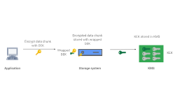

## 개요

애플리케이션이 비밀로 유지하려는 데이터
- 더 쉽게 말하면 애플리케이션 서비스에서 필요한 비밀 데이터
- ex) secret token, password, ...

<br/>

다음과 같은 운영상의 문제를 고려해야 함
- 시크릿 순환 정책
	- 변경해야 하는 시크릿은 얼마나 오래 남도록 허용되는가?
- 키 (암호화) 순환 정책
	- 암호화 키가 순환해야 하기 전에 얼마동안 머물 수 있는가?
- 시크릿 저장 정책
	- 시크릿 데이터를 저장할 때 어떤 요구사항을 충족해야 하는가?
	- 격리된 하드웨어에 시크릿을 유지해야 하는가?
- 개선 계획
	- 시크릿 또는 암호화 키가 손상되었을 때 어떻게 해결할 것인가?
	- 애플리케이션에 영향주지 않고 계획 및 자동화를 실행할 수 있는가?

<br/>

시크릿 관리를 어떤 레이어에서 제공할지 결정도 필요함
- 쿠버네티스 단에서 환경변수 또는 볼륨으로 제공할지?
- 볼트와 같은 외부 시크릿 관리 시스템을 두고, API를 통해 인증 및 이용할지?

<br/>

여긴 쿠버네티스 책이니, 일단 전자에 대해 알아볼 것이다.
- 그리고 더 나아가 외부 프로바이더에서 어떻게 integration 하고 있는지도 살펴보자.

<br/>

## 심층방어

**보안은 참 어렵다.**
- 안전을 위해서라면 보안을 무조건 강하고 튼튼하게 구성하면 된다.
  - 하지만 그렇게 하면 "사용성"은 버리게 되는 경우가 많다.
- 로그인을 예로 들면, 
  - 사실 강하고 튼튼하게 구성하려면 아이디/패스워드로 인식되는 것이 아닌 전화를 직접 해서 인증을 받는다거나, 얼굴인식 및 지문인식을 추가적으로 받는다거나, 직원에게 직접 찾아가 인증을 받는다는 등 처럼 구성해버리면 된다.
  - 당연히 기본적으로 이렇게 하지는 않는다. 왜냐? 서비스를 이용하는데 너무 불편하기도 하고, 이로 인해 로그인 하기도 전에 서비스를 나가버리기 때문이다.
- 그래서 실제로는 **"충분히 안전한 옵션"** 을 유지하면서 강화하는 쪽으로 합리적인 결정을 한다.
  - "충분히 안전한" 이라는 말이 참 추상적이고 애매하다. 그렇기 때문에 이를 잘못 이해해서 큰 장애로 이어지기도 한다.


<br/>

심층 방어를 위해 3가지로 레이어를 나눠보자.

1. **디스크 암호화 (저장 데이터 암호화 전략)**
	- 디스크/블록에 대한 암호화
	- LUKS (Linux Unified Key System) 등
2. **전송 보안**
	- 상호작용 지점 중 하나라도 TLS로 통신하지 않으면 시크릿 데이터가 노출됨.
	- 쿠버네티스는 기본적으로 TLS를 적용해 API 서버 및 etcd와의 암호화 통신을 수행함.
	- mTLS 같은 것들도 제공하는 서비스들이 있고, 적극적으로 많이 사용하는 중.
3. **애플리케이션 암호화**
	- 시스템 컴포넌트 또는 워크로드에서 수행하는 암호화 방식
		- 유저스페이스에서 키로 데이터를 암호화하는 작업
	- gpg 키를 이용해 파일을 암호화해 사용자가 사용하기 전에 암호를 해독하도록 구성


<br/>


## 쿠버네티스 시크릿 API

```yaml
kind: Secret
apiVersion: v1
metadata:
  name: mysecret
  namespace: default
type: Opaque
data:
  username: YWRtaW4=
  password: MTIzNDU=
```

<br/>

쿠버네티스 Secret 데이터는 base64로 인코딩된다.
- 생성할 때부터 직접 base64로 인코딩해 전달할 필요는 없다. `stringData` 필드로 plain한 값을 전달하면 base64로 인코딩 되어 적용된다
- 여기서 알아둬야하는 것은 "암호화"가 아닌 [단순 데이터의 표현방식을 변경한 "인코딩"이라는 것](https://www.writesoftwarewell.com/base64-encoding-explained/)이다. 

<br/>

운영 시, Secret에 대한 권한관리를 잘 생각해야 한다.
- RBAC 의미 파악하고, 공격패턴이 어떻게 들어올지 생각해봐야 한다.
- 유저에게 ClusterRoleBinding, ClusterRole을 함부로 주지 않아야 한다.
	- 일반 사용자에게 ClusterRole 권한은 필요 없다. 사용자의 RBAC과 워크로드가 액세스 할 수 있는 시크릿은 상관이 없기 때문.

<br/>

Secret은 Namespace 범위이다. 
- 즉 Namespace 간에 시크릿을 복제하지 않으면, Secret이 존재하는 Namespace의 Pod들에서만 사용이 가능하다.


<br/>


### 시크릿 사용

시크릿은 3가지 방법으로 사용이 가능하다.
- 환경변수
- 시크릿 볼륨 주입
- 쿠버네티스 API

<br/>

환경변수와 시크릿 볼륨은 직접 매니페스트에 작성해 활용한다.
```yaml
apiVersion: v1
kind: Pod
metadata:
  name: mypod
  namespace: default
spec:
  containers:
  - name: mycontainer
    image: nginx
    env:
    - name: username
      valueFrom:
        secretKeyRef:
          name: mysecret
          key: username
    - name: password
      valueFrom:
        secretKeyRef:
          name: mysecret
          key: password
    volumeMounts:
    - name: myvolume
      readOnly: true
      mountPath: /etc/secret
  volumes:
  - name: myvolume
    secret:
      secretName: mysecret
      items:
      - key: username
        path: username
      - key: password
        path: password
```

- 방식의 방법도 다른 것처럼 조금의 차이가 있다.
	- 업데이트가 가능한가?
		- 환경변수 방식은 파드를 재생성할 때까지 업데이트가 불가능하다.
		- 볼륨 방식은 파드를 다시 시작하지 않아도 시크릿을 동적으로 업데이트 할 수 있다. 시크릿이 변경된 것을 kubelet이 확인하면, 다시 로드해서 컨테이너 파일시스템에 업데이트 된 것을 표시한다.
	- 시크릿이 노출될 수 있다?
		- 환경변수 방식인 경우, 프로세스 또는 컨테이너 런타임이 검사 및 시작할 때, 환경변수를 로그에 덤프하는 등 시크릿이 노출될 수 있는 가능성이 있다.
	- 위 비교를 보고 알 수 있었을 것: 일반적으로 볼륨방식이 더 선호되고, 이용하기 좋다.

<br/>

쿠버네티스 API는 애플리케이션 실행 중 시크릿에 접근하는 방법이다.
- kube-api-server와 통신하며 시크릿을 검색하고, 이를 어떻게 주입하고/사용할지에 대한 책임을 애플리케이션에 넘긴다.
- [Spring Cloud Kubernetes 같은 라이브러리가 이런 방식으로 이용](https://docs.spring.io/spring-cloud-kubernetes/reference/property-source-config/secrets-propertysource.html)된다.
- 유연하게 대체가 가능할 것 같아 좋아보일 수 있지만 (MSA 느낌도 나고), Operator 같은 kubernetes 컴포넌트 애플리케이션이 아니라면 좋은 방식은 아니다. ~~쎄게 말하면 나쁜 방식이다~~.
	- 일단 애플리케이션이 Kubernetes를 알게 된다는 것. 애플리케이션은 자기의 책임 로직만 담당하면 되지, 자기가 어디서 배포되고 관리되는지는 알 필요가 없다. 
	- 알게 되는 순간 의존성이 생기고, 외부의 상황에 변화가 생겼을 때 애플리케이션도 수정을 해줘야 하는 문제가 생긴다. 더 나아가서 Spring Cloud Kubernetes 버전도 계속 고려해줘야하고, 새로운 쿠버네티스 버전을 올리고 싶음에도 이러한 라이브러리가 따라주지 않아 이용이 불가능할 수도 있다.

<br/>


### etcd 시크릿 데이터

다른 쿠버네티스 리소스들과 마찬가지로 시크릿은 etcd에 저장된다.

  
- 따로 암호화를 수행하지 않고, base64로 인코딩 된 결과물을 저장한다.
- 그러다보니 API 서버에 대한 루트 액세스 권한을 얻어서 공격하는 등 보안 위험성을 발생시킬 수 있는 요소들이 있다.
- 이를 해결하기 위해 etcd에서 데이터를 암호화하는 방법을 지원해, 시크릿에 대한 방어 수준을 높인다.
  - 방법으로는 정적 키 암호화, 봉투 암호화(envelope encryption)이 있다.

<br/>

### 정적 키 암호화

  

`EncryptionConfiguration`를 이용하여 API 서버로 이동할 때 Secret 오브젝트를 암호화하고 해독한다.

```yaml
kind: EncryptionConfiguration
apiVersion: apiserver.config.k8s.io/v1
resources:
- resources:
  - secrets
  providers:
  - aescbc: # provider
      keys:
      - name: key1
        secret: $(ENCRYPTION_KEY_1)
      - name: key2
        secret: $(ENCRYPTION_KEY_2)
  - identity: {}
```

<br/>

이 매니페스트를 배포해 적용한다고 바로 적용되는 것이 아닌, Api server에서 이를 바라보도록 하고 재시작되어야 한다.
- 배포된 이후에 만들어지는 Secret들에 대하여 명시한 key를 바탕으로 암호화 되어 저장되게 된다.
- key들은 보안을 위해 일정 간에 업데이트되어야 하며, 이에 2개 이상의 key가 생기게 될 수 있다. 그렇다고해서 이전 key를 지워서는 안된다. 이전 key를 이용해 암호화 된 Secret들이 존재하기 때문이다.
- 더 자세한 내용은 [공식문서](https://kubernetes.io/docs/tasks/administer-cluster/encrypt-data/)를 참고해보자.


<br/>

### 봉투 암호화


<br/>

쿠버네티스 1.10 이상부터는 KMS (Key Management Service)와의 통합을 지원해 envelope encryption이 가능하다.

```yaml
kind: EncryptionConfiguration
apiVersion: apiserver.config.k8s.io/v1
resources:
- resources:
  - secrets
  providers:
  - kms:
      name: mykey
      endpoint: http://127.0.0.1:8080
      cacheSize: 100
      timeout: 30
- identity: {}
```

<br/>


  
  


- KEK (Key Encryption Key), DEK (Data Encryption Key) 2가지 키를 이용한다.
- DEK를 만들어 데이터를 암호화 하고, 이를 KMS로 넘겨 KEK로 암호화 해 Wrapping(Encrypted) DEK를 받는다.
- 암호화 된 데이터와 Wrapping DEK를 저장한다. (etcd)
- 추후 복호화 시, 암호화 된 데이터와 Wrapping DEK를 찾는다. KMS로 Wrapping DEK를 넘겨 복호화 된 DEK를 받는다. 이를 이용하여 Data를 복호화한다.
- KEK는 외부에 있기에 쿠버네티스에 접근할 수 있다고 해도 복호화 할 수 없기에 위 방법들보다 안전하다.


<br/>


## 외부 프로바이더

쿠버네티스를 엔터프라이즈급 시크릿 저장소로 생각하긴 어렵다.
- Resource를 잘 만들고 구성해줘야 하며, 이를 잘 지키지 않으면 내부에서 바로 노출될 수 있기 때문이다.
- 은행/금융 서비스 애플리케이션 같은 경우, 이를 "충분히 안전한 옵션"으로 보기엔 어렵다. 그렇기에 아예 이를 위해 만들어진 솔루션을 이용하고자 하며, 이러한 솔루션들에서도 쿠버네티스와 함께 사용될 수 있게 여러 integration 방법들을 제공한다.


<br/>


### 볼트


Hashicorp 사에서 제공하는 Secret 저장소 서비스

<br/>

쿠버네티스와의 통합을 제공한다.
  
- https://developer.hashicorp.com/vault/docs/platform/k8s
- Mutating webhook을 통해 Init container, sidecar container가 붙어 동작하게 된다.
- 일반적으로 파드의 파일시스템에 주입되어 파드에서 실행되는 모든 컨테이너에서 사용할 수 있다.
- 참고자료
  - https://www.hashicorp.com/blog/dynamic-database-credentials-with-vault-and-kubernetes
  - [Vault Secret을 Kubernetes로 가져오는 방법](https://www.youtube.com/watch?v=Ky9LLQgOv_U) - 자사 서비스 사용률을 높이기 위해 홍보하는 감도 있으니 잘 감안해서 들을 것

<br/>

인증 과정을 보면 다음과 같다.
- 

<br/>

Service Account를 이용한 Vault policy 할당 기능도 지원한다.
-   


<br/>

얼마전까지는 진짜 거의 모든 기업에서 사용되나 했는데, 최근에는 라이선스니 비용이니 말이 조금 많은 것 같기도 하다.
- 대체제로 [infisical](https://infisical.com/) 같은 것들이 있는데, 현재 자신의 Cloud provider에 따라 나뉠 것 같기도 하다.


<br/>

### CSI 통합

`secrets-store-csi-driver`
https://secrets-store-csi-driver.sigs.k8s.io/

<br/>

Sidecar, Init container를 시랭해 시크릿 데이터를 파드에 주입하지 않아도, 파드가 외부에서 호스팅되는 시크릿에 엑세스 할 수 있는 방법
- CSI를 통해 Secret stores(시크릿 저장소)를 쿠버네티스와 통합하는 방식
- 더 쉽게 말하면 따로 컨테이너를 띄우는 것 없이 시크릿 저장소에서 알맞은 시크릿을 가져와 볼륨에 매핑한다.

<br/>

```yaml
kind: SecretProviderClass
apiVersion: secrets-store.csi.x-k8s.io/v1
metadata:
  name: vault-secrets-provider-class
  namespace: default
spec:
  provider: vault
  parameters:
    vaultAddress: http://127.0.0.1:8200
    roleName: my-role
    objects: |
      array:
        - |
          objectName: mysecret
          objectNamespace: default

---

kind: Pod
apiVersion: v1
metadata:
  name: my-pod
spec:
  containers:
    - name: my-pod
      image: nginx
      volumeMounts:
        - name: secrets-store-inline
          mountPath: /mnt/secrets-store
      volumes:
        - name: secrets-store-inline
          csi:
            driver: secrets-store.csi.k8s.io
            readOnly: true
            volumeAttributes:
              secretProviderClass: vault-secrets-provider-class
```

인증 및 권한 부여가 성공되면, 시크릿 데이터는 쿠버네티스 시크릿과 마찬가지로 볼륨 마운트에 시크릿 데이터가 나타난다.

<br/>


## 선언적 관리 방식

위 방식들을 배우면, 시크릿 데이터를 더 어떻게 해줘야 하는게 있나? 이 정도면 되지 않아? 라는 생각이 든다.
- 하지만 더 있다;

<br/>

쿠버네티스는 최근 "선언적" 방식을 이용해 관리되고 있다.
- 원하는 상태를 선언하고 시간이 지남에 따라 Controller가 원하는 상태를 현재 상태와 조정하려고 작동하는 모델
- 이런 열망은 `GitOps` 패턴으로 나타나게 된다.

<br/>

`GitOps` 의 핵심은 `git`에 저장된 배포 정의서/매니페스트(yaml)를 이용하여 클러스터를 선언적 방식으로 관리할 수 있다는 것

  

- 문제는 `git`으로 관리하고 repository에 올려 구성하다보니 필요한 `Secret`도 함께 올리게 된다.
- 암호화 되지 않은 리소스인 만큼 노출되어서는 안될 데이터가 노출되버리고 마는 것이다.
  - "내 repository는 private repository어서 괜찮아"라고 생각하는 것은 위험하다. 누구든지 repository 권한만 있다면 비밀 데이터가 다 노출되어버리는 것이기 때문이다. KMS 같이 보안을 구성할 땐 2개 이상의 수단을 융합해 활용할 수 있도록 구성하는 것이 안전하다.


<br/>

### 시크릿 봉인


이러한 문제를 해결하기 위한 방법 중 하나가 "봉인(Sealed)"이다.
- 단어로 보니 뭔가 새로운 방식 같아 보이지만, 사실 "비대칭 암호화" 방식을 의미한다.
- 시크릿을 공개키로 암호화해 커밋하므로 데이터가 노출되는 것을 우려하지 않아도 된다. 사용할 땐 접근할 수 없는 비밀키로 복호화해 사용한다.


<br/>

### sealed-secret-controller


시크릿 봉인을 위한 구현체의 대표적인 예가 `sealed-secret`이다.
- https://github.com/bitnami-labs/sealed-secrets

<br/>

  

방식은 위에서 말한 것처럼 "비대칭 암호화" 방식이다.
- 배포된 `sealed-secret-controller`는 Secret으로 Public/Private key를 만들어 이를 암호화/복호화하는데 이용한다. 기본적으로 `kube-system` ns에 배포되며, 바꿀 수는 있으나 `kubeseal` 명령어 옵션을 수정하는 등 귀찮아지므로 별 다른 이유가 없다면 `kube-system`에 배포하자.

<br/>

```yaml
apiVersion: bitnami.com/v1alpha1
kind: SealedSecret
metadata:
  name: mysecret
  namespace: mynamespace
spec:
  encryptedData:
    foo: AgBy3i4OJSWK+PiTySYZZA9rO43cGDEq.....
```

<br/>

배포하고자 하는 `Secret` 데이터를 `kubeseal` CLI를 통해 암호화를 하고, 이를 `SealedSecret` CR에 넣어 배포하면 끝이다.
- 해당 CR이 배포가 되면 `sealed-secret-controller`가 이를 복호화 해 `Secret` 리소스를 생성한다. 워크로드에서는 이 생성된 `Secret`을 이용하게 되는 것이다. 즉, 기본 쿠버네티스 구성을 이용하기에 이름/매핑만 잘 맞춘다면 워크로드 매니페스트는 수정하지 않아도 된다.
- `Secret`에 `onwerReferences`가 설정되기 때문에 `SealedSecret`이 제거되면 함께 제거된다. ([k8s ownerReferences, GC](https://binux.tistory.com/130))


<br/>

### 키 갱신 및 멀티 클러스터 모델

기능만 이해해서 도입해서는 안된다.
- **키 갱신을 어떻게 할지?**
  - `SealedSecret`에서는 기본적으로 30일마다 키가 갱신된다. 수정도 가능하다 ([문서](https://github.com/bitnami-labs/sealed-secrets?tab=readme-ov-file#secret-rotation)).
  - 키가 갱신된다 한들 기존의 시크릿들이 재암호화 되는 것은 아니다. 갱신 전 키들을 통해 복호화 해 사용된다.
- **키가 누출되면 어떻게 할지?**
  - 암호화 키를 즉시 교체하고, 기존의 모든 시크릿을 교체해야 한다.
  - 재암호화만으로는 충분하지 않다. Git history를 보고 이전 키로 암호화 한 데이터를 복호화해 시크릿 값에 접근할 수 있기 때문이다. 이런 것들도 고려해 키 교체 및 갱신 전략을 구성해야 한다.
- **멀티 클러스터 상황에서는 적합한지?**
  - 기본적으로 `SealedSecret`은 클러스터마다 암호화 키를 구성한다. 즉, 클러스터 간 키를 공유하지 않는다. 이를 어떻게 해결할지에 대해 고민이 필요하다.


<br/>

### etcd에는?

`sealed-secret-controller`는 `SealedSecret`을 복호화해 `Secret`을 구성한다. 그 후 추가적인 암호화 작업은 진행하지 않는다.
즉, KMS 등과 같은 `EncryptionConfiguration`을 구성하지 않으면 **etcd에는 암호화되지 않은 상태로 저장**된다.

Sealed-secret이 무슨 하나의 은 총알 처럼 보일 수 있지만, `Gitops` 체계를 위한 방어책일 뿐 etcd에서 암호화 되지 않는 것을 해결해주지는 않는다.
그러므로 위에서 말한 **여러 보안 툴, 솔루션, 전략들을 종합해 클러스터 보안을 구성해야만 한다.**


<br/>

## 참고

https://auth0.com/blog/kubernetes-secrets-management/
https://coffeewhale.com/sealedsecret
