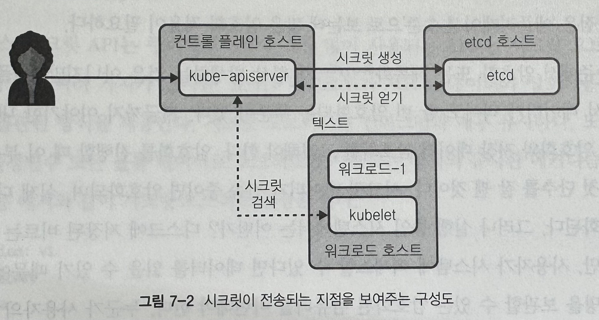
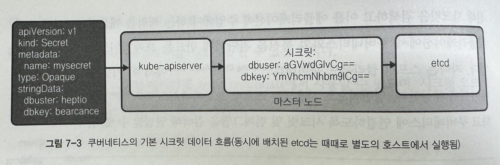
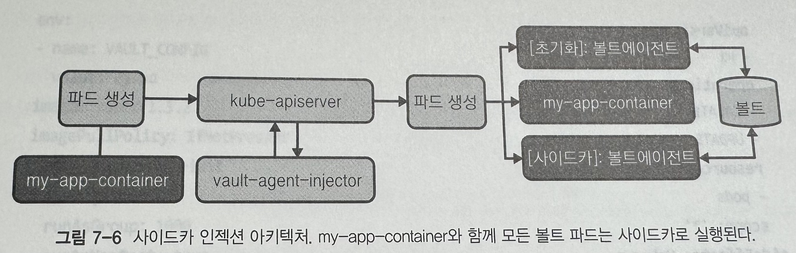
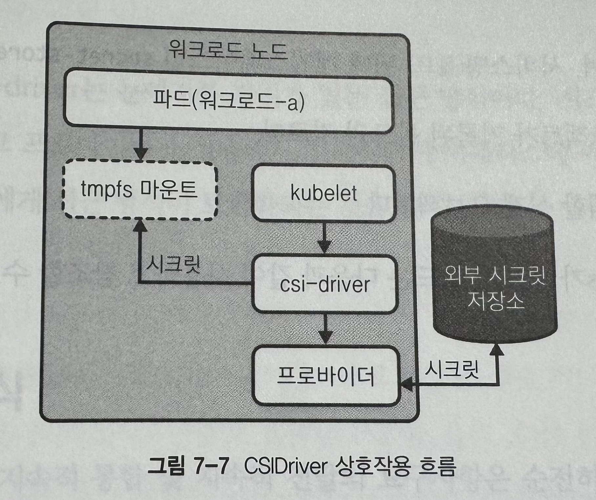
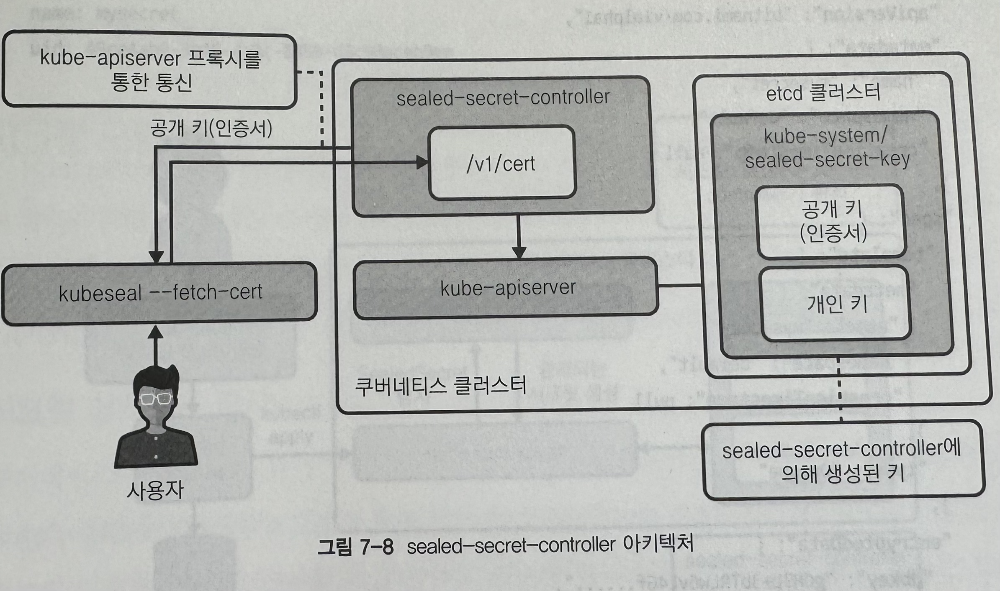
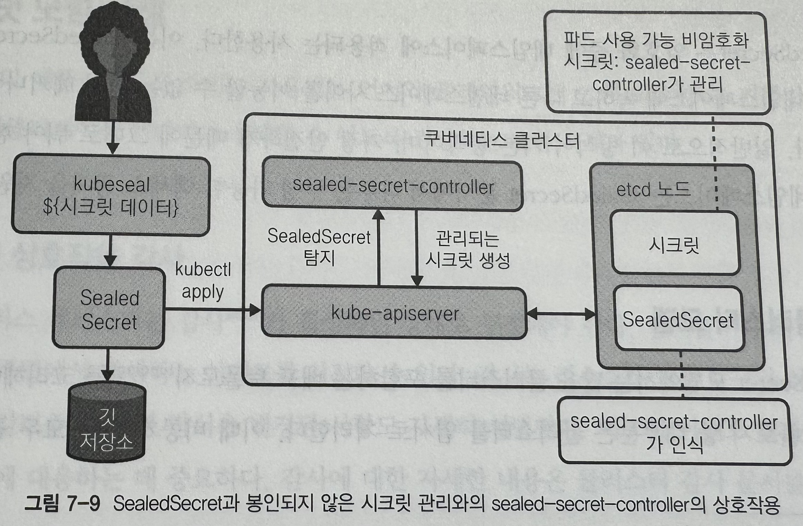

> [!NOTE]
> 책 내용 + 기타 레퍼런스를 보완한 요약본입니다.

# Chapter 7] 시크릿 관리

## 고려사항

- 시크릿 순환 정책
  - 변경해야 하는 시크릿은 얼마나 오래 남도록 허용되는가?
- 키(암호화) 순환 정책
  - 시크릿 데이터가 디스크에 유지되기 전에 애플리케이션 레이어에서 암호화된다고 가정할 때 암호화 키가 순환해야 하기 전에 얼마 동안 머물 수 있는가?
- 시크릿 저장 정책
  - 시크릿 데이터를 저장하려면 어떤 요구사항을 충족해야 하는가? 격리된 하드웨어에 시크릿을 유지해야 하는가? HSM과 통합하려면 시크릿 관리 솔루션이 필요한가?
- 개선 계획
  - 시크릿 혹은 암호화 키가 손상되면 어떻게 해결할 것인가? 애플리케이션에 영향을 주지 않고 계획이나 자동화를 실행할 수 있는가?

> ### 시크릿 관리를 제공할 레이어
> - 플랫폼 레이어
>   - Kubernetes `Secret` API를 사용할 수 있다.
> - 애플리케이션 레이어
>   - Third-party Provider (Vault, Infisical, etc,.) 를 사용해 애플리케이션에서 동적으로 API 통해 Secret을 주입받을 수 있다.

## 심층 방어

Secret을 안전하게 만들기 위해 어떤 깊이까지 갈 것인가?
- 물리적 보안
- 디스크 자체의 데이터 암호화
- ...

### 디스크 암호화

- LUKS (Linux Unified Key System)
- AWS
  - 서비스 관리 키 혹은 고객 관리키 (CMK) 사용한 저장시 암호화 제공
  - KMS 사용한 Secret의 Envelope Encryption
- GCP
  - 기본 모드로 저장 데이터 암호화 수행

### 전송 보안



전송 과정에서 TLS 적용이 되어 있지 않으면 데이터 노출 가능성이 있다. `kubectl` <-> `kube-apiserver` 및 `kube-apiserver` <-> `kubelet` 간에는 TLS가 적용되어 있어 암호화 통신이 이루어진다.

### 애플리케이션 암호화

쿠버네티스에서 실행되는 시스템 컴포넌트 혹은 워크로드에서 수행하는 암호화 방식. userspace에서 키로 데이터를 암호화하는 작업이다.

## Kubernetes Secret API

`ConfigMap`과 매우 유사하며 워크로드가 `Secret`을 `ENV` 혹은 `Volume Data`로 이 Object를 사용한다.

```YAML
apiVersion: v1
kind: Secret
metadata:
  name: mysecret
type: Opaque
data:
  dbuser: aGVwdG1vCg==
  dbkey: YmVhcmNhbm91Cg==
# 인코딩하지 않는 데이터를 전달하는 경우 `stringData` 필드 사용 - kube-apiserver에서 인코딩된다.
stringData:
  dbuser: heptio
  dbkey: bearcanoe
```

데이터는 `base64`로 인코딩된다. 이는 모든 종류의 특수문자나 바이너리 데이터가 올바르게 저장되었는지 확인하기 위해서다.

시크릿은 네임스페이스 scope를 가지며 시크릿 오브젝트의 안전한 사용을 위해 RBAC을 적용하게 된다.

> ### K8s Secret은 정말 Secret인가?
>
> ~~그저 문자열을 Base64로 인코딩한 것일 뿐인데?~~
> 공식 문서에는 다음과 같이 `Secret`을 안전하게 사용하는 방법 두 가지를 제시한다.
> - `Secret`에 대한 [암호화 활성화](https://kubernetes.io/docs/tasks/administer-cluster/encrypt-data/)
> - `Secret` 읽기 및 쓰기를 제한하는 [RBAC 규칙 활성화 또는 구성](https://kubernetes.io/docs/reference/access-authn-authz/authorization/). Pod를 만들 권한이 있는 모든 사용자는 `Secret`을 암묵적으로 얻을 수 있다.
> 
> 이러한 조치에도 여전히 위험성은 남아있다.
> 1. 공식 문서에서는 아래와 같은 위험성을 알리고 있다.
>   - `kube-apiserver`를 거쳐 시크릿 데이터는 `etcd`에 저장된다. 따라서,
>     - 관리자는 클러스터 데이터에 대해 저장 시 암호화를 활성화해야 한다. (v1.13 이상 필요)
>     - 관리자는 `etcd`에 대한 접근을 admin 사용자로 제한해야 한다.
>     - 관리자는 더 이상 사용하지 않을 때 `etcd`에서 사용하는 디스크를 지우거나 폐기할 수 있다.
>     - 클러스터에서 `etcd`를 실행하는 경우, 관리자는 `etcd` peer-to-peer 통신에 대해 SSL/TLS를 사용해야 한다.
>   - 실수로 기록하거나 신뢰할 수 없는 상대방에게 전송하지 않는 것과 같이, 애플리케이션은 볼륨에서 읽은 후에 시크릿 값을 보호해야 한다.
시크릿을 사용하는 파드를 생성할 수 있는 사용자는 해당 시크릿의 값도 볼 수 있다. API 서버 정책이 해당 사용자가 시크릿을 읽을 수 있도록 허용하지 않더라도, 사용자는 시크릿을 노출하는 파드를 실행할 수 있다.
>   - 현재, 모든 노드에 대한 루트 권한이 있는 모든 사용자는 `kubelet`을 가장하여 API 서버에서 모든 시크릿을 읽을 수 있다. 단일 노드에 대한 루트 취약점 공격의 영향을 제한하기 위해, 실제로 필요한 노드에만 시크릿을 보내는 것이 앞으로 계획된 기능이다.
> 2. `Secret`을 필요로 하는 애플리케이션이 GitOps를 통해 관리되고 있다면 사실은 이 오브젝트를 생성해서 업로드하는 자체가 보안 취약점이 될 수 있다. 따라서 암호화는 필요하다.

### Secret 소비 모델

위에서 간단하게 설명한 바처럼 워크로드가 Secret을 다음과 같은 방식을 사용해 로드할 수 있다.

- ENV

```yaml
apiVersion: v1
kind: Pod
metadata:
  name: nginx
spec:
  containers:
  - name: nginx
    image: nginx
    env:
    - name: USER
      valueFrom:
        secretKeyRef:
          name: mysecret
          key: dbuser
    - name: PASS
      valueFrom:
        secretKeyRef:
          name: mysecret
          key: dbkey
```

이 방식은 Hot Reload가 불가능한 단점이 있다. 그리고 환경변수로 시크릿을 집어넣게 되면 plaintext로 주입될 것이므로 노출 위험을 염두에 두어야 한다.

- `volumeMount`

```yaml
apiVersion: v1
kind: Pod
metadata:
  name: nginx
spec:
  containers:
  - name: nginx
    image: nginx
    volumeMounts:
    - name: creds
      readOnly: true
      mountPath: "/etc/credentials"
  volumes:
  - name: creds
    secret:
      secretName: mysecret
```

이 방식은 `Pod` Restart 없이도 `Secret`의 Hot Reload가 가능하다. `Secret`에 변경사항이 발생되면 `kubelet`이 `Secret`을 다시 로드 (`tmpfs` 임시 볼륨)하고, 컨테이너의 파일 시스템에 업데이트된 것으로 표시한다.

임시 볼륨에 시크릿이 저장되며 `Pod`가 호스트에서 제거될 때 `volumeMount` 또한 삭제되는 방식이므로 시크릿 데이터가 무한정 클 수는 없다.

- 클라이언트의 API 소비

권장되지 않는다. `kube-apiserver`와 통신해 시크릿을 검색하고 이를 애플리케이션에 주입해야 하는 책임을 애플리케이션이 가져야 한다. 그리고 애플리케이션이 위치를 인식해야 하고 오브젝트에 액세스할 때 RBAC도 요구된다. (반면 `kubelet`이 이 작업을 위임하게 되면 별도의 SA가 요구되지 않는다.)

### etcd Secret Data

모든 오브젝트들과 마찬가지로 `Secret`이 `etcd`에 저장된다. 기본적으로 `Secret`을 `etcd`에 저장하기까지 K8s 레이어에서 암호화가 수행되지 않는다.
외부 공격자는 `kube-apiserver`를 거치지 않고도 `etcd`에 접근 가능하기 때문에 `etcd`가 존재하는 노드의 루트 액세스 권한을 얻어 데이터 위치를 찾은 후 데이터 탈취가 가능하다. 혹은 `kube-apiserver`에 대한 루트 액세스 권한을 얻어 `kube-apiserver` 및 `etcd`에 대한 인증서를 확보해 `kube-apiserver`로 가장하여 `etcd`와 통신할 수도 있다.



따라서 `etcd`에 저장되기까지의 과정에 있어서의 암호화를 위해 아래의 정적 키 암호화 및 봉투 암호화 방식을 적용할 수 있을 것이다.

### Static Key Encryption


이 방식은 `EncryptionConfiguration` 오브젝트 구성에 의해 제공되는 키가 `Secret`이 `kube-apiserver`에 도달할 때 암호화하고 해독되는데 사용된다. 외부 공격자가 `etcd`에 접근하더라도 암호화되어 있어 `Secret`이 손상되지 않는다. `secretbox` / `AES-CBC` / `AES-GCM` 등 다양한 Provider를 사용해 암호화/해독 가능하다.

```yaml
apiVersion: apiserver.config.k8s.io/v1
kind: EncryptionConfiguration
resources:
  - resources:
    - secrets
    providers:
    - secretbox:
        keys:
        # 주기적으로 Rotation 하더라도 기존 키를 제거하지 않고 새 키를 지정한다.
        - name: secret-key-1
          secret: u7mc0cHKbFh9eVluB18hbFIsVfwpvgbXv650QacDYXA==
  - identity: {}
# 해당 파일은 kube-apiserver Restart 후 적용 가능하며 CLI Option --encryption-provider-config으로 파일명을 전달해야 한다.
```

### Envelope Encryption


봉투 암호화란 데이터 키로 일반 텍스트 데이터를 암호화한 후, 다른 키 아래에서 데이터 키를 암호화하는 방법이다.
Kubernetes에서는 1.10 이상부터 `KMS`(Key Management Service)와의 통합을 지원해 봉투 암호화를 사용할 수 있다. 봉투 암호화에는 `KEK` (Key Encryption Key), `DEK` (Data Encryption Key) 두 가지 키가 포함된다.
- `KEK`는 KMS에 외부적으로 저장되며 `KMS` Provider가 손상되지 않는 한 위험하지 않다. `KEK`는 `Secret` 오브젝트 암호화를 담당하는 `DEK` 암호화에 사용된다.
- 각 `Secret` 오브젝트는 데이터를 암호화/해독하기 위해 고유한 `DEK`를 가져온다. `DEK`는 `KEK`로 암호화되고 데이터 자체와 함께 저장 가능하므로 `kube-apiserver`가 많은 키를 인식할 필요가 없다.

`KMS` Provider마다 작동 방식에 약간의 차이가 있지만, 일반적 봉투 암호화 방식은 위와 같으며 아래와 같은 이점을 가지게 된다.

- `KMS`가 Kubernetes 외부에 있으므로 격리 방식으로 보안이 강화된다.
- `KEK`의 중앙 집중화로 키의 쉬운 Rotation이 가능하다.
- `DEK` / `KEK` 분리는 `Secret` 데이터가 `KMS`로 전송되거나 `KMS`로 알려진 적이 없음을 의미한다.
- KMS는 DEK 해독에만 관여한다.
- `DEK` 암호화는 `Secret`과 함께 저장하기 쉽고 `Secret`과 관련된 키를 쉽게 관리할 수 있음을 의미한다.

`KMS` Provider 플러그인은 컨트롤 플레인의 `EncryptionConfiguration`에서 지정할 수 있다.

```yaml
apiVersion: apiserver.config.k8s.io/v1
kind: EncryptionConfiguration
resources:
  - resources:
    - secrets
    providers:
    - kms:
        name: myKmsPlugin
        endpoint: unix:///tmp/socketfile.sock
        cachesize: 100
        timeout: 3s
  - identity: {}
# 해당 파일은 kube-apiserver Restart 후 적용 가능하며 CLI Option --encryption-provider-config으로 파일명을 전달해야 한다.
```

## External Provider

### Vault

Hashicorp의 오픈소스 프로젝트 (~~지금은 아닐걸~~) 로 사용자가 가장 선호하는 인기 프로젝트. Spring과 같은 프레임워크와 쿠버네티스 자체에서 통합하는 기능을 제공한다.
Kubernetes에서 Vault를 실행하고 Vault에서 `TokenReview` API를 사용해 `kube-apiserver`에 대한 요청을 인증할 수 있도록 한다.

Vault는 두 가지 방식으로 Kubernetes와 통합한다.
- Vault Agent Injector ([아래 항목](#Secret_Injection_Integration)에서 설명)
- Vault CSI

### [CyberArk](https://github.com/cyberark/secrets-provider-for-k8s)

CyberArk는 IT 보안회사로, 쿠버네티스 환경의 Secret Provider를 제공하고 있다. `Vault`와 유사하게 `initContainer`를 사용해 `DAP(Dynamic Access Provider)`와 통신하는 기능을 지원한다.

### Secret Injection Integration



이 방식은 `initContainer` 혹은 사이드카 컨테이너를 실행해 외부 `Secret` 저장소와 통신한다. 일반적으로 `Secret`은 `Pod`의 파일시스템에 주입되어 `Pod`에서 실행되는 모든 컨테이너에서 사용할 수 있다. (권장되는 방식) 이는 애플리케이션에서 `Secret` 저장소를 완전히 분리하는 이점을 가진다.

Vault의 경우 `MutatingWebhook`을 사용해 `Pod`가 생성되거나 업데이트되면 `annotation`을기반으로 `initContainer`와 사이드카 컨테이너를 추가해 필요하면 `Secret` 업데이트를 유지한다.

### CSI Integration

SIG 프로젝트인 [`secrets-store-csi-driver`](https://secrets-store-csi-driver.sigs.k8s.io/)은 low-level에서 `Secret` 관리 시스템과 통합이 가능하도록 지원하는 방식을 제공한다.

사이드카 혹은 `initContainer`를 실행해 `Secret` 데이터를 `Pod`에 주입하지 않고도 `Pod`가 외부에서 호스팅되는 `Secret`에 액세스할 수 있도록 한다. 이 Driver는 DaemonSet으로 배포되며 이는 `CSIDriver`가 Storage Provider와 함께 작동하는 방식과 유사하다. 그런 다음 드라이버는 외부 시스템에서 `Secret` 조회를 담당하는 Provider에 의존한다. Vault는 모든 호스트에 Vault Provider Binary를 설치해야 한다. 이 때 Binary 위치는 드라이버의 `provider-dir` mount가 설정된 곳이어야 한다.



## Declarative Management

GitOps를 통해 리소스를 관리하는 경우 `Secret`은 그저 인코딩 데이터일 뿐 철저히 암호화된 데이터가 아니므로 외부에 노출되는 위험을 낮추기 위해 Sealing (봉인) 매커니즘이 적용되어야 한다.

### Secret 봉인

`Secret` 정보는 비대칭 암호화를 사용해 암호화하고 공개된 장소에서 관리 가능하며 데이터 노출을 걱정하지 않도록 보장한다. 비대칭 암호화에는 공개되는 암호화 키와 공개되지 않는 해독 키가 있다. 암호화 키로 생성된 모든 `Secret` 키는 Private Key가 손상되지 않고는 값이 손상되지 않는다.

### sealed-secrets-controller





`SealedSecrets`는 자체 컨트롤러를 클러스터 내부에서 실행시켜 자체 암호화 및 해독에 필요한 키를 생성한다. 클라이언트 측에서는 `kubeseal` CLI 도구를 사용해 비대칭 암호화를 수행한다. 이 때 CLI는 공개 키 (암호화용)만 알면 된다. 다만 공개 키를 Kubernetes `Secret`에 직접 액세스하는 방식이 아니라 별도의 엔드포인트를 노출하고 이에 액세스하는 방식이다.

`Secret`을 생성하고 이를 `SealedSecret`이라는 자체 CR 형태로 Sealing을 진행할 수 있다.

```shell
$ kubeseal [--controller-name=sealed-secrets-controller] [--controller-namespace=kube-system] ${SECRET_FILE} -o yaml
```

`sealed-secrets-controller`가 보유하는 봉인 키가 손상되지 않는 한 위 오브젝트로 생성되는 데이터는 안전하다. 해당 오브젝트가 배포되면 컨트롤러에서 `Secret` 오브젝트로 변환하며 반대로 삭제될 경우 해당 `Secret`이 GC된다.

### Key 캥신

RBAC 구성 오류로 Private Key가 노출되면 모든 `Secret`이 손상된 것으로 간주해야 한다. 따라서 Sealing Key는 주기적으로 Rotation되어야 하며 `SealedSecrets`에서는 Rotation이 Default로 구성되어 있다. 30일 주기로 갱신되며 기존 키를 대체하지 않는다. (대신 데이터 봉인을 해제할 수 있는 기존 키 목록에 추가된다.) 새 키는 모든 새 암호화에 사용되며 기존 `SealedSecret`은 다시 암호화되지 않으니 키가 노출되면 즉시 암호화 키 및 기존 모든 `Secret`을 교체해야 한다.

`SealedSecret`은 namespace scope를 적용한다.

### Multi-cluster 모델

클러스터 간 비공개 키를 모두 공유하지 않기 때문에 멀티 클러스터를 운영하는 경우 이러한 점을 고려하여 클러스터별로 키를 관리하는 등의 고려가 필요하다.

> `SealedSecrets`으로 `Secret`을 암호화한다고 하더라도 클러스터에 배포된 이후 `etcd`에 저장되는 `Secret` 데이터는 plaintext이다.

## Best Practices

### Secret 상호작용 감사

감사를 사용하면 특정 리소스 주변에서 발생하는 이벤트 지정이 가능하다.
감사는 리소스가 언제 누구와 상호작용했는지 알려준다.
시크릿 이벤트 감사는 액세스 문제에 대응하는 데 중요하다.

### Secret 누출 금지

실수로 인한 `Secret`이 노출되지 않도록 하여야 한다.

### 볼륨 선호 방식

환경변수는 다양한 방식으로 누출될 가능성이 더 높다. 그리고 볼륨을 사용할 경우 환경변수에서는 누릴 수 없는 이점인 Hot Reloading 또한 가능하다.

### 애플리케이션에 시크릿 저장소 Provider를 알 수 없도록 설정

관심사 분리 철학에 따라서 애플리케이션이 시크릿을 관리하는 Provider의 종류를 알지 않아도 되도록 구성하는 것이 좋다. 이러한 구성을 하려면 환경변수 또는 볼륨에서 시크릿 로드하는 방식이 권장되고 특히 이 중에서는 볼륨을 더욱 권장한다.