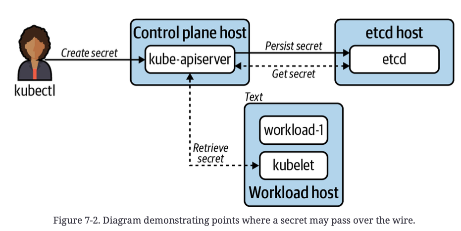
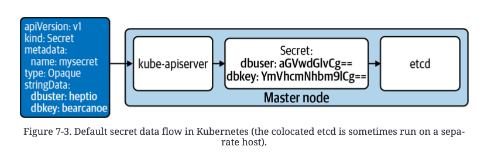
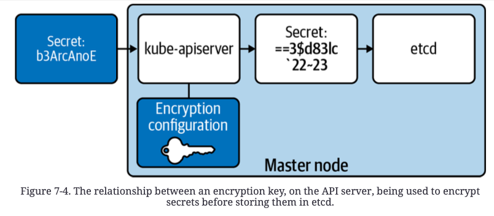
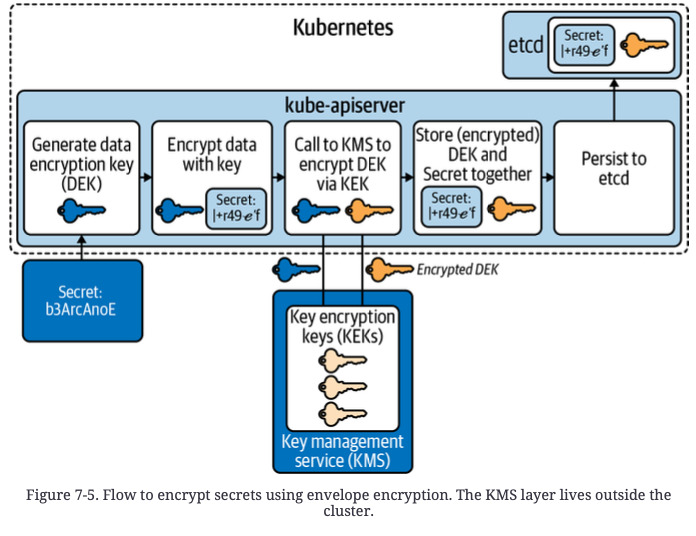
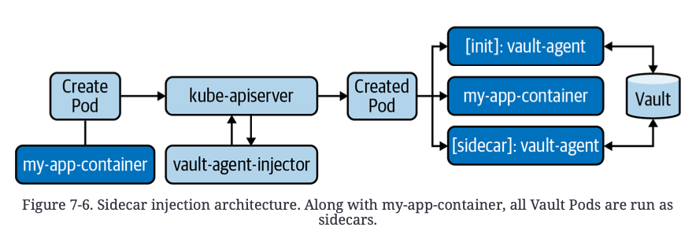
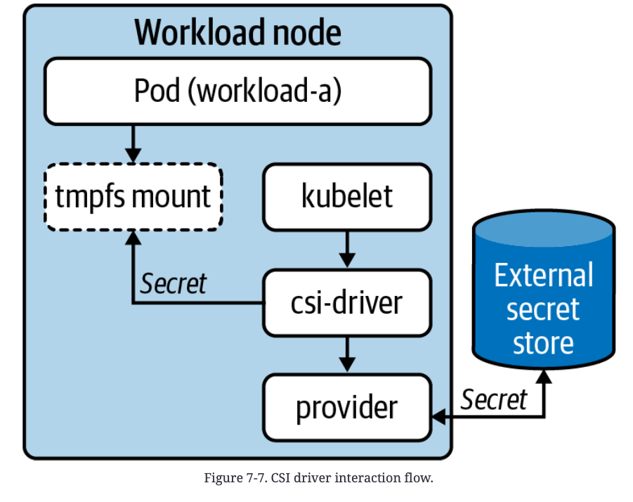
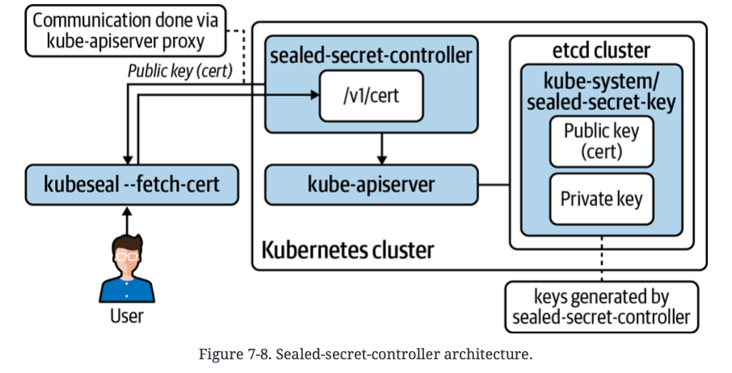
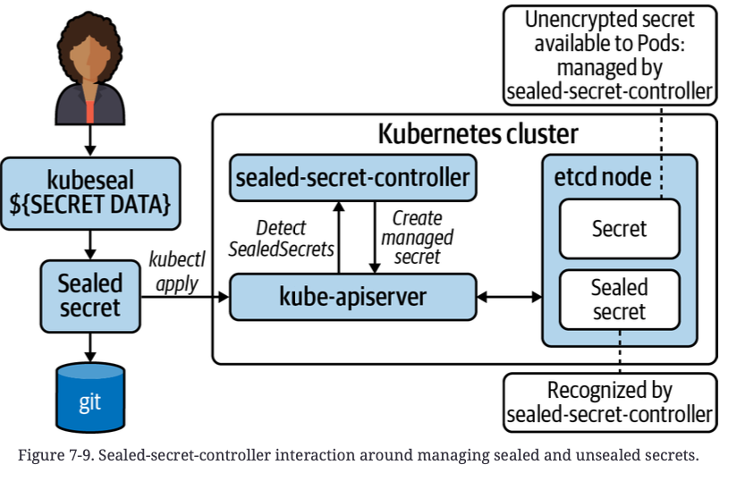

# Chapter 7. Secret Management

**secret**

- database, message queue 등에 접근하기 위한 credential
- app. 간 mTLS를 위한 private key
- etc.


**secret 관련 운영 고려사항**

- **secret rotation policies**
  - secret 변경 기한을 어느정도로 잡을 것인지
- **Key(encryption) rotation policies**
  - application layer에서 secret data를 암호화한다면 여기 사용되는 encryption key의 변경 기한을 어느정도로 잡을 것인지
- **Secret storage policies**
  - secret data 저장시 요구사항이 무엇인가?
    - 독립된 hardware에 보관할지?
    - HSM(Hardware Security Module)이 있는 secret management solution이 필요한지?
- **Remediation plan**
  - secret이나 encryption key가 위험할 때 app에 영향 없이 복구될 수 있는가?


**secret을 어떻게 관리할까**

- platform level에서 해결하지 않고, app 개발 시 secret을 동적으로 주입시키기도 한다.
  - ex) Hashicorp Vault를 사용해서 secret들을 API 통신으로 받아온다.

- platform level에서 처리하여, app 개발팀에서 secret에 대한 세부사항들(어떤 provider를 사용하는지, 어떻게 저장하고 사용해야하는지)에 대한 내용들을 알 필요 없게 만들 수도 있다.


## Defense in Depth

> security 계층들과 중요한 지점들을 살펴보자


**physical layer**

- 물리적인 data center 보호
  - 시설 보안
  - 악의적인 내부자 또한 데이터를 읽을 수 없도록 데이터 암호화
  - 적절한 hardware 폐기처분 등


### Disk Encryption

**disk Encryption 방안**

1. **LUKS** (Linux Unified Key System)
   - 전체 block 암호화를 위한 방안
   - Linux kernel v2.6 부터 사용 가능하다.
2. AWS EBS의 경우 기본 암호화 옵션을 제공함
3. Google Cloud는 기본으로 암호화를 수행한다.
   - AWS, GCP 둘 다 KMS(Key Management Service)를 통해 암호화 방식을 수정할 수 있다.


**기본적으로 암호화가 되어 있어야 한다.**

- 외부 공격 경로를 감소시켜줄 뿐만 아니라, 내부적인 실수로 인한 민감한 data 유출을 방지할 수 있다.
  - ex) AWS snapshot을 실수로 public으로 노출 시킬 수 있음. 이런 경우에도 private key access 없이는 데이터를 읽어볼 수 없도록한다면 큰 문제가 되지 않는다.


### Transport Security



해당 구조도를 보면 secret data가 host들 간 network를 통해 이동하는 것을 볼 수 있다. 따라서 아무리 강력한 암호화를 사용하더라도, TLS 없이 통신하게 된다면 secret data가 노출될 수 있다. K8S에서 기본적으로 제공된다.


### Application Encryption

**application layer encryption은 많은 계층들을 둘 수 있다.**

- K8S에 data를 저장하기 전에 암호화 수행
- K8S에서 암호화 수행 후 etcd에 저장
- etcd에서 filesystem level의 암호화 수행


**application encryption은 data를 userspace level의 key로 암호화하는 것이다.**


## The Kubernetes Secret API

> 2가지 가정을 하고 시작한다.
>
> 1. filesystem 암호화와 K8S storage system 둘 중 하나라도 암호화가 적용되어 있다.
> 2. 모든 K8S component들과 etcd에 TLS 가 적용되어 있다.

- Secret object는 ConfigMaps 와 유사하다.
  - workload들이 환경 변수와 volume data로 해당 object들을 사용할 수 있음

```yaml
apiVersion: v1
kind: Secret
metadata:
	name: mysecret
type: Opaque
data:
  dbuser: aGVwdGlvCg==  # base64 encoded
  dbkey: YmVhcmNhbm9lCg==  # base64 encoded
```

모든 secret data가 base64로 encoding 되지만, `data` 대신 `stringData`를 사용하면 raw data로 설정할 수 있다.

```yaml
apiVersion: v1
kind: Secret
metadata:
  name: mysecret
type: Opaque
stringData:
  dbuser: heptio
  dbkey: bearcanoe
```

`stringData`는 API server에서 encode 되어, etcd에 적용된다.


**base64로 encode하는 것은 보안을 위한 것이 아니다.**

- base64는 모든 종류의 특수문자나 binary data를 표현할 수 있기 때문이다.

**secret을 보호하는 주요 mechanism은 RBAC이다.**

- `get` : data retrieval
- `list` : 모든 secret 또는 secret data 목록  조회
- `watch` : secret data 변화에 대한 감지

- 사소한 RBAC 실수로 인해 secret이 노출될 수 있다. (ClusterRoleBinding 실수면 cluster 전체 secret이 노출될 수도 있음)

**the scope of secrets**

- secret은 namespace scope를 갖고 있다.
  - 따라서 여러 namespace에서 필요한 secret이라면 복제되어야 함


### Secret Consumption Models

workload는 다양한 방법으로 Secret을 사용할 수 있다.

3가지 방법을 알아보자

#### Environment Variables

```yaml
apiVersion: v1
kind: Pod
metadata:
	name: nginx
spec:
  containers:
  - name: nginx
  	image: nginx
  	env:
      - name: USER # app에서 사용할 환경 변수 이름(key)
      	valueFrom:
      		secretKeyRef:
      			name: mysecret # secret 이름
      			key: dbuser # secret object의 key 특정
      - name: PASS
      	valueFrom:
      		secretKeyRef:
      			name: mysecret
      			key: dbkey
```

- 편리함

- **hot reload** (Pod 재시작 없이 data reload) 불가능

  따라서 수동으로 개입하거나 reschedule할만한 system event가 없는 이상 secret이 update되지 않는다.

- volume mount에 비해서 안전하지 않다고 할 수 있다.

  - 환경 변수는 plain text로 볼 수 있는 방법들이 많음
  - 특정 framework나 언어에서 지원하는 debug, crash mode에서 환경 변수를 dump해서 확인할 수도 있다.


#### Volumes

```yaml
apiVersion: v1
kind: Pod
metadata:
	name: nginx
spec:
  containers:
  - name: nginx
    image: nginx
    volumeMounts:
    - name: creds # container filesystem에 mount됨
      readOnly: true
      mountPath: "/etc/credentials" # 지정 경로
  volumes: # Pod-level volume 지정
  - name: creds # mount 시 사용할 이름
    secret:
	    secretName: mysecret
```

- Pod restarting 없이 동적으로 update가 가능하다.
  - secret에 변동이 발생할 경우 kubelet이 secret을 reload하고 container file system에서 update된 것이 보인다.

- tmpfs(linux 휘발성 storage)를 사용해 secret data가 memory에 배타적으로 저장된다.
  - pod이 죽으면 mount도 삭제됨
  - 휘발성 memory에 저장되기 때문에 큰 용량을 차지하면 안된다.
- K8S API server와의 통신도 이해할 필요없고, 많은 workload들에 성공적으로 적용되는 이상적인 pattern이다.


#### Client API Consumption

- core K8S 기능이 아니다.
- kube-apiserver와 통신하여, secret을 반환받아, app에 inject해주는 역할을 한다.
- ex) Spring Cloud Kubernetes (K8S와 통신하여 Secret과 ConfigMaps를 주입한다.)

- 굳이 사용할 필요 없을듯 (provider-specific logic을 app에 추가해야 됨, 별도의 service account 필요)


### Secret Data in etcd




K8S api server와 다른 host위에서 etcd가 실행되고 있다면 

- 공격자는 etcd node의 root 권한을 얻어서, data location을 찾아서 secret들을 읽을 수 있다.
- 또는 API server의 root 권한을 얻어서, API server를 사칭해 etcd와 통신해서 secret들을 읽을 수도 있다.

위 방법들보단 RBAC 조작 중 발생한 실수나, app 침해가 더 위험하다.


### Static-Key Encryption



공격자가 etcd의 data들을 확인하더라도, kube-apiserver의 encryption configuration에 따라 암호화되어 있기 때문에, secret들을 읽을 수 없다.

키는 다양한 공급자들을 사용할 수 있다. (secretbox, aescbc, aesgcm, etc.)

FIPS(Federal Information Processing Standards 미 연방 정보 처리 표준)과 같은 표준을 준수할 필요가 있을 경우 공급자를 선택할 때 좀 더 조심스럽게 고려되어야 한다.


**encryption configuration 예시**

- secretbox를 사용한 예시

- 32-byte key를 생성해야 한다

- 대칭 암호화이기 때문에, 1개의 key가 필요하다

  - `head -c 32 /dev/urandom | base64`

- 위에서 얻은 key data가 EncryptionConfiguration이 모든 kube-apiserver에  추가되어야 한다.

  - ansible이나 KubeadmConfigSpec 과 같은 configuration management를 통해 추가되어야 한다.

    - key의 추가 / 삭제 / rotating 을 보장해준다.

  - encryption configuration 예시

    ```yaml
    apiVersion: apiserver.config.k8s.io/v1
    kind: EncryptionConfiguration
    resources:
      - resources:
        - secrets
        providers: # list 첫번째 key로 암호화, list 순서대로 key 사용해서 복호화
        - secretbox:
          keys:
          - name: secret-key-1
    	      secret: u7mcOcHKbFh9eVluB18hbFIsVfwpvgbXv650QacDYXA==
        # identity is a required (default) provider
        - identity: {}
    ```

  - identity가 1번째 element일 경우 secret을 암호화 하지 않는다.

- 이후 kube-apiserver들을 각 node에서 업데이트(재시작)한다.
  - kube-apiserver를 위해 static Pod을 사용하고 있을 경우 manifest file 변경시 자동으로 재시작하게 된다.


1. encryption key가 새로 설정된 경우, 그 이후 생성되거나 변경되는 object에 대해서만 encryption을 수행한다.

2. provider/key가 존재하지 않는다면 decryption이 수행되지 않는다.


```yaml
- secretbox:
  keys:
  - name: secret-key-2
  	secret: xgI5XTIRQHN/C6mlS43MuAWTSzuwkGSvIDmEcw6DDl8=
  - name: secret-key-1
		secret: u7mcOcHKbFh9eVluB18hbFIsVfwpvgbXv650QacDYXA=
```

**위 예시에서 secret-key-1이 존재하는 것이 중요하다.**

- 기존 key들은 secret-key-1으로 암호화되어 있기 때문에 없애버리면 복호화가 불가능
- secret들이 갖는 최대 rotate 기간 동안은 fallback decryption으로 사용할 수 있도록 해야됨


### Envelope Encryption

> K8S v1.10 이후로 KMS(Key Management System)를 통해 envelope encryption을 달성할 수 있다.

envelope encryption은 2개의 key를 사용한다.

- key encryption key (KEK)
  - 명시적으로 KMS에 저장 (KMS provider 침해가 있지 않은 이상 안전하다.
  - DEK를 암호화하는데 사용한다.
- data encryption key (DEK)
  - Secret object를 암호화한다.
  - 각 Secret마다 다른 DEK를 갖는다.



- KMS가 K8S로부터 독립되어 보안성 증가
- KEK들을 한곳에서 관리하여 key rotation이 쉽다.
- KMS는 DEK, KEK만 관리하기 때문에 KMS에서는 secret data를 알 수 없다.


원격 KMS와 grpc 통신하는 provider plug-in

- kube-apiserver가 있는  master node에서 실행

- EncryptionConfiguration이 추가되어야 한다.

  ```yaml
  apiVersion: apiserver.config.k8s.io/v1
  kind: EncryptionConfiguration
  resources:
  - resources:
  - secrets
  providers:
  - kms:
    name: myKmsPlugin
    endpoint: unix:///tmp/socketfile.sock
    cachesize: 100
    timeout: 3s
  # required, but not used for encryption
  - identity: {}
  ```

- KMS 구현체들이 많지도 않고 아직 미성숙하다고 한다.

  - cloud provider들에서 제공하는 plug-in들(제한적 기능 지원) 또는 vault plugin (abandoned)


## External Providers


### Vault

- Hashicorp vault open source project

1. K8S 내에서 Vault 실행
2. TokenReview API를 사용해서 K8S API server 인증
3. sidecar & initContainer injection / CSI integration

### Cyberark

- Credential Provider와 Dynamic Access Provider(DAP)를 제공
- DAP와 통신하기 위해 initContainer 사용


### Injection Integration

> Vault 구현체로 설명해본다.

- 외부 secret store와 통신하기 위해 initContainer 또는 sidecar container를 사용한다.
- 일반적으로 Pod의 filesystem에 주입하는데 이 방법을 가장 추천한다.
  - application과 secret store를 완전히 decoupling 하는 방법이기 때문에



**MutatingWebHook**

- 모든 Pod CREATE / UPDATE event에 호출된다.
- 이후 특정 Pod에만 mutate를 가한다
  - `vault.hashicorp.com/agent-inject: "true"`
    - vault-agent initContainer 주입
      - Pod filesystem에 secret 작성
  - `vault.hashicorp.com/agent-inject-status: "update"`
    - vault-agent sidecar 주입
      - secret 변경 시 업데이트해준다.


**Pod annotation에 명시된 secret들을 받아온다.**

ex) `vault.hashicorp.com/agent-inject-secret-db-creds: "secrets/db/creds"`


**요청자의 service account에 대한 validating 수행**

- K8S TokenReview API 로 통신
- 해당 Service Account가 secret에 접근할 수 있는지 확인


### CSI Integration

**secrets-store-csi-driver**

- Secret management system과 통합
- sidecar나 initContainer 없이 Pod이 secret에 접근가능하게 해준다.
- 모든 node에 DaemonSet으로 driver pod을 실행한다. (CSI Driver처럼)


valut의 경우 `valut-provider` binary를 모든 host에서 실행한다.



**SecretProviderClass** 

```yaml
apiVersion: secrets-store.csi.x-k8s.io/v1alpha1
kind: SecretProviderClass
metadata:
	name: apitoken
spec:
  provider: vault
  parameters:
    roleName: "teama"
    vaultAddress: "https://vault.secret-store:8000"
    objects: |
      array:
        - |
          objectPath: "/secret/team-a"
          objectName: "apitoken"
          objectVersion: ""
```

**SecretProviderClass를 이용해 secret을 mount하는 Pod**

```yaml
kind: Pod
apiVersion: v1
metadata:
	name: busybox
spec:
  containers:
  - image:
    name: busybox
    volumeMounts:
    - name: secrets-api
      mountPath: "/etc/secrets/apitoken"
      readOnly: true
  volumes:
    - name: secrets-api
      csi:
        driver: secrets-store.csi.k8s.com
        readOnly: true
        volumeAttributes:
        	secretProviderClass: "apitoken"
```


## Secrets in the Declarative World

CI/CD 로 인해 선언적인 model을 지향하게 되었다. (일반적으로 GitOps 접근 방식, 15장에서 다룬다)

secret은 선언적이어야 하지만, 노출되지 않아야 한다는 문제가 생긴다.

선언적임을 포기하거나, secret data를 **sealing** 하는 방법이 있다.


### Sealing Secrets

- 비대칭 암호화를 사용한다
- public key로 암호화한 key들을 선언적으로 사용
  - 믿을 수 있는 cipher
  - private key가 항상 안전할 것이라는 보장
  - encryption key &  secret data rotation policies


### Sealed Secrets Controller

**Bitnami-labs/sealed-secrets** 

위 비대칭 암호화를 통한 sealing을 하게 해주는 open source project




Secret object yaml에 `kubeseal mysecret.yaml` 을 수행해서 `SealedSecret` CRD object를 반환받는다.

**SealedSecret 예시**

```json
{
  "kind": "SealedSecret",
  "apiVersion": "bitnami.com/v1alpha1",
  "metadata": {
    "name": "mysecret",
    "namespace": "default",
    "creationTimestamp": null
  },
  "spec": {
    "template": {
      "metadata": {
        "name": "mysecret",
        "namespace": "default",
        "creationTimestamp": null
      },
      "type": "Opaque"
    },
    "encryptedData": {
      "dbkey": "gCHJL+3bTRLw6vL4Gf......",
      "dbuser": "AgCHJL+3bT......"
    }
  },
  "status": {
  }
}
```

- sealed-secret-controller의 sealing key가 침해되지 않는 이상 안전한 구조이다.

  - 따라서 rotation이 중요하다.

- secret object는 sealed secret CRD 에 의해 소유된다.

  따라서 SealedSecret이 삭제되면 해당 Secret object는 garbage collect 당한다.

  ```
  ownerReferences:
  - apiVersion: bitnami.com/v1alpha1
    controller: true
    kind: SealedSecret
    name: mysecret
    uid: 49ce4ab0-3b48-4c8c-8450-d3c90aceb9ee
  ```

  





### Key Renewal

- sealed-secret private key 하나만 유출돼도, 모든 secret이 위험해진다.
- 기본적으로 30일마다 key가 renew 된다.
- 기존 key를 대체하는 대신, 기존 key들에 추가된다.
  - unsealing 
  - 새로운 모든 암호화에 사용됨
  - 기존 secret들이 다시 암호화되지는 않는다.

**key 유출 상황이 발생하면**

- 즉시 암호화 key를 rotate한다.

- 존재하는 모든 secret을 rotate한다.

- secret의 value를 그대로 두고 암호화만 다시하는 것은 좋지 않다.

  기존 git history에 의해 value가 노출된 것이나 다름 없기 때문에


## Best Practices for Secrets

**항상 secret 상호작용을 검사해볼 것**

- secret event들을 검사해보며 access issue가 발생할 떄 반응할 수 있어야 한다
- cluster audit documentation 확인

**Secret을 유출하지 말 것**

- log 실수 - log가 plain text의 secret을 가지고 여기저기 전파된다.
- secret을 포함한 코드를 올리는 실수

**환경 변수보단 volume을 사용할 것**

- `echo` 또는 환경변수 dumping 때문에 위험할 수 있다.

**Application이 secret store provider를 모르게 할 것**


