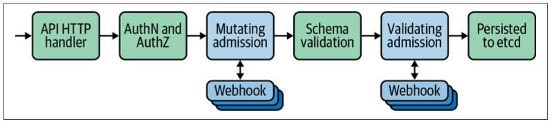

# Admission Control

Kubernetes API 서버에 대한 요청의 유효성을 검사하고, 변경하는 역할

예를 들어, 아래와 같은 작업을 할 수 있다.
- 현재 삭제 중인 네임스페이스에서 새 개체를 만들 수 없게 한다.
- 네임스페이스의 모든 파드가 사용하는 메모리의 총 합이 사용자 정의 한도를 초과하지 않는지 확인한다.
- 인그레스 규칙을 실수로 덮어쓰지 않도록 보장한다.
- 모든 파드에 사이드카 컨테이너를 추가한다.

위 사용사례를 보면 알 수 있듯 Admission Controller를 통해
- 사용자의 요청을 가로채고 특정 룰을 두어 이를 제한하거나, 
- 원하는 목적에 맞게 요청 매니페스트를 변경할 수 있다.

## 쿠버네티스 어드미션 체인

쿠버네티스에서 Admission Control은 특정 Chain을 정해진 순서대로 동작한다.

  
이를 Kubernetes Admission Chain이라 하며, 위 사진과 같이 동작한다.

주의깊게 봐야하는 곳이 파란색 박스 부분이다.

Kubernetes API 서버로 들어 온 요청을 Webhook으로 보내 변경 또는 검증한다.
- 이 때 Webhook으로 보내는 서버(Admission Controller)는 built-in controller 서버거나, out-of-tree 서버일 수 있다.

**Mutating admission**
- 리소스 속성을 수정할 수 있는 구간
- 요청 매니페스트 속성들을 보고 원하는 목적에 따라 리소스 속성을 추가, 삭제 등 변경할 수 있다.
- 예를 들어, 특정 어노테이션이 붙은 파드에 대해서 볼륨을 추가하는 등의 작업을 할 수 있다.

**Validating admission**
- 스키마 유효성 검사 구간
- 요청 매니페스트가 정의된 스키마에 맞게 구성되었는지 확인한다. 필수 필드 등을 확인하는 과정이라고 보면 된다.
- 요청에 대해 수정하지 않고 허용/거부 만 할 수 있다는 점에서 Mutating admission과 다르다.

Mutating admission이 일어난 후 Validating admission이 일어난다.
- 이 순서는 생각해보면 이해하기 쉽다. 요청 매니페스트의 최종 수정단계는 Mutating admission이다. 이 이후에는 Kubernetes 내부에서 요청에 대한 변경은 없다 (변경요청을 통한 변경은 있겠지만).
- 즉, 마지막 변경상태이다보니 변경 이후에 이 요청서가 정말 올바른 구성상태인지 검증을 해야하는 것이다. 그래서 Mutating 이후에 Validating 해야 한다.

## Webhook

Admission controller는 Kuberentes API 서버로의 요청을 확인하고 검증하는 단계에 포함되어있다.
매우 중요한 단계다보니 도입 시 지연시간, 동작방식을 고려해야 한다.
Admission Controller는 HTTPS를 통해 호출하는 것만 지원되는데, 만약 지연시간이 길어지면 그만큼 믈러스터 요청 수용동작도 느려지게 된다.
고로, Controller가 최대한 효율적으로 작동하고 빠르게 응답을 반환할 수 있도록 구현해야만 한다.

Webhook 수신서버는 정해진 특정 요청을 받고, 정해진 특정 응답만 할 수 있으면 된다.
그러므로 모든 언어로 작성할 수 있다는 장점이 있다.

앞서 말한 특정 요청/응답 스키마는 `AdmissionReview`로 [여기를 참조](https://github.com/kubernetes/kubernetes/blob/master/pkg/apis/admission/types.go#L29-L147)하면 스펙을 알 수 있다.

