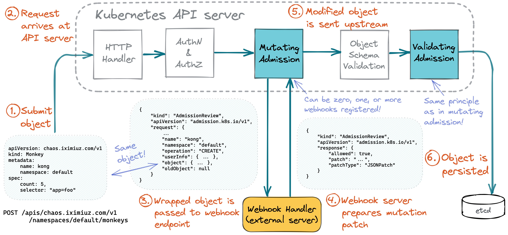

> [!NOTE]
> 책 내용 + 기타 레퍼런스를 보완한 요약본입니다.

# Chapter 8] 어드미션 컨트롤

## Overview

Admission Control은 etcd에 오브젝트가 저장되기 전 API Server에 대한 요청의 유효성을 검사하고 변경하는 것과 관련된다. 아래와 같은 Use-case가 있다.

- 현재 삭제 중인 네임스페이스(종료 상태)에 새 오브젝트를 생성할 수 없도록 적용
- 새 Pod가 Root 사용자로 실행하지 않도록 강제 적용
- 네임스페이스의 모든 Pod가 사용하는 메모리 총합이 사용자 정의 제한을 초과하지 않는지 확인
- Ingress 규칙을 실수로 덮어쓰지 않도록
- 모든 Pod에 사이드카 컨테이너 추가

## Kubernetes Admission Chain



처음 요청이 API 서버에 도착하면 클라이언틑가 유효하고 구성된 RBAC 규칙에 따라 요청된 작업을 수행할 수 있도록 인증 및 권한이 부여된다.
그런 다음 요청은 Mutating Admission Controller를 통과한다. 이 단계에서 리소스는 경우에 따라 컨트롤러에 의해 수정될 수 있다. 이후 생성되는 오브젝트가 정의된 스키마에 따라 유효한지 검사를 거치며, etcd에 저장되기 전 마지막 단계로 Validating Admission Controller를 통과한다. 이 단계에서는 요청이 허가 혹은 거부된다.

## Webhook

Admission Webhook은 HTTP Callback으로 구현된다. 이는 API 서버가 요청을 받아들이기 전에 호출되는 외부 프로세스이다. 이는 Mutating Admission Controller와 Validating Admission Controller를 구현하는 데 사용된다.

### AdmissionReview

API 서버와 Webhook 서버 간 교환되는 요청 및 응답 메시지의 스키마를 저수준 리소스로 정의한 것이다. 교환되는 데이터는 JSON으로 표현된다.

#### Input

```json
{
  "kind": "AdmissionReview",
  "apiVersion": "admission.k8s.io/v1beta1",
  "request": {
    "kind": {
      "group": "",
      "version": "v1",
      "kind": "Pod"
    },
    "resource": {
      "group": "",
      "version": "v1",
      "resource": "pods"
    },
    "namespace": "default",
    "operation": "CREATE",
    "userInfo": {
      "username": "system:serviceaccount:default:default",
      "uid": "439dea65-3e4e-4fa8-b5f8-8fdc4bc7cf53",
      "groups": [
        "system:serviceaccounts",
        "system:serviceaccounts:default",
        "system:authenticated"
      ]
    },
    "object": {
      "apiVersion": "v1",
      "kind": "Pod",
      "metadata": {
        "creationTimestamp": "2019-08-13T16:01:54Z",
        "generateName": "nginx-7bb7cd8db5-",
        "name": "nginx-7bb7cd8db5-dbplk",
        "namespace": "default",
      },
      "spec": {
        "containers": [
          {
            "image": "nginx",
            "imagePullPolicy": "Always",
            "name": "nginx",
          }
        ]
      },
      "status": {
        "phase": "Pending",
        "qosClass": "BestEffort"
      }
    },
    "oldObject": null
  }
}
```

- `request` : 사용자 요청 전체 스팩
  - `kind` - 요청한 리소스의 종류
  - `operation` - 요청된 작업의 종류
  - `userInfo` - 요청을 보낸 사용자에 대한 정보
  - `object` - 실제 리소스 스펙
  - `oldObject` - 리소스 변경이 발생하는 경우 이전 리소스 스펙

#### Output (Mutating Admission)

```json
{
  "apiVersion": "admission.k8s.io/v1",
  "kind": "AdmissionReview",
  "response": {
    "allowed": true,
    "patchType": "JSONPatch",
    "patch": "W3tvcDogYWRkLCBwYXRoOiAvbWV0YWRhdGEvYW5ub3RhdGlvbnMvZm9vLCB2YWx1ZTogYmFyfV0="
  }
}
```

#### Output (Validating Admission)

```json
{
  "apiVersion": "admission.k8s.io/v1",
  "kind": "AdmissionReview",
  "response": {
    "allowed": true,
  }
}
```

### Webhook Admission Controller 설정

Webhook 구성은 `MutatingWebhookConfiguration` / `ValidatingWebhookConfiguration` 리소스를 사용해 설정한다.

```yaml
apiVersion: admissionregistration.k8s.io/v1
kind: MutatingWebhookConfiguration
metadata:
  name: mutating-webhook-configuration
webhooks:
- name: mutating.example.com
  clientConfig:
    service:
      name: webhook-service
      namespace: default
      path: "/mutate"
    caBundle: "LS0tLS1CRUdJTiBDRVJUSUZJQ0FURS0tLS0tCk1JSURFakNDQWUyZ0F3SUJBZ0lCQVRBTkJna3Foa2lHOXcwQkFRc0ZBREFWTVJNd0VRWURWUVFHRXdKRWFqQkIKUWtFPQotLS0tLUVORCBDRVJU
SUZJQ0FURS0tLS0tCg=="
  rules:
  - operations: ["CREATE", "UPDATE"]
    apiGroups: [""]
    apiVersions: ["v1"]
    resources: ["pods"]
    scope: "Namespaced"
  admissionReviewVersions: ["v1", "v1beta1"]
  sideEffects: None
  timeoutSeconds: 5
  reinvocationPolicy: Never
  failurePolicy: Fail
```

```yaml
apiVersion: admissionregistration.k8s.io/v1
kind: ValidatingWebhookConfiguration
metadata:
  name: validating-webhook-configuration
webhooks:
- name: validating.example.com
  clientConfig:
    service:
      name: webhook-service
      namespace: default
      path: "/validate"
    caBundle: "LS0tLS1CRUdJTiBDRVJUSUZJQ0FURS0tLS0tCk1JSURFakNDQWUyZ0F3SUJBZ0lCQVRBTkJna3Foa2lHOXcwQkFRc0ZBREFWTVJNd0VRWURWUVFHRXdKRWFqQkIKUWtFPQotLS0tLUVORCBDRVJU
SUZJQ0FURS0tLS0tCg=="
  rules:
  - operations: ["CREATE", "UPDATE"]
    apiGroups: [""]
    apiVersions: ["v1"]
    resources: ["pods"]
```

### Webhook 디자인 고려사항

- 실패 모드
  - 연결 실패되거나 알 수 없는 응답을 API 서버로 다시 보내면 실패한 것으로 처리된다. 관리자는 정책 필드를 무시 또는 실패로 설정해 이 상황에서 실패 열림 또는 닫힘 여부를 선택해야 한다.
- 순서
  - 웹훅 실행은 여러번 실행 가능하며 순서 보장이 되지 않기 때문에 멱등성을 고려해서 설계해야 한다.
- 성능
  - 웹훅이 리소스 집약적이거나 외부 종속성이 있으면 훅이 호출되는 빈도와 주요 경로에 기능을 추가할 때 성능에 미치는 영향을 고려해야 한다.
- 부작용
  - 일부 웹훅은 K8s API에 대한 요청에 따라 외부 리소스를 수정하는 역할을 할 수 있는데, 웹훅은 `AdmissionReview`의 `dryRun` 옵션을 인식하고 활성화(`true`)될 때 외부 상태 수정을 건너뛴다.

  ```yaml
  apiVersion: admissionregistration.k8s.io/v1
  kind: ValidatingWebhookConfiguration
  webhooks:
    - name: my-webhook.example.com
      sideEffects: NoneOnDryRun
  ```

## 중앙 집중식 정책 시스템

정책 논리를 한 곳으로 중앙집중화하고 표준화된 언어를 사용해 허용/거부 규칙을 표현하는 모델. 아래와 같이 두 가지 주요 이점을 가진다.

- 특정 정책 언어로 규칙을 표현하므로 Admission Controller 구현을 위한 프로그래밍 지식이 필요없다. 정책 규칙은 또한 로직 변경마다 컨트롤러를 재빌드하고 재배포할 필요가 없다.
- 정책 및 규칙은 보기, 편집 및 감사 목적으로 단일 위치에 저장된다. (대부분은 클러스터 자체)

모델은 여러 오픈소스로 구축/구현되고 있으며 일반적으로 다음 두 가지 컴포넌트로 구성된다.

- 오브젝트가 허용 또는 거부되어야 하는지 여부에 대한 조건을 표헌할 수 있는 정책/쿼리 언어
- Admission Controller 역할을 하는 클러스터 내 컨트롤러 - 컨트롤러 역할은 API 서버로 들어오는 오브젝트에 대한 정책/규칙을 평가하고 승인/거부 결정을 내리는 것이다.

[OPA Gatekeeper](https://github.com/open-policy-agent/gatekeeper), [Kyverno](https://github.com/kyverno/kyverno)가 해당된다.