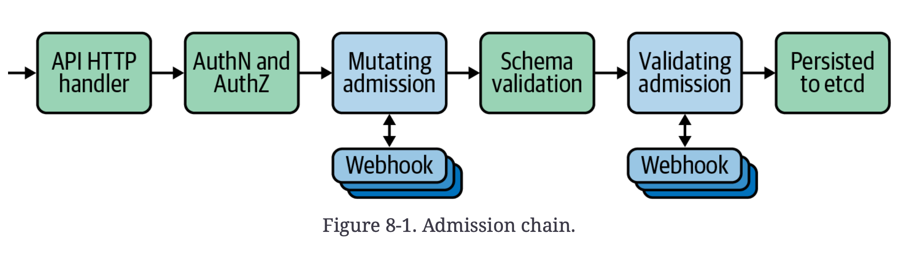

# Chapter 8. Admission Control

> 직역하면 입장(인입) 제어로 K8S api server로 들어온 요청에 대해 validation & mutation을 수행한다.

- Validation 예시
  - terminating state에 있는 Namespace에 object가 생성되지 않도록 한다.
  - pod들이 root user로 실행되지 않도록 한다.
  - ...
- Mutation 예시
  - sidecar container를 모든 pod에 붙인다. (e.g. Istio, linkerd...)


## The K8S Admission Chain



1. API server로 진입

2.  **Auth**e**N**tication, **Auth**ori**Z**ation 진행

   - AuthN: 유효한 client인지 확인
   - AuthZ: RBAC rule에 따라 허용된 action인지 확인

3. mutating admission 수행

   - 주체는 in-tree controllers 또는 out-of-tree mutating webhooks가 될 수 있음

   - 예시 (Service Account Controller)

     in-tree(built-in) controller인 Service Account Controller로 예시를 설명한다.

     1. controller에서 Pod의 spec이 serviceAccount field를 갖고 있는지 확인하고

        없을 경우 `default` SA로 세팅

     2. Pod의 Service Account token에 접근하기 위해 `ImagePullSecrets`와 Volume을 더해준다.

4. 정의된 schema에 맞게 요청되었는지 확인 (따라서 mutating admission 이후 수행되어야 한다.)

   - 필수 field들이 있는지

5. validating admission 수행

   - 주체는 in-tree controllers 또는 out-of-tree validating webhooks가 될 수 있음

   - 표준화된 schema가 아니라 operational logic에 대한 validation이라는 점에서 전에 수행된 **schema validation**과 다르다.

   - 예시 (`NamespaceLifecycle` controller)

     - 삭제된 namespace에 대한 object 생성을 막는다.

   - 최종적으로 etcd에 저장되려면 **모든** validating admission controller를 통과해야 하고,

     단 하나라도 통과못하면 거부된다.


## In-tree Admission Controllers

k8s에서는 다양한 API server flag들을 통해 admission controller들의 사용여부를 결정했는데,

이는 해당 flag들에 대한 접근이 없는 cloud-managed k8s platform을 사용할 경우 문제가 되었다.

- PodSecurityPolicy (PSP)가 이러한 예시로 나오지만 이는 v1.25에서 제거됨
  - Pod Security Admission(기본으로 활성화되어 있음) 또는 plugin을 대신 사용

위 문제에 대한 대안으로 mutating & validating webhook이 나온다.

PSP처럼 built-in admission controller들을 외부에 위임하는 형태가 트랜드가 되고 있다.


## Webhooks

**주의점**

1. out of tree이며 HTTPS로 호출되기 때문에 latency를 고려해야 한다.
2. 기능적인 범위가 넓을 수 있기 때문에(실수할 경우 치명적일 수 있음), 사용할 때 주의해야한다.

**webhook이란**

- special type of admission controller 
- K8S API server가 외부 webhook endpoint와 통신하도록 한다.
  - HTTPS만 사용 가능하다면 다양한 언어, framework를 사용할 수 있다. 어떤 로직이든 추가할 수 있다.
  - 필요에 따라 cluster 내부 또는 외부에서 실행될 수 있다.
  - policy decision을 위해 외부 system & datastore들을 호출할 수 있다.


webhook이 동작하기 위해 `AdmissionReview` 객체가 정의되어야 하고, 

이 객체는 요청에 대한 정보를 담고 있는 JSON payload이다

- API version, group & kind
- metadata (Namespace, unique ID, etc.)
- Operation (e.g. CREATE)
- 요청자 정보
- dry run 여부
- 실제 resource


이에 따른 응답으로 `AdmissionReview` 의 `response` 필드에 아래 정보들이 담기게 된다.

- request metadata에 있는 unique ID
- request 허가 여부
- 사용자 정의된 eror status, message


Validating webhook은 오직 validating만 수행한다.


Mutating webhook은 mutating을 수행하기 때문에 응답에 patch set이 포함될 수 있다.

- base64-encoded string
- API server에 들어가기 전에 반영되어야 하는 change가 들어있는 [JSONPatch](https://jsonpatch.com/) structure
- 예시 (sidecar proxy injection)
  - service mesh에서 Pod spec.에 sidecar container(data plane)를 추가하는 변경을 수행하는 admission controller를 실행한다.
  - 위 동작을 기본적으로 수행하지만, namespace나 pod level의 annotation으로 override할 수 있다.
- **단점**
  - end user에게는 보이지 않는 동작이 발생해서, 혼동을 줄 수 있다.


### Configuring webhook admission controllers

`MutatingWebhookConfiguration` , `ValidatingWebhookConfiguration`

MutatingWebhookConfiguration 예시

```yaml
apiVersion: admissionregistration.k8s.io/v1
kind: MutatingWebhookConfiguration
metadata:
	name: "test-mutating-hook"
webhooks:
- name: "test-mutating-hook"
  rules:
  - apiGroups: [""]
    apiVersions: ["v1"]
    operations: ["CREATE"] # trigger
    resources: ["pods"] # target
    scope: "Namespaced" # namespace-scoped or cluster-scoped
  clientConfig:
    service:
      namespace: test-ns
      name: test-service
      path: /test-path
      port: 8443
    # PEM: webhook server certificate에 사용하는 CA bundle encoding
    caBundle: "Ci0tLS0tQk...tLS0K" 
  admissionReviewVersions: ["v1", "v1beta1"]
  sideEffects: "None"
  timeoutSeconds: "5"
  reinvocationPolicy: "IfNeeded"
  failurePolicy: "Fail"
```

- namespace or obejct selector 사용 가능


### Webhook Design Considerations

**Failure modes**

- webhook이 unreachable이거나 알수 없는 response를 보낼경우
- `failurePolicy`를 `Ignore` (통과처리) 또는 `Fail`(거부처리)로 설정한다.

- critical 여부를 고려해서 결정

**ordering**

- Admission chain 순서에 따라 mutating이 무조건 validating보다 우선한다.
  - validating은 항상 최종 version의 resource를 볼 수 있도록
- mutating webhook 끼리는 순서가 보장되지 않고, 심지어 한번만 호출된다는 보장도 없다.
  - `reinvocationPolicy`로 재호출은 제어할 수 있다.
  - 하지만 이상적으로는 idempotent하고 ordering에 영향받지 않도록 구현되어야 한다.

**performance**

- webhook은 API server로 향하는 중요한 부분에 있다.

- webhook이 critical하고, failurePolicy가 `Fail` 일 경우 고가용성이 중요해진다.

  Bottleneck-As-A-Service가 되지 않도록 주의해야 한다. 

  resource가 중요하고 외부 의존성이 있는 hook일 경우 얼마나 호출될지, performance impact는 어느정도 되는지에 대한 고려가 필요해진다.

**side effects**

- cloud provider resource와 같은 외부 resource를 변경하는 webhook들도 있다.

  이러한 경우 dryRun일 경우 외부 resource에 대한 변경이 가해지지 않도록 해야 한다.

  `sideEffects` field를 사용하면 됨


### Mutating Webhooks

##### Plain HTTPS Handler

TLS-enabled HTTP handling과 JSON parsing만 가능하다면 어떤 언어든 사용할 수 있다.

최대의 유연성을 갖고 있지만, 그만큼 domain 지식을 요구하고, 구현과 유지보수가 복잡하다.

##### Controller Runtime

controller 구현시 사용할 수 있는 Go library set

##### Centralized Policy Systems

- admission controller 생성에 programming 지식이 필요하지 않다.

  지정된 policy language로 rule들을 표현하면 됨

- Policy와 rule들이 단일 위치(대부분 cluster 내)에 저장된다.

- e.g. **Gatekeeper**(built on a OPA(Open Policy Agent)), Kyverno...