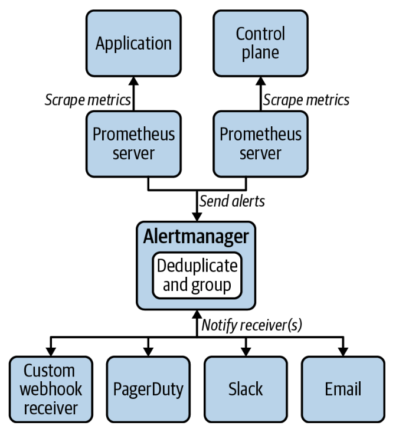

# 관찰 가능성 ( Observability )


**핵심 컴포넌트는 3가지**

1. 로깅: 프로그램으로 기록된 이벤트 메시지
2. 메트릭: 상태를 나타내는 시계열 데이터
3. 트레이싱: 여러 개의 워크로드 간 요청 연결관계 데이터

# 로깅

## 로깅 동작 방식

쿠버네티스 플랫폼에서는 로깅을 어떤 식으로 해야할까?

컨테이너화 된 세계에서 애플리케이션은 표준 출력 및 표준 오류로 로깅한다.

<br/>

과거에는 운영환경에서 디스크에 직접 로그를 기록했다. 인스턴스가 적었던 시절이었기에 로그를 확인하는데 어려움이 적었다.
지금은 아니다. 인스턴스는 동적으로 변하고, 엄청나게 많은 인스턴스가 존재하는 상황이 온다.

그렇기에 로그를 집계하는 중앙화 된 시스템(중앙 집중식 로그 집계)이 필요해졌고, 현재에 와서는 기본적으로 많이 사용한다.

<br/>

## 컨테이너 로그 처리

3가지 방식이 있다.
- 애플리케이션 포워딩: 애플리케이션에서 직접 백엔드로 로그를 보내는 방식
- 사이드카 처리: 사이드카를 이용해 애플리케이션 로그를 백엔드로 보내는 방식
- 노드 에이전트 이용: 각 노드에서 해당 노드의 모든 컨테이너 로그를 백엔드로 보내는 방식

<br/>

정답은 없고, 현재 프로젝트 상황 및 특성을 이해한 뒤 골라 사용하면 된다.

<br/>

### 애플리케이션 포워딩

직접 애플리케이션에서 백엔드로 로그를 보내다보니 애플리케이션 로직 내 로그를 백엔드로 보내는 기능(코드 및 Library/SDK)이 포함되어야 한다.

로그 백엔드가 변경되면 애플리케이션 업데이트가 필요하며, 직접 의존하게 됨으로서 변경에 민감하다.

<br/>

위 문제도 있고, 쿠버네티스를 이용 중인 환경에서는 다른 더 좋은 옵션들이 많기에 별로 좋은 옵션은 아니다.


<br/>

### 사이드카 처리

애플리케이션이 파일에 로그를 작성하면, 다른 컨테이너인 사이드카가 해당 로그를 읽고 작업을 수행한다.

사이드카가 수행하는 작업은 2가지로 이야기할 수 있다.
1. 로그 스토리지 백엔드로 직접 전달
2. 표준 에러 및  표준 출력 로그를 기록

<br/>

두 번째 방법은 아래에서 설명할 노드 에이전트 이용 방식과 결합해 사용된다.
플랫폼에서 기본적으로 로그 집계 시스템을 제공한다면 첫 번째 방법을 사용할 필요가 없다.

애플리케이션 자체에서 표준 출력 및 표준 에러를 쓰고 있다면 사이드카 처리 방식도 필요가 없다.


<br/>

### 노드 에이전트 이용

클러스터의 각 노드에서 로그 처리 워크로드(데몬셋 등)가 실행되고, 컨테이너 런타임에서 작성한 각 컨테이너의 로그 파일을 읽고, 이를 백엔드 서비스/스토리지로 전달한다.

일반적으로 가장 권장하는 모델이며 다음과 같은 이유로 유용하다고 평가 됨
- 사이드카를 이용하면 여러 컨테이너를 관리해야 하는데, 노드 에이전트 방식은 로그를 처리하는 단일 지점으로 관리가 용이
- 표준화된 필터링 구성, 메타데이터 첨부 등 백엔드 전달이 중앙 집중화 됨
- Log rotate를 달리 구현하지 않아도 kubelet/Container runtime 단에서 처리 됨

<br/>

많이 이용하는 구현체로는 fleuntd, fluentbit가 존재

  

<br/>

## 쿠버네티스 Audit log

쿠버네티스 클러스터에서 누가, 무엇을 했는지 이슈 추적용으로 Audit Log를 이용할 수 있다.
무언가 잘못됬을 때 원인 분석을 하기 위한 용도로 운영환경에서는 이 기능을 활성화 한다.


```yaml
apiVersion: audit.k8s.io/v1 # 필수사항임.
kind: Policy
# Request Received 단계의 모든 요청에 대해 감사 이벤트를 생성하지 않음.
omitStages:
  - "RequestReceived"
rules:
  # RequestResponse 수준에서 파드 변경 사항 기록
  - level: RequestResponse
    resources:
    - group: ""
      # 리소스 "파드" 가 RBAC 정책과 부합하는 파드의 하위 리소스에 대한
      # 요청과 일치하지 않음.
      resources: ["pods"]
  # 메타데이터 수준에서 "pods/log", "pods/status"를 기록함.
  - level: Metadata
    resources:
    - group: ""
      resources: ["pods/log", "pods/status"]

  # "controller-leader" 라는 컨피그맵에 요청을 기록하지 않음."
  - level: None
    resources:
    - group: ""
      resources: ["configmaps"]
      resourceNames: ["controller-leader"]

  # 엔드포인트 또는 서비스의 "system:kube-proxy"에 의한 감시 요청 기록하지 않음.
  - level: None
    users: ["system:kube-proxy"]
    verbs: ["watch"]
    resources:
    - group: "" # 핵심 API 그룹
      resources: ["endpoints", "services"]

  # 인증된 요청을 특정 리소스가 아닌 URL 경로에 기록하지 않음.
  - level: None
    userGroups: ["system:authenticated"]
    nonResourceURLs:
    - "/api*" # 와일드카드 매칭(wildcard matching).
    - "/version"

  # kube-system에 컨피그맵 변경 사항의 요청 본문을 기록함.
  - level: Request
    resources:
    - group: "" # 핵심 API 그룹
      resources: ["configmaps"]
    # 이 정책은 "kube-system" 네임스페이스의 리소스에만 적용됨.
    # 빈 문자열 "" 은 네임스페이스가 없는 리소스를 선택하는데 사용할 수 있음.
    namespaces: ["kube-system"]

  # 메타데이터 수준에서 다른 모든 네임스페이스의 컨피그맵과 시크릿 변경 사항을 기록함.
  - level: Metadata
    resources:
    - group: "" # 핵심 API 그룹
      resources: ["secrets", "configmaps"]

  # 요청 수준에서 코어 및 확장에 있는 다른 모든 리소스를 기록함.
  - level: Request
    resources:
    - group: "" # 핵심 API 그룹
    - group: "extensions" # 그룹의 버전을 기재하면 안 된다.

  # 메타데이터 수준에서 다른 모든 요청을 기록하기 위한 모든 수집 정책.
  - level: Metadata
    # 이 정책에 해당하는 감시자와 같은 장기 실행 요청은
    # RequestReceived에서 감사 이벤트를 생성하지 않음.
    omitStages:
      - "RequestReceived"

```

이렇게 Audit 로그 활성화를 하면, 2가지 방식으로 로그를 남길 수 있다.
1. 파일 로깅
  - 이벤트를 JSONlines 형식으로 파일에 기록

2. 웹훅
  - 원격 웹 API로 감사 이벤트를 전송하는데, 이는 인증 수단을 포함하여 쿠버네티스 API의 한 형태로 간주

<br/>

## 쿠버네티스 이벤트

https://binux.tistory.com/95

이벤트를 영속화 하는 방법은 다양하다. 여러 오픈소스 툴들도 많다.
책에서는 Kubernetes event exporter (prometheus)를 이야기한다.


<br/>

# 메트릭

메트릭은 애플리케이션에 무슨 일이 일어나고 있는지 이해하는데 도움을 주고, 애플리케이션이 예상대로 작동하는지 알려주며, 문제를 해결하거나 워크로드 관리 방법을 개선할 수 있는 방법에 통찰력을 제공한다.

메트릭 수집을 위해서 [Prometheus](https://prometheus.io/)를 이용한다. 보통 어떤 목적을 이루기 위해 사용하는 소프트웨어에는 정답이 없다고 하지만, 메트릭에 대해서는 Prometheus가 정답이다 (현재로선).

<br/>

## Prometheus

오픈소스 메트릭 모니터링 툴
- 다양한 Exporter를 이용하거나 메트릭 엔드포인트를 스크래핑 하는 방식을 통해 메트릭 데이터를 수집 및 저장함
- PromQL이라는 Prometheus Query 언어를 이용하여 의미있는 정보를 쉽게 추출하고 활용할 수 있음

<br/>

## 장기 보관

Prometheus는 메트릭을 장기간 보관하도록 설계되지 않았다.
장기보관의 여러 문제를 해결하는데 Thanos, Cortex 같은 프로젝트를 이용해볼 수 있다.
무조건 적으로 도입하기보단 테넌트가 이런 시스템을 어떻게 활용하는지를 보고 보존 정책을 잡아야 한다.


<br/>

## Push metrics

모든 워크로드에 대해 스크래핑 모델이 적합한 것은 아니다.
작업이 완료되면 종료되는 Batch 워크로드는 Prometheus가 메트릭을 수집하기 이전에 종료될 수 있다.

이럴 땐 Push Gateway를 이용할 수 있다.

  

워크로드가 메트릭을 Push Gateway에 푸시하면, Push Gateway는 Prometheus 서버가 스크래핑할 수 있도록 메트릭을 노출시켜 준다.


<br/>

## 조직 및 페더레이션

메트릭 처리는 컴퓨팅 자원을 많이 이용한다.
그렇기에 계산 부하를 세분화하면 Prometheus 서버 자원 소비를 관리하는데 도움이 될 수 있다.

예를 들어, 하나의 Prometheus 서버를 사용해 플랫폼의 메트릭을 수집하고, 다른 Prometheus 서버를 사용해 애플리케이션이나 노드 메트릭에서 사용자 정의 메트릭을 수집한다. 처리할 메트릭이 많은 대규모 클러스터에선 이러한 방법을 이용한다.

이렇게 Prometheus 서버로 다른 Prometheus 서버에서 저장하는 시계열을 스크랩하는 기능을 [Federation](https://prometheus.io/docs/prometheus/latest/federation/)이라고 한다.

  


직접 구축하긴 어려우니 이러한 기능을 확장해 제공하는 오픈소스 프로젝트들이 있다.
- Thanos
- Victoria Metrics
- Cortex


<br/>

## Alerts

당연히 메트릭에 따른 위험 수준을 알 수 있도록 Alert Manager 컴포넌트를 통해 Alert 기능을 제공한다.


  

운영에 있어서는 Alert 정보를 잘 구분해놓고, Alert 마다 어떠한 행동을 해야하는지, 문제 파악에 도움이 될 수 있는 런북 (RunBook)을 구성해놓는 것이 좋다.

<br/>

### 데드맨 스위치

Alert Manager가 죽어버리면 어떻게 될까?
당연히 메트릭 이슈가 있음에도 알림이 오지 않게 된다.

이러한 문제를 해결하기 위해 Alert 기능이 중지되는 경우, ciritical alert를 발생시켜 메트릭 및 alert 시스템이 다운됬음을 알려야 한다.
Pagerduty에서 해당 기능을 제공하는 데드맨 스위치 통합 기능이 있다.


<br/>

## 메트릭 컴포넌트

Prometheus 오퍼레이터를 이용하여 일반적으로 사용되는 Prometheus metric stack component들을 다음과 같다.

  

<br/>

### ServiceMonitor

`ServiceMonitor` 리소스를 생성하면, Prometheus 오퍼레이터는 관련 Prometheus 서버 스크래핑 구성을 업데이트해 응답한다.

```yaml
apiVersion: monitoring.coreos.com/v1
kind: ServiceMonitor
metadata:
  annotations:
    meta.helm.sh/release-name: prometheus
    meta.helm.sh/release-namespace: prometheus
  labels:
    app: kube-prometheus-stack-alertmanager
    app.kubernetes.io/managed-by: Helm
    chart: kube-prometheus-stack-14.3.0
    heritage: Helm
    release: prometheus
  name: prometheus-kube-prometheus-alertmanager
  namespace: prometheus
spec:
  endpoints:
  - path: /metrics
    port: web
  namespaceSelector:
    matchNames:
    - prometheus
  selector:
    matchLabels:
      app: kube-prometheus-stack-alertmanager
      release: prometheus
      self-monitor: "true"
```

<br/>

### PrometheusRule

`PrometheusRule` 리소스를 통해 레코드 규칙과 경보 규칙을 설정할 수 있다.

```yaml
apiVersion: monitoring.coreos.com/v1
kind: PrometheusRule
metadata:
  labels:
    app.kubernetes.io/component: prometheus
    app.kubernetes.io/instance: k8s
    app.kubernetes.io/name: prometheus
    app.kubernetes.io/part-of: kube-prometheus
    app.kubernetes.io/version: 2.50.1
    prometheus: k8s
    role: alert-rules
  name: prometheus-k8s-prometheus-rules
  namespace: monitoring
spec:
  groups:
  - name: prometheus
    rules:
    - alert: PrometheusBadConfig
      annotations:
        description: Prometheus {{$labels.namespace}}/{{$labels.pod}} has failed to reload its configuration.
        runbook_url: https://runbooks.prometheus-operator.dev/runbooks/prometheus/prometheusbadconfig
        summary: Failed Prometheus configuration reload.
      expr: |
        # Without max_over_time, failed scrapes could create false negatives, see
        # https://www.robustperception.io/alerting-on-gauges-in-prometheus-2-0 for details.
        max_over_time(prometheus_config_last_reload_successful{job="prometheus-k8s",namespace="monitoring"}[5m]) == 0
      for: 10m
      labels:
        severity: critical
```

<br/>

### Prometheus Adapter

Prometheus Client 중 하나. 즉, Prometheus 내 메트릭 수집을 위한 컴포넌트가 아닌 이미 수집된 메트릭을 이용하는 Client이다.

Prometheus API에서 메트릭을 검색하고 쿠버네티스 메트릭 API로 사용할 수 있도록 지원한다. 

Adapter를 이용해 워크로드의 Auto-scaling 기능을 활성화 할 수 있다.


<br/>

# 분산 트레이싱

트레이싱
- 실행경로를 따르는 특수한 종류의 이벤트 캡처


로깅/메트릭과 트레이싱 간의 차이라고 하면 **애플리케이션과 플랫폼 간의 트레이싱 기술이 호환되어야 한다는 점**이다.
- 애플리케이션에서 이용하는 트레이싱 기술과 트레이싱 툴에서 준수하는 트레이싱 기술이 호환되지 않는다면 제대로 동작하지 않는다.
- 다시 말해, 애플리케이션 플랫폼에서 제공하는 트레이싱 시스템과 호환되지 않는 클라이언트 라이브러리로 계측되면 트레이싱이 전혀 작동하지 않는다.


<br/>

## 용어들

Telemetry
- 시스템의 동작에 대해 표현하는 데이터들을 의미합니다. 이러한 데이터는 Trace, Metric, Log, Span 같은 형태로 제공될 수 있습니다.

 
<br/>


Reliability
- '서비스가 사용자가 기대하는 것들을 제대로 100% 수행하고 있는가?'를 의미합니다.
- 예를 들어, 사용자가 검은색 바지에 대해 '장바구니에 추가'버튼을 눌렀다고 합시다. 근데 장바구니엔 담기지 않거나 다른 색상의 바지가 담겼다면, 이는 'Reliability하다' 또는 'Reliability 한 시스템'이라고 할 수 없습니다.

 
<br/>


Metric
- 인프라 또는 애플리케이션에 대한 일정 기간동안의 숫자 데이터의 집계(aggregations)를 의미합니다. 예를 들면, CPU 사용률, Memory 사용률, 시스템 오류율, 초당 시스템 요청율 등이 있습니다.

<br/>

Log
- 서비스 또는 구성 요소에서 출력하는 timestamp를 포함한 메시지를 의미합니다. Trace와 달리 특정 사용자의 요청이라던가, Transaction과 반드시 연관되어 있지는 않습니다. 왠만한 모든 애플리케이션에서 찾아볼 수 있으며, 개발자/운영자에게 시스템 동작을 이해하는데 도움을 줍니다.

<br/>

Span
- 작업, 작업의 단위를 의미합니다. 요청에 대한 작업을 추적해서 작업이 실행된 시간동안 발생한 일에 대해 정보를 가집니다.
- 이름, 시간 데이터, 구조화된 로그 메시지, 작업에 대한 메타데이터 등이 포함됩니다.

<br/>

Distributed Trace (Trace)
- Microservice와 같은 다중 서비스(Multi-service) 아키텍처를 통해 요청 작업이 이뤄질 때, 그 실행 경로를 기록 및 추적하는 것을 의미합니다.
- 분산 시스템에서는 이슈, 성능문제 원인 등을 찾아내기가 어렵기 때문에, Distributed trace는 필수적입니다. 복잡한 분산 시스템에서 애플리케이션/시스템의 가시성을 향상시키고, 디버그에 도움을 주어 시스템을 분석 및 이해하는데 도움을 줍니다.

  

- Trace는 하나 이상의 Span으로 구성됩니다. 첫 번째 Span(그림의 맨 위 막대)은 Root span을 의미하며, root span은 요청의 처음부터 끝까지를 의미합니다. 하위 span들은 root span 중 일어나는 경로들로 실행 경로들을 표현해서 심층적인 context를 제공합니다.


<br/>

## 오픈텔레메트리

분산 트레이싱 구현 표준에 수렴하기 위한 오픈소스 명세.

요즘엔 분산 트레이싱 뿐 아니라 관찰 가능성 모든 부분을 커버하고 있다.

  


<br/>

## 트레이싱 컴포넌트

잘 알려진 오픈소스 구현체로 Zipkin, Jaeger가 있다.

트레이싱을 플랫폼 단에서 지원하기 위한 전체적인 아키텍처는 다음과 같다.

  


