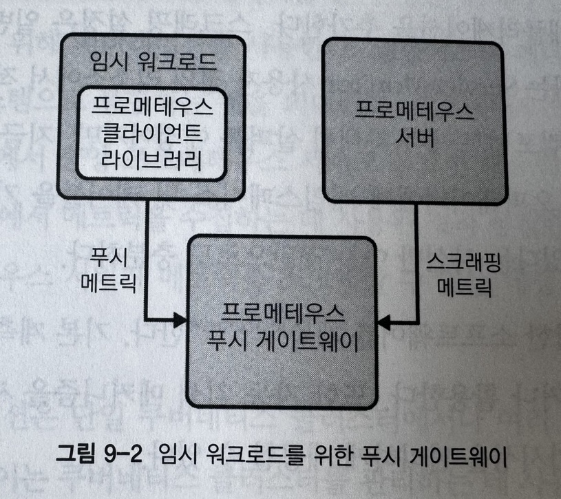

> [!NOTE]
> 책 내용 + 기타 레퍼런스를 보완한 요약본입니다.

# Chapter 9] 관찰 가능성

## Observability란?

> 실행 가능한 데이터를 수집하고, 시스템 내에서 진행되고 있는 작업들에 대해 무슨 일이 발생하고 있는지, 어디에서 발생하는지를 이해하고 답변할 수 있는 능력

## Observability의 세 컴포넌트

- Logging
    - 프로그램으로 기록된 이벤트 메시지를 집계하고 저장
- Metrics
    - 시계열 데이터를 수집해 대시보드에서 사용 가능하게 하고 경보를 보냄
- Traces
    - 클러스터에서 여러 개별 워크로드를 통과하는 요청 데이터 캡쳐

## Logging

전통적인 운영환경에서의 소프트웨어는 디스크의 파일에 로그를 기록하는 간단한 형태였으나, 클라우드 네이티브 환경에서는 워크로드의 각 인스턴스가 일시적이며 로그를 유지하기 위한 마운트된 디스크가 없을 때가 많아 로그 수집 / 집계 및 저장에 문제가 발생한다.


### 컨테이너 로그 처리

- 애플리케이션 포워딩
    - 애플리케이션에서 직접 백엔드로 로그를 보낸다.
        - 애플리케이션이 로그의 백엔드 스토리지와 통합되어야 한다.
        - 위 기능을 애플리케이션에 구축하여 해당 기능을 관리해야 한다.
        - 로그 백엔드 변경에 따른 업데이트가 필요하다.
    - 대부분의 상황에서 좋은 옵션은 아니다.
- 사이드카 처리
    - 사이드카를 사용해 애플리케이션의 로그를 관리한다.
    - 애플리케이션이 Pod의 공유 스토리지에 있는 하나 이상의 파일에 로그를 쓴다.
    - 사이드카 컨테이너가 해당 로그를 읽고 로그 스토리지 백엔드로 보내거나 혹은 `stdout` / `stderr` 로그를 기록한다.
    - `stdout` / `stderr`에 로그를 쓰지 못하는 애플리케이션 실행에만 유용하다.
    - 일반적으로 아래 노드 에이전트 전달 방식과 통합되어 사용된다.
- 노드 에이전트 전달
    - 각 노드에서 해당 노드의 모든 컨테이너의 로그를 백엔드로 전달하는 Pod를 실행한다.
    - 일반적으로 권장되는 모델로 다음과 같은 이유로 유용하다.
        - 서로 다른 사이드카 및 애플리케이션이 해당 통합을 유지해야 하는 것과는 달리 로그 포워더와 백엔드간 단일 통합 지점이 있다.
        - 표준화된 필터링 구성, 메타데이터 첨부 및 여러 백엔드로의 전달이 중앙 집중화된다.
        - 로그 순환이 kubelet 혹은 컨테이너 런타임에서 처리된다. 애플리케이션이 컨테이너 내부에 로그 파일을 작성할 때와 애플리케이션 자체 또는 사이드카로 적용하면 직접 로그 순환 처리를 해야 한다.
    - Fluentd, Fluentbit 등의 도구가 있다.
    - 로그 집계 중앙 집중화에 따른 잠재적 문제가 있다. (각 노드 혹은 클러스터에 대한 중앙 실패 지점으로 작용된다.)

### 쿠버네티스 감사 로그

클러스터에서 누가 무엇을 했는지 알아내는 방법을 제공한다. 쿠버네티스에서 제공하는 API를 사용해 운영 환경에서 활성화할 수 있다.

```yaml
apiVersion: audit.k8s.io/v1
kind: Policy
rules:
- level: None
  users: ["system:kube-proxy"]
  verbs: ["watch"]
  resources:
  - group: ""
    resources: ["endpoints", "services", "services/status"]
- level: Metadata
  resources:
  - group: ""
    resources: ["secrets", "configmaps"]
  - group: authentication.k8s.io
    resources: ["tokenreviews"]
  omitStages:
  - "RequestReceived"
- level: Request
  verbs: ["get", "list", "watch"]
  resources:
  - group: ""
  - group: "apps"
  - group: "batch"
  omitStages:
  - "RequestReceived"
- level: RequestResponse
  resources:
  - group: ""
  - group: "apps"
  - group: "batch"
  omitStages:
  - "RequestReceived"
- level: Metadata
  omitStages:
  - "RequestReceived"
```

### 쿠버네티스 이벤트

기본 리소스로, 플랫폼 컴포넌트가 쿠버네티스 API로 다른 오브젝트에 발생한 부분의 정보를 노출하는 방법. 다른 로그와 달리 일반적으로 로깅 백엔드에 저장되지 않고 `etcd`에 저장되며 기본적으로 1시간 동안 유지된다.

이벤트를 메트릭으로 노출하고자 한다면 Event Exporter를 사용할 수 있다.

## Metrics

측정된 데이터를 타임라인에 표시하고, 바람직하지 않거나 예기치 않은 동작을 나타내는 차이를 인식할 수 있다. 애플리케이션에 무슨 일이 일어나고 있는지 이해하는데 도움을 주고, 애플리케이션이 예상대로 동작하는지를 알려주며 문제를 해결하거나 워크로드 관리 방법을 개선할 수 있는 방법에 통찰력을 제공한다. 결정적으로 경보를 발생시킬 유용한 측정값을 제공한다. 장애 알림 혹은 임박한 장애 경보로 다운타임이나 에러를 방지 및 최소화할 수 있다.

### Prometheus

쿠버네티스 기반 플랫폼을 위한 일반적인 오픈소스 솔루션이 된 오픈소스 메트릭 도구. 대상에서 메트릭을 수집하는 스크래핑 모델을 사용하며 Exporter나 메트릭 엔드포인트, 혹은 `ServiceMonitor` 를 통해 메트릭을 수집한다.
PromQL이라고 하는 쿼리 언어를 통해 Prometheus 시계열 데이터를 검색할 수 있다.

- 스크래핑 모델을 사용해 대상에서 메트릭 수집
- 시계열 데이터베이스에 메트릭을 저장한다.
- 일반적으로 경보 규칙에 따라 Alertmanager로 경보를 보낸다.
- 다른 컴포넌트가 Prometheus로 저장된 메트릭에 액세스할 수 있도록 HTTP API를 노출한다.
- Ad-hoc 메트릭 쿼리를 실행하고 다양한 상태 정보를 얻는 데 유용한 대시보드를 제공한다.

메트릭 장기 보관을 해결하고, 메트릭 볼륨 증가함에 따라 Prometheus 확장 및 메트릭 시스템의 Federation 구성이 필요하다.

### 장기 보관

Prometheus 자체는 메트릭에 대한 장기 보관을 고려하지 않았다. 대신 원격 엔드포인트에 대한 쓰기 지원을 제공하며 이런 기능을 제공하는 플러그인과 통합해 사용할 수 있는 여러 솔루션을 도입할 수 있다.
Thanos 혹은 Cortex를 사용할 수 있다.

### Push Metrics



모든 워크로드가 스크래핑 모델에 적합하지 않기 때문에 Pushgateway 컴포넌트를 사용해 워크로드가 메트릭을 직접 Push할 수 있다. Pushgateway는 Prometheus 서버가 검색할 해당 메트릭을 노출한다.

### User-defined Metrics

많은 공식 클라이언트 라이브러리 혹은 커뮤니티 라이브러리를 사용하면 사용자가 직접 정의한 메트릭을 노출하는 것이 가능하다.

### 조직 및 페더레이션


메트릭 처리에 컴퓨팅 자원이 상당히 소모되기 때문에 이러한 부하를 분산시키면 Prometheus 서버의 자원 소비 관리에 도움이 된다. 예를 들면 한 서버는 플랫폼 메트릭 수집을, 다른 한 서버는 애플리케이션이나 노드 메트릭에서 사용자 정의 메트릭을 수집하는 경우이다. 다만 메트릭 계산 부하가 세분화되면 데이터를 볼 수 있는 위치가 단편화되기 때문에 이 때 사용할 수 있는 해결책이 Federation이다. 이는 데이터와 제어를 중앙 집중식 시스템으로 통합하는 것을 의미한다.
Prometheus Federation을 구현하는데 사용할 수 있는 오픈소스로 Thanos, Cortex가 있다.

### 경보


Prometheus는 경보 규칙으로 메트릭에서 경보를 생성한다. 경보가 트리거되면 경보가 구성된 Alertmanager 인스턴스로 전송되고 통합된 메세징 시스템에 전달되어 엔지니어가 문제를 알 수 있도록 한다.

### Showback / Chargeback

- Showback : 조직 단위 혹은 해당 워크로드의 리소스 사용량을 설명하는 데 사용
- Chargeback : 해당 리소스 사용량과 비용을 연결

합리적 리소스/비용 관리를 위해 메트릭에 레이블링을 강제하는 방법을 적용할 수 있다.

### 메트릭 컴포넌트


#### Prometheus Operator

- 쿠버네티스 메트릭 시스템의 다양한 컴포넌트를 배포하고 관리하는 Operator
- Prometheus 서버를 나타내는 몇가지 CRD를 사용한다.
    - 플랫폼 엔지니어와 테넌트에 매우 중요한 Custom Resource를 제공한다.

#### Prometheus Server

Operator를 통해 다음과 같이 Prometheus 서버를 정의할 수 있다.

```yaml
# Prometheus
apiVersion: monitoring.coreos.com/v1
kind: Prometheus
metadata:
  name: platform
  namespace: platform-monitoring
  labels:
    monitor: platform
    owner: platform-engineering
spec:
  alerting:
    alertmanagers:
    - name: alertmanager-main
      namespace: platform-monitoring
      port: web
  image: quay.io/prometheus/prometheus:v2.22.0
  nodeSelector:
    kubernetes.io/os: linux
  replicas: 2
  resources:
    requests:
      memory: 400Mi
  ruleSelector:
    matchLabels:
      monitor: platform
      role: alert-rules
  securityContext:
    fsGroup: 2000
    runAsNonRoot: true
    runAsUser: 1000
  serviceAccountName: platform-prometheus
  version: v2.22.0
  serviceMonitorSelector:
    matchLabels:
      monitor: platform
```

서버 정의와 별개로 서버의 스크래핑 구성은 아래의 `ServiceMonitor`를 통해 구성한다.

```yaml
# ServiceMonitor
apiVersion: monitoring.coreos.com/v1
kind: ServiceMonitor
metadata:
  labels:
    k8s-app: apiserver
    monitor: platform
  name: kube-apiserver
  namespace: platform-monitoring
spec:
  endpoints:
  - bearerTokenFile: /var/run/secrets/kubernetes.io/serviceaccount/token
    interval: 30s
    port: https
    scheme: https
    tlsConfig:
      caFile: /var/run/secrets/kubernetes.io/serviceaccount/ca.crt
      serverName: kubernetes
  jobLabel: component
  namespaceSelector:
    matchNames:
    - default
  selector:
    matchLabels:
      component: apiserver
      provider: kubernetes
```

메트릭 기록 및 메트릭 경보 규칙은 아래의 `PrometheusRule`로 구성한다.

```yaml
# PrometheusRule
apiVersion: monitoring.coreos.com/v1
kind: ServiceMonitor
metadata:
  labels:
    monitor: platform
    role: alert-rules
  name: sample-rules
  namespace: platform-monitoring
spec:
  groups:
  - name: kube-apiserver.rules
  rules:
  - expr: |
      sum by (code,resource) (rate(
        apiserver_request_total{job="apiserver",verb=~"LIST|GET"}[5m]
      ))
    labels:
      verb: read
    record: code_resource:apiserver_request_total:rate5m
  - name: kubernetes-apps
    rules:
    - alert: KubePodNotReady
      annotations:
        description: {{ $labels.namespace}}/{{ $labels.pod }} Pod가 15분 넘게 준비되지 않은 상태
        summary: Pod가 15분 넘게 준비되지 않은 상태
      expr: |
        sum by (namespace, pod) (
            max by (namespace, pod) (
                kube_pod_status_phase{job="kube-state-metrics", phase=~"Pending|Unknown"} ) *
                on(namespace, pod) group_left(owner_kind) topk by (namespace, pod) (
                    1, max by (namespace, pod, owner_kind) (kube_pod_owner{owner_kind!="Job"})
                )
        ) > 0
  for: 15m
  labels:
    severity: warning
```

#### Alertmanager

경보를 처리하고 대기 중인 엔지니어에 이를 알리는 역할 수행. Receiver로 이메일, 슬랙, Pageduty등을 사용할 수 있다.

```yaml
apiVersion: monitoring.coreos.com/v1
kind: Alertmanager
metadata:
  labels:
    alertmanager: main
  name: main
  namespace: platform-monitoring
spec:
  image: quay.io/prometheus/alertmanager:v0.21.0
  nodeSelector:
    kubernetes.io/os: linux
  replicas: 2
  securityContext:
    fsGroup: 2000
    runAsNonRoot: true
    runAsUser: 1000
  serviceAccountName: alertmanager-main
  version: v0.21.0
```

#### Grafana

- Prometheus 메트릭을 보기 위한 기본 솔루션인 오픈소스 레이어이다. 다양한 대시보드를 제공해 이를 Import하거나 혹은 필요에 따라 차트 및 대시보드를 직접 구성할 수 있다.
- 사용 사례에 맞게 조직, 팀 및 사용자를 구분해 구성할 수 있다.

#### Node Exporter

- 일반적으로 DaemonSet으로 실행되고 시스템 및 운영체제 메트릭을 수집하는 Node Agent이다.
- 호스트 수준 CPU, 메모리, 디스크 I/O, 디스크 공간, 네트워크 통계 및 파일 descriptor 정보를 제공한다. 커널에서 이러한 OS 관련 메트릭을 수집하고 Prometheus 에서 스크래핑할 수 있도록 제공한다.

#### kube-state-metrics

- 쿠버네티스 리소스 관련 메트릭을 제공한다. 본질적으로 K8s API에서 수집된 리소스의 정보를 제공하기 위한 Exporter 도구이다.
- CrashLoopBackoff Pod 혹은 리소스 할당량에 근접한 네임스페이스와 같은 중요한 클러스터 조건을 감지하는데 유용하다.

#### Prometheus Adapter

- Prometheus의 클라이언트로써 Prometheus API에서 메트릭을 검새갛고 쿠버네티스 메트릭 API로 사용할 수 있도록 지원한다. 이를 통해 워크로드 오토스케일링이 가능하도록 지원한다.

## Traces


여러 워크로드에 걸쳐 실행 경로를 따르는 특수한 이벤트 캡쳐.

Logging / Metrics와 Traces의 분명한 차이점은 애플리케이션과 플랫폼 간의 Tracing 기술의 호환성에 있다. Application이 `stdout` / `stderr`에 기록하는 한 로그를 집계하는 플랫폼 서비스는 앱에서 로그가 기록되는 방식을 신경쓰지 않고, CPU / 메모리 소비와 같은 일반적 메트릭은 특별한 계측 없이 워크로드에서 수집 가능하다. 반면 애플리케이션이 플랫폼에서 제공하는 트레이싱 시스템과 호환되지 않는 클라이언트 라이브러리로 계측되면 트레이싱이 작동되지 않는다.

### OpenTracing / OpenTelemetry

- OpenTracing
  - 생태계가 구현 표준에 수렴하도록 돕는 분산 트레이싱 오픈소스 명세.

  > 용어 정리
  > - Tracing : 분산 애플리케이션의 end-user가 요청하면 해당 요청은 요청을 처리하고 클라이언트 요청을 충족하는 데 참여하는 고유한 서비스를 통과한다. 트레이싱은 전체 트랜잭션을 나타내며 분석에 관심이 있는 엔티티이다. 트레이싱은 여러 범위로 구성된다.
  > - Span : 요청을 처리하는 각 고유 서비스의 범위를 의미한다.
  > - Tag : 트레이싱에서 Context화하고 검색 가능한 인덱스를 제공하기 위해 범위에 첨부된 메타데이터이다.

- OpenTelemetry
  - OpenTracing 및 OpenCensus와 병합된 프로젝트로 트레이싱 외에도 로깅 및 메트릭이 통합되어 관찰 가능성 전 범위를 커버한다.

### 트레이싱 컴포넌트

가장 유명한 구현체는 Jaeger과 Zipkin이다.

- Agent : 애플리케이션이 Span을 보낼 수 있는 서버 역할
- Collector : Span을 처리하고 백엔드 DB에 저장. 스토리지 저장 전 유효성 검사와 인덱싱 및 변환도 수행함.
- Storage
- API
- User Interface