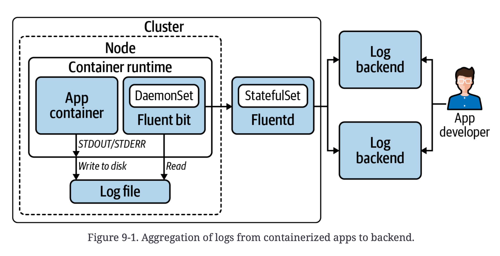
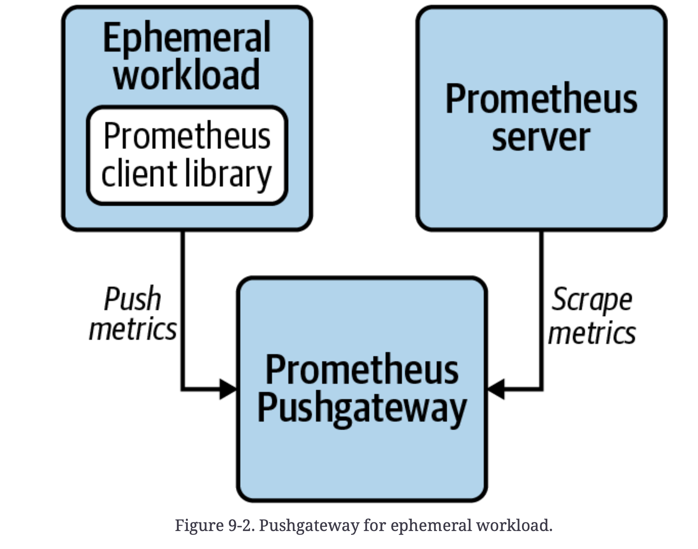
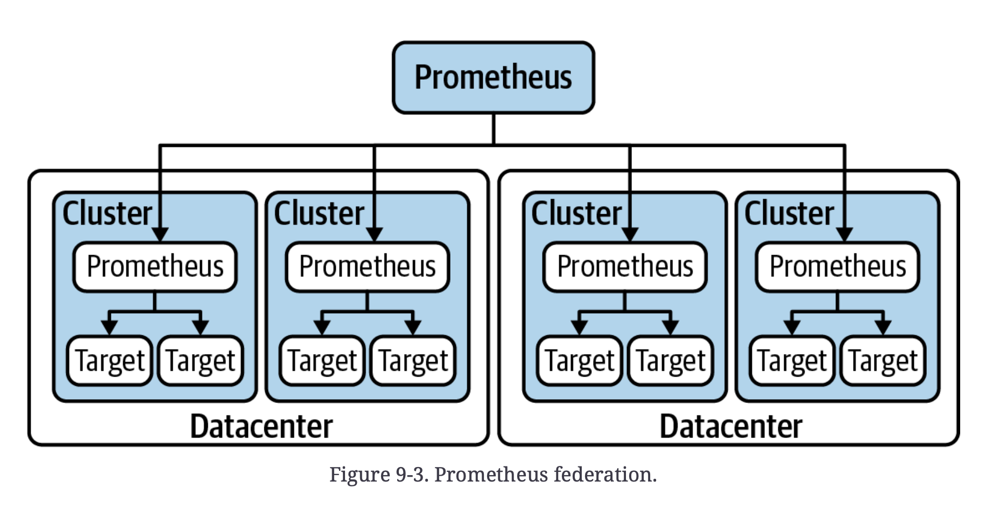
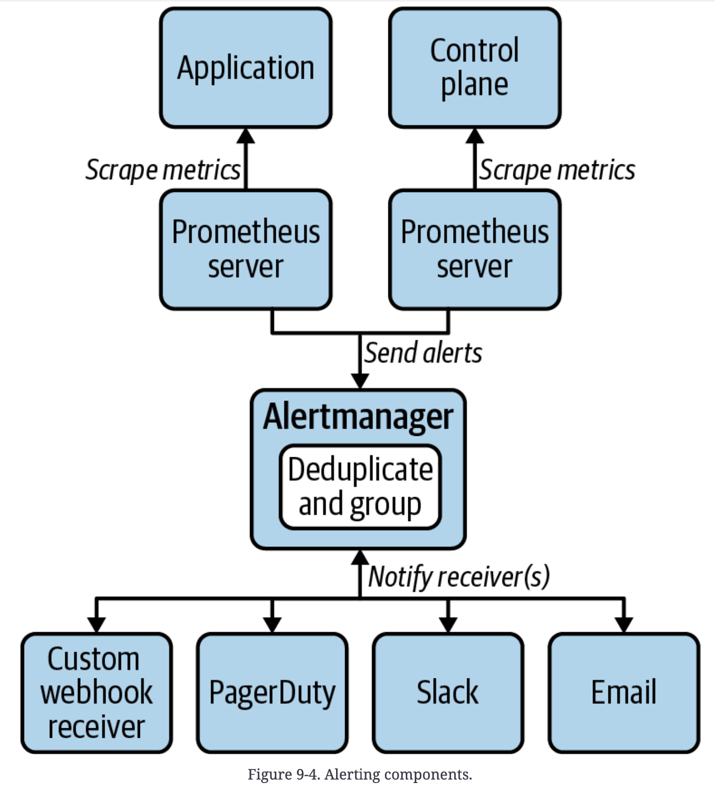
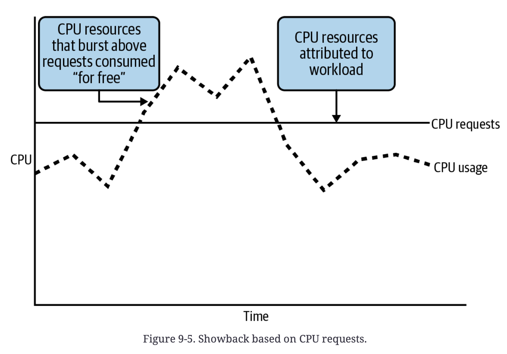
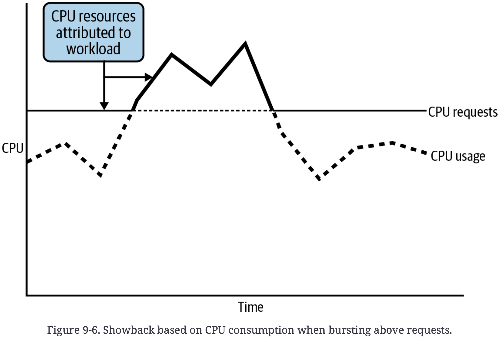
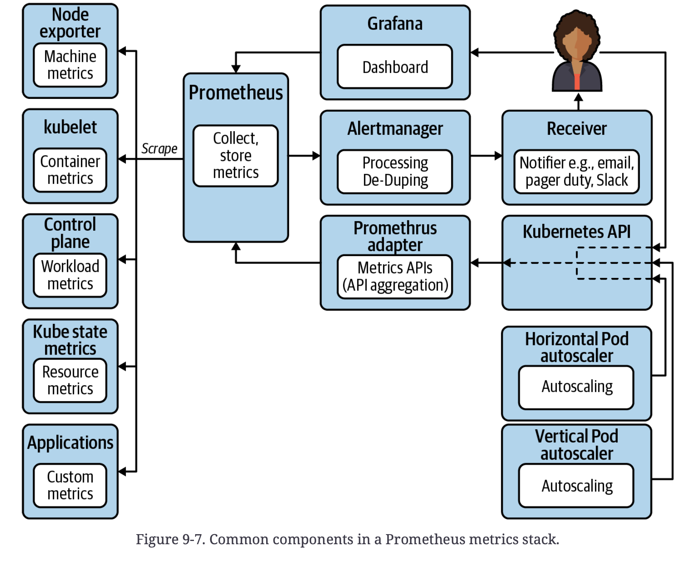
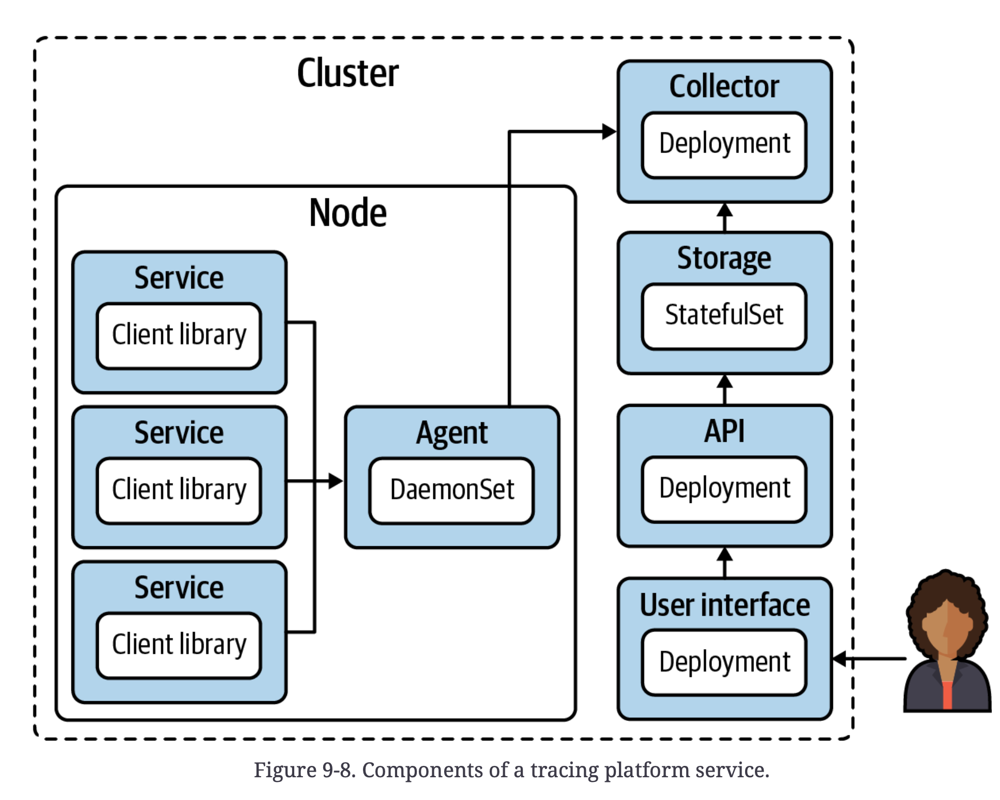

# Observability

관측 가능성 

- 운영중인 application들을 효과적으로 관리하기 위해 배워야 한다
- 제어 이론이 아닌 넓은 의미의 관측가능성을 다룬다
- K8S에서 효율적인 observability를 구현하는 법을 배운다


**Logging**

- program에 의해 logging된 event message들을 모으고 저장하는 것

**Metrics**

- 시간 연속적인 data를 모아서 가시성있게 표현하고, 이를 기반으로 경보를 울리는 것

**Tracing**

- cluster 내  request들이 여러 workload들을 횡단하는 것을 포착하는 것


## Logging Mechanics

이전과 달리 workload들이 너무 쉽게 다른 instance로 옮겨간다.

따라서 log collection, aggregation, storage에 대한 문제들을 다뤄야 한다.

예시) 단일 workload의 replica가 여러개일 경우

- 분리된 여러 component들에 분포
- 이를 일일히 확인하며 log를 분석하는 것은 아주 비효율적임
- 따라서 전체 replica들의 log를 확인할 수 있는 중앙화된 collection point가 필요


### Container Log Processing

아래 3가지 방법이 있다.

**Application forwarding**

> app.에서 직접적으로 backend로 log들을 전송한다.

- app에서 해당 기능을 갖춰야하고, 이를 개발자들이 유지보수해야한다.
- 바람직하지 않은 구조로 운영에서 사용하는 일은 드물다.

**Sidecar processing**

> app. log관리를 위해 sidecar를 사용한다.

- sidecar container에서 아래 둘 중 하나를 수행한다.
  1. log들을 log storage backend로 전송
     - 주로 사용됨
     - log aggregation system이 갖춰져야 함
  2. standard out & error로 log 출력
     - Node agent에게 forwarding하기 위함

**Node agent forwarding**

> 각 node에 pod을 배치해서 해당 node의 모든 container log들을 backend로 전송한다.

- 일반적으로 추천되는 방식
  - 관리 포인트가 적다
  - flitering, metadata, forwarding 방식에 대해 중앙화된 관리가 가능하다.
  - container에서 log rotation을 신경쓰는 것보다, 
    container runtime이나 kubelet에서 신경쓰는 것이 효율적이다.

- Fluentd, Fluent Bit가 주로 사용된다.
  - Fluentd는 ruby로 작성되었고, 이를 더 경량화 하기위해 C로 작성된 FluentBit가 등장했음
  - Fluentd가 좀 더 많은 plugin들을 지원한다.
  - Fluentd의 plugin들이 필요한 상황이 아니라면 FluentBit가 추천된다.



- 문제점들 - 장애로 인한 영향도가 크다
  - Node agent의 장애로 인한 해당 node의 log 영향
  - cluster-wide aggregator 사용시 장애로 인한 log 유실
    - StatefulSet 으로 지정해서 storage가 날아가지 않도록 하는 것이 좋다.


### Kubernetes Audit Logs

> cluster 내에서 누가 무엇을 했는지

- 장애 대응을 위해
- compliance 요구사항 준수를 위해

API server에 audit policy를 등록하려면 `--audit-policy-file` flag로 해당 파일의 위치를 지정해준다.

**example audit policy**

```yaml
apiVersion: audit.k8s.io/v1
kind: Policy
rules:
- level: None # 아래 조건에 부합하면 log를 남기지 않는다.
  users: ["system:kube-proxy"]
  verbs: ["watch"]
  resources:
  - group: "" # core
  resources: ["endpoints", "services", "services/status"]
- level: Metadata # request의 metadata만 logging 됨
  resources:
  - group: ""
  resources: ["secrets", "configmaps"]
  - group: authentication.k8s.io
  resources: ["tokenreviews"]
  omitStages: # 해당 stage는 log를 남기지 않고 건너뜀
  - "RequestReceived"
- level: Request # request의 metadata & body만 logging 됨
  verbs: ["get", "list", "watch"]
  resources:
  - group: ""
  - group: "apps"
  - group: "batch"
  omitStages:
  - "RequestReceived"
- level: RequestResponse # request metadata & body, response body
  resources:
  - group: ""
  - group: "apps"
  - group: "batch"
  omitStages:
  - "RequestReceived"
# Default level for all other requests.
- level: Metadata #
  omitStages:
  - "RequestReceived"
```

**Level 4가지**

- `None`
  - 아예 log를 남기지 않음
- `Metadata`
  - request metadata
- `Request`
  - request metadata & body
- `RequestResponse`
  - request metadata & body, response body

##### Stage 4가지 

- `RequestReceived`
  - request 수신 후 handler chain에게 넘겨주기 전
- `ResponseStarted`
  - only generated for long-running requests (e.g. watch)
- `ResponseComplete`
  - 응답 완료
- `Panic`
  - Events generated when a panic occurred


**audit log를 backend로 전송하기**

- app. forwarding 방식

  - API server에서 webhook backend로 직접 전송

  - config file 작성

    설정 tuning에 공을 들여야 한다.

    - event buffer size가 너무 작아서 overflow가 발생하면 event가 drop된다.

- node agent forwarding 방식

  - Fluent Bit나 Fluentd 사용 가능
  - API server flag로 설정값들을 넘길 수 있다. 


### Kubernetes Events

> Naive resource

- K8S API를 통해 다른 object들에게 event 정보를 노출시킬 수 있는 방법
- platform log의 한 종류로 볼 수 있다.
- 일반적으로 logging backend에 저장되지 않고 etcd에 저장되어 1시간동안 유지된다./

- describe pod을 통해 event 확인 가능
  - `$ kubectl describe pod nginx-6db489d4b7-q8ppw`

- event 조회
  - `$ kubectl get events -n default`

- Prometheus처럼 제공되는 event exporter를 사용해서 이용할 수 있다.


### Alerting on Logs

- alerting을 원한다면 metric을 사용해라
  - alerting rule 설정 가능
  - log를 사용할 경우 log message 내용이 조금만 달라져도 alerting이 되지 않을 수 있다.


### Security Implications

- log에 대한 접근제어 달성 - 사용자 그룹마다 log에 대한 접근을 달리 하도록
  - log tagging
  - 여러 backend 사용
  - forwarding 설정


## Metrics

- 장애 감지 및 대응
- workload 관리 개선
- alert 설정

> metric에 대한 내용들을 prometheus를 통해 알아보자


## Prometheus

> Open source metrics tool

- 다양한 system에서 Prometheus metric 사용을 지원한다.
  - Datadog, New Relic, VMware Tanzu Observability...
- Prometheus metrics: 시계열 data에 대한 표준
- metric 수집할 때 scraping model을 사용한다.
  - 따라서 app과 infra에서 metric을 어딘가로 전송하는 것이 아니라, Prometheus가 scraping할 수 있는 endpoint에 노출시킨다.
  - 이러한 방식 덕분에 app은 뒤의 metrics system을 알 필요가 없어진다.
- 동적인 cloud native 환경에서 사용하기 적합하다.
  - scraping model
  - 대용량 data 처리 가능
  - data model labeling
  - Prometheus Query Language(PromQL)

**Prometheus에서 제공하는 주요 기능들**

- Scraping model로 metric 수집
- 시계열 database에 metric 저장
- alerting rule들에 기반한 alert 전송 (일반적으로 AlertManager로 전송함)
- Prometheus metric에 접근하기 위한 HTTP API를 노출시킴
- 다양한 상태 정보 조회 & ad hoc metric query를 하기 위한 dashboard 제공


대부분 visualization을 위해 Grafana 사용한다.


### Long-Term Storage

- [remote endpoint & storages](https://prometheus.io/docs/operating/integrations/#remote-endpoints-and-storage) 채택할 수 있는 것이 너무나 많다.

- 고려 사항들
  - production에서만 long-term storage를 지원할 것인지
  - 그렇다면 non-prd 환경의 Prometheus layer에서의 보유 기간은 어떻게 설정할지


### Pusing Metrics

scrapting model에 적합하지 않은 workload들도 존재한다.

이럴 경우 [Prometheus Pushgateway](https://github.com/prometheus/pushgateway)를 사용할 수 있다.

예시 (batch workload)

- batch workload일 경우 Prometheus가 metric을 수집하기 전에 죽을 수 있음
- 그래서 Pushgateway로 metric을 전송한다.
- Pushgateway에 쌓인 metric은 Prometheus server가 수집해간다.




### Custom Metrics

- 다양한 언어의 [client library들](https://oreil.ly/t9SLv)을 제공해준다.

​	이를 통해 custom Prometheus metric을 노출시킬 수 있다.

- Prometehus metric이 app이나 system에 의해 지원되지 않는 경우

  **exporter**들을 사용할 수 있다. exporter는 data를 수집해서 이를 Prometheus metric으로 노출시켜준다.

  - 예시 (Node Exporter)

    hardware, OS metric을 수집해서 Prometheus metric으로 노출시켜 scrap되도록 한다.

- app을 scrap configuration에 추가하기

  **ServiceMonitor** CRD를 사용한다.

  - Prometheus Operator에서 ServiceMonitor를 통해 Namespace와 label들을 통한 service auto-discover를 수행한다.


## Organization and Federation

metric 처리는 연산이 집중되는 작업이므로, 나눠주는 것이 resource 관리에 도움이 된다.

- Prometheus server 1개는 platform metric 처리, 다른 server들은 node와 app. metric 처리

- 이 방식은 data들의 위치를 분산시키기 때문에 federation이 필요하다.

- **federation** : 중앙화된 system에 data들을 하나로 모으고 관리한다.

  중앙의 prometheus server 또한 다른 server들로부터 scraping 해온다.

  여러 layer 나 tier를 가지는 구조도 가능하다.

  

- Prometheus server들로부터 metric을 수집하는 open source project들 : **Thanos**, **Cortex**


### Alerts

> alerting rule을 통해 metric으로부터 alert를 발생시킨다.

- alert가 trigger되면 설정된 Alertmanager instance로 발송된다.

- Prometheus Operator로 Alertmanager 배포와 설정을 쉽게 진행할 수 있다.

  

- 과도한 alerting은 치명적인 alert들을 제대로 확인하기 어렵게 만든다.

- alert에는 적절한 정보들이 포함되어야 한다.

- tenant들이 alert set up을 할 수 있도록 해야 한다.

**Dead man’s switch**

> 조종사가 조종능력을 상실한 경우 자동적인 조치가 이뤄지도록 만든 장치

alerting system이 죽었을 때 alerting 해주는 기능

- PagerDuty의 dead man's switch 가 이러한 기능을 제공함


### Showback and Chargeback

> **showback**: 조직의 resource 사용량을 보여준다.
>
> **chargeback**: resource 사용량에 따른 비용을 보여준다.

추적하기 위해

- team, owner와 같은 labeling
  - 표준화된 system 적용 또는 admission control을 통해 labeling을 강제한다.


#### Showback

showback 구현에 대한 2가지 접근

- Requests

  각 container에 정의된 resource requests

- Consumption

  실질적으로 사용하는 양을 본다


**Requests**

- burst로 인해 request된 resource 보다 더 사용하는 경우가 발생한다.

- scheduler가 node에 할당하는 기준을 바탕으로 한다

- 아래 그래프처럼 burst된 것은 반영되지 않음

  

  

**Consumption**

- resource requests나 실제 사용량 중 더 높은 값 채택
- resource를 낮게 설정함으로 얻을 수 있는 이익을 없앤다.



**kube-state-metrics**

- K8S resource들에 대한 metric을 제공하는 platform service
- resource request들에 대한 metric들을 제공한다. (request & consumption)
  - CPU
    - `kube_pod_container_resource_requests`
    - `container_cpu_usage_seconds_total`
  - Memory
    - `kube_pod_container_resource_requests_memory_bytes`
    - `container_memory_usage_bytes`

CPU와 memory 중 더 높은 값을 고려해야 한다.


#### Chargeback

showback에서 비용을 부과할 metric을 얻었기 때문에 chargeback도 가능해진다.

- public cloud provider일 경우 단순하고, 자체 hardware일 경우 복잡할 수 있다.
- 2가지 cost value를 고려한다.
  - 단위시간 CPU 비용
  - 단위시간 memory 비용


#### Network and storage

CPU와 memory 이외에 networking bandwidth와 disk storage를 많이 사용하는 workload들도 존재한다.

위의 CPU memory에 대한 showback & chargeback 설명과 같이 metric을 수집하고, 기준 지표들을 설정하면 됨


### Metrics Components

> Prometheus metrics stack에 대한 전반적인 component들에 대해 알아보자



#### Prometheus Operator

> K8S metrics system을 위한 다양한 component들을 배포하고 관리하는 operator

- Prometheus server들을 표현하기 위한 custom resource들을 사용한다.
  - Alertmanager deployment
  - scrap config.
  - metric recording & alerting을 위한 rule들
- platform engineer들과 tenant들에게 편리한 custom resource들을 제공한다.

- [kube-prometheus](https://github.com/prometheus-operator/kube-prometheus) project를 통해 다양한 기능들을 사용해볼 수 있다.


#### Prometheus servers

Prometheus Operator와 함께 사용할 Prometheus server custom resource

**예시 Prometheus**

```yaml
apiVersion: monitoring.coreos.com/v1
kind: Prometheus
metadata:
  name: platform
  namespace: platform-monitoring
  labels:
    monitor: platform
    owner: platform-engineering
spec:
  alerting: # alert 전송할 곳 지정
    alertmanagers:
    - name: alertmanager-main
      namespace: platform-monitoring
      port: web
  image: quay.io/prometheus/prometheus:v2.20.0
  nodeSelector:
    kubernetes.io/os: linux
  replicas: 2
  resources:
    requests:
      memory: 400Mi
  ruleSelector: # 해당 rule들이 모두 적용된다.
    matchLabels:
      monitor: platform
      role: alert-rules
  securityContext:
    fsGroup: 2000
    runAsNonRoot: true
    runAsUser: 1000
  serviceAccountName: platform-prometheus
  version: v2.20.0
  serviceMonitorSelector: # 해당 ServiceMonitor의 scrape config가 적용된다.
    matchLabels:
      monitor: platform
```

- tenant별로 나눠서 관리하기 용이하다


위 설정에 나온 **ServiceMonitor**를 통해 scrape configuration을 정의한다.

```yaml
apiVersion: monitoring.coreos.com/v1
kind: ServiceMonitor
metadata:
  labels:
	  k8s-app: apiserver
	  monitor: platform # ServiceMonitorSelector로 refer됨
  name: kube-apiserver
  namespace: platform-monitoring
spec:
  endpoints: # metrics scraping할때 어떻게 connect할지
  - bearerTokenFile: /var/run/secrets/kubernetes.io/serviceaccount/token
    interval: 30s
    port: https
    scheme: https
    tlsConfig:
      caFile: /var/run/secrets/kubernetes.io/serviceaccount/ca.crt
      serverName: kubernetes
  # prometheus에서 metric을 받을 때 key가 component인 label의 value를 job의 value로 사용하게 된다.
  jobLabel: component 
  namespaceSelector:
    matchNames:
    - default
  selector: # service discovery 시 사용하는 label들
    matchLabels:
      component: apiserver
      provider: kubernetes
```

- ServiceMonitor 이외 PodMonitor로도 scrap config.를 정의할 수 있다.


**PrometheusRule**

```yaml
apiVersion: monitoring.coreos.com/v1
kind: PrometheusRule
metadata:
  labels:
    monitor: platform
    role: alert-rules # ruleSelector에서 refer됨
  name: sample-rules
  namespace: platform-monitoring
spec:
  groups:
  - name: kube-apiserver.rules
    rules:
    - expr: | # 모든 apiserver instance들의 모든 LIST, GET request 총합을 5분마다 기록한다.
				sum by (code,resource) 
        	(rate(apiserver_request_total{job="apiserver",verb=~"LIST|GET"}[5m]
       	))
      labels:
        verb: read
      record: code_resource:apiserver_request_total:rate5m # record 명
  - name: kubernetes-apps
  rules:
  - alert: KubePodNotReady # alerting rule
    annotations:
      description: Pod {{ $labels.namespace }}/{{ $labels.pod }} has been
        non-ready state for longer than 15 minutes.
      summary: Pod has been in a non-ready state for more than 15 minutes
    expr: |
      sum by (namespace, pod) (
        max by(namespace, pod) (kube_pod_status_phase{job="kube-state-...
    for: 15m
    labels:
      severity: warning
```


#### Alertmanager

- 중복 alert 제거
- receiver들에게 발송 - email, slack, PagerDuty

```yaml
apiVersion: monitoring.coreos.com/v1
kind: Alertmanager
metadata:
  labels:
  	alertmanager: main
  name: main
  namespace: platform-monitoring
spec:
  image: quay.io/prometheus/alertmanager:v0.21.0
  nodeSelector:
  	kubernetes.io/os: linux
  replicas: 2 # 고가용성 고려시
  securityContext:
    fsGroup: 2000
    runAsNonRoot: true
    runAsUser: 1000
  serviceAccountName: alertmanager-main
  version: v0.21.0
```


#### Grafana

- open source visualization layer
- 각 prometheus server마다 grafana를 둬서 tenant들간 분리시킬 수 있음
  - 여러 dashboard들에 접근해야 하는 번거로움이 발생할 수 있다.
    - federation을 통해 하나의 dashboard로 확인 가능
    - 단일 dashboard에 여러 data source를 추가해서 한번에 확인 가능

#### Node exporter

- 일반적으로 K8S DaemonSet으로 실행됨
- host-level 정보들 (CPU, memory, disk I/O, disk space, network stats, file descriptor info.)
- Linux에서 Prometheus metric을 노출시키지 않기 떄문에, node exporter가 kernel에서 metric들을 읽고 변환한다.


#### kube-state-metrics

- K8S resource들의 metric 제공
- kubectl get이나 describe로 얻을 수 있는 정보들
  (Pod start time, status, label, priority class, resource requests & limits)
- cluster 상태에 대한 정보를 감지해준다. (Pod crash loop, namespace의 resource quota 근접)

#### Prometheus adapter

- Prometheus client
- Prometheus API로부터 metric을 조회해서 반환한다.
- 이를 통해 workload autoscaling이 가능하도록 해준다.


## Distributed Tracing

> 여러 workload들을 넘나드는 request들을 tracing한다.

- logging, metric과 다르게 tracing은 모든 app과 platform간 호환되어야 한다.
- 그래서 platform 팀과 app 개발팀의 협업이 필요하다.


### OpenTracing

- distributed tracing을 위한 open source spec.

- 3가지 개념

  - **Trace**

    request의 횡단 전체 transaction을 표현한다.

  - **Span**

    request를 처리하는 각 분리된 service들

    Span이 모여서 trace를 이룬다.

  - **Tag**

    span에 붙는 metadata로 검색 가능한 index를 제공한다.


### Tracing Components



#### Agent

- node agent로 해당 node내 workload들에서 발생하는 span들을 받는다.
- span들을 중앙 controller(collector)로 발송

#### Collector

- validating, indexing
- storage로 보내기 전에 transformation 수행

#### Storage

- 주로 Cassandra or Elasticsearch 사용
- 대용량 데이터 검색


