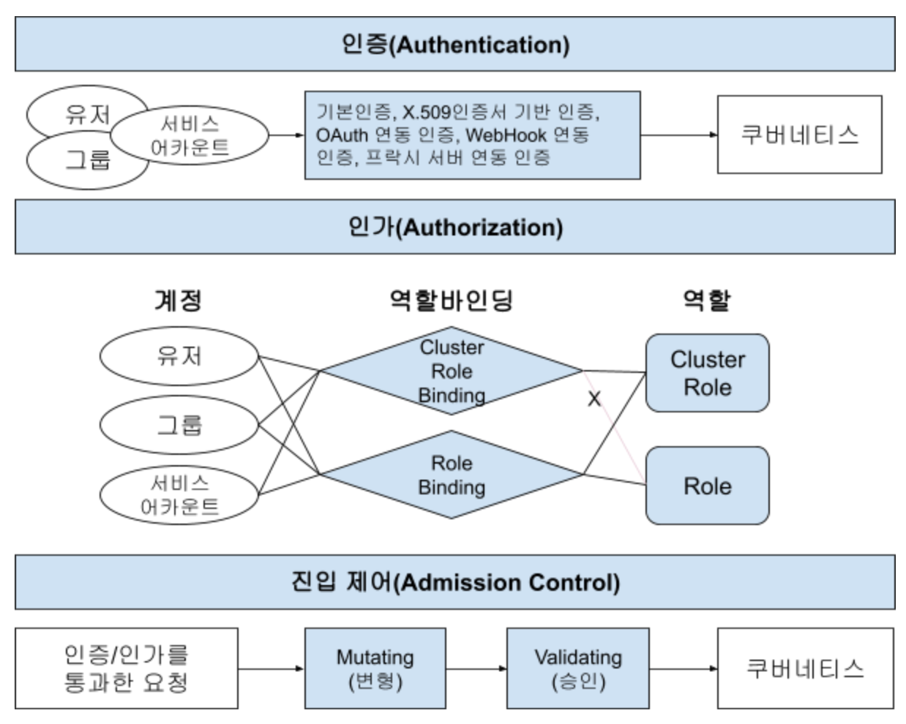
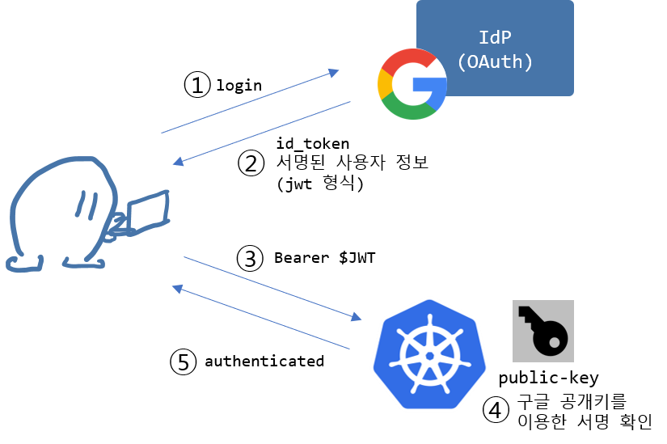
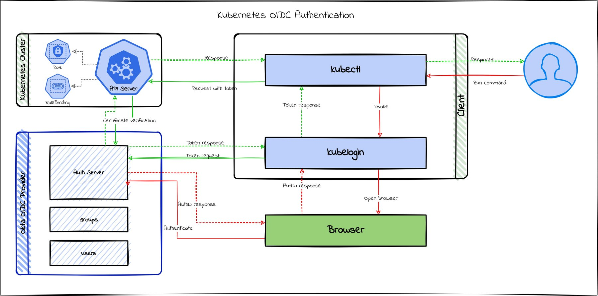
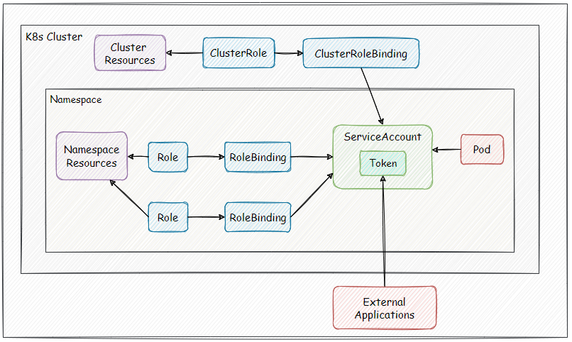
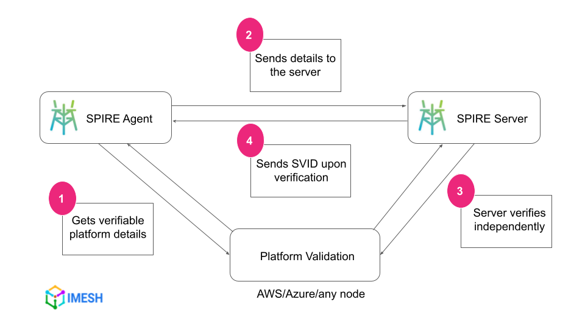
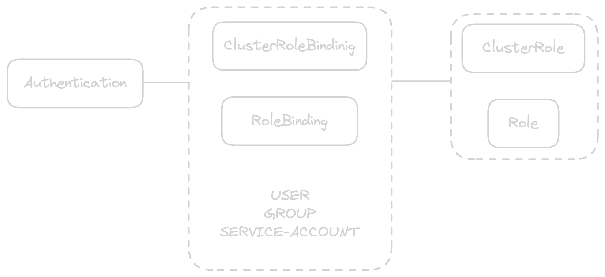

# 식별

사용자와 애플리케이션 워크로드의 ID를 설정하는 것은 쿠버네티스 플랫폼을 설계하고 구현할 때의 주요 관심사
- 왜? 
  - => 적절한 권한을 가진 사용자 및 애플리케이션에게만 엑세스/작업 권한을 줘야 하기 때문
  - => 이러기 위해서는 **인증 및 권한 부여 시스템** 구현이 필요함

  

- 인증 (Authentication)
  - 사용자 및 애플리케이션 ID를 설정하는 프로세스
- 권한 부여/인가 (Authorization)
  - 인증된 후, 사용자 및 애플리케이션이 수행할 수 있는 작업을 결정하는 프로세스

<br/>

인증 목적으로 ID를 설정하는 것은 모든 분산 시스템의 핵심 요구사항이다.
- ID에는 몇 가지 속성이 존재해야 함
  - **검증이 가능해야 함.** 예를 들어, 사용자 이름과 비밀번호가 주어지면 데이터베이스 등을 통해 값이 맞는지 확인한다거나, TLS 인증서는 신뢰할 수 있는 CA로 부터 발급되었는지 확인할 수 있어야 한다.
  - **고유해야 함.** 식별 방식이 고유하지 않을 때, 서비스는 보유자를 구체적으로 식별할 수 없음. 원하는 범위에서만 고유성을 유지해야 함.

<br/>


## 사용자 식별

### 인증 방법

사용할 수 있는 다양한 인증 방법이 있으며, 각각 고유한 강점과 약점이 있다.

> 각 방식에 따른 장단점 - [https://happycloud-lee.tistory.com/259] 인용 + 책 내용

| 인증방법                  | 설명                                                         | 장점                                                         | 단점                                                         |
| ------------------------- | ------------------------------------------------------------ | ------------------------------------------------------------ | ------------------------------------------------------------ |
| 기본인증 (일반유저)       | ID와 암호 또는 인증 토큰을 이용                              | 계정관리 편리: 외부 시스템 연동 없이 자체 계정 정보 파일만 있으면 됨 | 평문 또는 base64인코딩된 암호 사용으로 보안 위험 존재, 만료 날짜가 없음, 정보 변경 시, API 서버 재시작이 필요함.        |
| 기본인증 (서비스어카운트) | JWT 이용                                                     | 계정관리 편리: 외부 시스템 연동 없이 JWT로만 인증함          | JWT 탈취 시 보안 위험 발생하므로 정기적으로 서비스 어카운트의 프라이빗 키 교체 필요 |
| X.509 인증서 기반 인증    | X.509 인증서의 프라이빗키/퍼블릭키 비교 방식 이용            | 계정관리 편리: 외부 시스템 연동 없이 X.509인증서로만 인증함  | 클라이언트 인증서 탈취 시 보안 위험 발생하므로 정기적으로 클라이언트 인증서와 프라이빗 키 교체 필요 |
| OAuth 연동 인증           | OAuth 서비스 프로바이더와 연동하여 인증                      | 계정 관리 편의성과 보안 보장: 기존 OAuth 서비스 프로바이더 ID/암호 사용할 수 있고 OAuth방식으로 안전한 인증 보장 | OAuth 연동을 위한 개발 필요                                  |
| WebHook 연동 인증         | WebHook으로 인증 시스템과 연동하여 인증                      | 계정 관리 편의성과 보안 보장: 기존 인증시스템 ID/암호 사용할 수 있고 WebHook 통한 안전한 인증 보장 | WebHook 개발 필요                                            |
| 프락시 서버 연동 인증     | 프락시 서버로 인증 시스템과 연동하고 X.509인증서 기반 인증을 조합하여 인증 | 계정관리 편의성, 보안 보장, 쿠버네티스 API Server 노출 안됨  | 프락시 서버 개발 필요와 프락시 서버의 X.509인증서 정기적 교체 필요 |


그 중에 그럼 어떤걸 골라야 하나?
- 핵심 주제에 따라 특정 사용사례를 이해하고, 어떤 것이 효과있을지 평가하고, 시스템과 통합, 사용자 경험을 측면에서 고민해보고, 조직에 필요한 보안태세를 제공하는 것이 필수적.


### PKI - 공개 키 인프라스트럭처

`kubeconfig` 파일을 보자.
- 클러스터를 설치한 후 `kubernetes-admin` 사용자 세부 정보가 포함된 kubeconfig 파일을 얻는다.
- 기본적으로 이 파일이 클러스터의 루트 키다. `admin.conf`라고 하기도 한다.

<br/>

예시 `kubeconfig` 파일을 보자.
```yaml
apiVersion: v1
clusters:
- cluster:
    certificate-authority-data: <ca-data-here>
    server: https://your-k8s-cluster.com
  name: <cluster-name>
contexts:
- context:
    cluster:  <cluster-name>
    user:  <cluster-name-user>
  name:  <cluster-name>
current-context:  <cluster-name>
kind: Config
preferences: {}
users:
- name:  <cluster-name-user>
  user:
    token: <secret-token-here>
```

크게 3가지 부분으로 나눌 수 있다.
1. `clusters`: cluster 정보 - Cluster API Server 주소와 ROOT 인증서 경로 혹은 데이터
2. `contexts`: context 정보 - 클러스터, 네임스페이스, 유저 정보
3. `users`: user 정보 - 인증 방식에 조금씩 달라짐
  - 인증 토큰 (`token`)
  - 인증서 경로 혹은 데이터 (`client-certificate-data`, `client-key-data`)

제공하는 인증방식에 따라 `users` 값이 조금씩 달라진다.

<br/>

접근권한에 있어서 `CertificateSigningRequest` 리소스를 만들어 승인/거절의 과정으로도 구성이 가능하다.
- `CertificateSigningRequest` approve/deny 권한을 가진 자가 수동/자동으로 권한을 승인/거부 할 수 있으며, 이는 인증서를 통해 새롭게 인증과정을 구성한다.

<br/>

### Open ID Connect (OIDC)

쿠버네티스로 사용자 인증 및 ID를 설정할 때 가장 좋은 선택은 기존 싱글 사인 온(Single Sign On) 시스템 또는 프로바이더와의 통합이다.

널리 알려진 표준을 기반으로 하며, 관리 및 보안이 잘 된 단일 시스템의 엑세스를 통해 관리 및 제거를 간단하게 만든다.

쿠버네티스는 OIDC를 인증 메커니즘으로 직접 지원한다. (`kube-apiserver`)
- `--oidc-issuer-url`
- `--oidc-client-id`

간단한 과정을 보면 아래와 같다.
  

> [커피고래 님 블로그 인용](https://coffeewhale.com/kubernetes/authentication/oidc/2020/05/04/auth03/)

  

> [okta 문서](https://developer.okta.com/blog/2021/11/08/k8s-api-server-oidc)


### 사용자 최소 권한 구현 (Least Privilege)

권한 부여에 대해 쉽게 생각하면, 관리자는 모든 권한을, 개발자는 제한된 권한을 가지게 하는 것이다.
하지만 이렇게 단순한 권한 분리는 '관리자'에서 문제를 일으킬 수 있다.

관리자는 전체 클러스터를 완전히 접근 가능하므로 우발적으로 파괴적인 작업을 수행할 가능성이 더 커진다.

그렇다보니 이러한 문제를 해결하고자 가장/흉내(`Impersonation`) 기능을 쿠버네티스에서 제공한다.

<br/>

`Impersonation`는 어렵게 생각할 필요 없다. 단순히 유저의 권한은 최소로 제한하고, 민감한 명령을 수행할 수 있는 권한에 대해서는 권한 상승을 요구함으로써 위험한 일이 벌어지는 것을 막고자 하는 것이다.
- 간단히 말하면 Linux `sudo` 같은 역할을 수행할 수 있게 만든다.

`Impersonation`를 구현하기 위해서는 민감한 권한을 가진 `ClusterRole`에 대해 `impersonation` verbs 권한을 주고, 사용할 때 `as`를 통해 해당 Role을 명시적으로 사용하는 것이다.

```yaml
apiVersion: rbac.authorization.k8s.io/v1
kind: ClusterRole
metadata:
  name: cluster-admin-impersonator
rules:
- apiGroups: [""]
  resources: ["users"]
  verbs: ["impersonate"]
  resourceNames: ["cluster-admin"]
---
apiVersion: rbac.authorization.k8s.io/v1
kind: ClusterRoleBinding
metadata:
  name: cluster-admin-impersonate
roleRef:
  apiGroup: rbac.authorization.k8s.io
  kind: ClusterRole
  name: cluster-admin-impersonator
subjects:
- apiGroup: rbac.authorization.k8s.io
  kind: Group
  name: ops-team
```

`kubectl --as=cluster-admin create configmap my-config`와 같은 명령어를 통해 권한을 상승시켜 특정 명령어를 수행할 수 있다.


<br/>

## 애플리케이션/워크로드 식별

왜 워크로드 식별이 필요한가?
- 보안
  - 워크로드를 식별함으로써 각 서비스 또는 애플리케이션의 신원을 확인할 수 있습니다. 이는 인증과 권한 부여에 필요한 기본적인 단계입니다. 예를 들어, 특정 워크로드가 어떤 서비스인지 알고 있다면, 그 서비스에 대한 접근 권한을 정확하게 부여하고, 민감한 데이터나 리소스에 대한 접근을 제한할 수 있습니다.
- 관리
  - 워크로드를 고유하게 식별하면 시스템 관리 작업이 훨씬 용이해집니다. 각각의 워크로드가 자신의 ID를 가지고 있다면, 각각을 개별적으로 모니터링하고 관리할 수 있습니다. 이는 디버깅, 로깅, 성능 모니터링 등과 같은 작업에 매우 유용합니다.
- 네트워크 통신
  - 워크로드를 식별함으로써 각 서비스 또는 애플리케이션 간의 통신을 보다 효율적으로 관리할 수 있습니다. 예를 들어, 로드 밸런싱, 트래픽 라우팅, 서비스 디스커버리 등의 기능을 수행할 때 특정 워크로드를 식별하면 라우팅 및 트래픽 관리가 용이해집니다.

### 네트워크 식별

Calico, Cilium 같은 CNI 레벨 단에서의 네트워크 식별 기능

<br/>

### 서비스 어카운트 토큰

서비스 어카운트는 파드 그룹의 식별을 제공하는 쿠버네티스의 기본 요소이다.
- 모든 파드는 서비스 어카운트에서 실행된다.
- 서비스 어카운트가 관리자로 미리 생성되지 않고 파드에 할당되지 않으면, 해당 계정에는 네임스페이스에 대한 기본 서비스 어카운트가 할당된다.

<br/>

서비스 어카운트 토큰은 쿠버네티스 시크릿으로 생성되는 JWT다. 
- 각 서비스 어카운트에는 JWT가 포함된 암호가 있는데, Pod 생성 시 달리 지정하지 않으면 기본 서비스 어카운트의 토큰이 할당되며 Kubernetes API 요청할 때 사용할 수 있다.


<br/>

앞서 이야기했듯 파드는 사용할 특정 서비스 어카운트를 지정하지 않으면, 마운트 된 네임스페이스의 기본 서비스 어카운트 토큰을 자동으로 가져온다.

만약 파드의 서비스 어카운트를 따로 지정하려면, 파드 사양에서 `serviceAccountName` 필드를 사용하면 된다.

```yaml
apiVersion: v1
kind: Pod
metadata:
    name: my-pod
spec:
    serviceAccountName: my-pod-sa
```

<br/>

1.24 버전 이전에는 ServiceAccount를 생성하면 Token (Secret)도 알아서 생성해줬는데, 1.24 이후로는 Token을 수동으로 생성해야 한다.

Role, RoleBinding을 따로 설정하지 않으면 아무런 Permission이 존재하지 않는다. 적절한 Role, RoleBinding을 만들어 연결해주어야만 한다.


  

즉, Pod에 적절한 ServiceAccount를 생성해 활용한다고 하면
- ServiceAccount 생성
- Secret (ServiceAccount Token `kubernetes.io/service-account.name` annotation) 생성
- Role/ClusterRole 생성
- RoleBinding/ClusterRoleBinding 생성 (`subjects - ServiceAccount`)
- Pod - `serviceAccountName` 사용

<br/>

워크로드에서 쿠버네티스 API 서버 엑세스가 필요하지 않을 때, 서비스 어카운트 오브젝트에서 `automountServiceAccountToken`를 false로 지정해 서비스 어카운트 토큰을 비활성화 할 수 있다.
- 명시적으로 표현하기 위함이며, 네임스페이스에 전역적으로 적용이 필요한 경우 네임스페이스 default 서비스 어카운트 토큰에 해당 필드를 지정할 수 있다.
- https://kubernetes.io/docs/tasks/configure-pod-container/configure-service-account/#opt-out-of-api-credential-automounting


<br/>

## SPIFFE / SPIRE

왜 SPIFFE / SPIRE가 필요한 것인가?
- 고르지 않은 네트워크 주소 변환과 클라우드 네이티브 패턴으로 인해 IP 주소 배포에 급격한 변화가 생깁니다.
- 호스트 상호 작용을 위한 ID로 IP 주소를 사용하는 것은 서비스 간 통신에 대한 정책을 정의해야 하는 필요성에 부합하지 않습니다.
- 이 워크로드 신원 문제에 대한 해결책은 Spiffy ID를 사용하여 워크로드를 참조하고 SVID를 사용하여 신원 증명을 제공하는 것입니다.

<br/>

SPIFFE 표준은 세 가지 핵심 개념에 중점을 둡니다
- 워크로드를 고유하게 식별하는 SPIFFE ID
- 워크로드의 신원 확인을 위해 암호학적으로 검증 가능한 문서인 SPIFFE 검증 가능 신원 문서(SVID)
- 시스템에 참여하는 데 필요한 정보를 워크로드에 제공하는 워크로드 API

<br/>

프로세스

  

- Spire 서버는 등록 항목 목록을 에이전트에 보내고, 에이전트는 각 항목에 대한 인증서 서명 요청을 서버에 보내 워크로드 SVID 목록을 생성합니다.
- 그런 다음 에이전트는 워크로드 API 소켓에서 수신 대기하고, 워크로드 증명을 시작합니다. 워크로드 선택기를 비교하고, 워크로드가 서로 인증할 수 있도록 전체 시스템을 설정합니다.
- 워크로드 ID 부트스트래핑 프로세스에는 시스템에서 엔보이 프록시와 istio 에이전트가 포함되며, istio 에이전트는 gRPC를 통해 인증서를 요청합니다.
- 이 사례의 워크로드는 서비스, istio 사이드카, 엔보이 프록시, istio 에이전트를 포함하는 Kubernetes의 특정 포드 인스턴스를 참조하며, Istio의 ID 부트스트랩 흐름을 이해하기 위해 드릴다운합니다.


<br/>

## RBAC

  

- `ClusterRole`/`Role`: 어떤 리소스에 대해 어떤 권한을 가지고 있는지?
- `ClusterRoleBinding`/`RoleBinding`: 어떤 대상에서 어떤 Role을 바인딩/부여할지?

> 쿠버네티스 내 USER/GROUP 리소스, 오브젝트는 존재하지 않음. RBAC RoleBinding에서 식별하려고 미리 정의된 이름이다. 정적파일에서 토큰 또는 암호로 매핑될 수 있고, x509 인증서의 CN (Common Name)에서 가져오거나 OAuth 요청에서 필드로 읽을 수 있음.
> 사용자를 결정하는 방법은 사용 중인 인증 방식에 전적으로 의존하며, 쿠버네티스가 이를 내부적으로 정의하거나 관리할 수 있는 방법이 없음. 확장성 있게 일부로 이렇게 구현되어져 있는 것.
