> [!NOTE]
> 책 내용 + 기타 레퍼런스를 보완한 요약본입니다.

# Chapter 10] 식별

- 인증
  - 애플리케이션이나 사용자의 ID 설정 프로세스
- 권한 부여
  - 인증 후 애플리케이션이나 사용자가 수행 가능한 작업을 결정하는 프로세스

ID에는 몇 가지 속성이 필요하다.
- 검증 가능해야
  - 사용자 이름과 비밀번호 입력시 DB나 정보 출처로 이동해 값이 올바른지 검증할 수 있어야 한다.
- 식별은 고유해야
  - 서비스에 제공된 식별 방식이 고유하지 않으면 서비스는 보유자를 구체적으로 식별할 수 없으므로 원하는 범위에서만 고유성을 유지해야 한다. (e.g. 사용자명 혹은 이메일 주소)

## 사용자 식별

### 인증 방법

K8s 운영자가 사용할 수 있는 다양한 인증 방법이 있고 각각 고유한 장단점이 있다.

#### 공유 시크릿

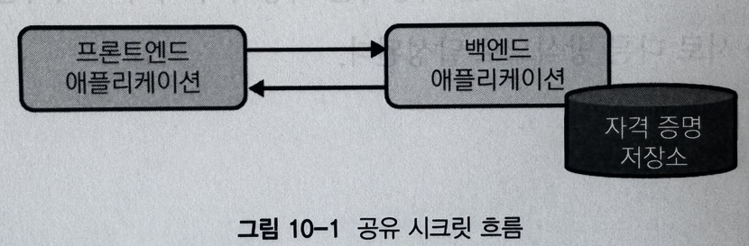

호출 엔티티와 서버가 보유하는 고유한 정보 조각 혹은 집합. 예를 들면 MySQL에 애플리케이션이 연결해야 할 때 사용자명과 패스워드 조합으로 인증하는 것. 이 때 양쪽 모두 어떤 형태로든 그 조합에 액세스 가능해야 한다.
이를 위해 이를 필요로 하는 호출 애플리케이션에 Secret을 배포해야 한다.

공유 시크릿 모델은 API 서버에 인증할 수 있는 두 가지 옵션으로
1. API 서버에 HTTP Authorization Header로 Bearer 토큰을 사용하여 매핑된 사용자의 요청을 처리하고 조치 (사용자명 및 그룹(Optional)을 정적 토큰에 매핑)
2. API 서버에 사용자 이름 및 그룹(Optional)과 암호 매핑 CSV 제공
하는 방식을 선택할 수 있다.

두 가지 방법 모두 심각한 약점이 있어 권장되지 않는다. K8s 구현 혹은 공유 시크릿 모델 자체의 잠재적 단점으로 인한 것이다.

- 대부분 자동화되는 쿠버네티스 설치에 있어서 설정에 필요한 모든 자산이 Repository에 저장되는데, 부주의나 잘못된 관행으로 자격 증명이 유출될 수 있는 잠재적 위험
- 정적 토큰 및 사용자 이름 / 암호 조합 모두 만료 날짜가 없어 자격 증명이 손상되면 위반 사항을 신속히 식별해 관련 증명을 제거후 API 서버를 재시작해 해결해야 함

#### PKI

인증서와 키를 사용해 K8s 사용자를 고유하게 식별하고 인증한다. K8s에서는 이를 광범위하게 사용해 시스템 모든 핵심 컴포넌트 간 통신을 보호한다.
상용 환경에서는 CA 및 인증서를 `kubeadm`을 사용한 클러스터 구축 과정을 사용하는 것이 일반적이다.

```yaml
# kubeconfig
apiVersion: v1
clusters:
- cluster:
    certificate-authority-data: <.. Snippet ..>
    server: https://127.0.0.1:32770
  name: kind-kind
contexts:
- context:
    cluster: kind-kind
    user: kind-kind
  name: kind-kind
current-context: kind-kind
kind: Config
preferences: {}
users:
- name: kind-kind
  user:
    client-certificate-data: <.. Snippet ..>
    client-key-data: <.. Snippet ..>
```

클러스터에 인증할 사용자를 결정하려면 `openssl`을 사용해 인증서를 발행하고 이 값을 base64로 인코딩하여 `client-certificate-data` 필드를 채우면 된다.

```
Certificate:
  Data:
    Version: 3 (0x2)
    Serial Number: 2587742639643938140 (0x23e98238661bcd5c)
  Signature Algorithm: sha256WithRSAEncryption
    Issuer: CN=kubernetes
    Validity
      Not Before: Jul 25 19:48:42 2020 GMT
      Not After: Jul 25 19:48:44 2021 GMT   
    Subject: O=system:masters, CN=kubernetes-admin
    Subject Public Key Info:
      Public Key Algorithm: rsaEncryption
        Public-Key: (2048 bit)
        Modulus:
          <.. Snippet ..>
        Exponent: 65537 (0x10001)
    X509v3 extensions:
      X509v3 Key Usage: critical
        Digital Signature, Key Encipherment
      X509v3 Extended Key Usage:
        TLS Web Client Authentication
  Signature Algorithm: sha256WithRSAEncryption
    <.. Snippet ..>
```

K8s CA에서 발급한 인증서를 확인하고 사용자를 `system:masters` 그룹에서 `kubernetes-admin` (CN 필드)으로 식별한다. O 필드는 쿠버네티스 사용자를 아우르는 조직으로 간주한다.

최종적으로 CSR (Certificate Signing Requests)를 거치고 나면, 해당 사용자의 작업 요청을 처리할 수 있다. 이를 정상적으로 처리시키려면 아래와 같은 kube-controller-manager를 구성해야 한다.

```yaml
spec:
  containers:
  - command:
    - kube-controller-manager
    - --cluster-signing-cert-file=/etc/kubernetes/pki/ca.crt
    - --cluster-signing-key-file=/etc/kubernetes/pki/ca.key
    # Additional Flags removed for brevity
    image: k8s.gcr.io/kube-controller-manager:v1.17.3
```

적절한 RBAC 권한이 있는 모든 엔티티는 kube-apiserver에 `CertificateSigningRequest` 오브젝트를 전달한다.
RBAC 권한이 없으면 인증되지 않은 사용자는 인증 허용 프로세스를 시작할 수 없다. 

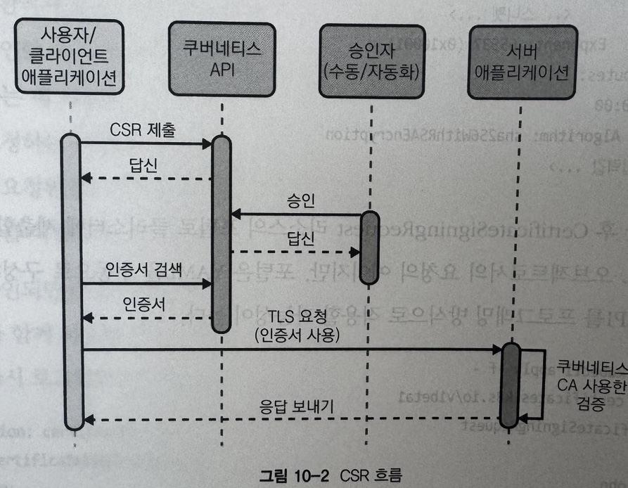

```shell
openssl req -new -key john.key -out john.csr -subj "/CN=john"
openssl req -in john.csr -text
# Certificate Request:
#   Data:
#     Version: 0 (0x0)
#     Subject: CN=john
#     Subject Public Key Info:
#       Public Key Algorithm: rsaEncryption
#         Public-key: (1024 bit)
#         Modulus:
#           <.. Snippet ..>
#         Exponent: 65537 (0x10001)
#     Attributes:
#       a0:00
#   Signature Algorithm: sha256WithRSAEncryption
#     <.. Snippet ..>
```

```shell
cat <<EOF | kubectl apply -f -
apiVersion: certificates.k8s.io/v1
kind: CertificateSigningRequest
metadata:
  name: john
spec:
  request: $(cat /root/CKA/john.csr | base64 | tr -d "\n")
  signerName: kubernetes.io/kube-apiserver-client
  expirationSeconds: 86400  # one day
  usages:
  - client auth
EOF
```

위 오브젝트를 보면 john의 인증서를 불러와 요청하고 usage는 client auth임을 알 수 있는데, 이렇게 John의 인증서 요청이 들어오면 클러스터 매니저가 아래 커맨드로 이 CSR을 승인한다. (혹은 거부)

```shell
kubectl certificate approve john
```
```shell
cat <<EOF | kubectl apply -f -
apiVersion: certicates.k8s.io/v1
kind: CertificateSigningRequest
metatdata:
  name: john
spec:
  request: $(cat john.csr | base64 | tr -d '\n')
  usages:
  - client auth
EOF
```

```yaml
apiVersion: certicates.k8s.io/v1
kind: CertificateSigningRequest
metatdata:
  name: my-app
# spec 생략
status:
  certificate: <.. Snippet ..>
  conditions:
  - lastUpdateTime: "2020-03-04T15:45:30Z"
    message: 이 CSR은 kubectl 인증서 승인에 의해 승인됨
    reason: KubectlApprove
    type: Approved
``` 

이러한 프로세스가 자동화가 되면 좋겠지만 권장하지 않는다. K8s 사용자의 기본 인증 방법으로 X509 인증서를 사용하면 아래와 같은 여러 문제가 발생한다.

- CSR 흐름으로 프로비저닝된 인증서는 만료되기 전에 취소 불가하다. OCSP (온라인 인증서 상태 프로토콜) 스테이플링의 인증서 해지 목록을 지원하지 않는다.
- 외부 인증을 기반으로 인증서 프로비저닝을 담당하는 컴포넌트를 만들고 유지보수하는 것 이외 추가 PKI를 프로비저닝, 지원 및 유지 관리해야 한다.
- X509 인증서에 만료 타임스탬프가 있으며 쌍(키/인증서)이 손상될 때의 위험을 줄이려면 타임스탬프를 짧게 유지해야 한다. 이는 인증서 변동이 잦음을 의미하며 클러스터에 대한 일관된 액세스가 유지되도록 인증서를 정기적으로 사용자에 배포해야 한다.
- 인증서를 요청하는 사용자에 대한 식별 방법이 필요하다.
- 인증서는 하나의 클러스터로 scope가 적용되며 멀티 클러스터라면 관련 자격 증명을 관리하는 복잡성이 배로 증가한다.

#### OIDC

- K8s로 사용자 인증 / ID를 설정할 때 가장 좋은 방식으로 기존 SSO 시스템 혹은 Provider와 통합하는 것이다. (조직에는 Okta / Auth0 / Google 혹은 LDAP / AD 같은 솔루션이 있다.)
  - 이런 시스템은 보통 잘 알려지고 널리 지원되는 표준을 기반으로 한다.
  - SA의 모든 관리와 보안이 잘 된 단일 시스템의 액세스를 통합해 계정 / 액세스 관리 및 제거를 간단하게 한다.
- OIDC Framework를 사용하면 사용자가 해당 시스템에 자격증명을 노출하지 않아도 다운스트림 애플리케이션에 액세스할 수 있다.
- 여러 환경에 있는 K8s 클러스터들이 단일 식별자를 활용할 수 있어 클러스터간 구성 편차를 줄일 수도 있다.

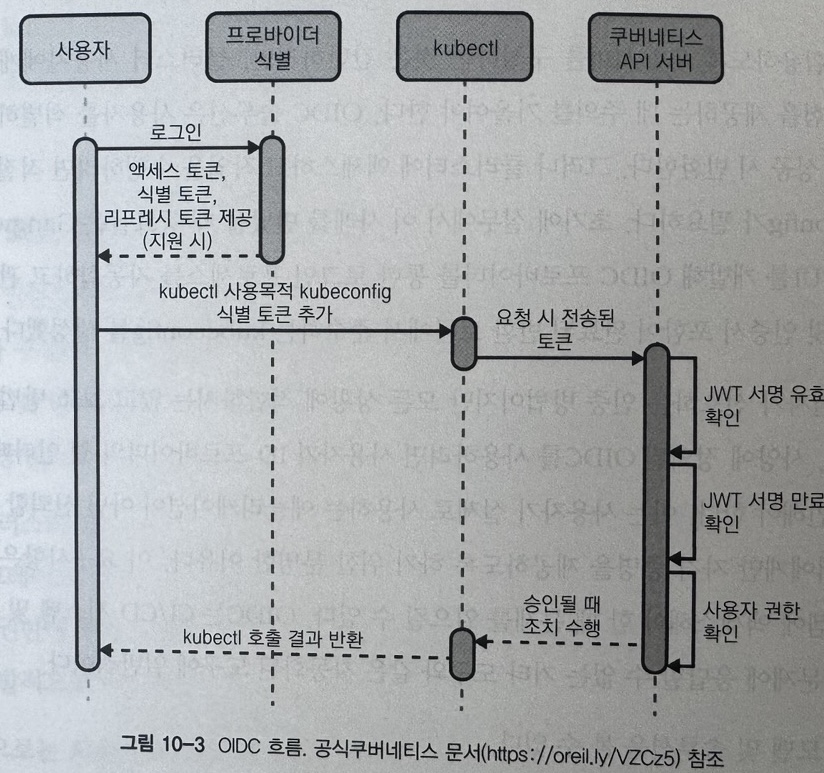

쿠버네티스는 OIDC를 인증 메커니즘으로 직접 지원한다. 다만 추가 기능을 제공하거나 UX 개선을 하려면 추가 도구가 필요할 수 있다.
- 조직에 여러 ID Provider가 있을 때 OIDC Collector를 활용해야 한다. (K8s에서는 단일 ID Provider 정의만 지원된다.)
    - [Keycloak](https://www.keycloak.org/), [UAA](https://github.com/cloudfoundry/uaa)가 유사한 기능을 제공한다. 혹은 [Dex](https://github.com/dexidp/dex)를 활용할 수도 있다.

OIDC는 선호되는 인증 방법이지만 모든 상황에 적합하지는 않고 보조 방법이 필요할 수 있다. 사양에 정의된 OIDC를 사용하려면 사용자가 ID Provider의 Web UI로 직접 로그인해야 하는데, (이는 신뢰 가능한 Provider에게만 자격  증명을 제공하기 위함) 이러한 요구사항은 자동화 봇이 시스템에 액세스할 때 문제가 된다.

CI/CD 시스템 및 웹 기반 자격 증명 문제에 응답할 수 없는 기타 도구와 같은 자동화된 도구에 일반적이다.

다른 모델 및 솔루션은 아래와 같다.
- 자동화봇이 중앙 관리 계정에 연결될 때, 외부 시스템에로그인하고 응답으로 토큰을 받는 kubectl 인증 플러그인을 구현할 수 있다.
  - 웹훅 토큰 인증 방법으로 토큰을 확인하도록 K8s를 구성할 수 있다.
  - 토큰 생성시 및 웹훅 서버를 생성하려면 일부 사용자 정의 코딩이 필요하다.
- 또다른 수동 방식이지만 효과적 대안은 도구에 대한 SA를 만들고 생성된 토큰을 활용하여 API에 액세스한다.
  - 도구가 클러스터에 실행 중일 때 Pod에 직접 탑재된 자격 증명을 사용할 수 있다.
  - 도구가 클러스터 외부에 있으면 도구가 액세스할 수 있는 보안 위치에 토큰을 수동으로 복사/붙여넣기 하고 kubectl 혹은 API 호출을 수행할 때 이를 활용할 수 있다.

### 사용자 최소 권한 구현

- 쿠버네티스에서는 Impersonation (가장) 이라는 개념을 지원한다.
  - 사용자 또는 서비스 게정이 kube-apiserver에 API 요청을 할 때 다른 사용자 또는 서비스 계정의 ID를 가장하는 기능을 의미한다.
  - 일반적으로 사용자 혹은 서비스 계정에 특정 작업을 수행하는데 필요한 권한이 없지만 다른 사용자 또는 서비스 계정에 있는 상황에서 사용한다.
  - 이는 사용자의 기본 권한을 제한하고 민감한 명령을 수행할 수 있는 권한을 Escalate하도록 요구함으로써 sudo와 밀접하게 작동하는 경험을 만들 수 있다.

우선 먼저 요청한 사용자로 인증한 후 가장된 사용자 정보로 전환한다.
- 사용자는 자격 증명 및 가장 헤더를 사용해 API 호출
- API 서버가 사용자 인증
- 인증된 사용자에게 가장 권한 확인
- 요청 사용자 정보가 가장 값으로 대체

> 가장 요청에 필요한 HTTP Headers
> - Impersonate-User: 역할을 할 사용자명
> - Impersonate-Group: 활동할 그룹명으로 여러 그룹 설정을 위해 여러 번 제공 가능하다. Impersonate-User가 필요하다.
> - Impersonate-Extra-(name): 추가 필드를 사용자와 연결하는데 사용할 동적 헤더로, Impersonate-User가 필요하다.
> - Impersonate-Uid: 가장 중인 사용자를 나타내는 식별자로, Impersonate-User가 필요하다.
>
> 예시
> ```
> Impersonate-User: jane.doe@example.com
> Impersonate-Extra-dn: cn=jane,ou=engineers,dc=example,dc=com
> Impersonate-Extra-acme.com%2Fproject: some-project
> Impersonate-Extra-scopes: view
> Impersonate-Extra-scopes: development
> Impersonate-Uid: 06f6ce97-e2c5-4ab8-7ba5-7654dd08d52b
> ```

Impersonation 수행은 몇 가지 방법으로 달성할 수 있다.
1. `kubectl` / `kube-apiserver`로 cURL 요청
```shell
kubectl --as=jane get pods
curl -H "Impersonate-User: jane" -H "Impersonate-Group: developers" https://<k8s-apiserver-url>/api/v1/pods
```

2. RBAC 설정

`ops-team` Group에 대한 view `ClusterRole` 바인딩
```yaml
apiVersion: rbac.authorization.k8s.io/v1
kind: ClusterRoleBinding
metadata:
  name: cluster-admin-view
roleRef:
  apiGroup: rbac.authorization.k8s.io
  kind: ClusterRole
  name: view
subjects:
- apiGroup: rbac.authorization.k8s.io
  kind: Group
  name: ops-team
```

`cluster-admin` User에 대한 cluster-admin `ClusterRole` 바인딩

```yaml
apiVersion: rbac.authorization.k8s.io/v1
kind: ClusterRoleBinding
metadata:
  name: cluster-admin-crb
roleRef:
  apiGroup: rbac.authorization.k8s.io
  kind: ClusterRole
  name: cluster-admin
subjects:
- apiGroup: rbac.authorization.k8s.io
  kind: User
  name: cluster-admin
```

`cluster-admin` 사용자가 가장 가능하도록 ClusterRole을 구성하고, 이를 `ops-team` Group의 모든 사람에게 바인딩하도록 ClusterRoleBinding 구성

```yaml
apiVersion: rbac.authorization.k8s.io.v1
kind: ClusterRole
metadata:
  name: cluster-admin-impersonator
rules:
- apiGroups: [""]
  resources: ["users"]
  verbs: ["impersonate"]
  resourceNames: ["cluster-admin"]
---
apiVersion: rbac.authorization.k8s.io.v1
kind: ClusterRoleBinding
metadata:
  name: cluster-admin-impersonate
roleRef:
  apiGroup: rbac.authorization.k8s.io
  kind: ClusterRole
  name: cluster-admin-impersonator
subjects:
- apiGroup: rbac.authorization.k8s
  kind: Group
  name: ops-team
```

```shell
kubectl get configmaps
# No resources found.

kubectl create configmap my-config --from-literal=test=test
# Error from server (Forbidden): configmaps is forbidden: User "john"
# cannot create resource "configmaps" in API group "" in the namespace "default"

kubectl --as=cluster-admin create configmap my-config --from-literal=test=test
# configmap/my-config created

kubectl auth can-i create pods --as john
# no

kubectl auth can-i create pods --as cluster-admin
# yes
```

## 애플리케이션 / 워크로드 식별

### 공유 시크릿

위의 공유 시크릿 항목은 애플리케이션 식별에도 적용된다.

### 네트워크 식별

전통적인 환경에서는 IP 주소, VPN, 방화벽 같은 네트워크 기본 요소가 어떤 애플리케이션이 어떤 서비스에 액세스할 수 있는지 제어하기 위한 식별 형식을 사용했지만 클라우드 네이티브 생태계에서는 이런 방법이 무너지며 패러다임이 변화해 그대로 사용하기 어렵다.

컨테이너 환경에서 워크로드는 네트워킹 스택과 기본 서버를 공유한다. 워크로드는 임시적이며 노드 간에 자주 이동하기 때문에 IP 주소 및 네트워크 변경이 지속적으로 발생한다.

기존 플랫폼 수준의 네트워크 기본 요소로는 워크로드 식별 설정이 적합하지 않으므로 효과적인 식별을 위하여 워크로드 컨텍스트가 필요하다. CNI 프로바이더를 사용하면 Kubernetes API에서 검색된 네트워크 기본 요소와 메타데이터의 결합을 통해 요청을 컨텍스트화하고 식별을 제공할 수 있다.

#### Calico

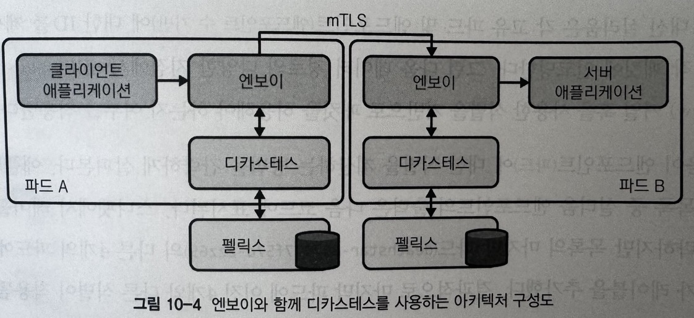

L3/L4에서의 네트워크 정책 적용을 제공해 사용자가 네임스페이스, 레이블 및 기타 메타데이터를 기반으로 Pod 간 통신을 제한한다. 네트워크 구성 (`iptables`) 를 수정해 IP 주소를 허용/비허용한다.
Envoy Proxy를 함께 사용하면 [Dikastes](https://github.com/projectcalico/calico/blob/master/app-policy/cmd/dikastes/dikastes.go) 컴포넌트를 사용해 SA 기반으로 정책 결정을 내릴 수 있도록 지원한다. 이 방법을 사용하면 애플리케이션 프로토콜 (헤더 등) 및 관련 암호화 식별 (인증서 등)의 특성에 따라 L7에서 적용할 수 있다.

Istio를 사용하는 경우 Istio가 mTLS만 수행하고 워크로드가 Citadel에서 서명한 인증서를 제공하는지 확인한다. Envoy는 Dikastes와 논의 전 CA를 확인해 요청을 Allow/Deny할지 결정한다. Dikastes는 Calico `NetworkPolicy` / `GlobalNetworkPolicy` 를 기반으로 결정을 내린다.

```yaml
apiVersion: projectcalico.org/v3
kind: GlobalNetworkPolicy
metadata:
  name: summary
spec:
  selector: app == 'summary'
  ingress:
  - action: Allow source
    serviceAccounts:
      names: ["customer"]
    NamespaceSelector: app == 'bank'
  egress:
  - action: Allow
```

#### Cilium

L3/L4에서의 네트워크 정책 적용을 제공해 사용자가 네임스페이스, 레이블 및 기타 메타데이터를 기반으로 Pod 간 통신을 제한한다. Cilium의 경우 L7에서 정책을 적용하고 SA로 서비스 액세스를 추가 도구 없이 제한하는 기능도 제공한다.

Calico와는 다르게 정책 적용을 IP 주소 및 노드 네트워크 구성 업데이트를 기반으로 하지 않고 각 고유 파드 및 엔드포인트에 대한 ID를 계산해 이를 각 패킷에 인코딩한다. 그런 다음 데이터 경로의 다양한 지점에서 eBPF 커널 훅을 사용한 식별을 기반으로 패킷 허용 여부를 결정한다.

```yaml
# SA `leia`로 할당된 Pod에서 Port 80의 /public 경로의 액세스를 제한, luke SA가 할당된 Pod에서만 액세스 허용
apiVersion: cilium.io/v2
kind: CiliumNetworkPolicy
metadata:
  name: k8s-svc-account
spec:
  endpointSelector:
    matchLabels:
      io.cilium.k8s.policy.serviceaccount: leia
  ingress:
  - fromEndpoints:
    - matchLabels:
        io.cilium.k8s.policy.serviceaccount: luke
    toPorts:
    - ports:
      - port: 80
        protocol: TCP
      rules: 
        http:
        - method: GET
          path: /public$
```

### ServiceAccount Token

ServiceAccount는 Pod 그룹의 식별을 제공하는 쿠버네티스 기본 요소이다. 모든 Pod에는 SA가 할당되며 별도 할당을 정의하지 않으면 namespace별 기본 SA가 할당된다.
ServiceAccount Token은 Kubernetes Secret으로 생성되는 JWT이다. 각 SA에는 JWT가 포함된 해당 암호가 있다. 달리 지정하지 않는 한 토큰은 해당 SA에서 실행되는 각 Pod에 탑재되며 K8s API를 요청할 떄 사용 가능하다.

```yaml
apiVersion: v1
kind: ServiceAccount
metadata:
  name: default
  namespace: default
secrets:
- name: default-token-mf9v2
```

SA가 생성되면 ~ v1.24까지는 아래와 같이 고유한 JWT를 포함하는 연결된 Secret이 생성된다. 다만 이후 버전에서는 자동으로 생성되지 않기 때문에 별도로 Secret을 생성해야 한다.
각 ServiceAccount에 대한 토큰 생성과 관리는 Token 컨트롤러가 수행한다.

```yaml
apiVersion: v1
kind: Secret
metadata:
  annotations:
    kubernetes.io/service-account.name: default
    kubernetes.io/service-account.uid: 59aee446-b36e-420f-99eb-a68895084c98
  name: default-token-mf9v2
  namespace: default
data:
  ca.crt: <.. Snippet ..>
  namespace: ZGVmYXVsdA==
  token: <.. Snippet ..>
type: kubernetes.io/service-account-token
```

다음과 같이 SA를 할당한다.

```yaml
apiVersion: v1
kind: Pod
metadata:
  name: my-pod
spec:
  serviceAccountName: my-pod-sa
  # Additional Fields Below
```

SA Secret(Token 포함)이 `/var/run/secrets/kubernetes.io/serviceaccount/` 에 있는 Pod에 마운트된다. 애플리케이션은 토큰을 검색해 클러스터의 다른 애플리케이션을 서비스 요청할 때 사용 가능하다.

```shell
curl -XPOST "https://{kube-apiserver IP}:{kube-apiserver Port}/apis/authentication.k8s.io/v1/tokenreviews" \
  -H 'Authorization: Bearer <token>' \
  -H 'Content-Type: application/json; charset=utf-8' \
  -d $'{
    "apiVersion": "authentication.k8s.io/v1",
    "kind": "TokenReview",
    "spec": {
        "token": "<token to verify>"
    }
  }'

# Returns Below:
# {
#     "apiVersion": "authentication.k8s.io/v1",
#     "kind": "TokenReview",
#     "metadata": {
#         "creationTimestamp": null
#     },
#     "spec": {
#         "token": "<token to verify>"
#     },
#     "status": {
#         "authenticated": true,
#         "user": {
#             "username": "system:serviceaccount:default:default",
#             "uid": "4afdf4d0-46d2-11e9-8716-005056bf4b40",
#             "groups": [
#                 "system:serviceaccounts",
#                 "system:serviceaccounts:default",
#                 "system:authenticated"
#             ]
#         }
#     }
# }
```

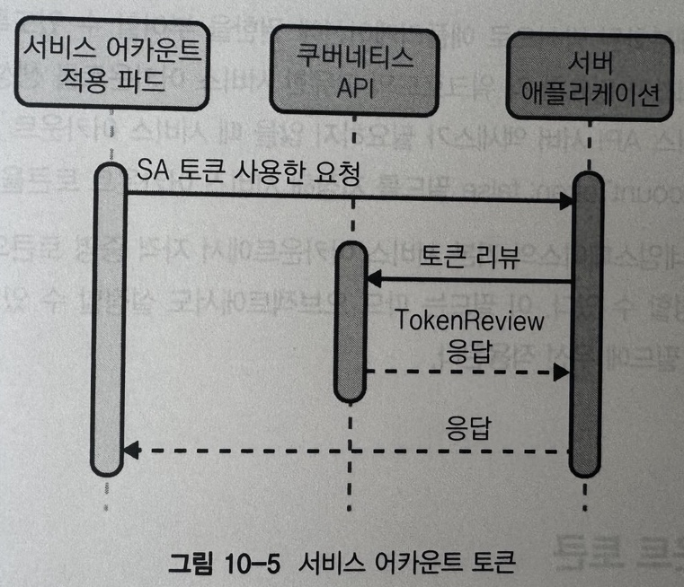

- SA가 삭제되면 토큰이 무효화되는 이슈를 고려해야 한다.
- 토큰을 클라이언트 식별의 한 혀앹로 사용하고 확인하려면 애플리케이션에 기능을 추가해야 한다.
- 토큰은 단일 클러스터로 범위가 지정되므로 클러스터 간 서비스 식별 / 인증 방법으로 이 경로를 사용하지 않는 것이 좋다.

> 워크로드에 kube-apiserver 액세스가 필요하지 않는 경우 SA 오브젝트에서 `automountServiceAccountToken: false` 필드를 설정한다.

### 예상 ServiceAccount Token (PSAT)

위 SA Token 방식 (이하 SAT)를 기반으로 하지만 일부 단점(TTL, 넓은 범위 및 지속성)을 해결하는 데 사용하는 추가 식별 방법이다.

```yaml
spec:
  containers:
  - command:
    - kube-apiserver
    - --service-account-signing-key-file=/etc/kubernetes/pki/sa.key
    - --service-account-key-file=/etc/kubernetes/pki/sa.pub
    - --service-account-issuer=api
    - --service-account-api-audiences=api
  # 기타 생략
  image: k8s.gcr.io/kube-apiserver:v1.17.3
```

SAT와 다른 점은 Pod/애플리케이션이 자동 마운트된 SA Token을 읽게 하는 대신 PSAT를 볼륨 마운트한다. 이렇게 하면 토큰이 Pod에 삽입됨은 물론 토큰 TTL과 사용자 정의 대상 지정이 가능하다.

```yaml
apiVersion: v1
kind: Pod
metadata:
  name: test
  labels:
    app: test
spec:
  serviceAccountName: test
  containers:
  - name: test
    image: ubuntu:bionic
    command: ['sh', '-c', 'echo Hello K8s! && sleep 3600'] 
    volumeMounts:
    - mountPath: /var/run/secrets/tokens
      name: app-token
  volumes:
  - name: app-token
    projected:
      sources:
      - serviceAccountToken:
          audience: api
          expirationSeconds: 600
          path: app-token
```

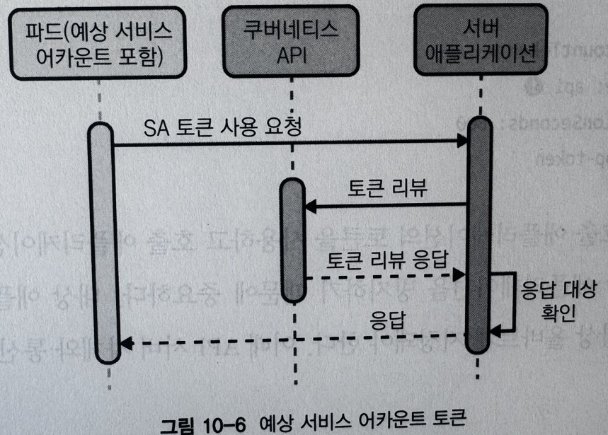

### 플랫폼 중재 노드 식별

워크로드가 AWS와 같은 플랫폼 위에서 실행될 떄, 워크로드의 메타데이터로 인해 플랫폼 자체에서 식별하고 워크로드에 식별자 할당이 가능하다.
이 때 식별은 워크로드 자체로 주장되지 않고 대역외 프로바이더 속성을 기반으로 결정된다. Provider는 플랫폼의 다른 서비스와 통신하는 데 사용할 수 있는 식별자를 증명하려고 워크로드 자격 증명을 반환하며, 다른 서비스도 동일한 플랫폼 위에 있으므로 해당 자격 증명을 확인하는 것이 간단해진다.

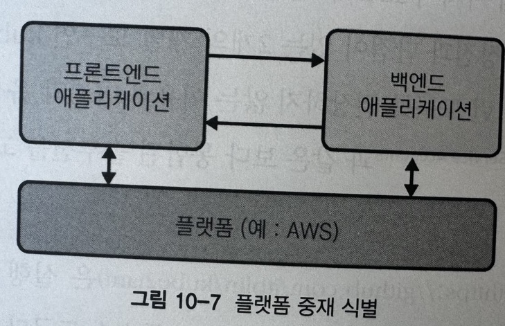

#### AWS 플랫폼 인증 메서드/도구

- AWS IAM
  - AWS의 경우 EC2 메타데이터 API로 노드 수준에서 강력한 자격 증명 솔루션을 제공한다.
  - EC2 메타데이터 API는 플랫폼이 자격 증명 / 식별 자체를 적용하는 엔티티 없이 여러 고유 속성을 기반으로 호출 엔티티를 식별할 수 있는 플랫폼 중재 시스템의 예
  - 플랫폼이 관련 정책으로 정의된 모든 서비스에 액세스할 수 있도록 하는 보안 자격 증명을 인스턴스에 전달

아래 두 가지 도구를 사용할 수 있다.

- kube2iam

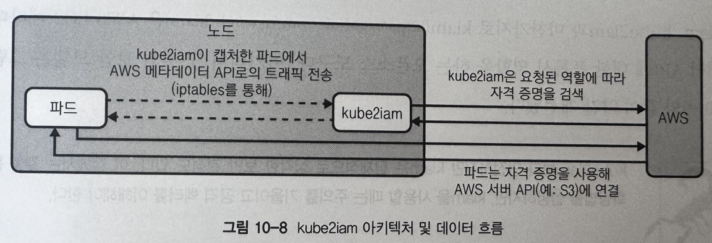

실행 중인 워크로드, AWS EC2 메타데이터 API 사이 프록시 역할을 하는 오픈소스이다. DaemonSet으로 배포되며 각 Pod는 iptables 규칙을 주입해 메타데이터 API의 Outbound Traffic을 캡쳐하고 해당 노드에서 실행 중인 kube2iam 인스턴스로 리디렉션 한다.

AWS API와 상호작용 하려는 Pod는 명세에서 annotation으로 역할 지정이 필요하다.

```yaml
apiVersion: apps/v1
kind: Deployment
spec:
  # ...
  template:
    metadata:
      annotations:
        iam.amazonaws.com/role: <role-arn>
```

- kiam

마찬가지로 AWS EC2 메타데이터 API에 대한 프록시 역할을 하는 오픈소스이다. 아키텍쳐와 보안 모델이 개선되었다.

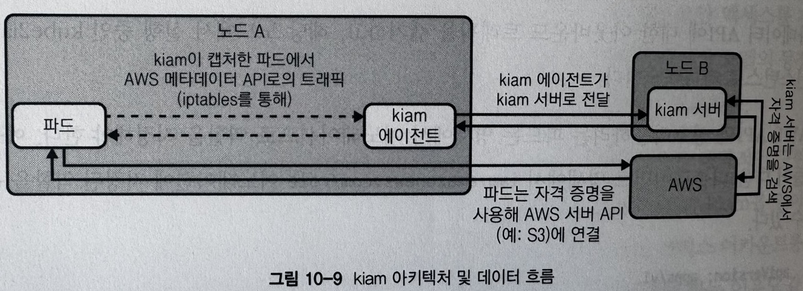

서버와 에이전트 컴포넌트가 있으며 에이전트는 DaemonSet으로 배포된다. 서버 컴포넌트는 Control Plane 노드나 클러스터 노드 하위 집합으로 제한될 수 있다.
에이전트가 EC2 Metadata API를 캡쳐하고 이를 서버 컴포넌트로 전달해 AWS에서 적절한 인증을 처리한다. 아래와 같이 서버 노드만 AWS IAM 역할을 적용하기 위한 액세스 권한이 필요하다.

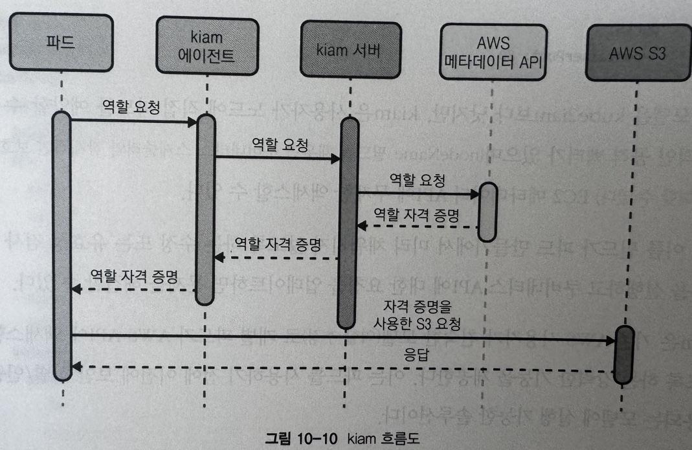

워크로드가 서버 노드에서 실행될 수 없도록 제어하기 위해 마찬가지로 annotation을 적용해야 한다.

이 도구를 사용할 때에는 사용자가 노드에 직접 Pod를 예약할 수 있는 잠재적 공격 벡터가 존재하며 EC2 Metadata API에 무제한 액세스가 가능하다.
--> 노드명 필드가 Pod spec 정의시 미리 채워지지 않도록 수정하거나 ValidatingWebhook을 실행하고 K8s API에 대한 요청을 업데이트하면 문제를 해결할 수 있다.

- SA에 대한 IAM Role

AWS에서는 IRSA (IAM Role for SA)라는 네이티브 통합을 제공한다. 클러스터에서 실행되는 Pod에서 SA를 사용하여 AWS 서비스에 대한 액세스 권한을 부여한다.

높은 수준에서 IRSA는 사용자가 원하는 IAM Role로 Pod에 annotation을 달 수 있다는 점에서 위 두 도구와 유사한 경험을 제공한다. 구현이 다르지만 기존 접근 방식의 보안 문제를 제거한다.

IRSA는 OIDC와 AWS STS (Security Token Service)를 통해 IAM Role을 할당하는 방식으로 동작한다. (그리고 토큰은 PSAT에 의해 TTL이 지나면 만료된다.)

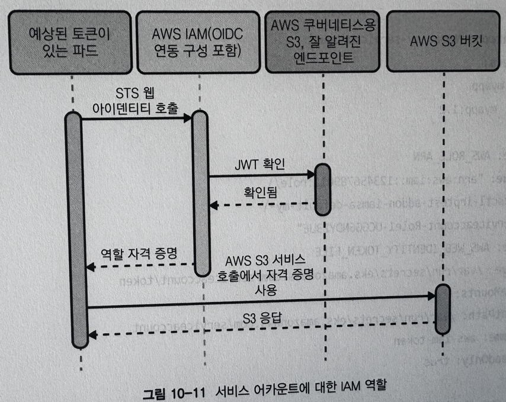


EKS에서 IRSA를 사용하는 것은 보안 취약성을 줄이는데 가장 최적이다. Node에 IAM Role을 할당하면 IRSA를 쓰지 않아도 쉽게 권한 제어가 가능하지만 Node 안에 다양한 서비스의 Pod가 배포되어 있으면 Pod별로 IAM Role을 관리할 수 없으므로 보안에 취약점이 생기는 부분이 있다.

#### SPIFFE / SPIRE를 통한 크로스 플랫폼 식별

SPIFFE는 다양한 플랫폼 지원 암호화 ID를 통해 동적인 이기종 환경에서 소프트웨어 서비스를 안전하게 인증하는 오픈소스 표준 집합이다.
SPIRE는 다양한 환경에 SPIFFE 사양을 구현하는 오픈소스 시스템이다. 애플리케이션이 SVID(SPIFFE Verifiable Identity Document, X509/JWT와 같은 기존 암호화 형식을 활용할 수 있는 식별 구문)를 제공하고 소비할 수 있도록 여러 SDK 및 통합 기능이 제공된다.

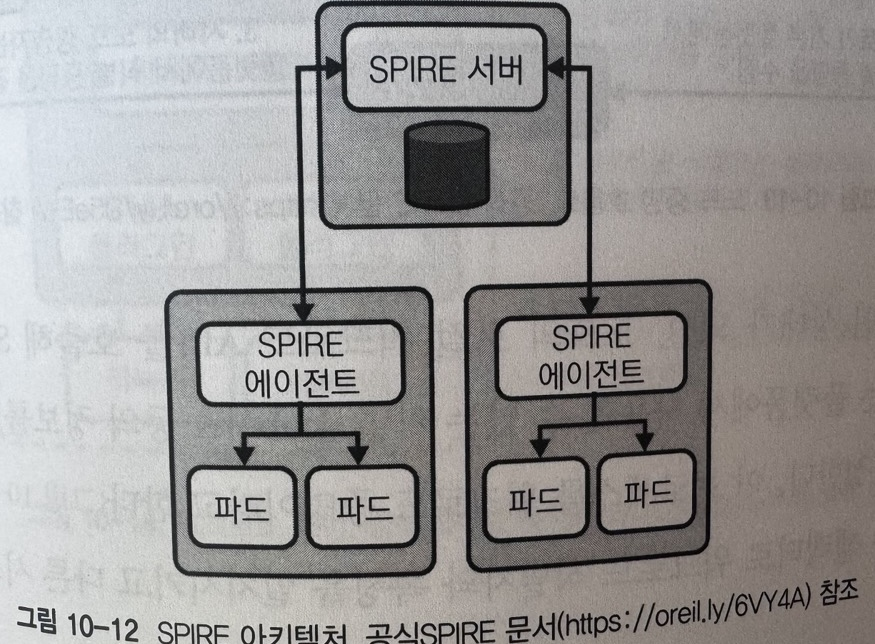

SPIRE는 식별자의 CA 역할을 하는 서버 컴포넌트를 실행하고 모든 워크로드 식별자의 레지스트리와 식별 문서를 발급하는데 필요한 조건을 유지/관리한다.

에이전트 컴포넌트는 Unix 소켓으로 식별자를 요청하려고 Workload용 API를 노출하는 DaemonSet이며, 노드의 각 Pod에 대한 메타데이터를 결정하기 위해 kubelet 에 대한 Read-only Access로 구성된다.

에이전트가 Active 상태가 되면 노드 증명 프로세스로 자신을 확인하고 서버에 등록한다. 이 프로세스는 환경 컨텍스트 (AWS EC2 Metadata API / K8s PSAT)을 활용해 노드를 식별하고 SPIFFE ID를 할당하며 서버는 X509 SVID 형식으로 노드 ID를 발급한다.

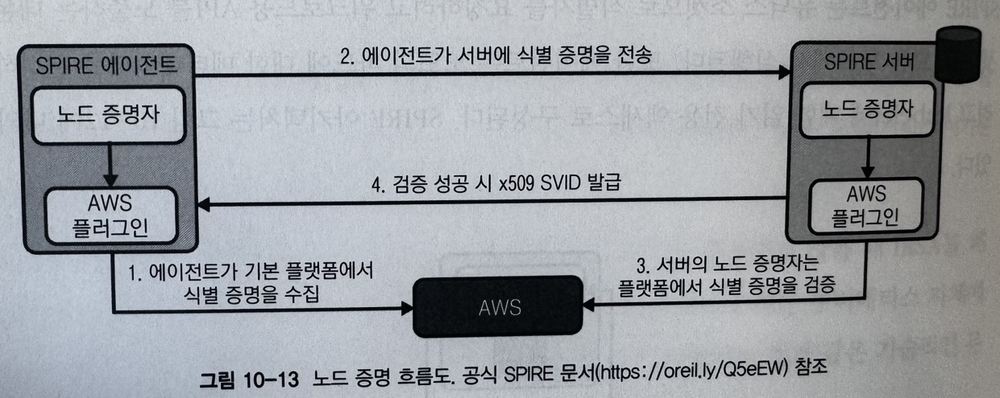

```shell
# SPIRE 서버에 SPIFFE ID를 에이전트 Pod가 지정된 Selector를 충족하는 노드에 할당하도록 지시
/opt/spire/bin/spire-server entry create\
  -spiffeID spiffe://production-trust-domain/nodes \
  -selector k8s_psat:cluster:production-cluster \
  -selector k8s_psat:agent_ns:spire \
  -selector k8s_psat:agent_sa:spire-agent \
  -node
```

워크로드가 Active 상태가 되면 Node의 로컬 Workload API를 호출해 SVID를 요청한다. SPIRE Agent가 플랫폼에서 사용할 수 있는 커널과 kubelet 정보를 사용해 호출 워크로드의 속성을 결정한다. (워크로드 증명)
그 후 SPIRE 서버가 selector로 워크로드 식별자와 속성을 일치시키고 다른 시스템 인증에 사용할 수 있는 SVID를 에이전트로 워크로드에 반환한다.

```shell
/opt/spire/bin/spire-server entry create\
  -spiffeID spiffe://production-trust-domain/service-a \
  -parentID spiffe://production-trust-domain/nodes \
  -selector k8s:ns:default \
  -selector k8s:sa:service-a \
  -selector k8s:pod-label:app:frontend \
  -selector k8s:container-image:docker.io/.../service-a:v.0.0.1
```

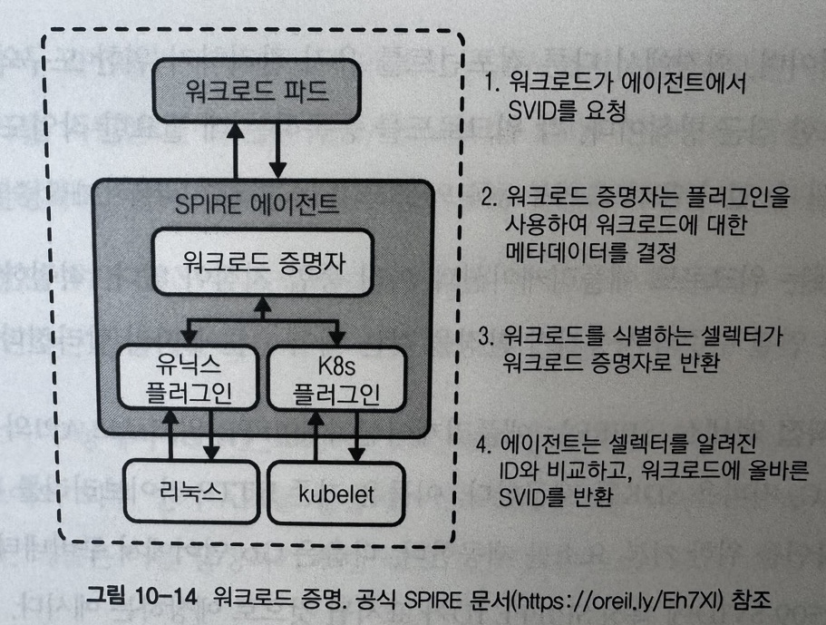

SPIFFE / SPIRE를 통한 크로스 플랫폼 식별 패턴은 K8s 안팎으로 워크로드에 강력한 ID 시스템을 구축할 때 상당한 이점을 가진다.
SPIFFE 명세는 X509와 JWT에서 잘 이해되고 널리 지원되는 암호화 표준을 활용하며 SPIRE 구현은 다양한 애플리케이션 통합 방법도 지원한다. PSAT을 자체 selector와 결합하여 개별 Pod를 식별함으로써 매우 세분화된 수준으로 ID 범위를 지정할 수 있는 속성이 있는 기능이 있다.
사이드카 컨테이너가 Pod에 있으며 각 컨테이너에 다양한 액세스 수준이 필요한 시나리오에서 유용하다.

SPIFFE / SPIRE에는 워크로드 애플리케이션과 여러 통합 지점이 있으며 적절한 통합 지점은 플랫폼에 원하는 연결 수준과 사용자가 환경을 갖는 제어 수준에 따라 아래와 같이 달라진다.

- 애플리케이션 직접 액세스
  - 애플리케이션이 SPIFFE 워크로드 API와 직접 통합 가능하도록 각 언어용 SDK를 제공한다. 단순 HTTP Client를 Wrapping 하는 수준이지만, 식별자 획득 및 확인을 위한 기본 요소가 제공된다.
  - 직접 통합은 아래와 같은 이유로 권장되지 않는다.
    - 애플리케이션과 플랫폼/구현을 Strong-coupled 시킨다.
    - SPIRE Agent Unix Socket을 Pod에 Mount해야 한다.
    - 쉽게 확장이 어렵다.

- Service Mesh 통합 (Istio)
  - Istio CA는 `spiffe://cluster.local/ns/<namespace>/sa/<service_account>` 형태로 SPIFFE ID를 인코딩해 모든 SA SVID를 생성한다. 따라서 메시의 서비스는 SPIFFE 인식 엔드포인트를 활용 가능하다.

  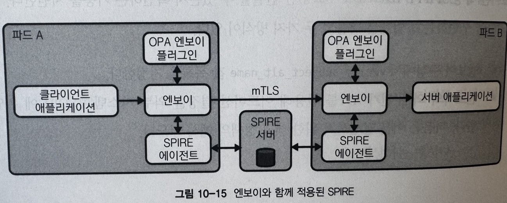

- 기타 애플리케이션 통합
- 시크릿 저장소 (Vault 등)와의 통합
  - OIDC Provider로 SPIRE 서버와 OIDC Federation을 사용해 클라이언트 인증하도록 구성 가능
  - Vault와 같은 시크릿 저장소 Role은 SPIFFE ID에 바인딩될 수 있으므로 워크로드가 SPIRE에서 JWT SVID를 요청할 때 시크릿 저장소가 Role을 획득하고 접근자 자격 증명을 얻는 데 유효한 기능을 제공한다.
- AWS와의 통합
  - AWS IRSA 혹은 시크릿 저장소 통합 방식과 동일한 OIDC 연동 아이디어를 활용한다.
  - Workload가 Federation OIDC Provider (SPIRE 서버) 유효성을 검사해 AWS에서 확인한 JWT SVID를 요청한다.
    - AWS에서 JWT를 검증하는 데 필요한 JWKS (JSON Web Key Set) 자료를 검색하려 할 때 SPIRE에 Public Access해야 하는 단점이 있다.