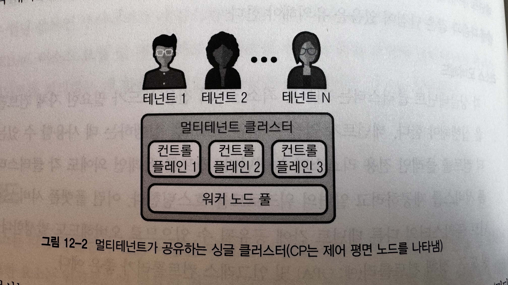
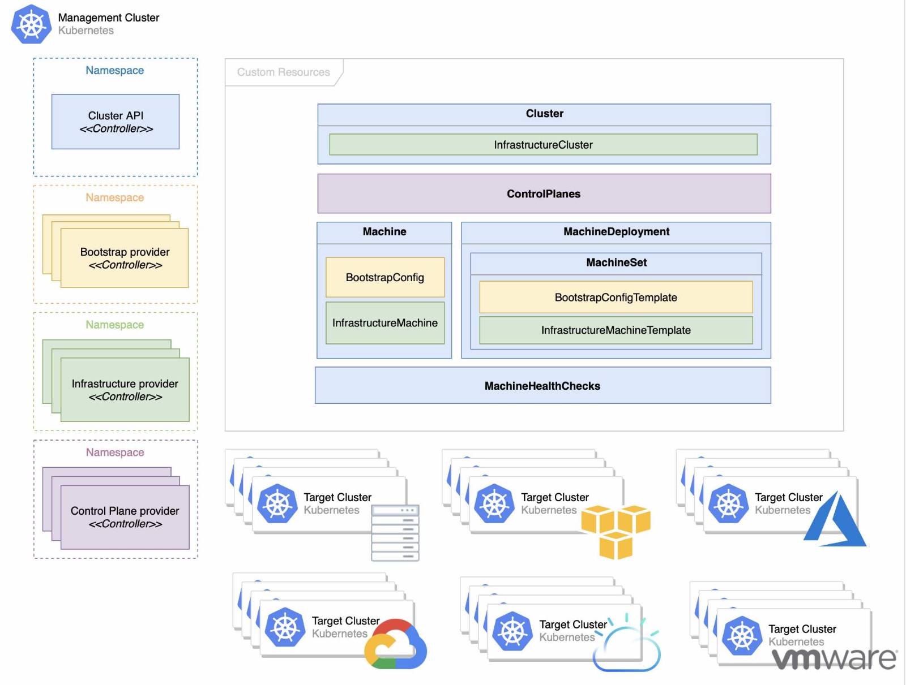
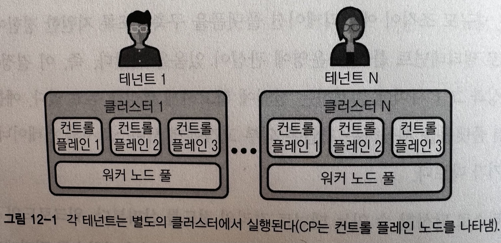

> [!NOTE]
> 책 내용 + 기타 레퍼런스를 보완한 요약본입니다.

# Chapter 12] 멀티테넌시

## Overview

쿠버네티스는 Tenant를 정의하지 않는다. 동일한 플랫폼에서 Tenant가 안전하게 공존할 수 있도록 하는데 사용할 다양한 핸들러를 Kubernetes에서 제공한다.

---

## 격리 정도

워크로드의 특성과 특정 요구사항에 따라 테넌트 격리 정도가 결정된다. 일반적으로 따를 수 있는 Tenancy 모델에는 Single Tenant Cluster, Multi Tenant Cluster가 있다.

### Single Tenant Cluster



이 모델에서는 클러스터 리소스를 공유하지 않기 때문에 Tenant간 가장 강력한 격리가 제공된다. 클러스터 리소스 공유가 없어서 복잡한 Multi-tenant 지원 문제, 즉 Tenant 격리 문제가 없어 매력적인 모델이다.

다음과 같은 단점도 존재한다.

- 리소스 오버헤드
    - 각 Single Tenant Cluster는 대부분 최소 3개의 전용 노드가 필요한 자체 Control Plane을 실행해야 하는데, 테넌트가 많을 수록 워크로드 실행에 사용할 수 있는 Cluster Control Plane 전용 리소스가 늘어난다.
    - Control Plane 외에도 각 클러스터는 플랫폼 서비스 제공을 위해 일련의 워크로드를 호스팅한다.
    - 이러한 플랫폼 서비스는 Multi-Tenant Cluster의 다른 Tenant와 공유될 수 있으므로 오버헤드가 발생한다.
        - e.g. Monitoring Tools, OPA, Ingress Controller
- 관리 복잡성 증가
    - 플랫폼 팀이 여러 클러스터를 관리해야 한다. 각 클러스터에 배포/추적/업그레이드를 수행해야 하고 보안 취약점을 수정해야 한다.

> #### CAPI (K8s Cluster API)
> 쿠버네티스 하위 프로젝트로 쿠버네티스 클러스터를 프로비저닝, 업그레이드 및 운영하기 위한 선언적 API 및 도구를 제공한다. 커스텀 리소스를 사용해 Cluster API 자원을 정의하고 관리한다.
> 
> - Machine
> - MachineSet
> - MachineDeployment
> - Cluster
> - ControlPlane

### Multi Tenant Cluster



Single Tenant Cluster의 단점을 개선한다. Cluster per-Tenant 대신 플랫폼팀이 더 적은 수의 클러스터로 테넌트를 관리할 수 있어 리소스 오버헤드와 관리 복잡성이 줄어든다. 그럼에도 불구하고 테넌트간 영향을 미치지 않고 공존 가능하다.

아래와 같이 Soft Multi-Tenancy와 Hard Multi-Tenancy 두 가지 유형으로 제공된다.

#### Soft Multi-Tenancy

플랫폼의 테넌트 간 일정 수준의 신뢰가 존재한다고 가정한다. 이 모델은 일반적으로 테넌트가 동일 조직에 속할 때 실행 가능하다.

#### Hard Multi-Tenancy

테넌트 간 신뢰가 없음을 설정한다. 다른 조직에 속한 신뢰할 수 없는 코드를 실행하는 플랫폼이 좋은 예시다. 이 때 테넌트가 클러스터를 안전하게 공유할 수 있도록 하기 위해 테넌트 간 강력한 격리가 중요하다.

워크로드에 필요한 격리를 결정하려면 K8s 기반 플랫폼에서 격리를 적용할 수 있는 다양한 레이어를 고려해야 한다.

- Workload (Data) Plane
    - 워크로드가 실행되는 노드로 구성된다. 이 수준의 격리에는 Node 리소스, 보안 및 네트워크 경계 등의 요소가 포함된다.
- Control Plane
    - API 서버, 컨트롤러 관리자 및 스케줄러와 같은 K8s 클러스터를 구성하는 구성요소를 포함한다. K8s에는 RBAC, Admission Control, API Priority 및 공정성을 포함해 이 수준에서 테넌트를 분리하는 데 사용할 수 있는 다양한 메커니즘이 있다.
- Platform Services
    - 중앙 집중식 로깅, 모니터링, Ingress, Cluster 내 DNS 등이 포함된다. 워크로드에 따라 플랫폼 서비스 또는 기능에도 일정 수준의 격리가 필요할 수 있다.
        - Tenant간의 로그 검사, 클러스터의 DNS 서버로 서로의 서비스 검색 방지 등

---

## namespace 경계

### 팀당 네임스페이스

각 팀이 클러스터의 Single namespace에 액세스 가능하며 특정 팀에 정책 및 할당량을 간단하게 적용할 수 있는 접근 방식
여러 서비스를 소유한 팀이 싱글 네임스페이스에 존재하는 것이 복잡할 수 있다.
일반적으로 K8s로 처음 온보딩하는 소규모 조직이 사용하기 좋은 모델이다.

### 애플리케이션당 네임스페이스

클러스터의 각 애플리케이션에 namespace를 할당하므로 애플리케이션별 정책 및 할당량 적용이 더 용이한 접근 방식.
일반적으로 테넌트가 여러 네임스페이스에 액세스 가능하므로 테넌트 초기 구축 프로세스와 테넌트 수준 정책 및 할당량을 적용하는 기능이 복잡해지는 단점이 있다. Multi-Tenant 플랫폼을 구축하는 대규모 조직 및 기업에 가장 적합한 방식이다.

### 레이어당 네임스페이스

네임스페이스를 사용해 다른 런타임 레이어(혹은 환경)을 설정하는 패턴.
개발/스테이징/운영 레이어를 별도의 클러스터로 사용하는 것을 선호하기 때문에 일반적으로는 이 방식을 사용하지 않는다.

## 쿠버네티스 멀티테넌시

다음은 Control Plane 레이어에서 사용할 수 있는 격리 메커니즘을 설명한다.

### RBAC

동일 클러스터에서 멀티테넌트를 호스팅할 때 테넌트가 자신에게 속하지 않는 리소스를 수정하지 못하도록 API 서버 레이어에서 격리를 적용해야 하는데 이때 RBAC을 통해 이 정책을 구성할 수 있다.

```yaml
apiVersion: rbac.authorization.k8s.io/v1
kind: RoleBinding
metadata:
  name: viewers
  namespace: app
roleRef:
    apiGroup: rbac.authorization.k8s.io
    kind: ClusterRole
    name: view
subjects:
- apiGroup: rbac.authorization.k8s.io
  kind: Group
  name: app1-viewer
```

> #### ClusterRole의 기본 제공 역할
> - admin
>   - 리소스를 보고 편집하는 것 외에 Role 및 RoleBinding을 만들 수 있다. Role은 일반적으로 테넌트 관리자에게 바인딩되어 네임스페이스 관리 문제를 위임한다.
> - edit
>   - 테넌트가 네임스페이스 범위 리소스를 볼 뿐만 아니라 생성, 수정 및 삭제 가능하다. Role 능력을 감안할 때 edit 역할의 Binding은 애플리케이션 배포에 대한 접근 방식에 따라 크게 달라진다. 
> - view
>   - 테넌트에게 네임스페이스 범위 리소스에 대한 읽기 전용 액세스 권한을 부여한다. 예를 들어 Role은 모든 개발자에 Binding될 수 있다. (운영 클러스터에서 리소스를 검사하고 문제를 해결할 수 있기 때문)

### 리소스 할당량

`ResourceQuota` 오브젝트로 정의된 리소스 쿼터는 네임스페이스별 총 리소스 사용을 제한하는 제약 조건이 제공된다. 유형별로 네임스페이스에서 만들 수 있는 오브젝트 수와 해당 네임스페이스 리소스가 사용할 수 있는 총 컴퓨팅 리소스 양을 제한할 수 있다.

다음과 같이 동작한다.

- 다른 팀은 다른 네임스페이스에서 작업한다. 이것은 RBAC으로 설정할 수 있다.
- 관리자는 각 네임스페이스에 대해 하나의 리소스쿼터를 생성한다.
- 사용자는 네임스페이스에서 리소스(파드, 서비스 등)를 생성하고 쿼터 시스템은 사용량을 추적하여 리소스쿼터에 정의된 하드(hard) 리소스 제한을 초과하지 않도록 한다.
- 리소스를 생성하거나 업데이트할 때 쿼터 제약 조건을 위반하면 위반된 제약 조건을 설명하는 메시지와 함께 HTTP 상태 코드 403 FORBIDDEN으로 요청이 실패한다.
- cpu, memory와 같은 컴퓨트 리소스에 대해 네임스페이스에서 쿼터가 활성화된 경우 사용자는 해당값에 대한 요청 또는 제한을 지정해야 한다. 그렇지 않으면 쿼터 시스템이 파드 생성을 거부할 수 있다. 힌트: 컴퓨트 리소스 요구 사항이 없는 파드를 기본값으로 설정하려면 LimitRanger 어드미션 컨트롤러를 사용하자.

```yaml
apiVersion: v1
kind: ResourceQuota
metadata:
  name: cpu-mem
  namespace: app1
spec:
  hard:
    requests.cpu: "4"
    requests.memory: 5Gi
    limits.cpu: "6"
    limits.memory: 6Gi  
```

### Admission Webhook

위의 `ResourceQuota`는 Admission Controller를 사용해 구현된다.

### 리소스 요청 및 제한

쿠버네티스의 리소스 요청 및 제한은 컴퓨팅 리소스와 관련하여 테넌트를 서로 격리하는 메커니즘으로 리소스 요청의 경우 일반적으로 K8s 스케줄러 수준에서 수행된다. 대조적으로 리소스 제한은 cgroup 및 Linux CFS를 사용해 노드 수준에서 구현된다.

리소스 격리 제공 외에도 리소스 요청 및 제한은 Pod의 QoS 클래스를 결정한다. 이는 노드 리소스가 부족할 때 kubelet이 Pod 축출 순서를 결정하는데 사용하기 때문에 중요하다. 다음과 같은 클래스가 있다.

- Guaranteed
  - 리소스 요청과 제한이 동일하다. 이 모델은 리소스가 항상 사용 가능하다는 것을 보장한다.
- Burstable
  - 보장 자격이 없고 CPU 혹은 메모리 요청과 제한이 다르다. 이 모델은 리소스가 사용 가능한 경우에만 사용할 수 있다.
- BestEffort
  - CPU 혹은 메모리 제한과 요청이 없다. 이름 그대로 가능한 한 리소스를 사용할 수 있도록 하나 kubelet에 의해 가장 먼저 Evicted될 수 있다.

  

### 네트워크 정책

대부분의 배포에서 쿠버네티스는 플랫폼에서 실행되는 모든 Pod가 서로 통신 가능한 것을 가정한다. 그러나 특정 시나리오에서는 특정 Pod가 다른 Pod와 통신하지 못하도록 해야 할 수 있다. 이때 네트워크 정책을 사용해 특정 Pod 간 통신을 제한할 수 있다.

```yaml
apiVersion: networking.k8s.io/v1
kind: NetworkPolicy
metadata:
  name: default-deny-all
  namespace: app1
spec:
  podSelector: {}
  policyTypes:
  - Egress
  - Ingress
```

일부 CNI 플러그인에서는 확장된 NetworkPolicy 또한 자체적으로 제공한다. 이를 사용해서 클러스터 수준이나 글로벌 수준의 네트워크 정책 또한 지정 가능하도록 별도 CRD를 제공한다.

```yaml
apiVersion: projectcalico.org/v3
kind: GlobalNetworkPolicy
metadata:
  name: deny-all
spec:
  selector: all()
  types:
  - Egress
  - Ingress
```

### PodSecurityPolicy

PSP는 테넌트가 동일한 클러스터에서 안전하게 공존할 수 있도록 하는 중요한 메커니즘으로 권한 있는 실행, 호스트 볼륨 액세스, 호스트 네트워크 바인딩 등과 같은 런타임 시 Pod의 중요한 보안 매개변수를 제어한다.

K8s에서는 Admission Controller를 사용해 PSP로 구현된 대부분의 제어를 시행하기 때문에 PSP에서 허용하지 않는 한 Pod 생성 시도 등의 요청이 차단된다.

```yaml
apiVersion: policy/v1beta1
kind: PodSecurityPolicy
metadata:
  name: restricted
spec:
  privileged: false
  allowPrivilegeEscalation: false
  requiredDropCapabilities:
  - ALL
  volumes:
  - 'configMap'
  - 'emptyDir'
  - 'projected'
  - 'secret'
  hostNetwork: false
  hostPorts:
  - min: 10000
    max: 11000
  hostIPC: false
  hostPID: false
  runAsUser:
    rule: 'RunAsAny'
  seLinux:
    rule: 'RunAsAny'
  supplementalGroups:
    rule: 'RunAsAny'
  fsGroup:
    rule: 'RunAsAny'
  readOnlyRootFilesystem: false
```

### Multi-Tenant Platform Service

Control Plane과 Data Plane을 격리하는 것 외에도 플랫폼에서 제공하는 다양한 서비스에서 격리를 시행할 수 있다. 여기에는 로깅, 모니터링, Ingress 등과 같은 서비스가 포함된다.