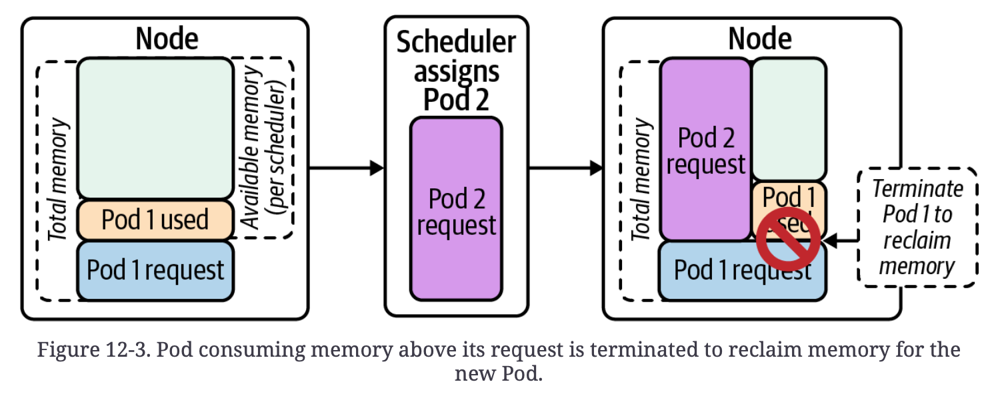

# Chapter 12. Multitenancy

tenant는 정의하기 나름이다. (app, dev team, business unit, etc.)


## Degrees of Isolation

workload에게 요구되는 isolation 수준을 결정해야 한다.

### Single-Tenant Clusters


- 보다시피 resource 공유가 없으므로, 가장 강력한 isolation이다.
- tenant가 많지 않을 경우 채택할만 하다.

#### 단점

**resource overhead**

- 각 cluster 마다 control plane이 필요하다. tenant count == cluster count

  monitoring tool, policy controller, ingres controller 등 또한 overhead가 된다.

**management 복잡도 증가 **

- 각 cluster마다 deploy, track upgrade 등 작업들을 수행해야 된다.


위 단점들에도 불구하고, single-tenant cluster로도 잘 운용하는 사례들이 많다.


### Multitenant Clusters


single-tenant cluster 에서 갖는 문제점들을 해결해줄 수 있다.

#### Soft multitenancy

- 'multiteam'이라고도 한다.

- tenant간의 일정 부분 신뢰가 있음을 전제로 한다. (동일한 조직일 경우)

- 신뢰가 존재하더라도 의도치 않은 문제 상황 발생이 가능하므로 tenant isolation이 필요하다.

  

#### Hard multitenancy

- tenant간 비신뢰 기반
- cluster를 안정적으로 공유하기 위해 강력한 isolation이 필요


multitenancy가 얼마나 soft하고 hard한지는 명확히 나눠지지 않음 (스펙트럼과 같다.)

따라서 trade off (비용 절감 vs 격리 수준) 를 잘 생각해서 적절하게 구현되어야 한다.

격리 적용

- **workload plane**

  node resource, 보안, network boundary 공유

- **control plane**

  cluster를 이루는 component들 (API server, controller manager, scheduler...)

  격리 방안:

  - Authorization(RBAC), Admission control, API priority & fairness

- **platform services**
  - 중앙화된 logging, monitoring, ingress, in-cluster DNS...


## The Namespace Boundary

control plane의 logical construct

 workload plane에서는 아무 의미 없다.

isolation에서 가장 먼저 고려되어야 하는 것이 namespace이다.

**namespace per team**

- 특정 team에게 policy나 quota 적용 용이함
- 너무 많은 service를 소유하는 집단일 경우 하나의 namespace는 부족할 수 있다.

**namespace per app.**

- 특정 app에게 policy나 quota 적용 용이함
- tenant들에게 여러 namespace를 부여해야 됨
- tenant level의 policy & quota를 적용시키기 까다로워짐

**namespace per tier**

- runtime tier(env) 별로 namespace를 달리하는 것
- cluster 자체를 dev, staging, prod로 나누기 때문에 별로 사용되지 않는다.


## Multitenancy in K8S


### RBAC (Role-Based Access Control)

**control plane layer에서의 isolation 제공**

tenant가 소유하지 않는 다른 resource들에 대한 조작이 불가능하도록 API server layer에서의 격리가 필요하다.

Role & ClusterRole을 tenant들의 identity에 binding한다.

**binding 예시**

```yaml
apiVersion: rbac.authorization.k8s.io/v1
kind: RoleBinding
metadata:
  name: viewers
  namespace: app1
roleRef:
  apiGroup: rbac.authorization.k8s.io
  kind: ClusterRole
  name: view
subjects:
- apiGroup: rbac.authorization.k8s.io
  kind: Group
  name: app1-viewer
```

위의 `view`는 built-in role이다.

**bulit-in roles**

- `view`
  - readonly-access
  - namespace-scoped
- `edit`
  - view, create, modify, delete
  - namespace-scoped
- `admin`
  - 위 권한들 포함 / Role과 RoleBinding 생성, 조작 가능

> [!NOTE]
>
> Namespace 목록 조회에 대한 권한 제어는 존재하지 않기 때문에 해당 요구사항이 발생한다면 더 고수준의 추상화를 구축해야 한다. (Openshift에서 제공해주는 project resource 사용 등)


### Resource Quotas

- namespace level에 적용된다.
  - 따라서 namespace strategy 또한 고려되어야 한다.
    - 각 tenant가 단일 namespace를 갖는다면 단순히 각 namespace에 `ResourceQuota`를 생성하면 된다.
    - tenant가 복수의 namespace에 접근할 수 있다면, 추가적인 자동화나 controller가 필요해진다.

- CPU, memory, storage 제한
- Namespace 내에서 생성될 수 있는 API object(Pods, Services, etc.) 수 제한
  - 제한하지 않으면 cloud 환경에서의 LoadBalancer Service(비쌈) 가 남용될 수 있음

**ResourceQuota 예시**

```yaml
apiVersion: v1
kind: ResourceQuota
metadata:
  name: cpu-mem
  namespace: app1
spec:
  hard:
    requests.cpu: "1"
    requests.memory: 512Mi
    limits.cpu: "1"
    limits.memory: 512Mi
```

만약 해당 object가 적용된 상황에서 0.5 CPU, 256MiB를 요구하는 Pod이 scheduling 된다면?

```shell
$ kubectl describe resourcequota cpu-mem
Name: 						cpu-mem
Namespace: 				app1
Resource 					Used 	Hard
-------- 					---- 	----
limits.cpu 				500m 	1
limits.memory 		512Mi 512Mi
requests.cpu 			500m 	1
requests.memory 	512Mi 512Mi
```

Hard를 초과하는 요청이 발생할 경우에는 오류가 발생한다.


### Admission Webhooks

mutating & validating webhooks

**multitenancy에서의 use case들**

- **Standardized labels**
  - label들에 대한 표준화로 validating admission webhook으로 표준에 맞지 않는 label들을 제한한다.
- **Require fields**
  - 특정 resource들의 특정 field를 강제할 수 있다.
  - 예시) https 필드 강제, readiness, liveness probe 강제 등
- **Set guardrails**
  - 특정 resource, 기능에 대한 제한
- **MultiNamespace resource quotas**
  - tenant가 여러 namespace에 접근가능할 경우

Gatekeeper(OPA 기반), Kyverno 등으로 보다 간단하게 구현 가능하다.


### Resource Requests and Limits

다른 tenant들의 resource들이 동일한 node에 위치하게 되면 서로 영향을 미칠 수 있게 된다.

resource requests & limits는 QoS(Quality of Service) class 또한 결정한다.

**QoS**

- Node의 resource가 부족할 때 어떤 Pod을 evict 시킬지 결정할 때 사용
- `Guaranteed`
  - request와 limit이 일치한다.
  - evict당하는 일이 거의 없음
- `Burstable`
  - request를 초과한 resource 사용량이 많을수록 eviction 대상이 된다.
- `BestEffort`
  - limit이나 request가 존재하지 않는다.
  - 가장 먼저 evict되는 대상




resource가 부족할 경우 request를 초과 사용하는 pod을 evict시킨다.


### Network Policies

**network-level isolation**

**default deny-all network policy model을 구현하기 위한 방법 2가지**

1. `NetworkPolicy` API 사용

   - core API이기 때문에 여러 CNI plug-in들에 적용 가능

   - namespace-scoped이기 때문에 각 namespace에 NetworkPolicy object를 생성, 관리해야 됨

   - 각 tenant는 NetworkPolicy object에 대한 권한이 필요함

     - admission webhook을 통해 tenant가 default deny-all NetworkPolicy에 접근하지 못하도록 한다.

   - 예시

     ```yaml
     apiVersion: networking.k8s.io/v1
     kind: NetworkPolicy
     metadata:
       name: default-deny-all
       namespace: tenant-a
     spec:
       podSelector: {}
       policyTypes:
       - Ingress
       - Egress
     ```

     

2. 특정 CNI plug-in의 CRD 사용

   - Antrea, Calico, Cilium과 같은 CNI plug-in에서 cluster-level 또는 global한 network policy를 제공해준다.

     각 namespace마다 생성할 필요가 없어져서 관리가 쉽다.

   - 말 그대로 특정 CNI plug-in에 의존하게 된다.

   - 예시 (Calico `GlobalNetworkPolicy` CRD)

     ```yaml
     apiVersion: projectcalico.org/v3
     kind: GlobalNetworkPolicy
     metadata:
     	name: default-deny
     spec:
       selector: all()
       types:
       - Ingress
       - Egress
     ```

     

default deny-all network policy이기 때문에 tenant들이 자신들의 목적을 달성하기 위해 `NetworkPolicy` resource를 생성해서 사용한다.

**tenant의 ingress, egress 설정**

```yaml
apiVersion: networking.k8s.io/v1
kind: NetworkPolicy
metadata:
  name: webservice
  namespace: reservations
spec:
  podSelector:
    matchLabels:
    	role: webservice
  policyTypes:
  - Ingress
  - Egress
  ingress:
  - from:
    - podSelector:
      matchLabels:
      	role: frontend
    ports:
    - protocol: TCP
    	port: 8080
  egress:
  - to:
    - podSelector:
    	role: database
  ports:
  - protocol: TCP
  	port: 3306
```


### Pod Security Admission

> (Pod Security Policy 삭제됨)

Pod Security Admission 기능을 활성화하거나 

PSS(Pod Security Standards)를 준수하는 out-of-tree webhook 사용 가능하다.

**namespace label로 설정**

```yaml
# <MODE>: enforce | audit | warn
# <LEVEL>: privileged | baseline | restricted
pod-security.kubernetes.io/<MODE>: <LEVEL>
```

**MODE**

- `enforce`: 정책 위반시 Pod 거부

- `audit`: 정책 위반이 audit log에 audit annotation event로 추가되지만, 허용됨

- `warn`: 경고가 트리거 돼서 정책 위반이 사용자에게 보이지만, 허용됨

**LEVEL**

- `privileged`: 가장 넓은 권한 제공
- `baseline`: 기본 pod 설정 허용
- `restricted`: PSS 준수


