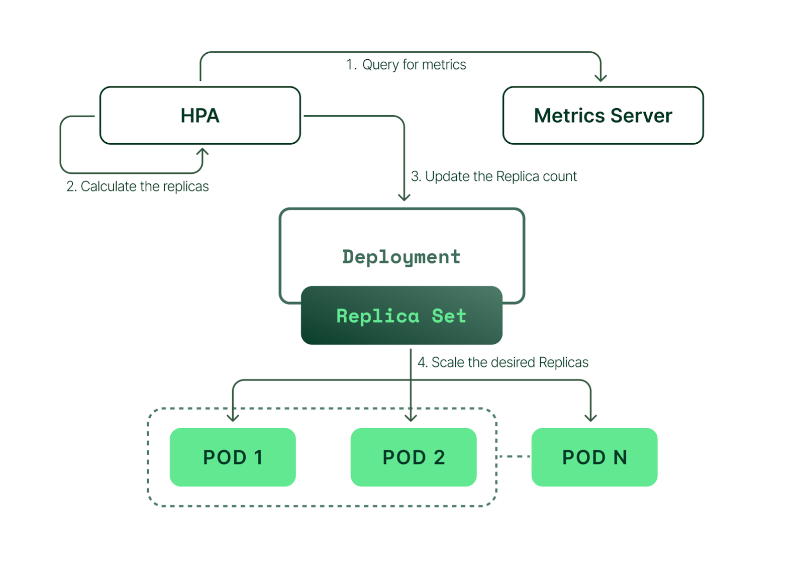
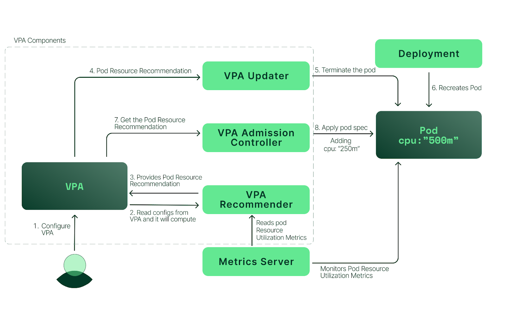
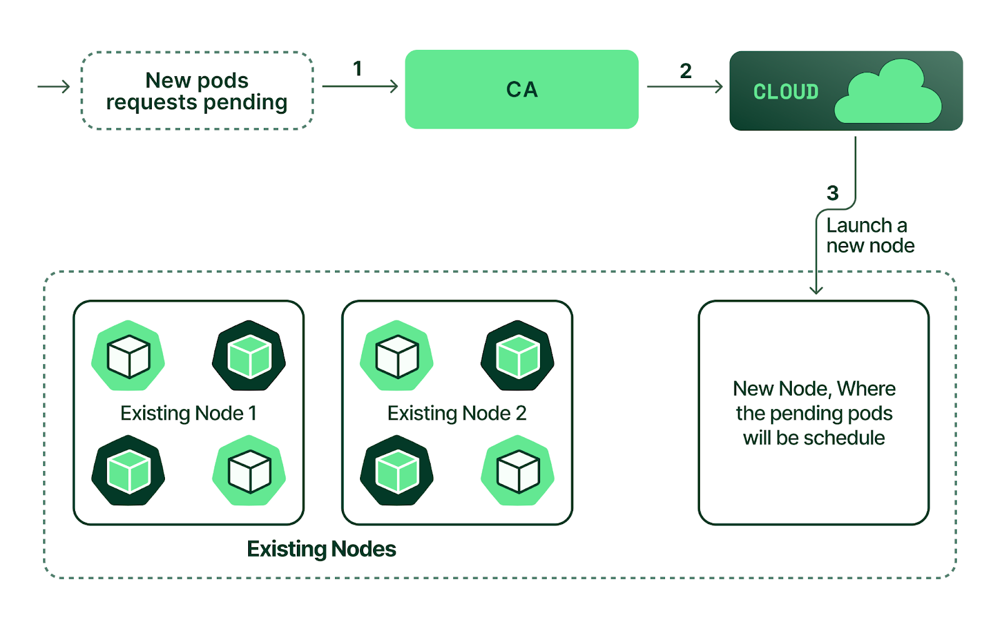

# 13. 오토스케일링

워크로드 용량 자동으로 스케일링하는 기술
- 클라우드 네이티브 시스템이라면 제공하는 당연한?! 기술
- 변화량이 많은 트래픽/메트릭에 대해서 유연하게 대처할 수 있다
- 그렇다고 무조건 사용해야하냐? 딱히 트래픽/메트릭의 변화량이 크지 않다면 그냥 필요할 때마다 수동을 하는게 적합할 수도 있음

쿠버네티스에서도 당연히 제공하고 있음

 

*아래 이미지들은 [kubecost](https://www.kubecost.com/)를 참조했음*

**HPA (Horizontal Pod Autoscaler): Scale In/Out, Pod의 수로 관리**

- `HorizontalPodAutoScaler` Resource를 이용
- Kubernetes metric server 또는 이를 대체하는 Prometheus adapter를 이용하여 메트릭 정보로 하여 Autoscaling 할 수 있음

 

**VPA (Vertical Pod Autoscaler): Scale Up/Down, Pod의 스펙으로 관리**

- `VerticalPodAutoScaler` Resource를 이용
- VPA Updater, VPA Admission Controller, VPA Recommender를 이용하여 Autoscaling 할 수 있음

 

**CA (Cluter Autoscaler): Cluster Node In/Out**

 

523p
- 오토스케일링은 이미지 크기가 작고 시작 시간이 빠른, 더 작고 민첩한 워크로드에 적합하다.
  - 클라우드 네이티브 애플리케이션에서는 Cold start가 문제임. 유연하게 대처해야하는데, 시작시간이 느린 애플리케이션들이 문제.
    - 갑자기 폭주하는 트래픽을 처리하려고 Pod를 늘리는데, Pod가 다 떴을 땐 트래픽이 낮아졌다? 폭주했던 트래픽은 처리도 못했고 Time out?
    - 뭐하러 오토스케일링하나! 하는 문제
    - 여러 애플리케이션 프레임워크/클러스터 단에서 이러한 문제를 해결하기 위한 여러 노력들이 있다.
      - https://spring.io/blog/2023/10/16/runtime-efficiency-with-spring
- 이미지를 가뎌오는데 필요한 시간이 짧고 컨테이너가 생성된 후 애플리케이션이 시작되는 데 걸리는 시간도 짧으면, 워크로드가 확장 이벤트에 빠르게 응답할 수 있다.

 

528p
- 워크로드 시작 시, CPU를 많이 사용하는 것 (CPU Spike)이 문제다. CPU Spike는 실제 트래픽으로 발생한 것이 아닌데도 HPA에서 스케일링 이벤트 트리거로 해석할 수 있다.
- `kube-controller-manager`에서 `--horizontal-pod-autoscaler-cpu-initialization-period`, `--horizontal-pod-autoscaler-sync-period` 옵션을 사용해 시작 유예기간 및 평가 시간을 늘리는 설정해 해결할 수 있다.
  - 해당 옵션은 전체 클러스터의 모든 HPA에 영향을 미치므로 잘 생각하고 설정해야 한다. HPA의 응답성을 감소시킬 수 있다.
- 이러한 옵션을 사용하는게 적합하지 않다면, Prometheus를 이용한 사용자 지정 메트릭 등을 활용하는 편이 좋다 (HTTP 요청 수 등)

 

540p
- Cluster 당 프로비저닝 할 수 있는 Pod 수에는 한계가 있다. 즉, 한 노드/클러스터에 무한대의 파드를 띄울 수 없다.
  - ex) [EKS - node 당 최대 pod 수](https://github.com/awslabs/amazon-eks-ami/blob/master/files/eni-max-pods.txt)
- '그럼 파드가 프로비저닝 될 수 없을 때 클러스터가 오토스케일링하게 해보자'는게 클러스터 오토스케일러(CA)의 역할.
- Cluster도 Pod처럼 프로비저닝하는데 오래 걸릴 수 있다 (특히, Cloud provider에서 인스턴스를 생성해 프로비저닝 하는 것이므로). 그럼, 유연하게 대처하기 어려울 수 있다.
- 이를 대처하기 위해 크게 2가지 방법이 존재하는데,
  - 1. HPA 목표 사용률을 낮게 설정하는 방법: 애플리케이션이 최대 용량이 되기 전에 워크로드가 확장되도록 한다. 트래픽 소화 못하기 전에 파드를 autoscaling 해서 cluster도 autoscaling 하자는건데, 생각할거리가 많다. 낮은 트래픽에서 그냥 트래픽이 끝이난다면 쓸데없이 autoscaling하는 것일수도 있다 (과도한 프로비저닝)
  - 2. 클러스터 오버 프로비저닝: 뭔가 특별한 기술 같지만, 그냥 리소스를 먹지 않는 빈 파드를 만들어서 버퍼 역할을 하게 만드는 것. 노드/클러스터 당 최대 파드 수가 정해져있으므로 이러한 문제가 발생하기 이전에 빈 파드를 하나 두고 파드 프로비저닝 불가능하기 전에 먼저 노드를 autoscaling 하는 것
    - 빈 파드를 만들어둔 상태로 노드가 꽉찼다고 하자. 이 때 새로운 파드 생성 요청이 오면 빈 파드가 축출되면서 새로운 파드가 생성되고, 노드가 프로비저닝되면서 빈 파드가 해당 노드에 생성되는 것.
    - `PriorityClass` resource를 이용하고, `value: -1`로 설정해 오버 프로비저너 배포에 이용하는 파드를 만들 수 있다.
    - 빈 파드는 어떤 이미지를 사용하지 하면, `k8s.gcr.io/pause` 이런거 이용하는 듯.
- 아예 처음부터 클러스터에 비례해 워크로드를 확장하게 끔 구성도 가능하다. CPA (Cluster Proportional Autoscaler)를 이용.

 

KEDA
- https://keda.sh/
- Kubernetes Event Driven Autoscaling
