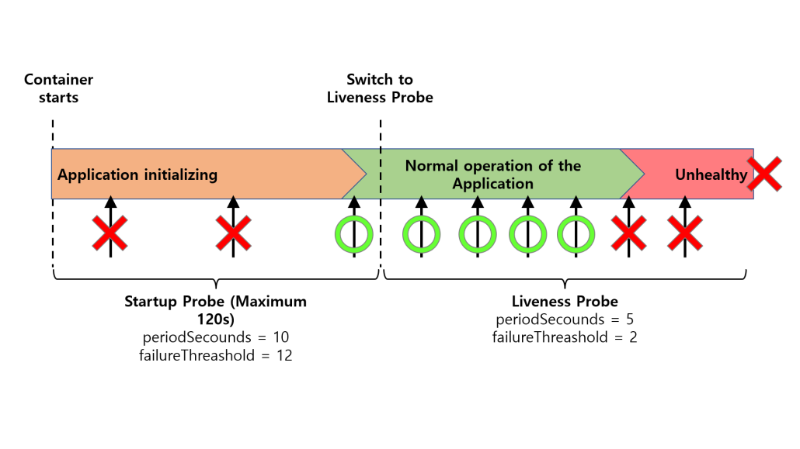

# 14. 애플리케이션 고려사항

이 장에서는 개발자들이 애플리케이션을 쿠버네티스에 구성할 때, 고려해야 될 부분들을 이야기한다.
- 어떻게 배포할 것인가? 매니페스트를 어떻게 구성하고 운영할 것인가?
- Configuration/Secret을 어떻게 이용할 것인가? 운영할 것인가?
- 파드 스케줄링 때, 애플리케이션 관리를 어떻게 할 것인가? 조정(다른 노드로 프로비저닝) 방식 및 조건이 필요한가?
- 파드 상태는 어떻게 확인하고, 서비스를 시작할 것인가? 이슈가 있을 때 재시작, 서비스 제외 등 액션이 필요한가?
- 파드의 최소/최대 리소스는 어떻게 설정할 것인가?
- 애플리케이션 모니터링(Log/Metric/Tracing)은 어떻게 구성할 것인가?


<br/>


### 매니페스트 구성 / 애플리케이션 패키징

547p) 헬름을 사용해 배포 매니페스트 템플릿을 구성하면 좋다.
- 플레이스 홀더를 통해 특정 환경에 맞게 유연하게 배포 매니페스트를 구성할 수 있다.

<br/>


### Configuration / Secret 구성 및 운영

7장 Secret 관리에서 다뤘었다.

549p) ConfigMap/Secret을 사용하는 방법
- 파일로 마운트 (`volumeMounts`): 저자는 이 방식을 제일 추천했다.
  - 동적으로 변경되는 값들을 활용 가능
- 환경변수로 설정 (`env`)
- 쿠버네티스 API와 통신해 설정을 가져오는 옵션
  - 551p) 단점: 쿠버네티스와 강결합이 생김. 자격증명 필요. 쿠버네티스 API 서버에 과도한 부하

<br/>

사실 이 방식말고도 Vault 등 외부 시스템을 이용해 값을 가져와 쿠버네티스 또는 애플리케이션에 적용하는 방식도 있다.
- 쿠버네티스에 싱크를 맞춰 ConfigMap/Secret으로 적용하는 방법
- 애플리케이션에서 아예 해당 외부 플랫폼에 의존해 값을 가져와 적용하는 방법

<br/>

### 컨테이너 생명주기 훅

파드 스케줄링 등으로 인해 워크로드는 언제든지 종료될 수 있음.
- 종료될 때 기존 작업 처리 등 해야하는 작업이 있다면 Graceful shutdown을 위해 Prestop hook을 제공


  
  
- *ex. https://www.thoughtworks.com/insights/blog/cloud/shutdown-services-kubernetes*

```yaml
apiVersion: apps/v1
kind: Deployment
metadata:
   name: graceful-shutdown-test-exit-graceful-30s
spec:
  replicas: 2
  selector:
     matchLabels:
           app: graceful-shutdown-test-exit-graceful-30s
  template:
    metadata:
       labels:
         app: graceful-shutdown-test-exit-graceful-30s
    spec:
      containers:
        - name: graceful-shutdown-test
          image: graceful-shutdown-test-exit-graceful-30s:latest
          ports:
            - containerPort: 8080
          lifecycle:
            preStop:
              exec:
                command: ["sh", "-c", "sleep 10"]  # set prestop hook
       terminationGracePeriodSeconds: 45    # terminationGracePeriodSeconds
```

- `preStop` hook을 이용해 특정 액션(exec command 등)을 실행할 수 있음
- `terminationGracePeriodSeconds`를 통해 SIGTERM, SIGKILL 중간의 유예기간을 설정할 수 있음 (위 예제는 45s 설정)
- Spring boot에서도 [Graceful shutdown 기능](https://docs.spring.io/spring-boot/reference/web/graceful-shutdown.html)을 활성화해서 SIGTERM 이후에 새로운 요청을 받지 않도록 구성이 가능

<br/>

### 가용성 요구사항 충족

같은 서비스 애플리케이션이 한 노드에만 모든 래플리카가 배포된다면 괜찮은 것일까?
- 당연히 아니다. 노드가 잠시나마 다운된다고 했을 때, 아예 서비스가 불가능해져버린다.
- 즉, 같은 서비스 래플리카들은 다양한 노드/클러스터로 균등히 분배되는 것이 제일 좋다.

쿠버네티스 환경에서는 쿠버네티스 스케줄러가 알아서 결정하기 마련인데, 스케줄러에서 활용하는 옵션인 `podAntiAffinity`를 이용하면 된다.
- 반대로 특정 파드들이 같은 노드에서 배포되어야 한다면 `podAffinity`를 이용할 수 있다.
- 특정 노드(ex. GPU가 있는)에만 붙어야 하는 파드들이 있다면 `nodeAffinity`를 이용할 수 있다.

```yaml
apiVersion: apps/v1
kind: ReplicaSet
metadata:
  name: myweb-b
spec:
  replicas: 2
  selector:
    matchLabels:
      app: b
  template:
    metadata:
      labels:
        app: b
    spec:
      affinity:
        nodeAffinity:
          preferredDuringSchedulingIgnoredDuringExecution:
            - weight: 10
              preference:
                matchExpressions:
                  - key: gpu
                    operator: Exists
        podAntiAffinity:
          requiredDuringSchedulingIgnoredDuringExecution:
            - labelSelector:
                 matchLabels:
                   app: b #자기 자신을 배척
              topologyKey: "kubernetes.io/hostname"
        podAffinity:
          requiredDuringSchedulingIgnoredDuringExecution:
            - labelSelector:
                 matchLabels:
                   app: a #a와 같이 배치되도록
              topologyKey: "kubernetes.io/hostname"
      containers:
        - name: myweb
          image: ghcr.io/c1t1d0s7/go-myweb
```
- *ex. [link](https://nayoungs.tistory.com/entry/Kubernetes-k8s-%EC%96%B4%ED%94%BC%EB%8B%88%ED%8B%B0Affinity%EC%99%80-%EC%95%88%ED%8B%B0-%EC%96%B4%ED%94%BC%EB%8B%88%ED%8B%B0Anti-Affinity)*

<br/>

### 상태 프로브

  
- *[ref](https://www.openmaru.io/kubernetes-%EC%97%90%EC%84%9C-pod-%EC%97%90-%EB%8C%80%ED%95%9C-%ED%97%AC%EC%8A%A4%EC%B2%B4%ED%81%AC-probe/)*

컨테이너 및 애플리케이션의 상태를 확인하고 서비스 하기 위해 여러 프로브를 제공한다.
- Startup Prove: 시작했어?
  - 실패 시, 재시작
  - 1회성
- Liveness Probe: 컨테이너 이상없어? 애플리케이션 시작에 문제 없어? (시작했어? ver 2)
  - 실패 시, 재시작
  - postStart hook, startup probe 이후 계속 진행
- Readiness Probe: 서비스 준비 됬어?
  - 실패 시, 서비스 사용 가능한 엔드포인트 축출 (트래픽 미수신)
  - postStart hook, startup probe 이후 계속 진행

<br/>

초기 딜레이(`initialDelaySeconds`), 확인 딜레이(`periodSeconds`), 타임아웃(`timeoutSeconds`) 등 여러 옵션 제공 ([docs](https://kubernetes.io/docs/tasks/configure-pod-container/configure-liveness-readiness-startup-probes/#configure-probes))

<br/>

방식은 4가지 제공
- Exec
- HTTP
- TCP
- gRPC (ver 1.24 beta, 1.27 stable)


<br/>

561p)
- Liveness probe 실패는 재시작을 야기함. 
- 만약 외부 리소스(ex. database)에 대한 서비스 불가 등의 이유로 Liveness probe가 실패한다면 어떻게 될까?
  - 외부 리소스가 살아날 때까지 무한 재시작을 하게 됨. 오히려 외부 리소스에 대한 부하를 더 키워버릴 수 있음
- 그렇기에 liveness probe는 컨테이너/애플리케이션 자체에 집중한, 외부 종속성을 제외한 것만 확인하는 것이 좋음
- 외부 리소스 가용성에 대한 검사는 '서비스가 가능한가?' 수준에서 확인이 필요하므로 readiness probe에서 검사하는 것이 좋음

<br/>

왜 startup probe가 필요한 것일까?

  
  

초기 시작 딜레이가 긴 애플리케이션의 경우를 들어보자.
- 그냥 초기 딜레이(`initialDelaySeconds`)를 크게 줘서 Liveness probe로 검증하면 안돼?
- 가능은 하지만, startup probe를 두면서 2가지 이점을 더 얻을 수 있음
  - 초기 딜레이 없거나 더 짧게 해서 startup probe를 설정하면, 애플리케이션 기동이 됬을 때 설정된 시간보다 빠르게 서비스 할 수 있음
  - liveness probe와 다르게 설정값을 설정해 유연하게 설정할 수 있음

<br/>

### Pod resource request/limit

Pod마다 최소/최대 cpu/memory resource를 설정할 수 있음
- 최소: 서비스 운영을 위한 최소한의 리소스 스펙을 정해두기 위해
- 최대: 특정 워크로드들로 인해 나머지 워크로드의 리소스 점유 되는 것을 막기 위해

이는 더 나아가 파드 스케줄링에도 영향을 줌 (QoS: Quality of Service)
- `BestEffort` : 가장 나쁨. 리소스 경합 시, 우선순위 가장 낮음.
  - request/limit 설정되어 있지 않는 경우
- `Burstable` 
  - request < limit 설정되어 있는 경우
- `Guaranteed` : 가장 좋음. 리소스 경합 시, 우선순위 가장 높음.
  - request == limit 설정되어 있는 경우
