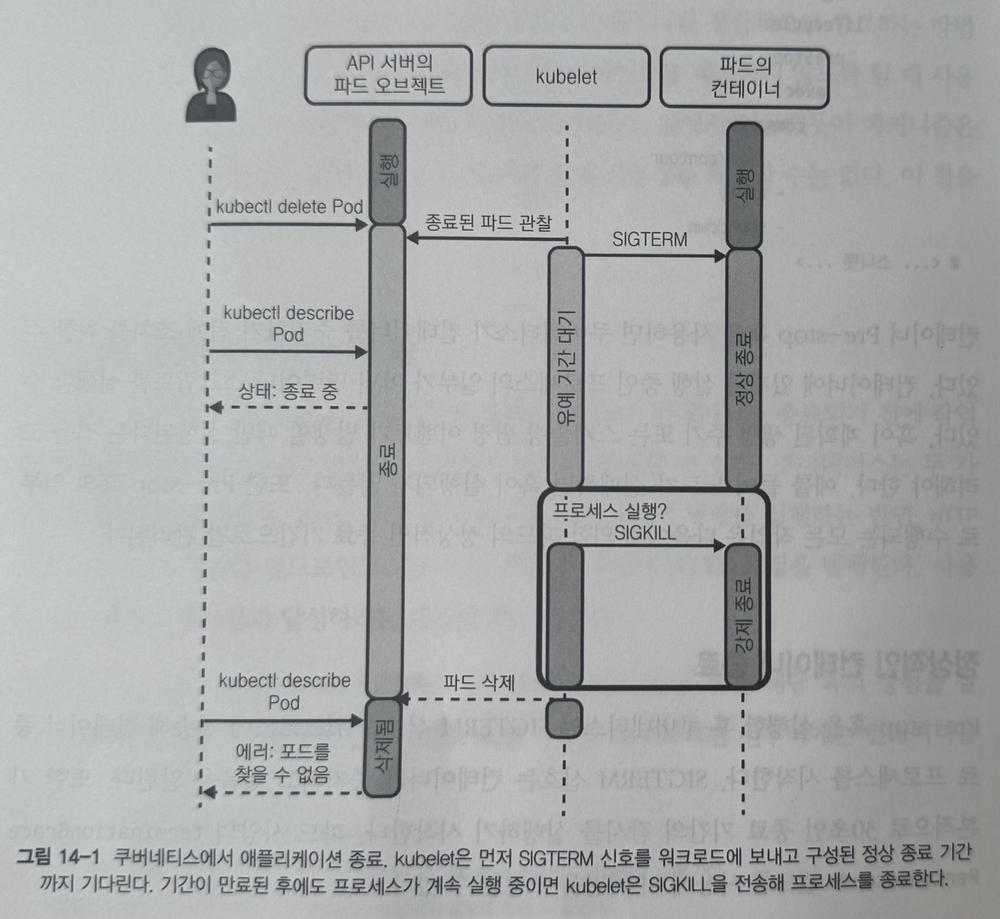
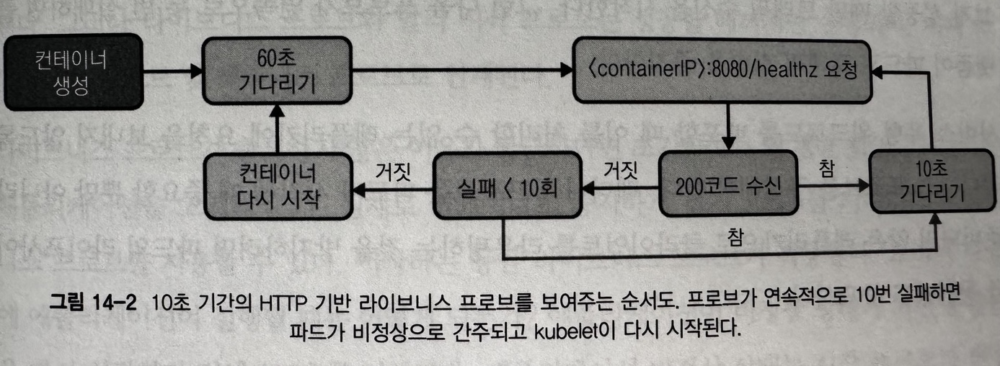
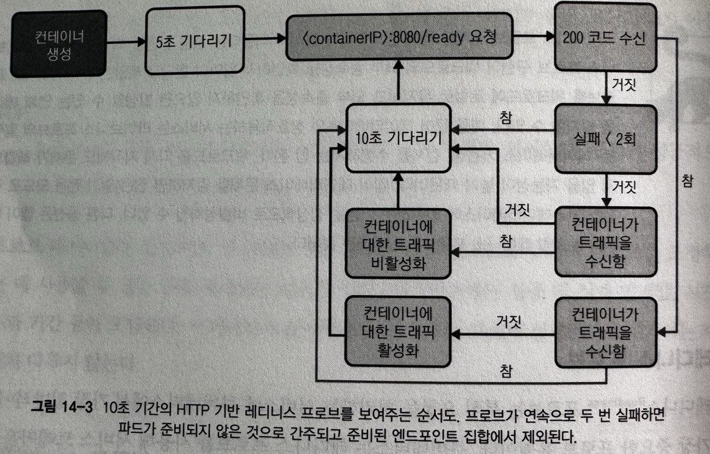
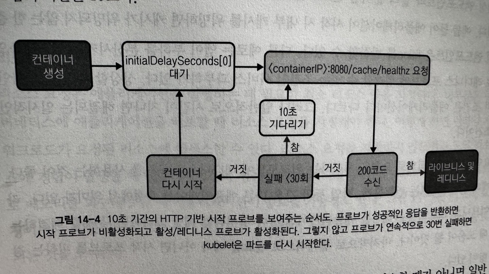

> [!NOTE]
> 책 내용 + 기타 레퍼런스를 보완한 요약본입니다.

# Chapter 14] 애플리케이션 고려사항

## 참고자료

- [K8S 환경에서 단단한 서비스를 구축하기 위한 여정](https://www.youtube.com/watch?v=DbUTlbELJ7A)

## Overview

쿠버네티스 환경에서의 애플리케이션 실행에 있어서 다음과 같은 고려사항이 있다.
- 플랫폼에 애플리케이션 배포 및 템플릿, 패키징과 같은 배포 매니페스트를 관리하는 매커니즘
- 쿠버네티스 API (ConfigMap / Secret) 사용, 설정 및 시크릿 관리를 위한 외부 시스템과의 통합과 같은 애플리케이션 구성 접근 방식
- Pre-stop 컨테이너 Hook, Graceful Shutdown 및 스케줄링 제한과 같은 워크로드 가용성을 향상시키는 쿠버네티스 기능
- 상태 Probes, 플랫폼에 애플리케이션 상태 정보를 표시할 수 있는 쿠버네티스 기능
- 애플리케이션이 플랫폼에서 제대로 실행되도록 하는 데 중요한 리소스 요청 및 제한
- 워크로드를 효과적으로 디버그, 문제 해결 및 운영하기 위한 매커니즘으로서 로그, 메트릭 및 트레이싱

## 쿠버네티스에 애플리케이션 배포

애플리케이션이 컨테이너화되어 컨테이너 이미지 레지스트리에서 사용 가능하다면 배포 준비가 완료된 것이다. 여기에 추가적으로 Deployment, Service, ConfigMap, CRD 등 애플리케이션에 필요한 Manifests 작성만 진행하면 된다.

Manifests 작성에 있어서 환경별로 미세하게 다른 values를 주입해야 하는 경우라면 Kubernetes용 Template Manifest 및 Packaging 애플리케이션을 통해 달성할 수 있다. 일반적으로는 Helm이나 Kustomize를 사용한다.

### 배포 매니페스트 템플릿

동일한 Manifest에서 환경별로 다르게 부여해야 하는 값을 Placeholder로 만들어야 한다. Helm을 사용하는 케이스라면 Go Template를 사용해서 values를 주입한다.

```yaml
apiVersion: apps/v1
kind: Deployment
metadata:
  labels:
    app: nginx
  name: nginx
spec:
  replicas: {{ .Values.replicaCount }}
  selector:
    matchLabels:
      app: nginx
  template:
    metadata:
      labels:
        app: nginx
    spec:
      containers:
      - name: nginx
        image: nginx
```

### 쿠버네티스용 애플리케이션 패키징

Helm은 대표적인 쿠버네티스 환경에서의 애플리케이션 패키지 매니저이다. 이를 사용해서 Third-party가 제공하는 소프트웨어를 배포하거나 직접 애플리케이션을 패키징해서 Registry에 등록하고 사용할 수도 있다.

## 설정 및 Secret 수집

### 쿠버네티스 ConfigMap 및 Secret

이 두가지 리소스 타입은 런타임에서 애플리케이션을 설정할 수 있게 해주는 Kubernetes API 핵심 리소스이다. 다른 리소스들과 마찬가지로 API 서버로 생성되며 일반적으로는 아래와 같이 YAML로 선언된다.

```yaml
apiVersion: v1
kind: ConfigMap
metadata:
  name: my-config
data:
  debug: "false"
```

이러한 리소스를 애플리케이션에서 사용하는 방법은 아래와 같다.

1. `volumeMount`

```yaml
apiVersion: v1
kind: Pod
metadata:
  name: my-app
spec:
  containers:
  - name: my-app
    image: my-app:v1.0
    volumeMounts:
    - name: my-config
      mountPath: /etc/my-app/config.json
  volumes:
  - name: my-config
    configMap:
      name: my-config
```

`volumeMount`를 사용하는 방식은 Pod 파일이 동적으로 업데이트되는 방식으로 애플리케이션의 재시작이나 Pod 재생성 없이도 애플리케이션 설정 적용이 가능하기 때문에 권장되는 방식이다.

2. 환경변수로 바인딩

```yaml
apiVersion: v1
kind: Pod
metadata:
  name: my-app
spec:
  containers:
  - name: my-app
    image: my-app:v1.0
    env:
    - name: DEBUG
      valueFrom:
        configMapKeyRef:
          name: my-config
          key: debug
```

환경변수 바인딩 방식은 위의 `volumeMount`와는 다르게 변경사항이 다시 시작될때까지 실행 중인 Pod에 반영되지 않는다. 또한 Secret의 경우 유출 가능성이 있기 때문에 보안적으로 안전하지 않다.

3. 애플리케이션 <-> Kubernetes API 간 직접 통신

애플리케이션에서 SDK / 라이브러리를 사용하여 Kubernetes API를 직접 호출해 구성을 읽어올 수도 있다. 다만 이 방식은 애플리케이션이 SDK / 라이브러리를 의존성으로 가져야하므로 높은 커플링이 발생하는 단점을 가지게 된다. 또한 API 호출을 위한 별도의 자격증명과 올바른 권한을 가지고 있어야 하므로 배포 복잡성이 증가한다. 그리고 이러한 애플리케이션이 많아지면 API 서버에 가해지는 부하 또한 높아지는 문제가 있다.

### 외부 시스템에서 설정 가져오기

HashiCorp Vault이나 Infisical과 같은 외부 시스템에서 설정을 가져올 수도 있다. 특히 Vault를 사용하면 K8s Secret에서 사용할 수 없는 고급 Secret 관리 기능이 제공된다. 예를 들면 동적 Secret, Secret Rotation, Time-based Token 등이 대표적이다.

## 스케줄링 조정 이벤트 처리

쿠버네티스의 동적인 특성이 애플리케이션의 가용성과 운영에 영향을 미칠 수 있다. 클러스터 노드의 리소스 부족으로 인한 스케일링 처리, 업그레이드를 위한 Drain/Cordon 처리 등의 상황이 예시에 해당된다. 이러한 영향으로부터 최소화할 수 있는 다양한 기능에 대해서 살펴보고 이를 적용하여 가용성을 최대화하도록 노력해야 한다.

### Pre-stop 컨테이너 생명주기 Hook

쿠버네티스에서는 여러 가지 이유로 워크로드의 종료가 가능한다. 컨테이너가 종료되기 전에 수행해야 하는 작업이 있다면 `preStop` 컨테이너 생명주기 Hook을 사용해 컨테이너 중지 전 취해야 하는 조치를 실행할 수 있다.

```yaml
# ... snippets
spec:
  containers:
  - command:
    - /bin/contour
    args:
      - envoy
      - shutdown-manager
    image: docker.io/projectcontour/contour:main
    lifecycle:
      preStop:
        exec:
          command:
            - /bin/contour
            - envoy
            - shutdown
# ... snippets
```

### 정상적 컨테이너 종료

`preStop` Hook이 실행된 후 쿠버네티스는 `SIGTERM` Signal을 워크로드에 전송해 컨테이너 종료 프로세스를 시작한다. 이후 `terminationGracePeriodSeconds` (Default 30s) 기간 동안 쿠버네티스가 해당 워크로드의 종료를 감시하면서, 워크로드는 종료 전 필요한 모든 작업을 완료해야 한다. (데이터 유지, 열린 커넥션 종료, 파일의 디스크로의 Flush 등) 완료되면 성공 종료 코드와 함께 종료되어야 하며 만약 해당 시간 내 종료가 되지 않으면 `kubelet`이 `SIGKILL` 시그널을 보내 강제 종료를 수행한다.



### 가용성 요구사항 충족

`preStop` Hook과 `terminationGracePeriodSeconds`을 사용한 종료는 애플리케이션 단일 인스턴스 혹은 Replica와 관련되어 있다. 쿠버네티스에서는 이러한 애플리케이션이 수평 확장되어 있을텐데, 만약 특정 클러스터 노드에 장애가 발생하면 해당 노드에 스케줄링되지 않은 애플리케이션이 업무를 수행함으로써 내결함성이 지켜지게 된다. 다만 모든 인스턴스가 동일 클러스터 노드에 위치한다면 의미가 없게 된다.

따라서 인스턴스를 여러 노드에 분산 배치할 수 있도록 Pod Affinity와 같은 속성을 적용할 수 있다.

```yaml
# ... snippets
affinity:
  podAntiAffinity:
    preferredDuringSchedulingIgnoredDuringExecution:
    - labelSelector:
        matchExpressions:
        - key: "app"
          operator: In
          values:
          - my-web-server
  topologyKey: "zone"
# ... snippets
```

Affinity는 선호도를 의미하며 `nodeAffinity`, `podAffinity`, `podAntiAffinity` 세 가지 옵션이 제공된다. 각각은 옵션명에서 의미하는 것처럼 Node에 대한 선호도, 실행 중인 Pod에 대한 선호도 (해당 Pod와 동일 노드 배치), 실행 중인 Pod에 대한 비선호도 (해당 Pod와 다른 노드 배치)를 지정할 수 있다.

> - requiredDuringSchedulingIgnoredDuringExecution (Hard) : 반드시 충족 필요 (스케줄링되는 워크로드에는 적용, 실행 중인 워크로드에는 미적용)
> - preferredDuringSchedulingIgnoredDuringExecution (Soft) : 선호하는 조건 (스케줄링되는 워크로드에는 적용, 실행 중인 워크로드에는 미적용)

Affinity 말고도 제공되는 `topologySpreadConstraints` 옵션을 사용하면 토폴로지 키를 기반으로 스케줄링 전략을 지정할 수 있다. Anti-Affinity의 경우 Pod가 클러스터 노드 전체에 고르게 분산되도록 보장하지는 않기 때문에 `topologySpreadConstraints` 를 통해서 보완할 수 있다.

```yaml
# ... snippets
spec:
  topologySpreadConstraints:
  - maxSkew: 1
    topologyKey: topology.kubernetes.io/zone
    whenUnsatisfiable: ScheduleAnyway
    labelSelector:
      matchLabels:
        foo: bar
  - maxSkew: 1
    topologyKey: kubernetes.io/hostname
    whenUnsatisfiable: ScheduleAnyway
    labelSelector:
      matchLabels:
        foo: bar
# ... snippets
```

## 상태 Probe

쿠버네티스에서는 여러 Signal을 사용해서 플랫폼 내 실행되는 애플리케이션의 상태를 확인한다.

Kubernetes에서는 활성, 준비, 시작 세 가지 Probe가 제공된다.
아래 세 가지 메커니즘은 모든 Probe에서 공통적으로 사용하게 된다.

- Exec
  - `kubelet`이 컨테이너 내부에서 명령을 실행하고 exit code가 0을 반환하면 Probe가 성공한 것으로 간주, 그렇지 않으면 비정상 처리한다.
- HTTP
  - `kubelet`이 Pod의 특정 endpoint로 요청을 보내고 HTTP Response Code가 2XX ~ 4XX일 경우 성공으로 간주한다.
- TCP
  - `kubelet`이 설정 가능한 포트에서 컨테이너와 TCP 커넥션을 설정하며 연결이 성공적일 경우 컨테이너를 정상 간주한다.

### livenessProbe

`livenessProbe`는 Pod 생존 여부를 확인하기 위한 방법이다. `livenessProbe`가 실패하면 `kubelet`이 Pod를 비정상 간주해 재시작 처리한다.



```yaml
# ... snippets
livenessProbe:
  tcpSocket:
    port: 8080
  initialDelaySeconds: 15
  periodSeconds: 20
# ... snippets
```

### readinessProbe

`readinessProbe`는 Pod 생명 주기 중 Pending 상태에서의 동작, 서비스 요청에 응답 가능한지 확인하기 위해 사용되는 Probe이다. Service와 연결된 Pod를 확인해 개별 Pod에 대해 응답이 없거나 실패된 응답이 돌아오면 Serving 가능한 트래픽 목록에서 이를 제외시킨다. `kubelet`이 `livenessProbe`를 체크하는 방식과 동일한 메커니즘으로 동작한다.



```yaml
# ... snippets
readinessProbe:
  exec:
    command: ["cat", "/readiness/ready.txt"]
  initialDelaySeconds: 5
  periodSeconds: 10
  successThreshold: 3
# ... snippets
```

### startupProbe

애플리케이션이 처음 시작하는 데 상당히 오랜 시간이 걸리는 경우 `startupProbe`를 사용하는 것이 유리하다. `livenessProbe`와 마찬가지로 실패되는 경우 컨테이너가 다시 시작된다. 다만 `startupProbe`가 활성화되는 경우 이 Probe를 통과할 때까지 나머지 Probe는 활성화되지 않는 특징을 가진다.



```yaml
# ... snippets
startupProbe:
  httpGet:
    path: /health
    port: 8080
# ... snippets
```

## Pod 리소스 요청 및 제한

쿠버네티스 스케줄링 프로세스에는 워크로드를 호스팅하기에 충분한 리소스가 있는 후보 노드를 찾는 것이 포함된다. 워크로드의 효과적 배치를 위해서 스케줄러가 애플리케이션의 리소스 요구사항을 알아야 하고 이러한 요구사항에는 CPU 및 메모리가 포함되지만 임시 저장소 및 사용자 정의, 혹은 확장 리소스와 같은 다른 리소스 유형도 포함될 수 있다.

### 리소스 요청

애플리케이션을 실행하는 데 필요한 최소 리소스 양을 지정한다. 만약 지정하지 않으면 노드 리소스 경합 발생시 애플리케이션 성능이 크게 저하될 수 있다. 또는 노드가 다른 워크로드로 메모리를 회수해야 할 때 애플리케이션의 종료 가능성 또한 존재한다.


### 리소스 제한

워크로드가 소비할 수 있는 최대 리소스 양을 지정할 수 있다. 물론 소비할 수 있는 리소스가 많을 수록 좋겠지만 워크로드가 리소스를 할당받는 노드의 가용 리소스는 한정되어 있다.

> #### 압축 가능한 리소스와 압축 불가능한 리소스
> - 압축 가능한 리소스
> CPU나 네트워크 Bandwidth 같은 리소스가 해당되며 리소스 사용량이 최대에 달했을 때 이 리소스를 필요로 하는 다른 프로세스는 이 리소스를 사용할 수 있을 때까지 대기해야 한다. (Throttling)
> - 압축 불가능한 리소스
> 메모리와 같은 리소스가 해당되며 리소스가 필요할 때 공급받지 못하는 경우 OOM이 발생할 가능성이 있다.

## 애플리케이션 로그

애플리케이션 로그는 개발/운영 환경 구분할 것 없이 애플리케이션에서 발생할 수 있는 문제를 해결하고 디버그하는데 매우 중요한 요소이다. 따라서 쿠버네티스에서 실행되는 애플리케이션은 가능한 한 `stdout` / `stderr` 스트림을 로깅해야 한다.

### 로그 내용

애플리케이션 로그는 불필요한 로그를 너무 많이 기록하면 중요한 정보를 놓칠 위험이 있고, 반대로 너무 적게 기록하면 애플리케이션 문제를 효과적으로 해결하기 어렵다. 따라서 균형을 맞추는 것이 중요하다.

### 구조화되지 않은 로그와 구조화된 로그

애플리케이션 로그는 정형 (구조화)/비정형 (비구조화)으로 구분할 수 있다. 로그의 출력 형식은 구조화된 방식으로 가는 것이 쿼리 및 분석을 더 효과적으로 진행될 수 있도록 지원한다. 다만 구조화된 형식은 상대적으로 Human-readable하지 않으므로 절충점을 신중히 고려해야 한다.

### 로그의 컨텍스트 정보

로그의 주요 목적은 특정 시점에 애플리케이션에서 발생한 이벤트에 대한 인사이트를 얻는 것이다. 발생한 문제에 대해서 그 이유를 정확이 이해하기 위해서 로그 메시지 뿐만 아니라 컨텍스트 정보 또한 필요할 것이다. 다만 너무 민감한 정보를 포함하는 것은 지양해야 한다.

## 메트릭 노출

로그 뿐만 아니라 메트릭 또한 애플리케이션이 어떻게 작동하는지에 대해서 중요한 인사이트를 제공한다. 메트릭을 통해서 애플리케이션에 주의가 필요한 시점을 알려주도록 Alerting을 구성할 수 있고, 시간 경과에 따른 메트릭 집계로 소프트웨어 새 버전의 릴리즈 때 추세, 개선 사항 및 회귀 사항을 발견할 수 있다.

### 애플리케이션 계측

모니터링하려는 소프트웨어 타입에 따라 메트릭을 노출하기 위해 취할 수 있는 두 가지 접근 방식은 아래와 같다.

- 기본 계측 : 애플리케이션 프로세스에서 메트릭이 노출되도록 Prometheus Client Library 등을 사용해 애플리케이션을 계측하는 작업을 포함한다.
- 외부 프로세스 Exporter : 기존 메트릭을 변환하고 Prometheus 호환 형식으로 노출하는 워크로드 옆에서 실행되는 추가 프로세스이다. 직접 계측할 수 없고 일반적으로 사이드카 컨테이너 패턴을 사용해 구현되는 상용 소프트웨어에 가장 적합하다. e.g. NGINX Prometheus Exporter, MySQL Server Exporter

### USE 방법

> Utilization, Saturation, Errors

Brendan Gregg가 제안한 방법으로 시스템 리소스에 중점을 둔다. 애플리케이션에서 사용하는 각 리소스(CPU, 메모리, 디스크)에 대한 사용량과 포화도 및 에러를 캡처한다. 대기열이나 Thread Pool과 같이 애플리케이션 소프트웨어상 존재하는 리소스도 포함될 수 있다.

### RED 방법

> Rate, Errors, Duration

Tom Wilkie가 제안한 방법으로 USE 방법과는 다르게 기본 리소스보다 서비스 자체에 더 중점을 둔다. 서비스가 처리하는 요청 비율, 에러 및 기간을 캡처한다. 온라인 서비스에 더 적합하다.

### 4가지 Golden Signals

Google SRE에서 제안한 4가지 Golden Signals를 측정하는 것으로 모든 서비스를 지연, 트래픽, 에러, 포화 이 네가지 중요한 신호에 대해서 측정할 것을 제안한다. RED 방법에서 포화도를 추가한 점에서 다소 유사하다.

### 기타 애플리케이션 특정 메트릭

## 분산 트레이싱을 위한 계측 서비스

분산된 마이크로서비스를 통과하는 요청의 실행 흐름에 대한 가시성을 위해서 분산 트레이싱 도구를 사용해 계측할 수 있다. 이러한 분산 트레이싱을 위해 Jaeger, Zipkin과 같은 시스템을 활용할 수 있다. 이러한 계측은 별도의 작업을 추가로 요구한다.

### 트레이싱 도구 초기화

서비스에서 Span을 생성해야하고 이를 위해서 트레이싱 도구 초기화가 필요하다. 이 작업에는 애플리케이션이 실행 중인 환경에 따라 트레이싱 도구를 구성하는 작업을 포함한다. 그리고 메트릭 및 로깅 라이브러리와 통합하여 샘플링된 트레이싱 및 범위 수, 성공적으로 보고된 범위 수 등과 같이 트레이싱 프로그램에서 발생하는 이벤트를 메트릭으로 Export할 수도 있다.

### Span 생성 / 컨텍스트 전파

클라이언트가 서버로 호출하는 단일 행위를 Trace라고 한다면, 서비스 컴포넌트간 호출을 Span이라고 정의한다. 따라서 각 서비스 컴포넌트들은 하나의 클라이언트 호출 추적을 위해 동일한 Trace Id를 사용하고, 각 서비스 간 호출은 개별 Span Id를 생성한다. HTTP 서비스는 이러한 정보를 Header에 담아 전파할 수 있다.
