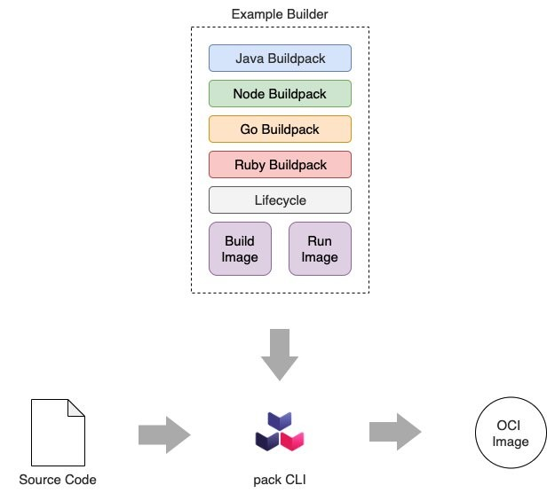

# 15 - CI/CD

쿠버네티스: 컨테이너 오케스트레이션
- 서버를 배포한다고 가정하면?
- 애플리케이션 빌드를 하고, 컨테이너 이미지를 만들고, 저장하고, 이를 배포하는 것까지의 과정이 필요하다.
- CI/CD의 필요성

 

## 컨테이너 이미지 구축
이미지 자체는 일부 메타데이터와 함께 압축된 파일 시스템 레이어의 집합 ([Chap. 03](https://github.com/KimDoubleB/production-k8s-kr/blob/main/Chap_03/KimDoubleB_03_Container%20Runtime.md)) => OCI 이미지 사양을 준수

 

보통 "컨테이너 이미지를 어떻게 만드나요?"라는 질문을 묻는다면, "Docker를 이용해서요"라고 말할 것
  - 하지만 Chap 03에서 말했듯 그건 하나의 방법일 뿐 무조건 적인 것은 아님. 더 나아가 요즘엔 Dockerfile 없이도 컨테이너 이미지를 코드에 맞게 최적화 된 방향으로 만들어주는 툴들이 많음 (cloud native buildpack, kaniko, jib)

 

컨테이너 이미지라 함은 애플리케이션 이미지 만을 말하는 것은 아님. 멱등성 있는 이미지 빌드 과정을 위해 빌드 자체도 컨테이너 이미지 내에서 하는 경우도 많음 (좋음).
  - 빌드를 위한 컨테이너 이미지도 적절히 만들어 운영해줘야 한다는 것을 잊어서 안됨.
  - 애플리케이션 컨테이너 이미지를 빌드용 컨테이너 이미지 내에서 만들어내야 하니 docker가 필요함. docker-in-docker (dind).
  - 이미지 빌드를 위해 docker daemon이 필요하고, docker daemon은 보통 수행환경으로 Linux root 권한을 필요로 함. 즉, 빌드용 컨테이너 이미지가 root 권한으로 동작하게 됨으로 문제가 발생할 수 있음
  - 이러한 문제를 해결하기 위해 dind 이미지를 이용하거나, 앞서 이야기 한 buildpack, kaniko를 이용하는게 대안이 될 수 있음.
  - 빌드 이미지와 런타임 이미지는 목적 자체가 다른 것. 분리해 필요한 라이브러리/소프트웨어만 설치해야 함을 잊지 말자.

 

buildpack 등을 이용하는 건 플랫폼 입장에서는 통일된 방식으로 container image를 만들어주기 때문에 관리하기 편함.
  - 개발 팀에서 모두 자체 Docker 파일을 생성해 관리하면 이슈 대응하기가 어려움.
  - 더 큰 단점들: 개발자에게 추가작업이 발생해 개발자가 애플리케이션 비즈니스 로직에 집중하지 못함. 컨테이너 이미지 표준화가 거의 일어나지 않게 되서 이미지 간에 성능/보안 차이가 발생할 수 있음.
  - 즉, cloud native buildpack 같은 것을 이용하는게 제일 좋다.

 

## 골든 베이스 이미지

회사/조직/팀 단에서 승인된 컨테이너 이미지로 여러 조직에 관련된 에이전트/소프트웨어가 설치된 컨테이너 이미지로서, 프로덕션에 들어가는 모든 애플리케이션이 해당 이미지를 베이스로 만들어지게끔 제한함.

 

외부에서 제공하는 업스트림/공급업체 이미지를 자체 기본 이미지로 리팩터링하려는 시도는 피해야 함
- 컨테이너 이미지가 무거워질 수도 있고, 유지보수 관리책임이 힘듦
- 결국엔 조직/팀 내 필요한 필수 요소(에이전트/소프트웨어)를 적절히 설치하고, 보안 확인 등의 요소를 추가해 가볍고 안정적인 컨테이너 이미지로 활용해야 함

## 기본 이미지

기본 이미지는 애플리케이션 컨테이너 이미지의 일부가 될 운영체제 라이브러리 및 도구를 포함하므로 매우 중요함
- 주의하지 않으면 불필요한 라이브러리 및 도구가 포함되어 컨테이너 이미지가 비대해질 뿐만 아니라 보안 취약점이 될 수 있음
- docker commit을 통해 관리되지 않는 이미지를 만드는 것이 안티패턴이라고 할 수 있음

 

기본 이미지를 정할 때, 아래 옵션들을 살펴보는 것이 좋음
- 평판이 있는, 공식업체에서 등록한 이미지인지 확인
- 업데이트 주기를 확인하고, 지속적으로 업데이트가 되는 이미지인지 확인
- 오픈소스 빌드 프로세스 또는 사양이 있는 이미지인지 확인 (이미지 빌드 구성을 확인 가능한가?)
- 불필요한 도구, 라이브러리가 설치되어 있는 이미지인지 확인 (작고 가벼운 이미지) ex. [distroless](https://github.com/GoogleContainerTools/distroless)

 

## Cloud Native Buildpack (CNB)

  

buildpack 파이프라인을 통해 규정 준수를 보장해 플랫폼에서 실행하는 컨테이너 이미지를 표준화 할 수 있음
- 개발 팀은 애플리케이션을 컨테이너 화하는 방법이 아닌 애플리케이션의 가치를 구축하는데 집중할 수 있음

Spring boot에서도 기본적으로 CNB를 이용해 Container image를 쉽게, 통일된 방식으로 만들 수 있게 지원하고 있다.
- https://docs.spring.io/spring-boot/docs/current/reference/htmlsingle/#container-images.buildpacks
- https://docs.spring.io/spring-boot/docs/3.2.5/gradle-plugin/reference/htmlsingle/#build-image
- paketo에서 제공하는 CNB builder를 통해 이를 지원하고 있다.

 

## Image registry

이미지 레지스트리는 다음과 같이 3가지 주요 구성요소로 이루어진다.
- Server (사용자 인터페이스 및 API 로직용)
- Blob store (이미지 자체)
- Database (사용자 및 이미지 메타데이터)

 

이미 Artifactory 또는 Nexus와 같은 아티팩트 저장소를 활용하고 있다면, 이미지 호스팅 기능을 활용해 관리의 편의성을 높일 수 있음
- 즉, 만약 [Sonatype Nexus](https://blog.sonatype.com/sonatype-nexus-repository-as-a-container-registry)/[JFrog](https://jfrog.com/help/r/jfrog-artifactory-documentation/get-started-with-artifactory-as-a-docker-registry)을 사용 중이라면 따로 이미지 레지스트리를 구성할 필요없이 artifactory에서 제공되는 기능을 사용해도 된다.

 

이미지 레지스트리를 고가용성과 성능(throughput)이 매우 중요하다.
- 이미지 레지스트리의 이용은 빌드 뿐 아니라 배포 과정에서도 필요하며, 개발자들의 로컬에서도 빈번히 이용되는 것이기에 아주 중요하다.
- 성능은 왜?
  - 수천 명의 개발자가 모든 코드 커밋에서 코드 및 이미지 빌드를 트리거 하는 조직이라면? 동시 작업이 매우 많을 것
- 사내 시스템 또는 이용중인 클라우드의 이미지 레지스트리가 갑자기 내려갔다면? 개발/빌드/배포 다 어려워지는 문제를 맞이할 수 있다.
- 이미지 레지스트리를 단순히 이용하는 편이라면 고민하지 않아도 되겠지만, 운영하는 측의 입장에서는 고가용성과 성능이 잘 받춰지는지 확인해보아야만 한다.

 

이미지 레지스트리는 사용하는 모든 이미지의 만남의 장소일 수 있다.
- 취약성 스캔, 보안 결함을 중앙화 해 확인하기 매우 좋은 장소
- CVE 점수, 사용해서는 안되는 베이스 이미지 등 레지스트리에서 검사 후 승인된 이미지만 Pull을 받아 사용이 가능하도록 제공해야 한다.
- 단순히 Push 된 이미지의 정적 스캐닝만 진행해서는 안된다고 함
  - 배포 후 이미지가 악성 콘텐츠를 다운로드하고, 이를 통해 컨테이너화 된 애플리케이션 런타임에 손상/탈취 문제를 일으킬 수 있기 때문.
  - 이를 위해 런타임 스캐닝일 지원하고, 컨테이너가 수행할 수 있는 작업과 동작을 제한하는 방법으로 문제를 막고자 함 (Falco, Aqua Security 등 제품군)
- 이러한 과정을 수동으로 그때마다 개입해서 하는 것이 아닌 Qurantine workflow를 통해 검사를 자동화 해야 함
  - Qurantine registry / Vetted registry를 나누어 스캐닝 워크플로를 자동화해 인증된 이미지를 사용할 수 있도록 구성

 

## 이미지 서명

이미지를 누군가 위조할 수 있는 문제
- 사용하는 외부 의존망이 많아지면서 공급망 보안 문제가 발생함

이미지 서명
- 레지스트리에 푸시하기 전에 이미지의 해시를 생성하고, 자신의 신원을 이미지에 암호화 서명을 하는 개념
- 서명된 해시를 게시자의 공개 키와 비교하여 이미지의 진위 여부를 확인
- 단순히 한 서명만 하는 것이 아닌, 여러 단계로 나누어진 이미지 푸시/인증 단계마다 서명을 해서 모든 과정이 잘 수행되었는가도 확인이 가능
- "모든 서명이 다 이루어졌는가"를 이용하여 이미지 배포를 프로덕션으로 이동시킴
- 예로 [Notary](https://www.cncf.io/blog/2021/07/28/enforcing-image-trust-on-docker-containers-using-notary/), [Sigstore](https://www.sigstore.dev/) 같은 구현체가 있다

