# eBPF
https://ebpf.io/what-is-ebpf/
https://docs.cilium.io/en/stable/bpf/

<br/>

## eBPF가 뭐야?
eBPF([extended Berkeley Packet Filter](https://www.wikiwand.com/en/EBPF))란 운영체제 커널과 같은 권한이 있는 컨텍스트에서 샌드박스가 적용된 프로그램을 실행할 수 있는 기술
- **프로그램을 변경하거나, 추가할 때마다 커널 소스코드를 변경하거나 커널 모듈을 새롭게 빌드/로드 할 필요가 없다 !**

<br/>

## 왜 eBPF가 생겨났나?
- OS는 전체 시스템을 감독하고 제어할 수 있는 커널의 권한으로 인해 항상 통합 가시성(Observability), 보안 및 네트워킹 기능을 구현하기에 이상적인 장소였음.
- 동시에 OS kernel은 중심적인 역할이다보니 보안, 안정성에 대한 높은 요구사항으로 발전하기 어려웠음. 그래서 보통 OS 수준에서의 혁신속도는 OS 외부보다 느렸음.

<br/>

eBPF는 이를 근본적으로 이를 바꿔놓았음.
- OS에 추가기능을 넣기 위해 런타임 중 eBPF 프로그램을 실행하게 만들 수 있음.
- OS는 JIT (Just-In-Time) 컴파일러 및 검증 엔진의 도움을 받아 기본적으로 컴파일 된 것처럼 안정성, 실행효율성을 보장함.
- 이러한 장점들을 통해 차세대 네트워킹, 통합 가시성(Observability), 보안 기능 등 다양한 사용 사례를 포괄하는 eBPF 프로그램들이 나오고 있음.


<br/>

## BPF와의 관계?
eBPF는 어느순간 딱 만들어진 것이 아님
- BPF (Berkely Packet Filter)가 1992년에 만들어졌음.
- 이름 그대로 Packet filter를 통해 Packet을 분석하고 필터링하는데 사용되는 In-kernel Virtual Machine임.
	- 즉, 커널 내에서 가상머신으로서 동작하는 프로그램.
	- 가상의 레지스터와 스택 등을 가지고, 이를 바탕으로 코드를 실행.
- Virtual Machine이라고 해서 성능이 안좋지는 않음. JIT 컴파일러가 추가되며 성능이 향상되었음.

<br/>

BPF에서 뭐가 extended 되었나?

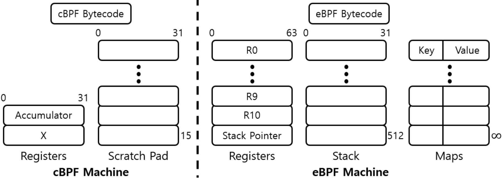  

- eBPF는 말 그대로 확장 BPF라는 것.
- 기존 BPF를 토대로 레지스터 크기를 늘리거나, eBPF Maps라고 하는 맵 유형을 도입하는 등 변화들을 적용했음.
	- 사진의 왼쪽이 BPF 구조, 오른쪽이 eBPF 구조.

<br/>

### 용어 정리 (BPF? eBPF? cBPF?)
- eBPF는 앞서 이야기한대로 BPF를 기반으로 만들어졌음.
- 하지만 eBPF는 본래 Packet을 분석하기 위한 용도를 넘어서 그 이상의 더 다양하고 많은 기능들에 사용되고 있음.
- 그러면서 여러 프로젝트 문서에서 단순히 BPF라고 불러 헷갈리는 경우가 있는데, **요즘 날에와서는 왠만하면 BPF라고 함은 eBPF를 의미**함.
	- 이 문서에서도 다음 문단부터는 BPF라 함은 eBPF를 의미함.
- 그래서 이를 구분하기 위해 아예 처음에 고안됬던 BPF는 cBPF(classic BPF)라고 부르기도 함.
- Cilium 문서에서도 이를 이야기하는데, 요즘에 클래식 BPF(cBPF)라고 불리는 기존 BPF 버전은 거의 사용하지 않는다고 함.
	- **Linux kernel에서도 eBPF만 실행하며, 로드된 cBPF bytecode는 실행 전 kernel에서 eBPF로 변환됨.**

<br/>

문서를 보다보면 XDP라는 단어도 많이 등장함.
- XDP: eXpress Data Path ([문서](https://docs.cilium.io/en/stable/bpf/progtypes/#xdp))
	- 고성능 패킷 처리를 가능하게 하는 BPF framework
	- Network driver가 Packet을 수신하는 순간(소프트웨어에서 가능한 가장 빠른 시점) BPF 프로그램을 실행. 이를 통해 패킷이 수신되는 즉시 라우팅 결정을 할 수 있음.
	- Kernel 영역에서 사용하기에 User space에서만 동작하는 다른 Network framework와 다름. Kernel/User space 영역의 경계를 넘을 필요가 없어 성능적으로 우수함.

<br/>

## 어떻게 동작해?
사실 단순하게 생각하면 그냥 "Event에 따라 eBPF 프로그램이 동작하는 구조"라고 보면 됨.

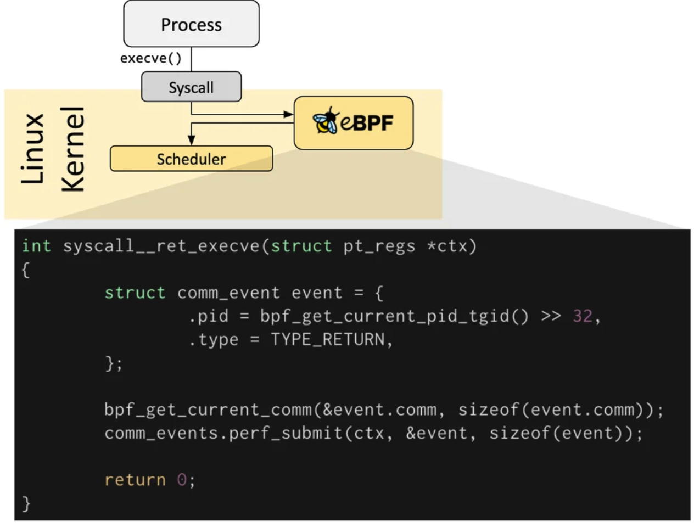  

<br/>

Kernel, Application이 특정 Hook 지점을 통과하면서 eBPF 프로그램이 실행됨.
- Pre-defined hook에는 System call, Function entry/exit, Kernel trace point, Network event 등이 존재

<br/>

Pre-defined hook이 없다면, Kernel Probe(kprobe), User Probe(uprobe)를 생성해 Kernel, Application의 거의 모든 위치에 eBPF 프로그램을 추가할 수 있음.

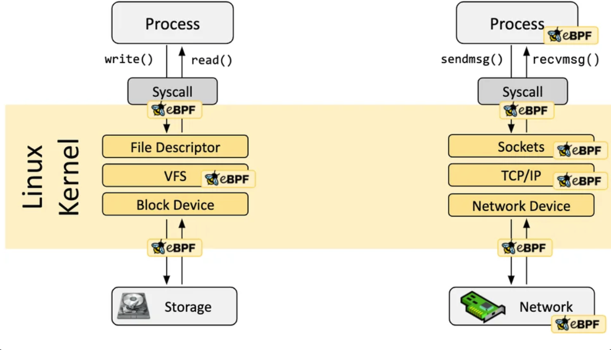  


<br/>

## eBPF 이해를 위해
https://www.brendangregg.com/blog/2019-01-01/learn-ebpf-tracing.html

<br/>

처음 eBPF/eBPF 프로그램이라고 하면, 역할에 대한 감이 안옴.
- OS에서 동작하는 새로운 구조? 구조화된 어떤 프레임워크로 그걸 만드는건가? 새로운 언어로 OS에서 트리거하는거야? 등...

<br/>

그래서 설명할 때 보통 **HTML, Javascript를 예로 사용**함.
- Javascript를 사용하면 정적인 HTML 웹사이트 대신 마우스 클릭 같은 이벤트에 따라 실행되는 프로그램을 정의할 수 있음. 또한 이러한 프로그램은 Web browser의 안전한 머신에서 실행됨.
- eBPF는 Javascript가 HTML에서 하는 일을 한다고 생각하면 됨. 예를 들어, Disk I/O 같은 이벤트에서 실행되는 미니프로그램(eBPF 프로그램)을 만들어 Kernel의 안전한 가상머신에서 실행시킬 수 있음.
	- eBPF가 Javascript 역할 자체라기보단, [V8 javascript engine](https://v8.dev/)에 가까움. Web browser에 V8이 포함되듯, eBPF도 Linux kernel의 일부.


<br/>

## 어떻게 eBPF 프로그램을 만들어?
개발하는 것도 위에서 말한 Javascript와의 관계와 비슷함.
- Web browser에서 특정 기능을 동작시키기 위해 v8 bytecode로 작성하지 않음. 
	- 왜? Low해서 이해하기 어렵고, 코드 짜는 것도 어려움. 
- 그래서 Javascript 또는 Javascript framework (jQuery, React, Vue 등)을 이용해 개발함.
- eBPF도 마찬가지. eBPF로 직접 프로그래밍하는 것은 매우 어려움. ebpf를 위한 framework들이 존재함. 
- `bcc`, `bpftrace` 같은 framework가 있고, 이들은 kernel code base에 존재하는 것이 아닌 `iovisor` Linux Foundation project github에 있음.


<br/>

즉, eBPF는 직접적으로 사용되지 않고, `Cilium`, `bcc`, `bpftrace` 같은 프로젝트에서 간접적으로 사용됨.
- eBPF 위 추상화를 제공해서, 프로그램을 직접 작성할 필요 없이 intent 기반 정의(intent based definitions) 지정해 eBPF를 구현할 수 있도록 제공.
- [Development Toolchains](https://ebpf.io/what-is-ebpf/#development-toolchains) 참고

<br/>

사실 초보자(이용자)는 직접 eBPF 코드를 작성할 필요는 없음. `bcc`에는 바로 사용할 수 있는 70개 이상의 도구가 포함되어있고, 여러 기능을 지원하는 툴들이 제공되고 있음.
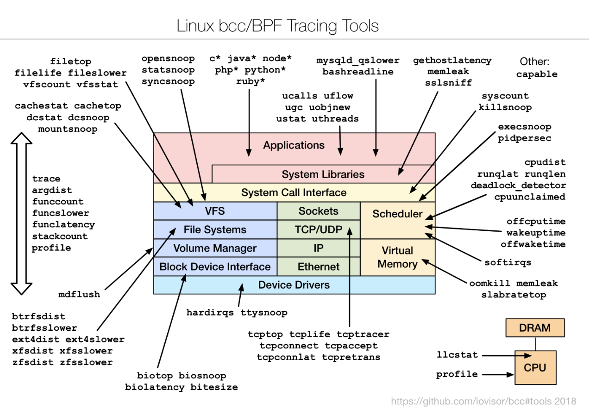  


<br/>

## Kernel? 안전해 이거?
eBPF는 kernel 영역 단에서 호출을 통해 실행되는 만큼 안정성이 매우 중요하다. 
성능, 보안 등 이슈가 발생할 수 있는 만큼 eBPF 프로그램에 대한 검증이 필수적이다.

<br/>

Verification step에서는 아래와 같은 조건들이 충족되는지 확인한다.
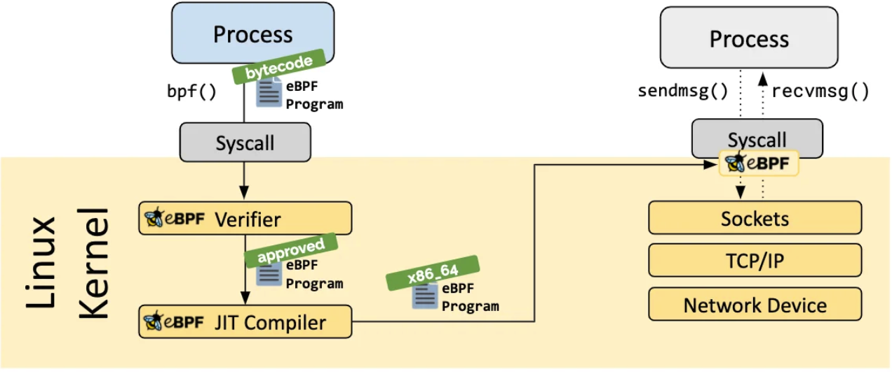  

- eBPF 프로그램을 실행하는 프로세스가 필요한 권한을 보유하는지 확인한다. 권한이 있는 프로세스만 eBPF 프로그램을 활용할 수 있다.
- 시스템과 충돌을 일으키거나 손상을 일으키지 않는지 확인한다.
- '완료'됨을 보장하는지 확인한다. 즉, 무한루프에 빠지지 않는지 확인한다.
- 자세한 건 [eBPF Safety section](https://ebpf.io/what-is-ebpf/#ebpf-safety)을 참고


<br/>

## eBPF Maps?
- eBPF 프로그램의 중요한 역할 중 하나는 수집된 정보를 공유하고, 상태를 저장하는 것
- 이를 위해 eBPF 프로그램은 다양한 데이터 구조에 데이터를 저장하고 검색하기 위해 eBPF Map 개념을 활용할 수 있음.
- eBPF Map은 System call을 통해 user space 애플리케이션 뿐 아니라 eBPF 프로그램에서도 접근할 수 있음.
- 다양한 구조를 지원
	- Hash table, array
	- LRU, Ring buffer, Stack trace 등
	- 점점 더 규칙이 추가되고 확장되고 있음

<br/>

**Loader & Verification Architecture**
  


<br/>
<br/>

# Cilium

## Cilium이 뭐야?
https://docs.cilium.io/en/stable/overview/intro/

<br/>

**Docker, Kubernetes와 같이 Linux container management platform을 사용해 배포된 애플리케이션 서비스 간의 네트워크 연결을 투명하게 보호하기 위한 오픈소스 소프트웨어**
- eBPF를 사용하는 최초의 CNI

<br/>

Hubble?
- **분산 네트워킹 및 보안 가시성(observability) 플랫폼**
	- Cilium과 계속 같이 나오게 된다. 이유는 Cilium을 이용한 네트워크 설정을 통해 어떻게 동작하는지, 현재 플랫폼 내 어떤 네트워크 결과가 있는지 가시성을 보기 위함. Cilium과 마찬가지로 eBPF로 동작함.
- Cilium, eBPF를 기반으로 구축되어 완전히 투명한 방식으로 인프라/서비스 통신 및 동작에 대해 가시성을 제공
	- '투명한 방식'이란 애플리케이션/서비스 측의 코드 및 설정 수정 없이, 또 애플리케이션/서비스가 외부에 이런게 있는지도 모르게 끔 신경쓰지 않아도 되는 방식이라고 생각하면 된다.
- eBPF를 통해 동작하며, 여러 상세한 가시성을 제공한다.
	- 어떤 서비스 간에 통신하고 있는지? 얼마나 자주 통신하는지? 종속 관계는 어떤지?
	- 어떤 HTTP 호출이 일어나고 있는지? 어떤 서비스가 카프카 토픽을 생성하거나 소비하는지?
	- 네트워크 통신에 장애가 있는지? 실패하고 있는지? DNS 이슈가 있는지?
	- Layer 3-4, Layer 7 문제인지? TCP 연결이 중단되거나 SYN 요청응답을 하지 않은 경우가 있는지?
	- HTTP 오류 응답 비율이 어떻게 되는지? 지연시간 백분위 수는 어떻게 되는지? 어떤 서비스가 성능이 제일 좋지 않은지?
	- 네트워크 정책으로 차단된 서비스는 무엇인지? 외부에서 엑세스 한 적이 있는지?

<br/>

Cilium을 사용하는 경우, 보안 정책을 정의할 때 엔드포인트 IP 주소는 중요하지 않다. 대신, 파드에 할당된 레이블을 사용하여 보안 정책을 정의할 수 있다. 클러스터 내에서 실행되는 위치나 시간에 관계없이 레이블을 기반으로 올바른 파드에 정책이 적용된다.


<br/>

다양한 기능을 지원함
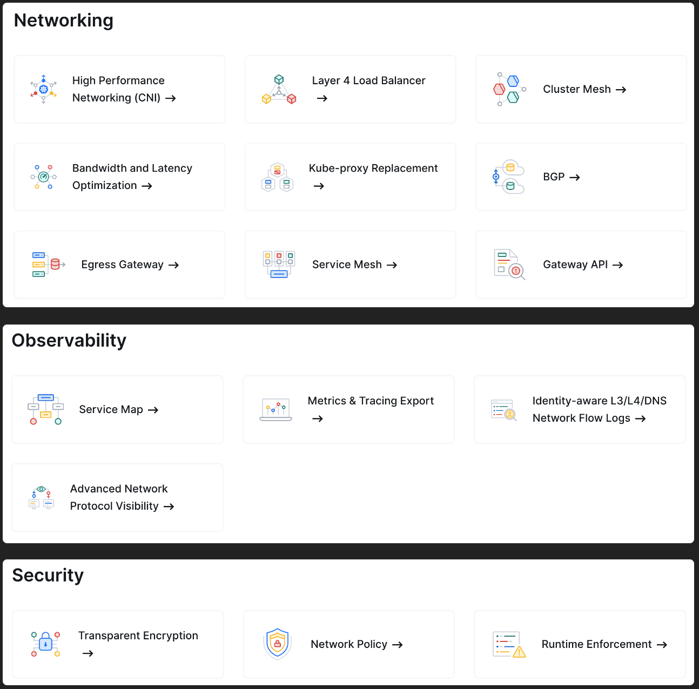  

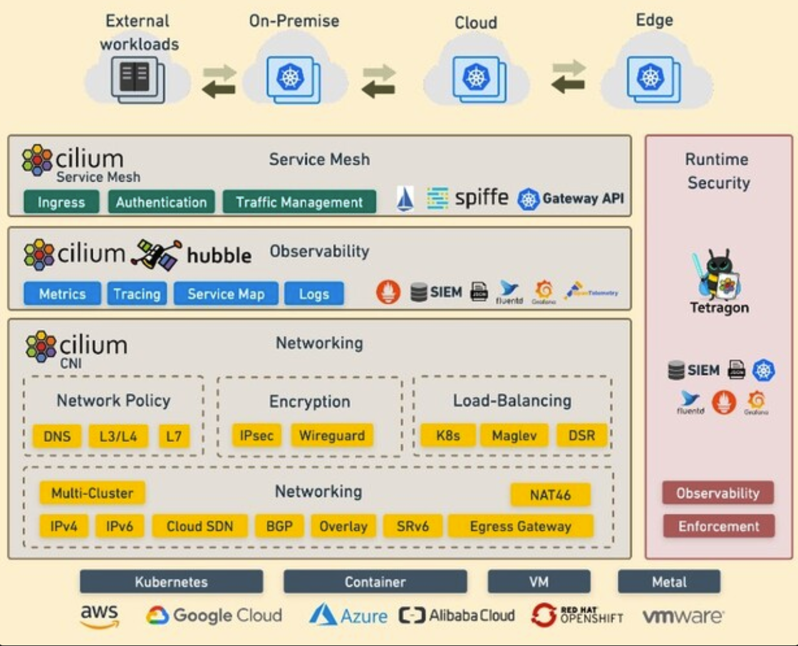  


<br/>

## 왜 Cilium을 사용해?
eBPF를 통해 이전에 불가능했던 세분화되고, 효율적인 시스템, 애플리케이션에 대한 가시성(visibility) 및 제어(control)를 지원하게 되었음.
- 이런 기능들을 기존의 애플리케이션 변경 없이 완전한 투명한 방식으로 지원.
- 최신 컨테이너 된 워크로드는 물론, 가상머신/표준 Linux를 다 지원.

<br/>

Cilium은, 아니 더 나아가 Kubernetes는 마이크로서비스(Microsevice)와 뗄래야 뗄 수 없는 관계임. 
- 서비스 지향 아키텍처(SOA)가 되어 각 서비스들이 하나의 독립된 애플리케이션으로 동작하게 되고, HTTP 같은 프로토콜 및 API을 이용해 통신함. 
- 트래픽 변화에 따라 스케일 아웃, 인 되기도 하며, 지속적인 배포로 여러 컨테이너가 시작과 중지를 반복함.

<br/>

이러한 환경 가운데, 마이크로서비스 간 **'연결 보안(securing connectivity)' 측면은 도전과제이자, 기회**였음.
- Linux network security approach (ex. iptables)는 IP 주소와 TCP/UDP 포트를 필터링 함. 
- 위에서 말했듯 마이크로서비스 환경에서는 컨테이너 수명주기가 불안정하고, IP 주소가 자주 변경 됨. Linux approach는 변경이 일어날 때마다 수십만 개의 규칙이 포함된 load balancing table과 access control lists를 업데이트해줘야 하며, 이걸 추가적으로 확장해나가는데 있어서 어려움이 있었음.
- 또한, Protocol ports (TCP port 80 of HTTP traffic)는 서비스 전반에 걸쳐 광범위한 메시지에 활용되기에 보안 목적으로 애플리케이션 트래픽을 구분하는데 사용할 수 없었음.
- 마지막으로, 기존의 시스템에서는 IP 주소가 기본 식별 수단이었으나, 마이크로서비스 아키텍처에서는 수명이 몇 초에 불과함. visibility 측면에서 정확하게 제공할 수 없었음 (IP가 이미 없어져 추적이 불가능 하는 등).
- Istio sidecar의 문제점(Overhead)도 Cilium이 더 관심받을 수 있는 조건이지 않았었을까...

<br/>

Cilium은 eBPF를 이용하여 앞선 문제들을 해결하고자 했음.
- Security visibility를 투명하게 추가함.
- IP 주소 식별과 달리 Service/Pod/Container ID 기반으로 식별하며, 이를 통한 Application layer(L7)에서 필터링할 수 있게 지원.


<br/>

BPF와 통합은 네트워크 정책 적용 같은 일반적인 CNI 문제가 더 이상 사용자 공간의 iptables를 통해 처리되지 않음을 의미.
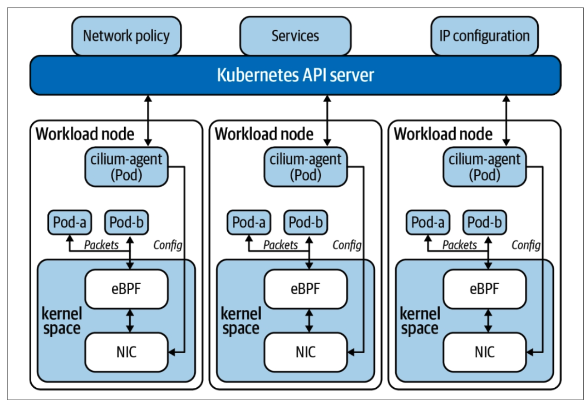  


<br/>

**CNI와 Service mesh 기능**
- 실리움에서 제공하는 eBPF 기능은 기존의 많은 CNI 제공업체와 함께 실행할 수 있다. 이는 CNI 체이닝 모드에서 Cilium을 실행하면 된다.
- 이 모드에서는 AWS의 VPC CNI와 같은 기존 플러그인이 라우팅과 IPAM을 처리. **실리움은 네트워크 가시성, 부하 분산, 네트워크 정책 시행 등 다양한 eBPF 프로그램에서 제공하는 기능만 담당**. 이 접근 방식은 사용자 환경에서 Cilium을 완전히 실행할 수 없거나 현재 선택한 CNI와 함께 기능을 테스트하려는 경우 선호할 수 있음.
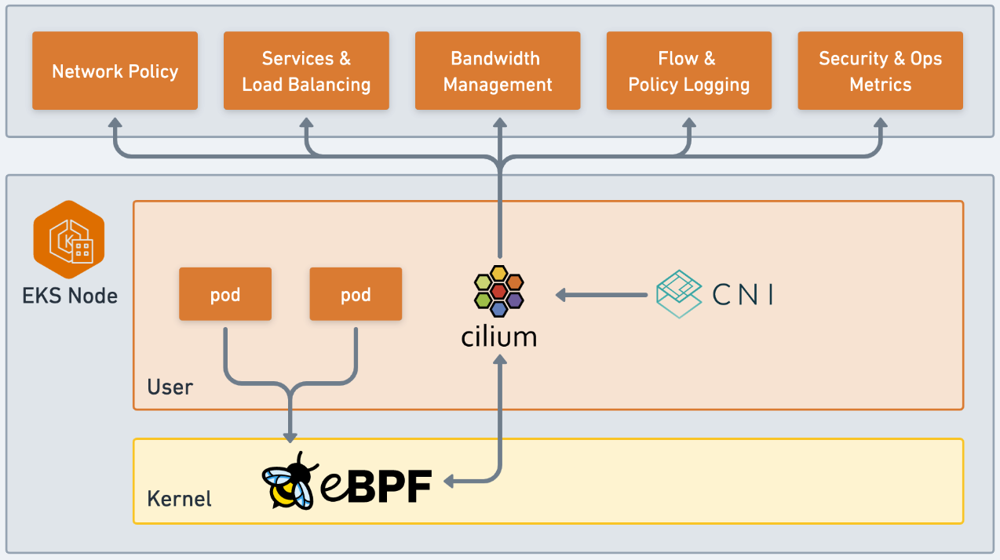  


<br/>


**API 보호 및 보안**
- HTTP/REST, gRPC, Kafka 같은 Application layer protocol을 보호하는 기능을 지원함.
	- 기존의 방화벽들은 특정 IP/Port를 기준으로 실행되는 프로토콜을 완전히 신뢰하거나 차단하는 등 Layer 3-4에서 동작했음.
- ex)
	- HTTP `GET`으로 요청 온 `/public/.*`를 사용하는 모든 HTTP 요청을 허용. 그 외 모든 요청은 거부.
	- Service 1이 Kafka `topic1`을 생성하고, Service 2가 `topic1`을 소비하도록 허용함. 다른 모든 Kafka message는 거부.
	- 모든 REST 호출에 있어 HTTP header `X-Token: [0-9]+`가 있어야 함.

<br/>

## Cilium 사용해보기

이제 직접 사용해보자
- Cilium에서 제공하는 [Star wars demo](https://docs.cilium.io/en/stable/gettingstarted/demo/)를 참고했다.

<br/>

먼저 클러스터를 준비하고, Cilium을 배포하자.

<br/>

minikube를 이용해 클러스터를 구성했다.
- `minikube start --network-plugin=cni --cni=false`
- 버전별 차이 및 다른 클러스터를 구성하고 싶다면, [문서](https://docs.cilium.io/en/stable/gettingstarted/k8s-install-default/)를 참고

<br/>

cni를 false 했으므로 core-dns가 제대로 설치되지 않는 것을 확인할 수 있다.

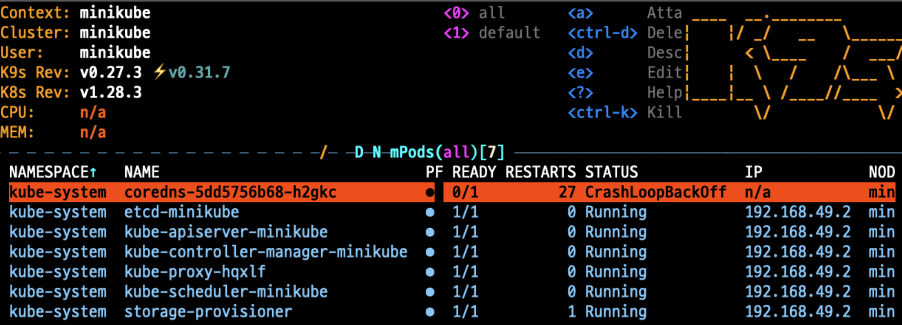  


<br/>

Cilium은 Cilium CLI를 이용한 방법 또는 Helm을 이용하여 설치할 수 있다.

설치하기 전에 Helm을 이용해 설치될 파일을 확인해보자.
- `helm pull cilium/cilium --version 1.14.6 --namespace kube-system`
- template을 보면 정말 다양한 서비스들이 존재한다.
	- cilium-agent
	- cilium-envoy
	- cilium-nodeinit
	- cilium-operator
	- cilium-preflight
	- clustermesh-apiserver, clustermesh-config
	- hubble, hubble-relay, hubble-ui
	- spire, etcd-operator

<br/>

### Cilium, Hubble 설치

이 구성들에 하나하나는 나중에 살펴보기로 하고, 일단 설치해보자.
- helm
	- `helm install cilium cilium/cilium --version 1.14.6 --namespace kube-system`
- Cilium CLI를 통해 설치해도 동일하다. (이후 부터는 cilium CLI를 이용한 방법으로만 설명한다)
	- [Cilium CLI 설치](https://docs.cilium.io/en/stable/gettingstarted/k8s-install-default/)
	- `cilium install --version 1.14.6`
- 특별히 다른 옵션 없이 설치하면 `cilium-agent`, `cilium-operator`가 설치된다.

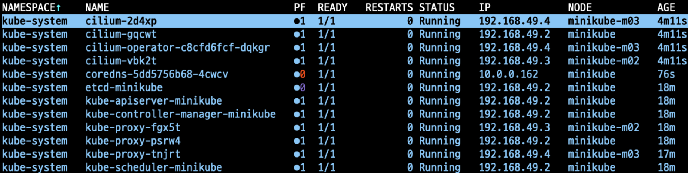  


<br/>


시각화를 위한 hubble도 설치한다.
- `cilium hubble enable --ui`
	- UI도 이용할 것이기에 옵션을 추가했다.
	- 이에 따라 `hubble-relay`, `hubble-ui` pod가 설치되었다
- hubble을 위한 CLI도 존재하는데, 지금 hubble을 깊게 다룰 것은 아니니 관련 내용은 [문서](https://docs.cilium.io/en/stable/gettingstarted/hubble_setup/)를 참고하자.


<br/>

hubble의 UI를 켜보자.
- `cilium hubble ui`

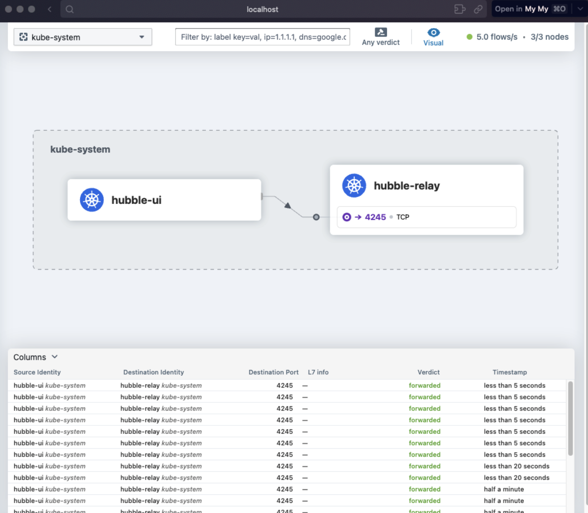  

- 네트워크 간 트래픽이 수집되는 것을 볼 수 있다.


<br/>

### 테스트 구성

테스트를 위한 Pod를 설치하자.
![[Pasted image 20240128201520.png]]
https://github.com/cilium/cilium/blob/main/examples/minikube/http-sw-app.yaml

<br/>

```sh
$ kubectl create -f https://raw.githubusercontent.com/cilium/cilium/1.14.6/examples/minikube/http-sw-app.yaml
service/deathstar created
deployment.apps/deathstar created
pod/tiefighter created
pod/xwing created
```

위 구성처럼 클러스터가 완성되었다.

<br/>

Cilium에선 엔드포인트 별 ingress/egress 정책을 가지고 있는데, 이를 `cilium` cli를 통해 확인 해볼 수 있다.

```sh
kubectl -n kube-system exec cilium-5ngzd -- cilium endpoint list
ENDPOINT   POLICY (ingress)   POLICY (egress)   IDENTITY   LABELS (source:key[=value])                       IPv6   IPv4         STATUS
           ENFORCEMENT        ENFORCEMENT
232        Disabled           Disabled          16530      k8s:class=deathstar                                      10.0.0.147   ready
                                                           k8s:io.cilium.k8s.policy.cluster=default
                                                           k8s:io.cilium.k8s.policy.serviceaccount=default
                                                           k8s:io.kubernetes.pod.namespace=default
                                                           k8s:org=empire
726        Disabled           Disabled          1          reserved:host                                                         ready
883        Disabled           Disabled          4          reserved:health                                          10.0.0.244   ready
1634       Disabled           Disabled          51373      k8s:io.cilium.k8s.policy.cluster=default                 10.0.0.118   ready
                                                           k8s:io.cilium.k8s.policy.serviceaccount=coredns
                                                           k8s:io.kubernetes.pod.namespace=kube-system
                                                           k8s:k8s-app=kube-dns
1673       Disabled           Disabled          31028      k8s:class=tiefighter                                     10.0.0.112   ready
                                                           k8s:io.cilium.k8s.policy.cluster=default
                                                           k8s:io.cilium.k8s.policy.serviceaccount=default
                                                           k8s:io.kubernetes.pod.namespace=default
                                                           k8s:org=empire
2811       Disabled           Disabled          51373      k8s:io.cilium.k8s.policy.cluster=default                 10.0.0.47    ready
                                                           k8s:io.cilium.k8s.policy.serviceaccount=coredns
                                                           k8s:io.kubernetes.pod.namespace=kube-system
                                                           k8s:k8s-app=kube-dns
2843       Disabled           Disabled          16530      k8s:class=deathstar                                      10.0.0.89    ready
                                                           k8s:io.cilium.k8s.policy.cluster=default
                                                           k8s:io.cilium.k8s.policy.serviceaccount=default
                                                           k8s:io.kubernetes.pod.namespace=default
                                                           k8s:org=empire
3184       Disabled           Disabled          22654      k8s:class=xwing                                          10.0.0.30    ready
                                                           k8s:io.cilium.k8s.policy.cluster=default
                                                           k8s:io.cilium.k8s.policy.serviceaccount=default
                                                           k8s:io.kubernetes.pod.namespace=default
                                                           k8s:org=alliance
```

보이는 것처럼 엔드포인트(endpoint) 별 정책이 다 Disabled로 따로 설정된 정책이 없은 것으로 확인된다. 
- 각 Label을 토대로 IP, Identity 값을 확인할 수 있다. 전체적인 네트워크 상황을 cilium이 알고 있는 것이다.

<br/>

### L3/L4 정책 적용
Cilium에서는 보안정책을 정의할 때, Endpoint IP 주소는 중요하지 않음.
- 대신 Pod에 할당된 레이블을 통해 보안정책을 정의할 수 있음. 실행되는 위치, 시간에 관계 없이 레이블을 기반으로 올바른 파드에 정책이 적용될 수 있음.

<br/>

위 예제의 deathstar에서 `org=empire` 레이블이 있는 경우에만 착륙요청을 허용하게 정책을 설정해보자.
- 해당 레이블이 없다면, 연결조차 불가능하다. 즉, TCP/IP에서 간단한 필터링을 수행하므로 L3/L4 보안 정책이라고 볼 수 있다.

```yaml
apiVersion: "cilium.io/v2"
kind: CiliumNetworkPolicy
metadata:
  name: "rule1"
spec:
  description: "L3-L4 policy to restrict deathstar access to empire ships only"
  endpointSelector:
    matchLabels:
      org: empire
      class: deathstar
  ingress:
  - fromEndpoints:
    - matchLabels:
        org: empire
    toPorts:
    - ports:
      - port: "80"
        protocol: TCP

```
- yaml 필드만봐도 이해를 할 수 있음
	- `endpointSelector`: 어떤 엔드포인트에 대해 정책을 반영할지? (target)
	- `ingress.fromEndpoints`: 어떤 엔드포인트로부터 오는 요청에 대해
	- `ingress.toPorts`: 어떤 포트로의 요청을
	- 허용할 것인가? (즉, 화이트리스트로 지정되어 적용됨)
- 풀어쓰면 `org=empire` 레이블이 있는 모든 파드는 `org=empire,class=deathstar` 레이블이 있는 파드의 TCP 80포트로의 요청이 가능하다. 라고 볼 수 있다.


<br/>

이 정책을 적용해보자
- `kubectl create -f https://raw.githubusercontent.com/cilium/cilium/1.14.6/examples/minikube/sw_l3_l4_policy.yaml`

<br/>

그럼, 이제부터 `org=empire` 레이블을 가진 패드만 요청이 가능해진다.

```sh
$ kubectl exec tiefighter -- curl -s -XPOST deathstar.default.svc.cluster.local/v1/request-landing
Ship landed

$ kubectl exec xwing -- curl -s -XPOST deathstar.default.svc.cluster.local/v1/request-landing
행 걸림. timeout까지 기다림.
```

<br/>

그럼 이 정책이 반영됨에 따라 앞서 보았던 엔드포인트 별 정책이 변화됬을까?

```shell
$ kubectl -n kube-system exec cilium-1c2cz -- cilium endpoint list
ENDPOINT   POLICY (ingress)   POLICY (egress)   IDENTITY   LABELS (source:key[=value])                       IPv6   IPv4         STATUS
           ENFORCEMENT        ENFORCEMENT
232        Enabled            Disabled          16530      k8s:class=deathstar                                      10.0.0.147   ready
                                                           k8s:io.cilium.k8s.policy.cluster=default
                                                           k8s:io.cilium.k8s.policy.serviceaccount=default
                                                           k8s:io.kubernetes.pod.namespace=default
                                                           k8s:org=empire
726        Disabled           Disabled          1          reserved:host                                                         ready
883        Disabled           Disabled          4          reserved:health                                          10.0.0.244   ready
1634       Disabled           Disabled          51373      k8s:io.cilium.k8s.policy.cluster=default                 10.0.0.118   ready
                                                           k8s:io.cilium.k8s.policy.serviceaccount=coredns
                                                           k8s:io.kubernetes.pod.namespace=kube-system
                                                           k8s:k8s-app=kube-dns
1673       Disabled           Disabled          31028      k8s:class=tiefighter                                     10.0.0.112   ready
                                                           k8s:io.cilium.k8s.policy.cluster=default
                                                           k8s:io.cilium.k8s.policy.serviceaccount=default
                                                           k8s:io.kubernetes.pod.namespace=default
                                                           k8s:org=empire
2811       Disabled           Disabled          51373      k8s:io.cilium.k8s.policy.cluster=default                 10.0.0.47    ready
                                                           k8s:io.cilium.k8s.policy.serviceaccount=coredns
                                                           k8s:io.kubernetes.pod.namespace=kube-system
                                                           k8s:k8s-app=kube-dns
2843       Enabled            Disabled          16530      k8s:class=deathstar                                      10.0.0.89    ready
                                                           k8s:io.cilium.k8s.policy.cluster=default
                                                           k8s:io.cilium.k8s.policy.serviceaccount=default
                                                           k8s:io.kubernetes.pod.namespace=default
                                                           k8s:org=empire
3184       Disabled           Disabled          22654      k8s:class=xwing                                          10.0.0.30    ready
                                                           k8s:io.cilium.k8s.policy.cluster=default
                                                           k8s:io.cilium.k8s.policy.serviceaccount=default
                                                           k8s:io.kubernetes.pod.namespace=default
                                                           k8s:org=alliance

```

deathstar label이 포함된 2개의 엔드포인트에 대하여 ingress policy가 `enabled`된 것을 확인할 수 있다.


<br/>

### L7 정책 적용 (HTTP)
마이크로서비스에선 L3/L4 보안 뿐 아니라 L7 레이어 프로토콜(HTTP 등)에 대해서도 특정 HTTP 요청만 허락할 수 있는 기능들이 제공되어야 함.

예를 들어, deathstar가 호출되서는 안되는 일부 유지관리 API를 노출하게 되는 경우, 오류가 발생하는 것을 확인할 수 있음.

```sh
$ kubectl exec tiefighter -- curl -s -XPUT deathstar.default.svc.cluster.local/v1/exhaust-port
Panic: deathstar exploded

goroutine 1 [running]:
main.HandleGarbage(0x2080c3f50, 0x2, 0x4, 0x425c0, 0x5, 0xa)
        /code/src/github.com/empire/deathstar/
        temp/main.go:9 +0x64
main.main()
        /code/src/github.com/empire/deathstar/
        temp/main.go:5 +0x85

```

<br/>

이를 막기 위하여 L7 정책을 적용해보자.
- tiefighter의 POST `/v1/request-landing` API만 허용하도록 정책을 확장하면 다음과 같다.

<br/>

```yaml
apiVersion: "cilium.io/v2"
kind: CiliumNetworkPolicy
metadata:
  name: "rule1"
spec:
  description: "L7 policy to restrict access to specific HTTP call"
  endpointSelector:
    matchLabels:
      org: empire
      class: deathstar
  ingress:
  - fromEndpoints:
    - matchLabels:
        org: empire
    toPorts:
    - ports:
      - port: "80"
        protocol: TCP
      rules:
        http:
        - method: "POST"
          path: "/v1/request-landing"
```
- `ingress.toPorts.rules`를 통해 프로토콜의 특정한 경우만 허용하도록 정의했다. (더 다양한 예제는 [문서](https://docs.cilium.io/en/latest/security/policy/language/#layer-7-examples) 참고)

<br/>

위 정책을 반영하고, 위에서 했었던 요청을 다시해보면 denied 되는 것을 볼 수 있다.
```sh
$ kubectl exec tiefighter -- curl -s -XPUT deathstar.default.svc.cluster.local/v1/exhaust-port
Access denied
```
