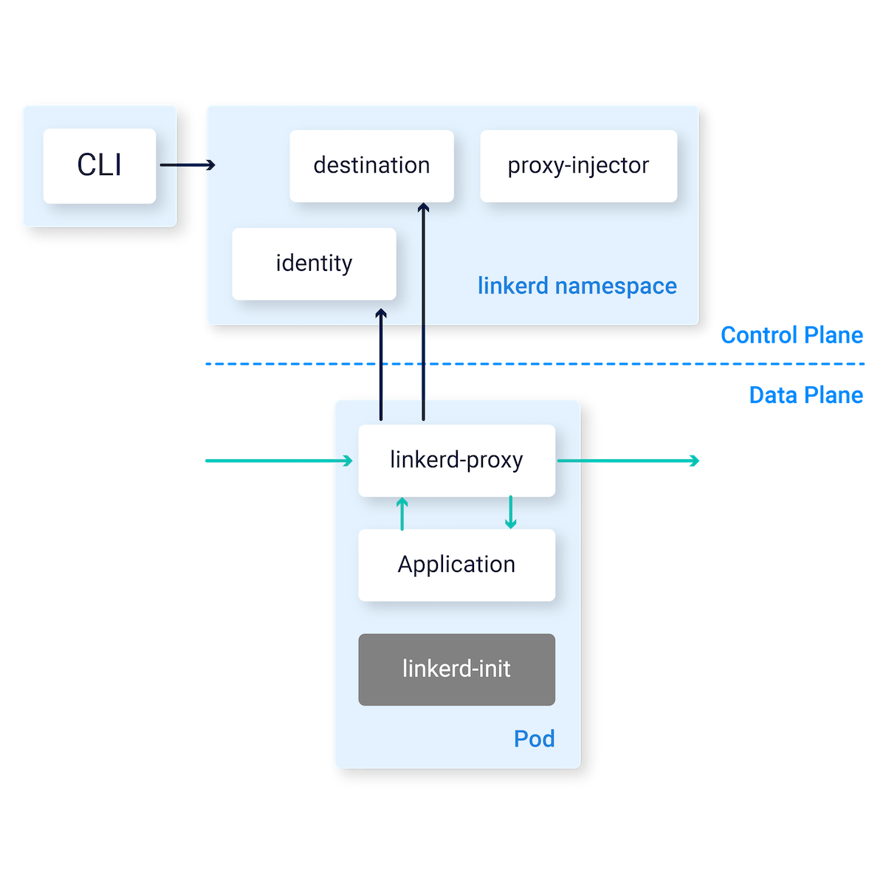

proxy로 envoy가 아닌 Linkerd2-proxy라는 자체적인 구현체를 이용한다.
- rust로 만들어진 proxy 구현체. Linkerd uses an **ultralight “micro-proxy” called [Linkerd2-proxy](https://github.com/linkerd/linkerd2-proxy)**, which is built in Rust for safety and performance.
- 참고) envoy는 C++로 만들어졌음.

 

[Why Linkerd doesn't use Envoy](https://linkerd.io/2020/12/03/why-linkerd-doesnt-use-envoy/)
- TL;DR;
	- envoy는 다양한 곳에서 Proxy의 역할을 하도록 만들어졌기에 Service mesh sidecar 역할로는 너무 크고 복잡하다. linkerd는 가볍고 간단하며 안전한 Service mesh를 목표로 하는데, 이에 맞지 않았기에 linkerd2-proxy 라는 목적에 맞는(linkerd service mesh 목적만을 위한) proxy를 따로 구현했다.
	- Service mesh 데이터 플레인 proxy 역할로 보면 코드 복잡성, 리소스, 보안 측면에서 envoy보다 우수하다.
- 간단히 말해서, **Linkerd는 Envoy를 사용하지 않습니다. Envoy를 사용하면 세계에서 가장 가볍고 간단하며 가장 안전한 Kubernetes 서비스 메시를 구축할 수 없기** 때문입니다.
- Envoy가 나빠서가 아니라, 적어도 Kubernetes 사이드카 프록시라는 매우 구체적이고 제한된 사용 사례에 있어서는 Linkerd2-proxy가 더 낫기 때문입니다.
- Envoy는 유연하고 범용적인 프록시이며, 이것이 바로 인기의 이유 중 하나입니다. 인그레스, 이그레스, 서비스 메시 사이드카 등 다양한 방식으로 Envoy를 사용할 수 있습니다. 하지만 이러한 유연성에는 복잡성이 따르기도 합니다.
	- 비교를 위해 2020년 11월 현재, Envoy 리포의 C++ 코드 크기는 **172 KLOC이며**, '복잡성 점수(브랜치와 루프로 측정)'는 **19k입니다**. 반면, Linkerd2-proxy는 **30 KLOC이며**, 복잡성 점수는 **1.5k입니다**. 다시 말해, Linkerd2-proxy 코드베이스는 Envoy보다 5배 더 작으며, 이 측정 기준으로 복잡성은 10배 더 낮습니다.
- Linkerd2 프록시를 사용하면 Linkerd의 리소스 소비를 엄격하게 관리할 수 있습니다. 예를 들어, 4,000RPS(초당 요청 수)의 인그레스 트래픽에서[Kinvolk의 오픈 소스 벤치마크 하네스를](https://github.com/kinvolk/service-mesh-benchmark) 사용한 Linkerd와 Istio의 내부 벤치마크에서 Linkerd2-proxy 인스턴스는 지속적으로 **14MB에서** **15MB** 사이의 메모리를 사용하는 반면, Istio의 Envoy는 **10배 크기인** **135MB에서** **175MB**사이를 기록했습니다. 마찬가지로, 테스트 실행 시 Linkerd2-proxy의 CPU 사용량은 인스턴스당 **15ms** (CPU 밀리초)로 일관된 반면, Istio의 Envoy는 **22ms에서 156ms로**50% 이상에서 10배 이상까지 다양했습니다.

 

istio, Linkerd 둘 다 Service mesh의 구현체. 무슨 차이일까?
- Linkerd is significantly lighter and simpler than Istio. Linkerd is built for security from the ground up, ranging from features like [on-by-default mTLS](https://linkerd.io/2.15/features/automatic-mtls/), a data plane that is [built in a Rust, memory-safe language](https://github.com/linkerd/linkerd2-proxy), and [regular security audits](https://github.com/linkerd/linkerd2/blob/main/SECURITY_AUDIT.pdf). Finally, Linkerd has publicly [committed to open governance](https://linkerd.io/2019/10/03/linkerds-commitment-to-open-governance/) and is hosted by [the CNCF](https://cncf.io/).
- [Linkerd vs. Istio: 7 Key Differences](https://www.solo.io/topics/linkerd/linkerd-vs-istio/)
- [Linkerd vs Istio - A 2024 service mesh comparison](https://buoyant.io/linkerd-vs-istio)
- [Istio vs. Linkerd: Service Mesh Showdown 2023](https://medium.com/@onai.rotich/istio-vs-linkerd-service-mesh-showdown-2023-370937107452)

 

클라우드의 미래는 Rust로 작성된다?
- [Why the future of the cloud will be built on Rust](https://buoyant.io/media/why-the-future-of-the-cloud-will-be-built-on-rust)

 

**Linkerd architecture**
https://linkerd.io/2.15/reference/architecture/

  

- **Destination service**—used by data plane proxies to determine their desired behavior. It receives service discovery details, fetches policy data about requests that should be allowed for each service, receives service profile data for route metrics, and handles retries and timeouts.
- **The identity service**—functions as a transport layer security (TLS) certificate authority. Accepts certificate signing requests (CSRs) from data plane proxies and provides signed certificates that can be used for secure proxy-to-proxy connections supporting mutual TLS (mTLS).
- **The proxy injector**—a Kubernetes admission controller that is triggered by a webhook each time a new pod is created in the cluster. When a new pod is created, the injector checks if resources have a Linkerd-specific annotation, and injects a proxy container into the pod

 

**Service discovery**
- Kubernetes에 있는 대상의 경우, Linkerd는 Kubernetes API에서 IP 주소를 조회합니다. 
- IP 주소가 서비스에 해당하는 경우, Linkerd는 해당 서비스의 엔드포인트에서 부하를 분산하고 해당 서비스의 [서비스 프로필의](https://linkerd.io/2.15/features/service-profiles/) 모든 정책을 적용합니다. 
- 반면, IP 주소가 파드에 해당하는 경우, 링커드는 [서비스 프로파일을](https://linkerd.io/2.15/features/service-profiles/) 적용하지 않고, 파드 단에서 로드 밸런싱을 수행합니다.

**자동 프록시 인젝션**
- https://linkerd.io/2.15/features/proxy-injection/
- `linkerd.io/inject: enabled` annotation을 deployment/pod에 추가하면 자동으로 Linkerd proxy가  주입된다. Kubernetes admission webhook에 의해 동작하게 된다.
- 2개의 sidecar container가 주입된다.
	- `linkerd-init`: inbound/outbound TCP traffic을 proxy로 보내기 위해 iptables를 설정하는 InitContainer.
	- `linkerd-proxy`: Linkerd data plane proxy.
- 프록시에 대한 여러 설정을 하기 위해서는 지원하는 어노테이션을 추가해야만 한다.
	- https://linkerd.io/2.15/reference/proxy-configuration/
	- 어노테이션을 통해 proxy에 대한 cpu/memory limit/request 설정 등을 할 수 있다.

 

Istio는 자신만의 ingress/egress를 지원한다
- Linkerd는 간단한 구성을 위해(Service mesh의 본질에만 집중하기 위해) 따로 Ingress controller를 지원하지 않는다.
- 대신 타 Ingress controller와 상호작용 할 수 있게 여러 옵션을 제공한다.
- https://linkerd.io/2.15/tasks/using-ingress/

 

**Linkerd는 총 8가지의 CRD를 제공한다.**
- `AuthorizationPolicy` (policy.linkerd.io)
- `MeshTLSAuthentication` (policy.linkerd.io)
- `NetworkAuthentication` (policy.linkerd.io)
- `ServerAuthorization` (policy.linkerd.io)
- `Server` (policy.linkerd.io)
- `ServiceProfile` (serviceprofiles.linkerd.io)
- `HTTPRoute` (policy.linkerd.io)
- `HTTPRoute` (gateway.networking.k8s.io)

 

왜 `HTTPRoute`는 2가지나 지원되는가?
- 위 spec group에서 볼 수 있듯, 하나는 Linkerd에서 지원되는거고, 하나는 k8s gateway sig group에서 제공되는 것이다.
- Linkerd에서 지원되는 기능들은 아직 kuberenetes gateway api에서 지원되지 않는 기능들이 아닌 실험적인 기능들도 구현된 것이다.
	- https://linkerd.io/2.15/features/httproute/
- 부모 리소스가 누군가에 따라 동작이 다를 수 있음.
	- [서비스를](https://kubernetes.io/docs/concepts/services-networking/service/) 부모 리소스로 사용하는 HTTPRoutes는 해당 [서비스의](https://kubernetes.io/docs/concepts/services-networking/service/) 클라이언트인 파드에서_아웃바운드_ 프록시에 대한 정책을 구성합니다. 아웃바운드 정책에는 [동적 요청 라우팅](https://linkerd.io/2.15/tasks/configuring-dynamic-request-routing/), 요청 헤더 추가, 요청 경로 수정,[시간 초과](https://linkerd.io/2.15/tasks/configuring-timeouts/#using-httproutes)와 같은 안정성 기능이 포함됩니다.
	- [서버를](https://linkerd.io/2.15/reference/authorization-policy/#server) 부모 리소스로 사용하는 HTTPRoutes는 해당 [서버로](https://linkerd.io/2.15/reference/authorization-policy/#server) 트래픽을 수신하는 파드의_인바운드_ 프록시에 대한 정책을 구성한다. 인바운드 HTTPRoutes는 세분화된 [경로별 권한 부여 및 인증 정책을](https://linkerd.io/2.15/tasks/configuring-per-route-policy/) 구성하는 데 사용됩니다.
- ServiceProfile과 다른게 뭐야?
	- 중복된 구성임. 
		- 이전 버전과의 호환성을 위해 동일한 서비스를 구성하는 HTTPRoutes보다 **ServiceProfile이 우선**합니다. HTTPRoute의 부모 서비스에 대해 ServiceProfile이 정의되어 있는 경우, 프록시는 ServiceProfile이 존재하는 한 HTTPRoute 구성이 아닌 ServiceProfile 구성을 사용합니다.
	- 근데 HTTPRoute를 통해 Service Profile을 대체해갈 것 같음.
		- [HTTPRoute는](https://linkerd.io/2.15/features/httproute/) [서비스프로파일을](https://linkerd.io/2.15/features/service-profiles/)대체하기 위한 새로운 구성 메커니즘이므로 서비스에 대한 서비스프로파일이 이미 존재하지 않는 한 HTTPRoute 타임아웃을 사용하는 것을 권장합니다.

 

Retry와 Timeout
- Retry는 ServiceProfile CR을 통해 설정 가능
	- https://linkerd.io/2.15/tasks/configuring-retries/
- Timeout은 HTTPRoute CR을 통해 설정 가능
	- https://linkerd.io/2.15/tasks/configuring-timeouts/
	- 현재는 `policy.linkerd.io` API 그룹이 있는 HTTPRoute 리소스에서만 사용가능.

 

서비스 프로필
https://linkerd.io/2.15/features/service-profiles/

 

더 자세히 공부해야한다면, Oreilly 책도 있다. ebook으로 무료로 제공한다.
- https://buoyant.io/resources/linkerd-up-and-running