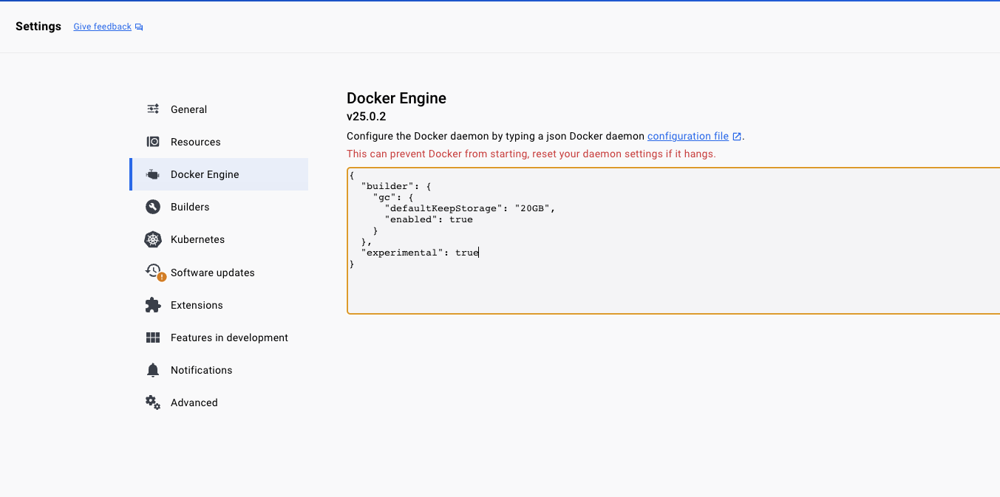
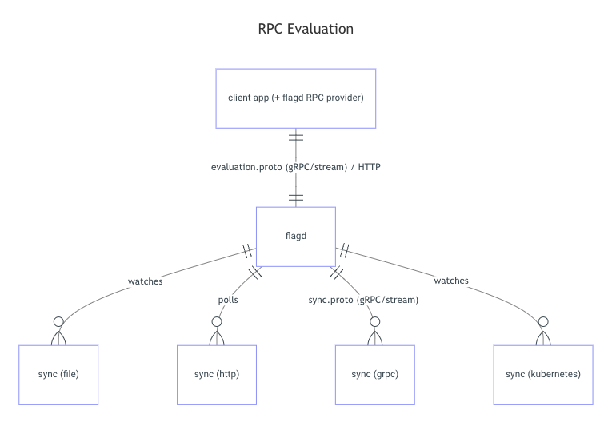

# OpenFeature / FlagD Demo

## Getting Started

### Prerequisites

- Docker Desktop
  - Enable Experimental Option 
  - 
- Setup Kubernetes Local Cluster
    - `minikube` or `k3d` or ...
- Install `cert-manager` / `open-feature-operator`
  - https://artifacthub.io/packages/helm/cert-manager/cert-manager
  - https://artifacthub.io/packages/helm/open-feature-operator/open-feature-operator

## OpenFeature

CNCF Feature Flagging 프로젝트. 현재 Incubating 단계이다.
Cloud-Native에서 사용할 수 있는, Vendor-agnostic하면서도 Community-Driven API를 제공하는 Feature Flag 표준을 정립한다.

> [Feature Flag와 관련해서는 해당 블로그 문서가 잘 설명하고 있습니다.](https://medium.com/daangn/%EB%A7%A4%EC%9D%BC-%EB%B0%B0%ED%8F%AC%ED%95%98%EB%8A%94-%ED%8C%80%EC%9D%B4-%EB%90%98%EB%8A%94-%EC%97%AC%EC%A0%95-2-feature-toggle-%ED%99%9C%EC%9A%A9%ED%95%98%EA%B8%B0-b52c4a1810cd)

### Architecture

이번 Demo에서는 `Flags-R-us OpenFeature Provider`로 커뮤니티에서 제공하는 [`flagd`](https://flagd.dev)를 사용합니다.

### In Cloud-Native Environment

[OpenFeature Operator](https://github.com/open-feature/open-feature-operator)를 사용하면 `flagd`를 별도의 `Deployment`로 구성하지 않아도 Operator에 의해 각 애플리케이션 사이드카 컨테이너로 주입되게 구현할 수 있습니다. 또한 플래그 정보는 별도 Custom Resource 오브젝트로 관리가 가능합니다.

